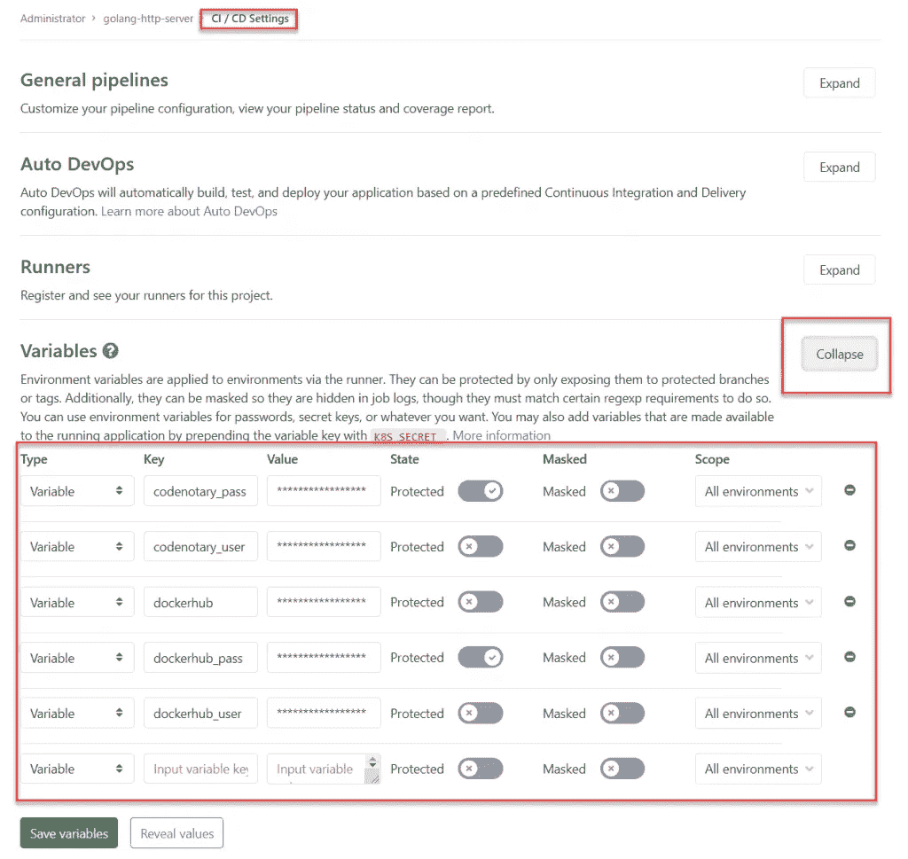
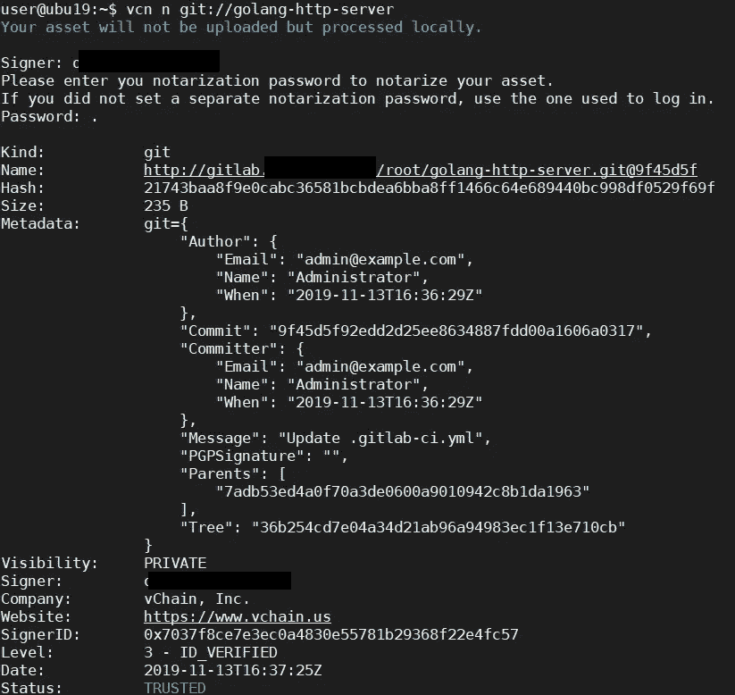
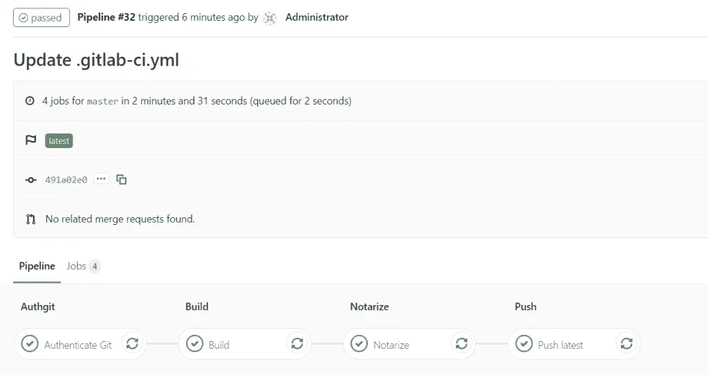

# 运行完全受信任的 GitLab 管道

> 原文：<https://itnext.io/running-a-fully-trusted-gitlab-pipeline-a1f69475e7a7?source=collection_archive---------7----------------------->

正如您已经注意到的，我们的目标是让 code 公证人集成对您来说尽可能简单。这就是为什么我们的博文系列继续使用 [GitLab](http://www.gitlab.com/) 的原因。到目前为止，我们已经介绍了[詹金斯](https://www.codenotary.io/securing-your-azure-devops-ecosystem-jenkins-and-kubernetes-aks-using-codenotary-part-1/)和 [CircleCI](https://www.codenotary.io/validated-builds-using-circleci-ci-cd/) ，如果你也想看的话。对于这篇博文，我们使用 GitLab CE 安装。

这一次，我们比前几篇文章更进一步，还集成了一个 Git 库检查。

这些检查将如下所示:

*   认证 Git 存储库
*   如果可信，基于存储库构建容器映像
*   发布前公证容器图像
*   将容器映像发布到您的注册表

我们开始吧！

# 先检查我们的需求

因为我们只想使用经过公证的 git 提交，所以我们需要一个 code 公证人帐户和本地安装在 Git 旁边的 vcn。

1.  [公证账户(完全免费)](https://dashboard.codenotary.io/auth/signup)
2.  [下载 vcn](https://github.com/vchain-us/vcn/releases/latest) &登录 vcn
3.  为 DockerHub 和 code 公证人设置项目中的变量



*   code 公证人 _ 用户
*   公证员 _ 通行证
*   dockerhub(类型 *docker 信息*，在我们的例子中:[https://index.docker.io/v1/)](https://index.docker.io/v1/))
*   dockerhub_user
*   dockerhub_pass

# 设置。gitlab-ci.yml

像大多数 CI/CD 管道一样，我们从基本设置开始。确保创建。存储库中的 gitlab-ci.yml 文件:

```
image: docker:18

stages:
  - authgit
  - build
  - notarize
  - push

variables:
    CONTAINER_IMAGE: "<dockerhub_repository_name>"

before_script:
  - echo -n $dockerhub_pass | docker login -u $dockerhub_user --password-stdin $dockerhub
```

在这里，我们将 Container_image 设置为我们想要使用的 Dockerhub 注册表(即用户/图像),并登录到 Dockerhub

# 鉴定来源

下一步是对源代码进行认证，以确保在构建过程中只使用经过公证的 git 提交。在那篇文章中，我们使用的是 vcn 版本 0.7.3，但是你也可以使用最新的版本。

请注意，因为我们使用基于 Alpine OS 的映像来使用 vcn 的静态链接版本。

最重要的是，我们希望确保没有人篡改我们下载的 vcn 可执行文件，因此我们使用带有 curl 的 code 公证人. io API 进行独立检查。

```
# Authenticate Git source
Authenticate Git:
  stage: authgit
  script:
    - apk add --no-cache curl
    - curl -L -o /tmp/vcn https://github.com/vchain-us/vcn/releases/download/v0.7.3/vcn-v0.7.3-linux-amd64-static
    - CHECKSUM=$(sha256sum /tmp/vcn | cut -d " " -f 1)
    - echo $CHECKSUM
    - curl -s https://api.codenotary.io/authenticate/$CHECKSUM?org=vchain.us | grep -q :0
    - chmod +x /tmp/vcn
    - /tmp/vcn a git://$CI_PROJECT_DIR
```

vcn git://$ CI _ PROJECT _ DIR 用于认证我们在项目管道中使用的存储库。

对于稍后运行的管道，您总是需要确保公证最新的 git 提交。

**因此，如果我们批准了最新的变更，我们需要提取并公证它们:**

*   git 拉
*   git://repository-folder



重要提示:在测试或使用私有存储库时，您应该只使用匿名身份验证。强烈建议仅对 org 或 signer 标志使用 authenticate。

**vcn a 帮助**:

```
-I, --org string         accept only authentications matching the passed organisation's ID,
                           if set no SignerID can be used
                           (overrides VCN_ORG env var, if any)
  -s, --signerID strings   accept only authentications matching the passed SignerID(s)
                           (overrides VCN_SIGNERID env var, if any)
```

# 建立形象

我们将构建容器图像，并仅使用哈希来推送它，但没有额外的标记。这将在后面的步骤中发生。

```
Build:
  stage: build
  script:
    - >
      docker build
      --pull
      --build-arg VCS_REF=$CI_COMMIT_SHA
      --build-arg VCS_URL=$CI_PROJECT_URL
      --tag $CONTAINER_IMAGE:$CI_COMMIT_SHA
      .
    - docker push $CONTAINER_IMAGE:$CI_COMMIT_SHA
```

# 公证集装箱图像

这主要是对之前其他构建步骤中的身份验证步骤的复制。原因是，您无法知道是否只有一个或不同的 GitLab 运行程序在执行任务，因此我们确保它们总是处于同一阶段:

```
# notarize container
Notarize:
  stage: notarize
  script:
    - apk add --no-cache curl
    - curl -L -o /tmp/vcn https://github.com/vchain-us/vcn/releases/download/v0.7.3/vcn-v0.7.3-linux-amd64-static
    - CHECKSUM=$(sha256sum /tmp/vcn | cut -d " " -f 1)
    - echo $CHECKSUM
    - curl -s https://api.codenotary.io/authenticate/$CHECKSUM?org=vchain.us | grep -q :0
    - chmod +x /tmp/vcn
    - VCN_USER=$codenotary_user VCN_PASSWORD=$codenotary_pass /tmp/vcn login
    - VCN_NOTARIZATION_PASSWORD=$codenotary_pass /tmp/vcn n --attr GitLab="$CI_COMMIT_SHA" docker://$CONTAINER_IMAGE:latest
```

# 推送图像

最后的步骤是关于使用不同的标签、校验和(对 GitLab 作业的引用)和 latest 来推送新构建的容器映像。

```
# Here, the goal is to tag the "master" branch as "latest"
Push latest:
  variables:
    GIT_STRATEGY: none
  stage: push
  only:
    # Only "master" should be tagged "latest"
    - master
  script:
    # no guarantee that this job will be picked up by the same runner 
    # that built the image in the previous step, pull it again locally
    - docker pull $CONTAINER_IMAGE:$CI_COMMIT_SHA
    # Then we tag it "latest"
    - docker tag $CONTAINER_IMAGE:$CI_COMMIT_SHA $CONTAINER_IMAGE:latest
    # push it.
    - docker push $CONTAINER_IMAGE:latest

Push tag:
  variables:
    GIT_STRATEGY: none
  stage: push
  only:
    # run on tags only.
    - tags
  script:
    - docker pull $CONTAINER_IMAGE:$CI_COMMIT_SHA
    - docker tag $CONTAINER_IMAGE:$CI_COMMIT_SHA $CONTAINER_IMAGE:$CI_COMMIT_REF_NAME
    - docker push $CONTAINER_IMAGE:$CI_COMMIT_REF_NAME
```

# 结果

当更改。gitlab-ci.yml 文件，因为这一更改也将阻止构建容器映像——安全第一！

如果一切顺利，您应该能够获得每一个管道步骤的绿色支票。



在另一篇博文中，我们还将介绍如何自动部署到 Kubernetes 中，并使用[Kube-公证人](https://github.com/vchain-us/kube-notary)集成来完成 360 度安全循环。

*原载于 2019 年 11 月 13 日*[*https://www . code 公证人. io*](https://www.codenotary.io/fully-trusted-gitlab-pipeline/) *。*