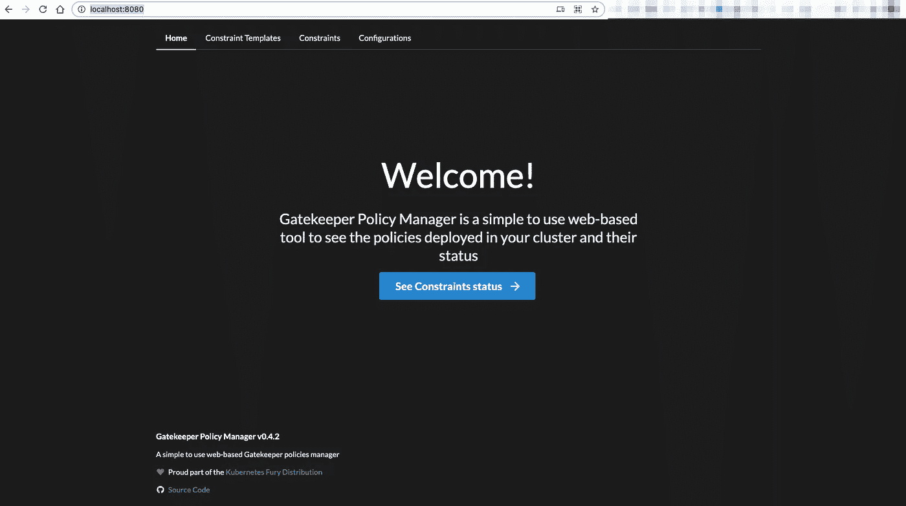
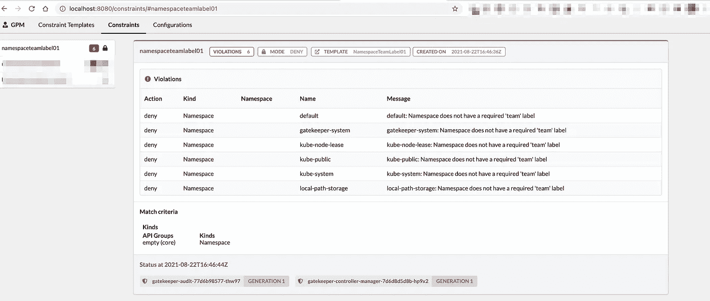

# 在 Kubernetes 中运行和编写网守策略—第 2 部分

> 原文：<https://itnext.io/running-and-writing-gatekeeper-policies-in-kubernetes-part-2-1c49c1c683b2?source=collection_archive---------3----------------------->

# 系列概述

本系列文章考察了一个自以为是的 Kubernetes 网关守护设备策略生态系统，包括什么是网关守护设备，为什么使用网关守护设备，编写和测试策略，将策略部署到本地 Kubernetes 集群，以及如何使它们对用户可见。本系列的所有代码都位于这个 GitHub 存储库中:

[](https://github.com/sebradloff/k8s-gatekeeper-policies-example) [## GitHub-sebradloff/k8s-网关守护设备-策略-示例

### 在 GitHub 上创建一个帐户，为 sebradloff/k8s-gate keeper-policies-example 开发做出贡献。

github.com](https://github.com/sebradloff/k8s-gatekeeper-policies-example) 

[**第 1 部分:网守组件和架构概述**](https://medium.com/@sebradloff/running-gatekeeper-in-kubernetes-and-writing-policies-part-1-fcc83eba93e3)

# 第 2 部分概述

在这篇文章中，我们将回顾最初的项目设置，利用 [konstraint](https://github.com/plexsystems/konstraint) cli 编写策略，创建一个本地[种类的 Kubernetes 集群](https://kind.sigs.k8s.io/)和[网关守护设备策略管理器](https://github.com/sighupio/gatekeeper-policy-manager)(查看策略和违规的 UI)，并将这些策略应用到集群。

# 初始项目设置和概述

让我们回顾一下高级存储库结构，让我们的本地集群启动并运行起来。

我假设您在 Mac 上运行这个程序，但是它应该也可以在 Linux 上运行。将项目依赖项 [docker](https://docs.docker.com/get-docker/) 、 [kubectl](https://kubernetes.io/docs/tasks/tools/) 和 [kind](https://kind.sigs.k8s.io/docs/user/quick-start/#installation) 作为二进制文件安装在您的路径中。安装完依赖项后，克隆 GitHub 存储库:

```
git clone [https://github.com/sebradloff/k8s-gatekeeper-policies-example.git](https://github.com/sebradloff/k8s-gatekeeper-policies-example.git)
```

## 知识库结构

目录是我们写政策的地方。`policies/`目录中的每个新子目录都代表一个新策略的名称，我们将在其中创建定义策略的`src.rego`和测试策略的`src_test.rego`。

每个策略子目录都有一个代表约束和约束模板的`constraint.yaml`和`template.yaml`，由 [konstraint](https://github.com/plexsystems/konstraint) cli 通过 rego 上的注释生成。`policies/lib/`目录包含一个 konstraint [标准 Kubernetes 库](https://github.com/plexsystems/konstraint/tree/main/examples/lib)的副本，我们在我们的策略中使用它。为什么要重新发明轮子？

`manifests/`目录是通过脚本放置所有约束和约束模板的地方。在某些情况下，我们希望手动生成约束，这就是为什么在 konstraint cli 策略创建命令期间，所有的 CRD 都没有放入`manifests/`目录。

`scripts/`目录包含一组初始设置或持续集成过程所需的脚本和配置。

`gatekeeper-infra-manifests/`目录包含最初用网关守护设备和网关守护设备策略管理器配置我们的集群所必需的 Kubernetes 清单。

`Makefile`保存了我们需要运行的所有命令，以建立我们的集群并快速迭代我们的策略。

## 集群设置

我们将使用我们的网关守护设备和网关守护设备策略管理器 Kubernetes manifests 建立一个友好的 Kubernetes 集群。运行以下两个 make 目标来创建集群并应用 Kubernetes 清单。

```
make kind_cluster_setup
make kubectl_apply_gatekeeper_infra
```

运行这些命令可能需要几分钟时间来设置群集，并提取运行 Gatekeeper pods 所需的 docker 映像。

如果您想使用 kubectl 查看集群，请确保使用 Makefile 中定义的 kubeconfig。

您可以通过运行`make port_forward_gatekeeper_policy_manger_ui`并在浏览器的`localhost:8080`访问网关守护设备策略管理器 UI，确保一切正常运行。



# 迭代网关守护设备策略

在本节中，我们将重点关注网关守护设备策略的迭代过程。我们将首先编写一个策略，测试它，生成 Kubernetes 资源，将它们应用到集群，并证明违反策略的对象拒绝。我们将要开始的策略是确保所有名称空间都有一个“团队”标签。

## 撰写政策

首先创建目录`policies/namespace-team-label-01/`，我们将在其中存储该策略所需的所有文件。我们将在`policies/namespace-team-label-01/src.rego`文件中定义策略本身。

从文件的顶部开始，我们有 konstraint cli 使用的注释和注释。`@title`注释表示策略的标题以及策略的描述，在生成的策略文档中使用。

`@enforcement`标签用于告诉 konstraint 哪个[执行动作](https://open-policy-agent.github.io/gatekeeper/website/docs/violations/#dry-run-enforcement-action)用于生成的约束。现在，我们将坚持“拒绝”，但我们将讨论如何在未来利用“干运行”。

`@kinds`是我们指定我们希望将这个策略应用到哪些 Kubernetes 资源类型的地方，这些资源类型被添加到约束匹配器中。在我们的例子中，我们只关注名称空间。

`package`定义了 rego 模块的名称，如果需要，可以将它导入到其他策略中。

现在说正题，遵循[规则模式](https://github.com/open-policy-agent/frameworks/blob/4f80ac172ddffad377f88986a162242dcf772eb6/constraint/README.md#rule-schema)的看门人需要`violation`规则。括号`[{"msg": msg, “details": {}}]`定义了违例函数的预期返回参数。这就是我们如何向集群用户反馈为什么网关守护设备拒绝了对其资源的更改。值得注意的是“细节”键是可选的。

`violation`的主体是我们定义政策的地方。**我建议将您的策略视为一组真或假的陈述，需要评估为真才会发生违规**。首先，我们将输入对象定义为一个名为`resource`的变量。如果 team 标签不存在，或者其中任何一个键的值为 null，那么该语句的值应该为 true。因为它评估为真，所以它继续遍历违例块并创建`msg`变量。`msg`变量被定义为名称空间名称的插值字符串，它解释了名称空间被拒绝的原因。

## 为策略编写测试

[OPA 为我们提供了在类似 style 的单元测试中直接测试策略](https://www.openpolicyagent.org/docs/latest/policy-testing/)的能力。我们创建一个名为`src_test.rego`的文件，因为 konstraint 库在生成 CRDs 时会忽略所有带有`_test.rego`的文件。测试被表示为减压阀规则，规则名称的必要约定是以`test_`为前缀。在文件的顶部，我们声明了与策略相同的包名来调用策略中声明的函数。

以上是最简单的测试例子。一个`input`变量定义了传入违规规则的审查对象。在这里，它是一个名称空间 Kubernetes 资源。然后用输入变量调用`violation`规则，返回值存储在`results`变量中。然后，根据测试的情况，如果我们预期会有一个违例，我们期望结果包含一组对象，如果没有违例，则包含一个空集。

在这个项目中，我们使用`make opa_test`运行测试，它在我们的 policies 目录下的 OPA docker 容器中运行 OPA test 命令。如果你想在一个正在运行的测试中理解一个变量在策略或者测试中的值，你需要使用`[trace](https://www.openpolicyagent.org/docs/latest/policy-reference/#debugging)` [内置函数](https://www.openpolicyagent.org/docs/latest/policy-reference/#debugging)，并且测试需要失败。

[](https://asciinema.org/a/QVgjReiQFtFEdxb652tNZrVCj) [## 调试测试

### 由 sebradloff 录制

asciinema.org](https://asciinema.org/a/QVgjReiQFtFEdxb652tNZrVCj) 

在上面的记录中，我使用 trace 函数打印出 results 变量的值，并使用语句`true == false`故意使测试失败。当测试运行时，失败测试的输出显示我的打印语句，前缀为`Note`。

## 生成 Kubernetes 策略清单

既然我们已经编写了策略并对其进行了有效的测试，我们希望创建 Kubernetes 资源来将策略应用到我们的集群。在这个项目中，我们可以运行`make generate_all`目标来运行测试并生成所有的 Kubernetes 策略清单，并将它们放在`manifests/`目录中。底层 make 目标`constraints`使用 konstraint cli 创建策略，而`migrate_manifests`目标运行脚本`scripts/migrate_manifests.sh`。

我使用`migrate_manifests.sh`脚本将所有与策略相关的 Kubernetes 资源移动到`manifests/`目录，因为[有些情况下](https://github.com/plexsystems/konstraint/issues/106)我需要手动生成约束。

生成的 ConstraintTemplate 输出到名为`template.yaml`的文件中，相应的约束输出到名为`constraint.yaml`的文件中。生成的资源如下所示:

要将策略应用到集群，运行`make kubectl_apply_policies`。这可确保 ConstraintTemplates 在相应的约束之前应用于聚类。为了查看策略，我们在浏览器中检查网关守护设备 UI。



我们看到所有现有的名称空间目前都是违规的。这是把关者审计功能的一部分，对于迁移到新策略特别有用。

既然策略已经激活，如果我尝试使用 kubectl 创建一个没有团队标签的名称空间，我会得到如下体验:

[](https://asciinema.org/a/UEiaUC1stIlotcx16PTtcFX9A) [## kubectl 创建名称空间策略失败

### 由 sebradloff 录制

asciinema.org](https://asciinema.org/a/UEiaUC1stIlotcx16PTtcFX9A) 

## 生成策略文档

我们可以使用 konstraint cli 为我们的策略生成文档。当集群用户遇到违反策略的错误时，我发现这很有用；他们可以很容易地更好地理解违反的政策。文档是通过 make 目标`docs`生成的，它是`generate_all`目标的一部分。

您可以在`policies.md`文件中查看该存储库的策略文档:[https://github . com/sebradloff/k8s-gate keeper-policies-example/blob/main/policies . MD](https://github.com/sebradloff/k8s-gatekeeper-policies-example/blob/main/policies.md)

在下一篇文章中，我们将深入探讨编写策略及其相应测试的有趣想法。