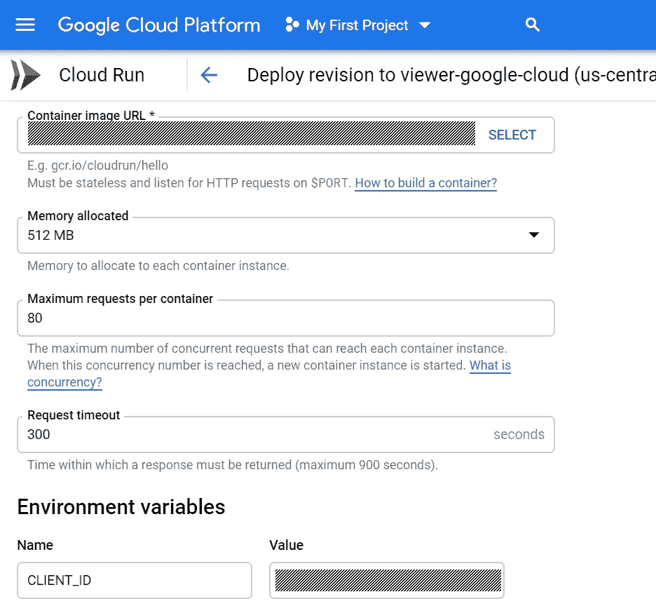

# DockerHub 到谷歌云运行

> 原文：<https://itnext.io/running-any-container-on-cloudrun-cca137cddbca?source=collection_archive---------2----------------------->


直冲云端

在听说它的一分钟后，我不得不尝试 Google CloudRun out，结果发现它有一个小怪癖:它要求您的服务器侦听＄{ PORT }环境变量中定义的特定端口。“粮草！如何运行我刚刚从 Docker-Hub 上下载的容器，没有修改的理由！?"，不要评价我，作为这个同步世界的公民，我有天赐的权利可以极度懒惰！毕竟，我如此喜欢 CloudRun 的原因是因为它让我变得懒惰…

**言归正传:**我有一些想要运行的 docker 映像，它知道如何监听某个端口，该端口可以在某个配置文件或命令行参数中进行配置，但它绝对不知道 google 注入到容器 env 中的＄{ PORT }参数。

对原始 docker 文件的一点观察表明它是从一些 Debian 风格(debian-slim，ubuntu 等)开始的。)所以我有 apt get，你可能需要用 yam 或者 apk 取决于发行版。

**我的计划:**

1.  从我的目标容器开始
2.  安装 nginx
3.  更改 nginx 配置以监听{PORT}
4.  配置 nginx，将流量路由到原始服务器的默认端口
5.  在 CloudRun 上启动它，并在几秒钟内获得可扩展的云服务

**你可能已经注意到一个小问题** : nginx 不知道如何监听 env 变量提供的动态端口号，不要担心，我们将在我们的容器运行脚本中使用一个小的 **sed 命令**来替换运行它之前 nginx 配置中的端口，以及原始的服务器进程。

下面是我们的 nginx 配置。一个基本服务器，在端口$NGINX_PORT 上有一个监听器(在容器运行时由 sed 脚本替换)，以及一个 proxy_pass 命令，用于将所有内容发送到原始服务器端口(此处为 8042):

```
worker_processes 1;
events { worker_connections 1024; }
http {
  server {
    listen $NGINX_PORT;
    location / {
      proxy_pass [http://127.0.0.1:8042](http://127.0.0.1:8042);
      proxy_redirect off;
    }
  }
}
```

dockerfile 只是按照计划，从原始映像开始，安装 nginx 并对其进行配置，然后运行一个脚本，该脚本将用${PORT}替换 nginx 监听端口，并运行所有需要的进程。

请注意带有 **"Entrypoint []"** 的那一行，因为它删除了原始的入口点，消除了在容器而不是我们的脚本中启动的原始流程的错误或问题。

```
FROM jodogne/orthanc-pluginsRUN apt-get update && apt-get install -y \
    nginxRUN rm -rf /etc/nginx/nginx.conf
ADD nginx.conf /etc/nginx/nginx.conf
ADD run_nginx.sh ./run_nginx.shENTRYPOINT []CMD ["bash", "./run_nginx.sh"]
```

我现在需要从我的原始容器中得到的唯一东西是获取它的原始 CMD(或端点),并把它作为我的 run_nginx shell 文件启动的最后一个进程。

**下面是我的 nginx_run.sh 文件，**它用“sed”替换端口，作为后台进程启动 nginx，然后作为容器的主进程运行原来的服务器。如果你有任何问题，首先检查你的 nginx_run.sh 文件中是否有[CR][LF]，把它们改成[LF]，这样 linux/bash 就不会发疯了…

```
sed -i "s/\$NGINX_PORT/${PORT}/g" /etc/nginx/nginx.conf
exec "/usr/sbin/nginx" -c "/etc/nginx/nginx.conf" -g "daemon off;" &
exec "/usr/local/sbin/Orthanc"
```

现在我需要做的就是构建 docker，标记它并将其推送到一个 google cloud registry (CloudRun 不支持其他注册表)，并通过选择 docker 映像和启用一个公共 URL 在 CloudRun 控制台中设置服务。可选地，您还可以提供想要注入到容器中的任何 env 变量，并更改内存限制和超时。



**现在按“部署”,一分钟后，通过调用其 Url 检查服务是否启动并运行。**这项新服务现在是一项完全可扩展的服务，因为每当遇到高流量时，google 都会运行额外的容器，这是通过检查设置中每个容器的最大并发请求数来实现的(目前，80 是允许的最高设置)。只有当至少有一个请求处于活动状态时，才会对容器进行计费，因此一个没有被访问的运行中的容器绝对不会产生任何成本。

希望这有助于你使用这个非常好的 Goolge 云服务，是时候让容器变得比 ECS/GKE/EKS 更容易使用了，一旦你克服了 CoudRun 的单一粗糙点，它就会像纯粹的魔法一样运行你的容器。**我必须祝贺谷歌云团队**战胜了 AWS，AWS 仍然是我在大多数情况下首选的云提供商。