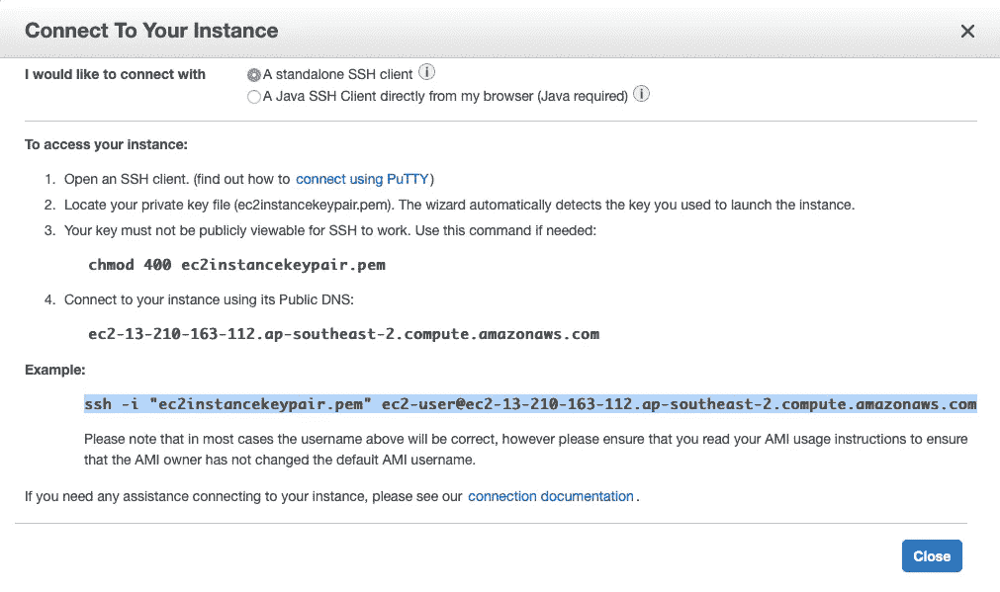
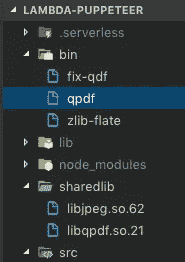
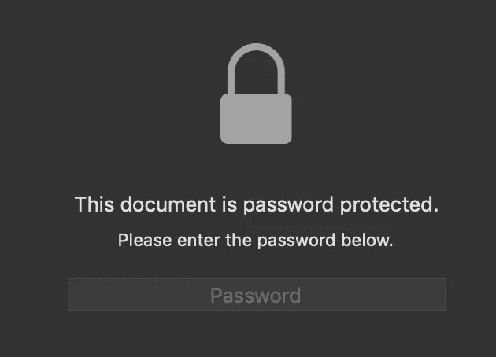

# 在 AWS Lambda 中运行任意可执行文件—加密 PDF

> 原文：<https://itnext.io/running-arbitrary-executables-in-aws-lambda-encrypting-a-pdf-afea47e3c345?source=collection_archive---------1----------------------->


在我的[上一篇文章](https://medium.com/@keith.coughtrey/html-to-pdf-using-a-chrome-puppet-in-the-cloud-de6e6a0dc6d7?source=friends_link&sk=de0cbdf69ae1cfd52ecd8ba457c2ded7)中，我使用 headless chrome 和 puppeteer 创建了一个 pdf 服务。今天，我将获取该服务的输出，并对其进行密码保护。

[Qpdf](https://github.com/qpdf/qpdf) 是一个开源的命令行工具，支持加密 pdf 文件。它可用于设置所有者密码(可用于限制修改和打印等功能)和用户密码(仅用于限制打开文件)。

从 Lambda 函数运行命令行工具需要我们深入构建和打包相关二进制文件的复杂过程。理解如何做到这一点的起点是这篇文章:

[](https://aws.amazon.com/blogs/compute/running-executables-in-aws-lambda/) [## 在 AWS Lambda | Amazon Web Services 中运行任意可执行文件

### 在这篇博客的前几篇文章中，我们已经讨论了 Lambda 如何管理容器生命周期，以及如何使用自定义的…

aws.amazon.com](https://aws.amazon.com/blogs/compute/running-executables-in-aws-lambda/) 

> 互联网上有大量的开源软件，这些软件没有经过预编译，也不能从包存储库中下载。你可能最终会发现一个你需要自己编译的软件包，从它的源代码。

不幸的是，qpdf 是一个我们需要自己编译的包。我们需要在我们的函数最终运行的那种类型的 linux 机器上这样做。

> Lambda 执行环境基于一个特定的 [Amazon Linux AMI](https://aws.amazon.com/amazon-linux-ami/) 和内核版本。Lambda 部署包中使用的任何本机二进制文件都必须在这个环境中编译，并且只支持 64 位二进制文件。

我们可以通过旋转 EC2 实例来访问这样的机器。

# 连接到 EC2 实例

目前，AWS 免费层包括每月 750 小时的 Linux t2.micro 实例，为期一年。要保持在空闲层内，请仅使用 EC2 微实例。目前的定价是[这里](https://aws.amazon.com/ec2/pricing/)。

要启动一个实例，请遵循这些指令。当出现提示时，选择生成一个新的密钥对，给它一个名称(例如`ec2instancekeypair.pem`)并下载它并将其移动到一个适当的目录(例如`~/Dev/ec2`)。

实例运行后，按 connect，您将看到如下对话框



在您选择的目录中打开一个终端，运行 chmod 命令(防止您的密钥被任何人读取)，然后运行 ssh 命令。现在我们已经连接到 EC2 实例，我们需要从源代码构建 qpdf。

在 qpdf 自述文件中，我们发现:

> 从 UNIX/Linux 上的源代码发行版构建对于 UNIX 和类似 UNIX 的系统，您通常只需要
> 
> 。/配置
> 制作
> 制作安装

为了能够运行这些命令，我们首先需要用一些开发工具来设置我们的实例。

[](https://docs.aws.amazon.com/AWSEC2/latest/UserGuide/compile-software.html) [## 准备编译软件-亚马逊弹性计算云

### 安装开发工具来编译软件。

docs.aws.amazon.com](https://docs.aws.amazon.com/AWSEC2/latest/UserGuide/compile-software.html) 

> 因为软件编译不是每个 Amazon EC2 实例都需要的任务，所以默认情况下不会安装这些工具，但是它们在一个名为“开发工具”的包组中是可用的，该包组可以通过 **yum groupinstall** 命令轻松添加到实例中。

```
[ec2-user ~]$ **sudo yum groupinstall "Development Tools"**
```

接下来，我们获取代码，从 tar 中提取代码，然后进入代码目录。

```
wget "https://github.com/qpdf/qpdf/archive/release-qpdf-8.4.0.tar.gz"tar -zxvf release-qpdf-8.4.0.tar.gzcd qpdf-release-qpdf-8.4.0/
```

我们第一次运行 configure 的尝试以这些警告结束:

```
./configureconfigure: WARNING: unable to find required header jpeglib.hconfigure: WARNING: unable to find required library jpeg
```

> QPDF 依赖于外部库 [zlib](http://www.zlib.net/) 和 [jpeg](http://www.ijg.org/files/) 。 [libjpeg-turbo](https://libjpeg-turbo.org/) 库也可以工作，因为它与常规 jpeg 库兼容，QPDF 不使用任何在直接 jpeg8 API 中不存在的接口。这些都是每个 Linux 发行版的一部分，并且很容易获得。下载信息出现在文档中。

所以现在我们需要建立一个 jpeg 库。这里我们可以采用不同的方法，因为 libjpeg-turbo 可以由 yum 安装。为了使它可用，我们获取 yum repo 并将其放在`/etc/yum.repos.d`文件夹中，当我们运行 install 命令时，yum 将在那里找到它。

```
cd /etc/yum.repos.d/
sudo wget "https://libjpeg-turbo.org/pmwiki/uploads/Downloads/libjpeg-turbo.repo"
sudo yum install libjpeg-turbo-official
```

接下来，我们需要在构建 pdf 时使库可用

```
export LIBRARY_PATH=/usr/local/lib:/opt/libjpeg-turbo/lib64:$LIBRARY_PATH
export CPATH=/usr/local/include:/opt/libjpeg-turbo/include:$CPATH
```

现在我们可以返回到 qpdf 代码所在的目录，并尝试再次构建。

```
cd ~/qpdf-release-qpdf-8.4.0/
./configure
make
sudo make install
```

这次我们成功了:)

# 使我们的库对 lambda 函数可用

基本上，我们需要:

*   将 EC2 中的相关文件复制到我们的项目中
*   上传带有 aws lambda 部署包的可执行二进制文件。
*   确保我们的可执行二进制文件保持正确的可执行权限。
*   更改`$PATH` env 变量以包含我们的可执行文件的位置。

然后我们应该可以运行`qpdf`命令。

## 复制文件

当我们将 qpdf 安装在可执行文件之上时，我们将它放在了`/usr/local/bin`目录中，该目录位于 EC2 实例的路径上。

```
[ec2-user@ip-172-31-11-145 bin]$ cd /usr/local/bin[ec2-user@ip-172-31-11-145 bin]$ ls -ltotal 3716-rwxr-xr-x 1 root root    8369 Jun  3 02:40 fix-qdf-rwxr-xr-x 1 root root 3612336 Jun  3 02:40 qpdf-rwxr-xr-x 1 root root   40808 Jun  3 02:40 zlib-flate
```

我们看到有 3 个可执行文件放在那里。为了将它们压缩并复制到我们的开发机器上，我们使用以下命令:

```
zip -r9 /tmp/QpdfBinaries.zip /usr/local/bin/*exitscp -i "ec2instancekeypair.pem" ec2-user@ec2-13-210-163-112.ap-southeast-2.compute.amazonaws.com:/tmp/QpdfBinaries.zip QpdfBinaries.zip
```

注意您必须更改`ec2-user@ec2–13–210–163–112.ap-southeast-2.compute.amazonaws.com`来引用您的 ec2 实例。

## 使用无服务器部署上传

在部署中包含二进制文件实际上非常容易。

在您的项目中创建一个名为`bin`的文件夹，并将所有文件放入其中。然后，把这个加到你的`serverless.yml`

```
package:
  include:
    - bin/*
    - sharedlib/*
```

## 了解 Linux 上的共享库

每当执行 ELF 二进制程序时，程序加载程序(`/lib/ld-linux.so.X`)就会运行。加载器查找并加载程序使用的所有共享库。要了解`qpdf`使用了哪些共享库，可以使用`ldd`:

```
[ec2-user@ip-172-31-11-145 ~]$ ldd /usr/local/bin/qpdflinux-vdso.so.1 =>  (0x00007ffe061f5000)libqpdf.so.21 => /usr/local/lib/libqpdf.so.21 (0x00007fcda1028000)libjpeg.so.62 => /usr/lib64/libjpeg.so.62 (0x00007fcda0dcd000)libz.so.1 => /lib64/libz.so.1 (0x00007fcda0bb7000)libstdc++.so.6 => /usr/lib64/libstdc++.so.6 (0x00007fcda08b3000)libm.so.6 => /lib64/libm.so.6 (0x00007fcda05b0000)libgcc_s.so.1 => /lib64/libgcc_s.so.1 (0x00007fcda039a000)libc.so.6 => /lib64/libc.so.6 (0x00007fcd9ffcd000)/lib64/ld-linux-x86-64.so.2 (0x00005560ffe20000)
```

我们将所需的共享库与 Lambda 部署包捆绑在一起。在项目中创建一个名为`sharedlib`的文件夹，并将所有必需的共享库文件放在那里。稍后我们将把环境变量`LD_LIBRARY_PATH`设置到适当的位置。

```
scp -i "ec2instancekeypair.pem" [ec2-user@ec2-13-210-163-112.ap-southeast-2.compute.amazonaws.com](mailto:ec2-user@ec2-13-210-163-112.ap-southeast-2.compute.amazonaws.com):/usr/local/lib/libqpdf.so.21.4.0 libqpdf.so.21
scp -i "ec2instancekeypair.pem" [ec2-user@ec2-13-210-163-112.ap-southeast-2.compute.amazonaws.com](mailto:ec2-user@ec2-13-210-163-112.ap-southeast-2.compute.amazonaws.com):/usr/lib64/libjpeg.so.62 libjpeg.so.62
```

事实证明，只有 libqpdf.so.21 和 libjpeg.so.62 需要添加到 lambda 已经可用的共享库中。

您的项目现在应该看起来像这样:



## 许可

你的文件在 lambda 机器上解包时应该保持它们的权限。在您的开发机器上使用`chmod`赋予文件执行权限，如果他们还没有的话。

## 改变路径

我们需要确保在函数代码的开头包含以下内容:

```
process.env.PATH = `${process.env.PATH}:${process.env.LAMBDA_TASK_ROOT}/bin`;process.env.LD_LIBRARY_PATH = `${process.env.LAMBDA_TASK_ROOT}/sharedlib`;
```

# 运行 qpdf

> 要启动一个后台进程，您可以使用 Node.js 中的 [*child_process* 命令](https://nodejs.org/api/child_process.html)来执行一个随您的函数上传的二进制文件或任何对您的函数可见的可执行文件，比如 */bin/bash* 或 */usr/bin/python* 。Node.js 既支持 *child_process.spawn* ，它通过接受回调或返回 EventEmitter 来遵循常见的异步编程模式，也支持 *child_process.spawnSync，*，它在将控制权返回给代码之前等待衍生的进程退出。

下面是异步生成`qpdf`命令的代码，向它传递必要的参数。

完整的加密选项在这里[列出。与我们的目的相关的部分是:](http://qpdf.sourceforge.net/files/qpdf-manual.html#ref.encryption-options)

```
--encrypt *user-password* *owner-password* *key-length* [ *restrictions* ] --
```

通过指定`modify=none`，我们使得 pdf 对于任何只知道用户密码的人来说都是不可变的。您还可以添加对打印、文本和图像提取、注释等的限制。

如果`*key-length*`设置为 256，则最低 PDF 版本为 1.7，扩展级别为 8，使用的基于 AES 的加密格式为 Acrobat X 支持的 PDF 2.0 加密方法。

# 实现加密服务

由于 qpdf 需要对文件进行加密，存储在文件系统中，并将结果文件写出到文件系统中，因此我们需要创建一个服务来读取和写入文件。

让我们定义一个我们的文件系统服务必须实现的简单接口:

```
export interface FileSystemService { read(path: string): Promise<Buffer>; save(data: Buffer, path: string): Promise<any>;
}
```

该接口的一个可能实现是:

幸运的是，每个 Lambda 函数在其自己的/tmp 目录中接收 500MB 的非持久磁盘空间，因此我们可以用它来存储我们的文件。

这里我们完成了加密服务。注意，private encrypt 方法的代码已经被省略，因为它在本文前面已经显示过。

最后一步是修改我之前文章中的`handler`代码，在返回之前对 pdf 进行加密:

现在，当我们尝试打开由服务创建的 pdf 时，我们看到:



请注意，用户密码和所有者密码都可以是空字符串。如果将空字符串指定为用户密码，则打开 pdf 时不需要密码，但会施加应用于文档的任何限制，例如不允许修改。

今天的帖子到此结束。记得停止 EC2 实例，以确保不会产生意外的费用。

显然`qpdf`只是你可能想在 Lambda 函数中使用的命令行工具的一个例子。运行另一个工具的步骤应该与上面列出的非常相似。

在我的下一篇[文章](https://medium.com/@keith.coughtrey/aws-step-functions-why-you-should-use-them-eb40cc359f2a?source=friends_link&sk=dd791418db0db9861f1ac580627617eb)中，我将介绍从 AWS step 函数调用 PDF 服务。

该系列的所有代码都可以在[这里](https://github.com/keithcoughtrey/LambdaPuppeteer)找到。