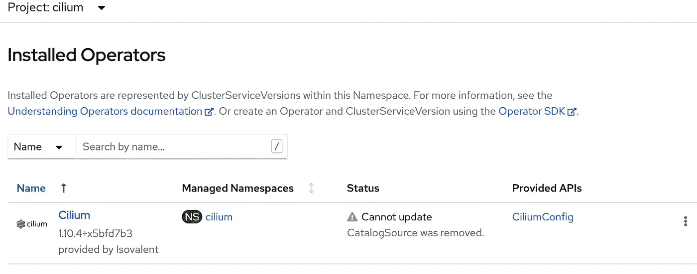
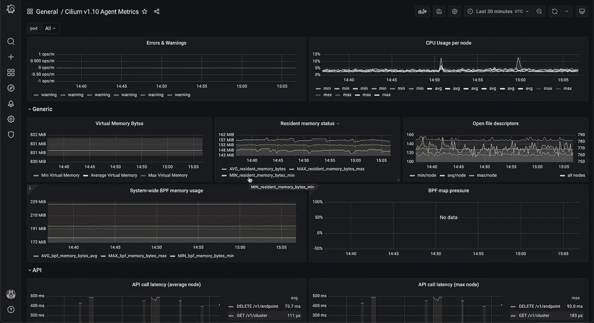

# 在 OpenShift 上运行纤毛 CNI 插件

> 原文：<https://itnext.io/running-cilium-cni-plugin-on-openshift-f161b9411400?source=collection_archive---------4----------------------->


*图像由* [*PollyDot*](https://pixabay.com/users/pollydot-160618/?utm_source=link-attribution&utm_medium=referral&utm_campaign=image&utm_content=352206) *从* [*Pixabay*](https://pixabay.com/?utm_source=link-attribution&utm_medium=referral&utm_campaign=image&utm_content=352206)

Cilium 是 OpenShift 上[认证的 CNI 插件](https://access.redhat.com/articles/5436171)之一。它由 Linux 内核 eBPF 技术提供支持，不仅为 Kubernetes 提供了网络，还支持对应用程序透明的内核的可观察性和安全性控制。

这篇文章分享了我在 OpenShift 上对纤毛设置的探索。

## OCP 集群设置

Cilium CNI 插件必须在集群设置期间安装。例如，必须在 install-config.yaml 中将网络类型更改为 Cilium，

```
...
networking:
  clusterNetwork:
  - cidr: 10.128.0.0/14
    hostPrefix: 23
  **networkType: Cilium**
  serviceNetwork:
  - 172.30.0.0/16
...
```

我们需要为集群添加一些自定义的纤毛资源。

让我们首先创建清单，假设我们在复制了 install-config.yaml 的 ocp-install 目录中工作。

```
cd ocp-install
openshift-install create manifests --dir .
```

克隆 cilium-olm git repo(与 ocp-install 级别相同)

```
cd ..
git clone https://github.com/cilium/cilium-olm.git
```

将默认清单文件复制到创建的清单目录中，

```
cp cilium-olm/manifests/cilium.v1.10.4/* ocp-install/manifests
```

现在，根据更新的清单生成点火文件，

```
cd ocp-install
openshift-install create ignition-configs --dir .
```

将点火文件复制到 HTTP 服务器。

然后，像往常一样安装 OCP 集群。你应该把 OCP 和纤毛一起作为 CNI 网络插件运行。登录到 web 控制台，您应该看到 cilium 操作符安装在 Cilium 命名空间中。



## **更新 CiliumConfig**

我们将更新 CiliumConfig CRD 资源，使哈勃用户界面和监测。创建以下 YAML 文件，

```
apiVersion: cilium.io/v1alpha1
kind: CiliumConfig
metadata: 
  name: cilium
  namespace: cilium
spec:
  debug:
    enabled: false
  cni:
    binPath: /var/lib/cni/bin
    confPath: /var/run/multus/cni/net.d
  endpointRoutes:
    enabled: true
  hubble:
    enabled: true
    metrics:
      enabled:
      - dns:query;ignoreAAAA
      - drop
      - tcp
      - flow
      - icmp
      - http
      serviceMonitor:
        enabled: true
    tls:
      enabled: true
    relay:
      enabled: true
    ui:
      enabled: true
      ingress:
        enabled: true
        hosts:
          - hubble.apps.dev-cilium.ibmcloud.io.cpak
  ipam:
    mode: cluster-pool
    operator:
      clusterPoolIPv4MaskSize: "23"
      clusterPoolIPv4PodCIDR: 10.128.0.0/14
  kubeProxyReplacement: probe
  nativeRoutingCIDR: 10.128.0.0/14
  prometheus:
    enabled: true
    serviceMonitor:
      enabled: true
  operator:
    prometheus:
      enabled: true
      serviceMonitor:
        enabled: true
```

请注意，我们已经启用了 hubble relay 和 hubble UI，以便我们可以观察服务地图。我们还为操作员、纤毛和哈勃度量启用了普罗米修斯数据采集。由于 OCP 安装了 Prometheus operator，我们使用 Prometheus CRD 资源服务监视器来监视指标。

## 修复纤毛-olm 作用的 RBAC 问题

应用 YAML 文件，您将很快看到由于 RBAC 限制，定义的 CR 无法正确协调。serviceMonitors 和 ingress 是使用 cilium 命名空间中的服务帐户 cilium-olm 创建的。命名空间角色 cilium-olm 已绑定到服务帐户。该角色缺少对这两种资源的 RBAC 访问权限。

通过将权限附加到 servicemonitors 和 ingresses 来更新 cilium-olm 角色，如下所示，

```
kind: Role
apiVersion: rbac.authorization.k8s.io/v1
metadata:
  name: cilium-olm
  namespace: cilium
rules:
...
- verbs:
    - '*'
  apiGroups:
    - monitoring.coreos.com
  resources:
    - **servicemonitors**
- verbs:
    - '*'
  apiGroups:
    - networking.k8s.io
  resources:
    - **ingresses** 
```

## 修复哈勃中继的 SELinux 权限问题

现在，如果你登录 hub-ui，你将看不到任何数据，也看不到任何服务地图。根本原因是由于 SELinux 禁止访问 hubble 创建的 UNIX 套接字文件，hubble-relay 无法正常运行。

关于这个问题更详细的分析可以参考我上一篇论文[这里](https://zhimin-wen.medium.com/selinux-policy-for-openshift-containers-40baa1c86aa5)。

修复方法是创建以下类型强制(te)文件。

```
module myapp 1.0;
require {
 type container_var_run_t;
 type container_t;
 class dir read;
 class sock_file write;
}
#============= container_t ==============
allow container_t container_var_run_t:dir read;
allow container_t container_var_run_t:sock_file write;
```

编译到策略模块中，并通过运行以下命令加载到 OCP 集群的工作节点中，

```
sudo checkmodule -M -m -o myapp.mod myapp.te
sudo semodule_package -o myapp.pp -m myapp.mod
sudo semodule -i myapp.pp
```

作为纤毛测试应用程序的一个例子，您现在应该能够在 hub-ui 中看到数据。


## 监视

我打开了用户工作负载监控，使用 OCP 的用户 prometheus 实例来收集纤毛数据。要允许 serviceMonitor CRD 从 cilium 命名空间开始抓取数据，请更改以下命名空间批注。

```
oc label ns cilium openshift.io/cluster-monitoring=false --overwrite
```

按照我的另一篇论文[中的描述安装 Grafana 仪表盘。我们还可以导入 grafana 网站发布的纤毛仪表板。下面显示了一个 grafana 仪表板示例，](https://zhimin-wen.medium.com/custom-grafana-dashboard-for-user-workload-in-openshift-6dc2d4cad274)



现在，OCP 的纤毛设置已经完成。我们准备通过定义 Cilium 网络策略来控制网络流量。