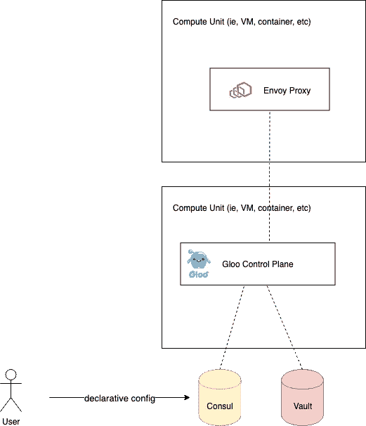
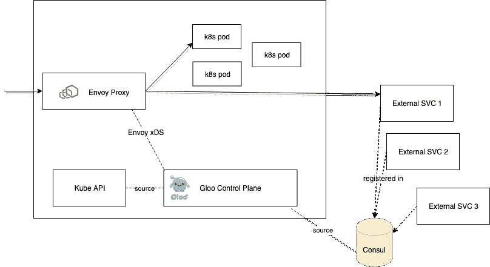

# 在 Kubernetes 或 Consul 或两者上运行 Envoy API 网关

> 原文：<https://itnext.io/running-envoy-api-gateways-on-kubernetes-or-consul-or-both-7a22deb27312?source=collection_archive---------4----------------------->

业界已经将[特使代理](https://medium.com/solo-io/guidance-for-building-a-control-plane-to-manage-envoy-proxy-at-the-edge-as-a-gateway-or-in-a-mesh-badb6c36a2af)作为 L7 网络的事实上的数据平面代理。你会发现 Envoy 作为数据层运行于许多不同的[服务网格实现](https://www.consul.io/docs/connect/index.html)以及入口和[分散 API 网关解决方案](https://medium.com/solo-io/decentralized-approach-to-api-gateways-for-openshift-on-your-way-to-service-mesh-cd3b4892c73f)。如今，Envoy 如此受欢迎的最大原因之一是它的[可插拔控制平面的开放接口](https://blog.envoyproxy.io/the-universal-data-plane-api-d15cec7a)。

Envoy 使用其 xDS 接口在运行时动态地控制代理的方方面面。这意味着你可以有一个[可插拔的实现，用于服务发现、路由和安全](https://medium.com/solo-io/guidance-for-building-a-control-plane-for-envoy-part-4-build-for-extensibility-40f8ac8e48e)。要实现这一点，您需要有一个控制平面，可以插入这些不同的后端，并通过 xDS 提供正确的特使配置。

[Gloo 是来自](https://gloo.solo.io) [Solo.io](https://www.solo.io) 的一个开源 API Gateway 项目，它构建在 Envoy Proxy 之上，具体工作如下:它为控制平面提供了一个[清晰的关注点分离，并允许您根据自己的环境来构建控制平面。](https://medium.com/solo-io/guidance-for-building-a-control-plane-for-envoy-part-4-build-for-extensibility-40f8ac8e48e)没有两个环境和进程是完全相同的，因此 Gloo 遵循[“开放-封闭”原则](https://en.wikipedia.org/wiki/Open%E2%80%93closed_principle)，其中核心是封闭的，以便进行修改，但我们可以通过用插件扩展它来丰富它的功能。这种方法在[构建控制平面管理特使](https://medium.com/solo-io/guidance-for-building-a-control-plane-to-manage-envoy-proxy-at-the-edge-as-a-gateway-or-in-a-mesh-badb6c36a2af)指南中有详细讨论。

这种可扩展性的一个例子是在 Kubernetes 中使用 CRDs([not hacky annotations](https://kubernetespodcast.com/episode/041-ingress/))本地运行 Gloo，或者在 Kubernetes 之外使用类似的声明性配置独立运行 Gloo。我们可以利用[金库](https://www.vaultproject.io)和[领事](https://www.consul.io)项目，从我们在 [Hashicorp](https://www.hashicorp.com) 的朋友那里让这一切发生。[使用 Gloo 作为特使](https://medium.com/solo-io/guidance-for-building-a-control-plane-for-envoy-part-5-deployment-tradeoffs-a6ef55c06327)的控制平面，我们可以利用这两个重要的用例:

1.  在 Kubernetes 内部或外部运行 API 网关
2.  路由到 Kubernetes 内部或外部的服务

用例 2 与 Gloo 关系密切，因此得名。Gloo 打算提供 L7 网络控制和可观测性，以统一混合环境(运行虚拟机、容器，甚至[FaaS/λ](https://gloo.solo.io/gloo_routing/virtual_services/routes/route_destinations/single_upstreams/function_routing/))。让我们更仔细地看看用 Consul 和 Vault 解决这两个用例。

# 在 Kubernetes 之外运行我们的 API 网关

Kubernetes 为 Gloo(以及一般的应用程序)提供了一些很好的操作简化。Kubernetes 拥有良好的声明式配置结构、服务发现机制、存储和秘密 API 等。如果我们选择在 Kubernetes 之外运营，我们需要有一种方法:

*   定义我们的声明性配置
*   存储我们的声明性配置
*   储存我们的秘密和钥匙

使用 Gloo 与领事和金库，我们可以做到这一点。



在此模型中，Gloo 被配置为使用 Consul 作为路由配置的后备存储，并使用 Vault 来存储/访问机密(即，设置 TLS、与 Lambda 对话等所需的密钥)

用户以声明格式指定他们的配置(类似于 Kubernetes 资源), Gloo 具体化配置。当直接与 Consul 对话时，用户可以做类似这样的事情:

```
curl -v **\
**    -XPUT **\
**    --data-binary "@<resource yaml file>.yaml" **\
**    "http://127.0.0.1:8500/v1/kv/gloo/<resource group>/<group version>/<resource kind>/<namespace>/<name>"
```

这将插入 Gloo 配置到领事和 Gloo 将阅读它，并提交给特使。请参见[关于 Consul 后端的文档以了解更多](https://gloo.solo.io/advanced_configuration/consul_kv/)。

# 路由到 Kubernetes 以外的服务

另一个非常重要的企业用例是使用多个不同来源进行服务发现的能力。当在 Kubernetes 中运行时，我们获得了内置的服务发现，但是组织可能使用 Consul(或其他方法)来发现我们希望融入 L7 应用程序网络控制(服务网格或 API 网关)的服务。使用 Gloo，我们可以将 Consul 配置为服务发现源，并路由到这些服务。



向 Consul 注册的服务可以在任何地方运行:虚拟机、容器、物理机器等。如果在 EC2 上运行， [Gloo 也支持直接 EC2 发现](https://gloo.solo.io/gloo_routing/virtual_services/routes/route_destinations/single_upstreams/ec2_upstream/)。

有关路由到领事注册服务的更多信息，请参见文档。

# 包扎

Envoy 是一个通用的 L7 数据平面，只要您的控制平面能够支持它。Gloo 支持在 Kubernetes 内部以及在 Consul 和 Vault 的帮助下在 Kubernetes 外部运行。请[看看 Gloo](https://gloo.solo.io) 项目，看看一个现代的、[分散式 API 网关](https://medium.com/solo-io/decentralized-approach-to-api-gateways-for-openshift-on-your-way-to-service-mesh-cd3b4892c73f)是什么样子的，它建立在支持多平台的 Envoy 之上。请在 [Slack](http://slack.solo.io) 或 Twitter 上关注[@ Christian posta](https://twitter.com/christianposta)[@ solio _ Inc](https://twitter.com/soloio_inc)了解更多信息！

*原载于 2019 年 8 月 16 日*[*https://medium.com*](https://medium.com/solo-io/running-envoy-api-gateways-on-kubernetes-or-consul-or-both-f195eede19c1)*。*