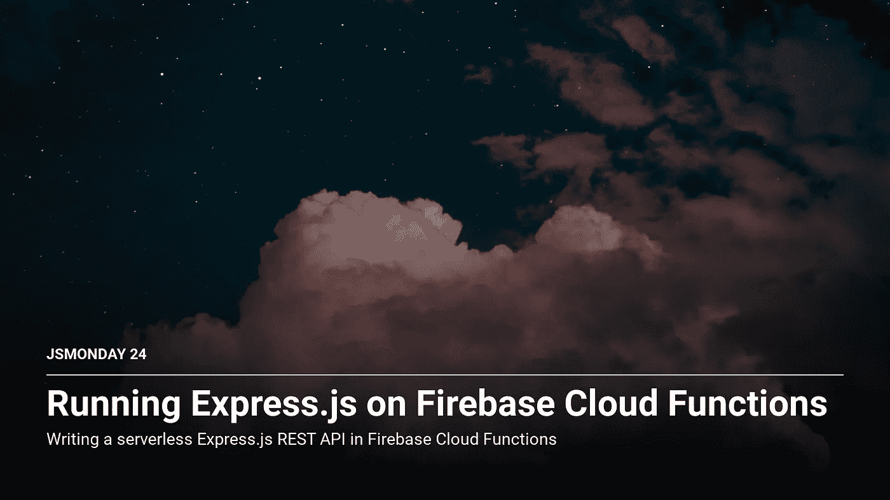
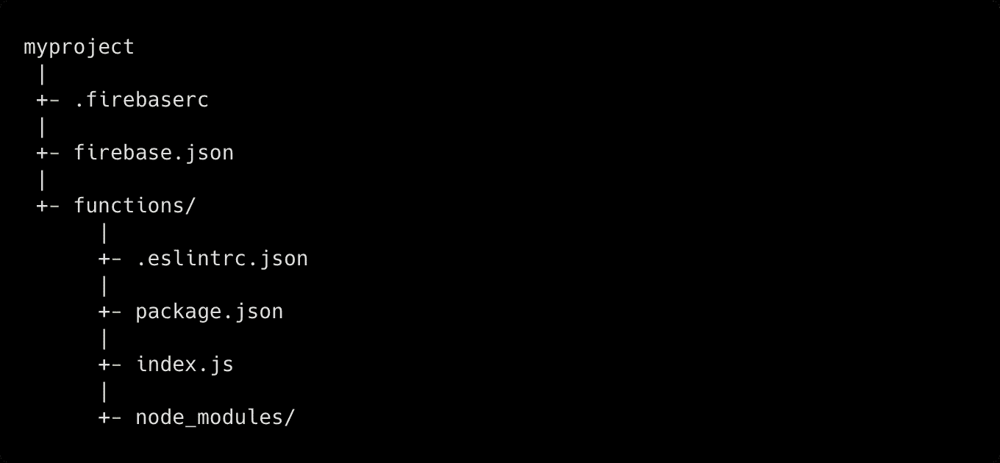
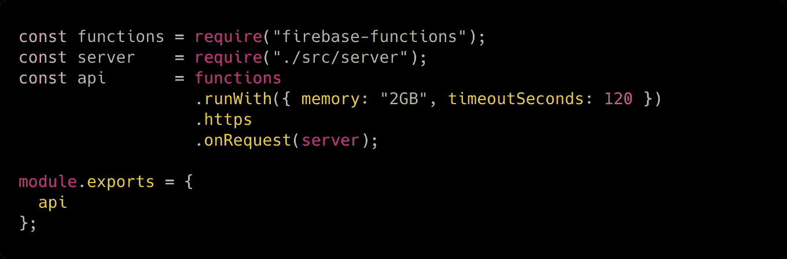
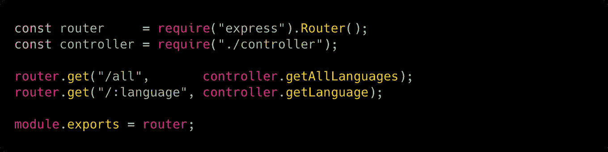
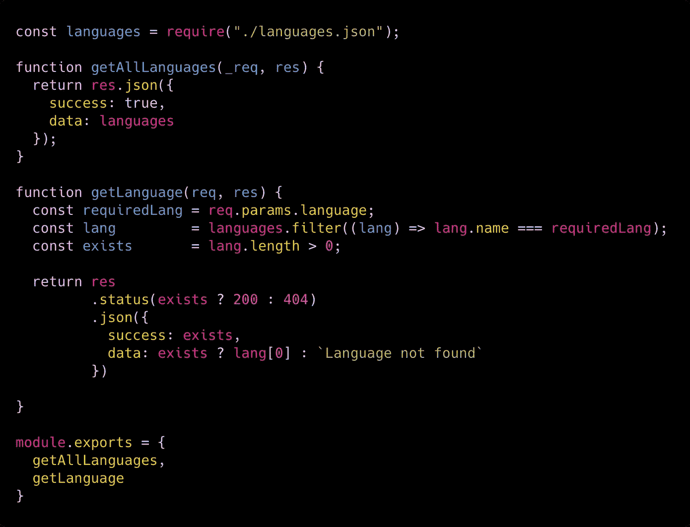

# 在 Firebase 云函数上运行 Express.js

> 原文：<https://itnext.io/running-express-js-on-firebase-cloud-functions-a20b536c6aec?source=collection_archive---------1----------------------->

firebase 的云函数是运行后端代码以响应 Firebase 事件和 HTTP 请求的绝佳解决方案。
您不需要管理您的服务器:只需部署 JavaScript 代码，让 Google 来完成剩下的工作。这样，即使没有 HTTP 请求，你也不需要为一个 24/7 运行的服务器付费；您只需为每个**功能执行**支付固定金额的费用，这要便宜得多！

# 你能用 Firebase 云函数做什么？

正如我们之前所说的，您可以运行后端代码来响应 Firebase 事件或 HTTP 请求。
例如，假设一个用户正在上传一张图片到 Firebase 存储器。您可以轻松地从该图像生成缩略图，并将它们的路径存储在 NoSQL 实时数据库 Firebase Firestore 中！

您还可以用 Express.js 编写一个**无服务器 REST API** 并在几秒钟内完成部署…这就是我们今天将看到的！

# 引导函数

首先让我们进入 [**Firebase 管理控制台**](https://console.firebase.google.com/u/0/) ，让我们添加一个**新项目**。

然后，让我们在您的机器上安装 **Firebase 工具**:

太好了！现在让我们从命令行登录到您的 Firebase 帐户:

现在你已经准备好启动你的函数了！这就是你要做的:

现在，您应该拥有以下文件夹结构:

我们准备好编写我们的 REST API 了！
让我们进入`functions`目录并安装所需的依赖项:

现在让我们打开`functions/index.js`文件，写下我们的 **Firebase 云函数**！

我们来分析一下上面的代码:

1.  我们需要`firebase-functions`模块。
2.  我们需要一个`server`模块。这里我们将编写我们的 REST 服务器。
3.  我们声明一个新的`api`常量，它是 Firebase Cloud 函数处理程序:每次我们得到一个 HTTP 请求，我们将分配 2GB 的内存和最多 120 秒的时间来执行函数。
    我们还声明它将在 HTTP 下服务，请求将由`server`模块处理。
4.  我们只是导出了`api`函数。它将可以通过`https://<your-project>/api`端点到达。

现在让我们进入我们的`server`模块:

如您所见，我们正在创建一个标准的 Express.js 应用程序，其中我们基本上只声明了一个端点(`/languages`)和一个`*`通配符，它将响应一个 404 状态页面。

让我们看看我们的`/lib/languages/route.js`文件中有什么:

只是路线！我们将把这两条路线的处理程序委托给我们的`/lib/languages/controller.js`文件:

如您所见，我们只是创建了两个控制器，它们从本地 JSON 文件中获取数据，但也可能是数据库调用或任何其他数据源。

在`getAllLanguages`函数中，我们只是从`languages.json`文件发回一组编程语言。
在`getLanguage`函数中，我们做了一些更复杂的事情:

1.  我们将所需的编程语言作为 Express.js 参数(`/languages/:language`)。
2.  我们从 JSON 文件中获取该语言
3.  我们在控制`lang`变量是否用一个元素的数组来赋值。
4.  现在我们向用户发回一个响应:如果我们的 JSON 文件中存在所需的语言，我们将发回一个 200 状态代码。否则，我们将发送 404。
5.  然后，我们发送回所需的语言(如果存在)或友好的错误消息。

# 测试功能

我们现在准备在本地测试我们的功能 Firebase 让测试变得很容易！让我们转到`/functions`目录并键入:

这将引导一个本地服务器，其端点如下:**http://localhost:5000/js Monday-CMS/us-central 1/api**，您可以在这里测试您的 API！试着去下面的网址看看你能得到什么:

[http://localhost:5000/js Monday-CMS/us-central 1/API/all](http://localhost:5000/jsmonday-cms/us-central1/api/all)

# 部署功能

如果在本地测试功能很容易…部署它就更容易了！只需键入以下命令:

您的函数现在可以从整个互联网上调用了！

