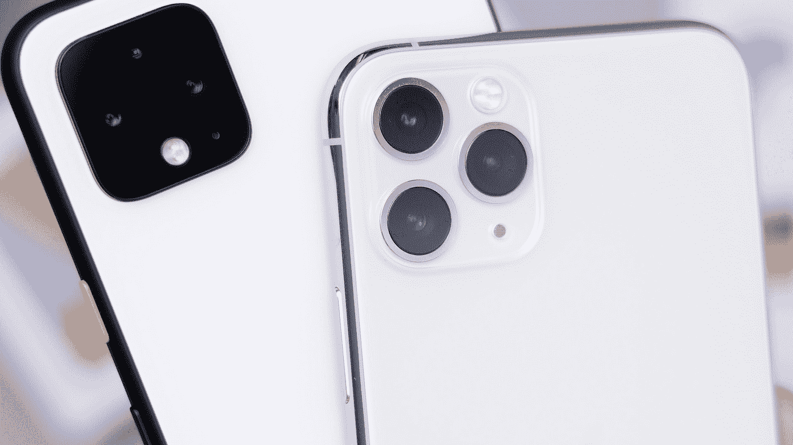
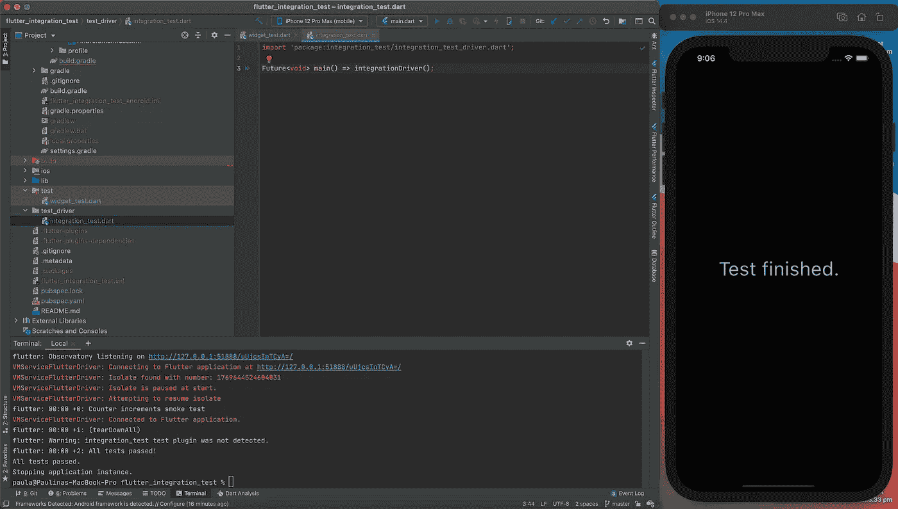
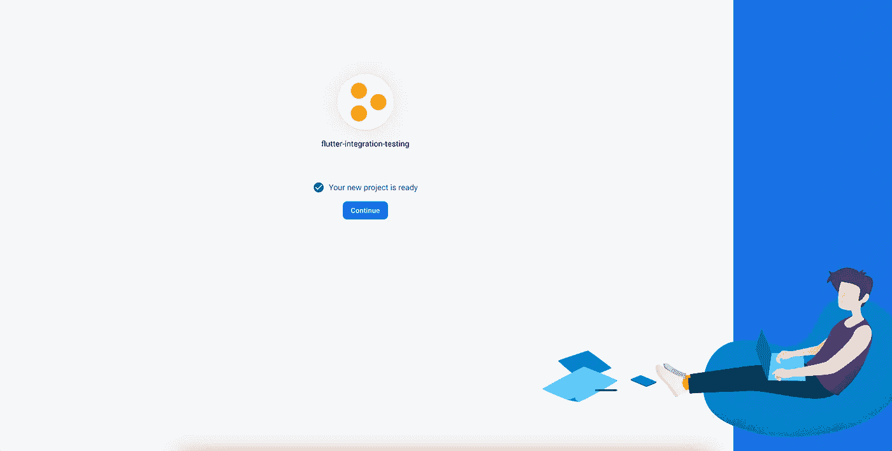
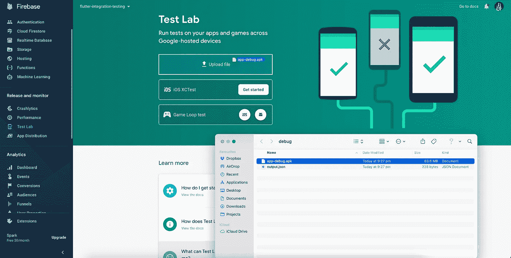
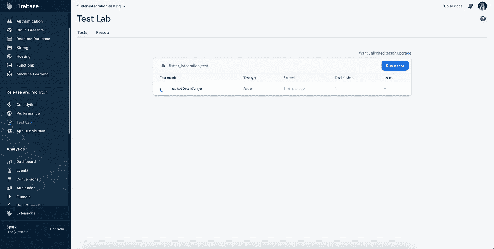
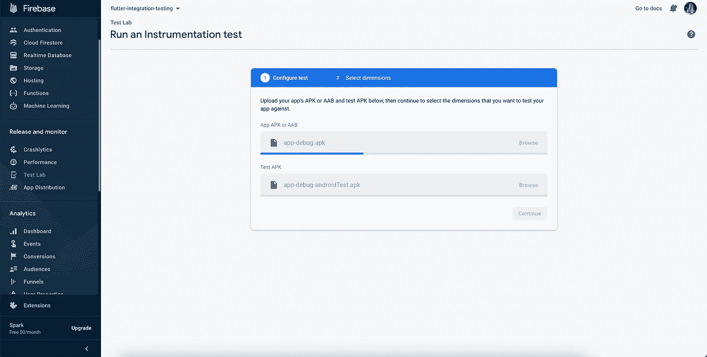
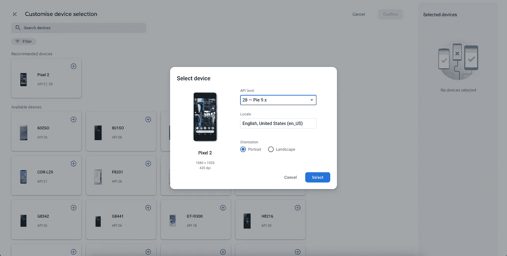
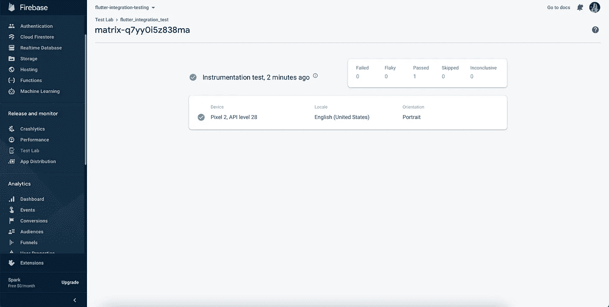

# 在 Firebase 试验室进行颤振综合试验

> 原文：<https://itnext.io/running-flutter-integration-tests-on-firebase-test-lab-820b57af7cd2?source=collection_archive---------4----------------------->



丹尼尔·罗梅罗在 [Unsplash](https://unsplash.com?utm_source=medium&utm_medium=referral) 上的照片

嗨！今天，我将向大家展示如何使用 Firebase Test Lab 在设备上运行颤振集成测试。

## 什么是集成测试？

集成测试检查应用程序的不同部分如何协同工作。与单元测试不同，它们旨在在设备(物理或虚拟)上运行，用于**端到端测试**，而不是单独测试特定组件。正因为如此，集成测试比单元测试慢得多，但它们是检查我们的应用程序在现实生活中是否正常工作的好方法。

## 什么是 Firebase 测试实验室？

虽然运行集成测试是测试应用程序的一种很好的方式，但不幸的是，我们受限于现有的设备。它们可以是物理设备、仿真器或模拟器，但是我们必须设置它们中的每一个来在我们的机器上运行测试。如果我们想在许多不同的设备上测试它，这可能会成为问题。

有了 **Firebase 测试实验室**，我们就可以访问**数以千计的谷歌托管设备**以及不同的设备配置。它们都存储在云中，所以我们可以远程访问它们。我们所要做的就是上传我们的应用程序的测试，Firebase 将为我们运行它们。

# 先决条件

对于这个例子，我将使用运行`flutter create`命令时生成的默认计数器应用程序。

如果您想一路跟随这些步骤，您可以查看这个库的分支:[flutter _ integration _ testing](https://github.com/pszklarska/flutter_integration_testing/tree/05ce78deb3ea410e46a4532e94ffdeff27077315)

# 设置

我们将从在 *pubspec.yaml* 到`dev_dependencies`部分添加一个依赖项开始。非生产代码的所有依赖项都应该放在这个部分。

我们将使用 [integration_test](https://pub.dev/packages/integration_test) 包。要安装它，请将其添加到您的 *pubspec.yaml* 中:

```
dev_dependencies:
  flutter_test:
    sdk: flutter
  integration_test: ^1.0.2+2
```

# 添加集成测试支持

要添加对集成测试的支持，首先要做的是在测试中添加方法`IntegrationTestWidgetsFlutterBinding.*ensureInitialized*()`。这种方法是初始化颤振试验环境所必需的。

在我的例子中，我将把它添加到 *test/widget_test.dart* 文件中。这是在 start 上添加到 counter 应用程序的基本小部件测试，它检查每当我们点击“+”按钮时屏幕上的文本是否更新:

> 完整源代码: [widget_test.dart](https://github.com/pszklarska/flutter_integration_testing/blob/master/test/widget_test.dart)

# 在您的计算机上运行测试

要在您的机器上运行测试，您必须首先为测试驱动程序脚本创建一个入口点。为此，在*test _ driver/integration _ test . dart*中创建一个新文件并粘贴它:

> 完整源代码: [integration_test.dart](https://github.com/pszklarska/flutter_integration_testing/blob/master/test_driver/integration_test.dart)

然后，该文件可用于运行`flutter drive`命令，并运行来自*test/widget _ integration _ test . dart 的所有测试。*请记住，`flutter drive`在您的设备上运行测试，因此您应该已经运行了一个测试！

```
flutter drive \
 --driver=test_driver/integration_test.dart \
 --target=test/widget_integration_test.dart
```

因此，您应该看到您的应用程序已安装，测试正在快速运行，稍后您将看到测试结果:



# 在 Firebase 测试实验室上运行测试

如果你还没有这样做，你可以从在控制台中创建[新的 Firebase 项目开始。你不必安装 Android & iOS 应用程序，当你看到那个屏幕时，你就可以完成:](http://console.firebase.google.com/)



现在，您可以设置 Android、iOS 或两个应用程序，并准备将它们上传到 Firebase 测试实验室。

*注:本文描述的是上传 Android 版本。如果你想了解如何设置 iOS，请查看这个*[*integration _ test*](https://pub.dev/packages/integration_test#ios-device-testing)*包文档。*

## Android 设置

要设置 Android，您必须在*Android/app/src/Android test/Java/your/package/your app/mainactivitytest . Java*目录中创建一个新文件。那个`/java/your/package/yourapp`路径应该换成你的路径:

> 完整源代码:[MainActivityTest.java](https://github.com/pszklarska/flutter_integration_testing/blob/master/android/app/src/androidTest/java/com/pszklarska/flutter_integration_test/MainActivityTest.java)

最后一件事是在*android/app/build . gradle*文件中添加 Android 测试的依赖项:

> 完整源代码: [build.gradle](https://github.com/pszklarska/flutter_integration_testing/blob/master/android/app/build.gradle)

完成此设置后，您可以使用以下命令准备检测测试构建:

```
pushd android
flutter build apk
./gradlew app:assembleAndroidTest
./gradlew app:assembleDebug -Ptarget=test/widget_test.dart
popd
```

这应该会在*/build/app/outputs/apk/debug/app-debug . apk 中生成文件。*获取该文件并将其拖动(或上传)到 Firebase 控制台的 Test Lab 选项卡中:



这将自动启动 Robo 测试。这是您可以探索的另一种测试类型，但我们今天不会重点讨论这一点。相反，我们将运行我们的集成测试。

为此，点击*“运行测试”*，并选择*“仪器”*:



在下一个屏幕上，您应该上传两个之前生成的 apk:

1.  App APK 位于*/build/app/outputs/apk/debug/app-debug . apk*
2.  测试 App 位于*/build/App/outputs/apk/androidTest/App-debug-androidTest . apk*



上传后，在下一个屏幕上，您可以选择要在哪些设备上运行集成测试:



选择设备并继续后，您的测试将开始运行。几分钟后你会看到结果。如果一切正常，您应该会看到这个屏幕显示绿色成功！



如果你有一些测试失败，你也会在这里看到。

就是这样！如果您想查看完整的源代码，请访问我的知识库:

[](https://github.com/pszklarska/flutter_integration_testing) [## pszklarska/颤振 _ 集成 _ 测试

### 在 Firebase 实验室进行颤振综合试验的例子这个项目是颤振应用的起点…

github.com](https://github.com/pszklarska/flutter_integration_testing) 

我希望你喜欢这篇文章。如果你想看更多我的文章，别忘了关注我。敬请关注更多内容！🙌