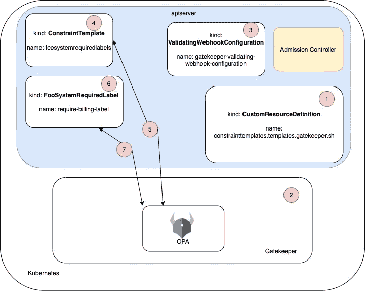
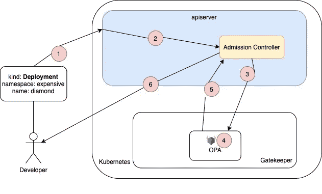

# 在 Kubernetes 中运行和编写网守策略—第 1 部分

> 原文：<https://itnext.io/running-gatekeeper-in-kubernetes-and-writing-policies-part-1-fcc83eba93e3?source=collection_archive---------2----------------------->

# 系列概述

本系列文章考察了一个自以为是的 Kubernetes 网关守护设备策略生态系统，包括什么是网关守护设备，为什么使用网关守护设备，编写和测试策略，将策略部署到本地 Kubernetes 集群，以及如何使它们对用户可见。本系列的所有代码都位于这个 GitHub 存储库中:

[](https://github.com/sebradloff/k8s-gatekeeper-policies-example) [## GitHub-sebradloff/k8s-网关守护设备-策略-示例

### 在 GitHub 上创建一个帐户，为 sebradloff/k8s-gate keeper-policies-example 开发做出贡献。

github.com](https://github.com/sebradloff/k8s-gatekeeper-policies-example) 

[**第 1 部分:网守组件和架构概述**](https://medium.com/@sebradloff/running-gatekeeper-in-kubernetes-and-writing-policies-part-1-fcc83eba93e3)

[**第 2 部分:为本地集群安装网关守护设备，并迭代策略**](https://medium.com/@sebradloff/running-and-writing-gatekeeper-policies-in-kubernetes-part-2-1c49c1c683b2)

# 第 1 部分概述

在本帖中，我们将介绍什么是网关守护设备，为什么您可能需要它，一个示例策略，网关守护设备基础架构，以及如何实施策略。在阅读完本文后，我希望您能够决定是否要了解更多关于 Gatekeeper 的信息，以确定它在您的组织中是否有一席之地。


# 什么是看门人？

Gatekeeper 是 Kubernetes 对开放策略代理[(OPA)的具体实现，作为一个](https://www.openpolicyagent.org/docs/latest/)[验证准入 webhook](https://kubernetes.io/docs/reference/access-authn-authz/extensible-admission-controllers/) 运行。Gatekeeper 是一个工具，使您能够在 Kubernetes 资源上审计和执行策略。这些政策是用一种叫做 rego 的语言编写的。

# 为什么需要看门人？

每个 Kubernetes 资源上都有大量必需和可选的参数。当许多团队编写自己的 Kubernetes 资源时，每个团队如何配置这些资源肯定会有分歧。Gatekeeper 可以拒绝创建或更新任何不符合我们策略的资源，从而帮助我们在整个集群中实施资源标准。

虽然我们可以编写策略来控制任何 Kubernetes 资源的任何配置选项，但大多数策略应该集中在以下目标上:

*   **资源所有权**:我们想要跟踪特定团队的每个资源的所有权。所有权可以在名称空间级别确定，假设一个团队拥有名称空间中的所有资源或每个资源上的一个标签。
*   **资源请求和限制**:我们希望确保所有容器都有资源请求和限制，以避免“[噪音邻居问题](https://thenewstack.io/kubernetes-performance-troublespots-airbnbs-take/)”
*   **集群范围的资源配置含义**:例如，我们希望在 API 网关策略中使用 nginx-ingress 实施一个标准，其中只有一个入口资源可以处理对`/api/${resource}`的请求，以确保没有其他入口可以为该资源提供流量。
*   **安全性**:我们希望确保没有容器以 root 用户身份运行，除非在我们策略中定义的允许列表上。
*   **最佳实践**:例如，我们需要就绪性和活性探测来帮助确保流量不会到达没有准备好的容器，并且当容器进入不可恢复状态时会重新启动。

# 如何使用网关守护设备编写和实施策略

Gatekeeper 项目引入了三个 [Kubernetes 定制资源定义](https://kubernetes.io/docs/concepts/extend-kubernetes/api-extension/custom-resources/)(CRDs)；[约束](https://github.com/open-policy-agent/frameworks/blob/4f80ac172ddffad377f88986a162242dcf772eb6/constraint/README.md#what-is-a-constraint)、[约束模板](https://github.com/open-policy-agent/frameworks/blob/4f80ac172ddffad377f88986a162242dcf772eb6/constraint/README.md#what-is-a-constraint-template)和[配置](https://github.com/open-policy-agent/gatekeeper/blob/b468cf25dd7c5fd2b5918fe3ff47e003db930de2/website/docs/sync.md)。ConstraintTemplate 是在[开放策略代理/框架库](https://github.com/open-policy-agent/frameworks)中定义的，而约束实际上不是 CRD，而是描述 ConstraintTemplate 创建的 CRD 的概念。让我们定义这些术语，看看每个术语的例子，并理解它们是如何相互作用的。

## 约束模板

> 约束模板允许人们声明新的约束。他们可以提供预期的输入参数和执行其意图所必需的底层减压阀。

```
# Pulled from [https://github.com/open-policy-agent/frameworks/blob/4f80ac172ddffad377f88986a162242dcf772eb6/constraint/README.md#what-is-a-constraint-template](https://github.com/open-policy-agent/frameworks/blob/4f80ac172ddffad377f88986a162242dcf772eb6/constraint/README.md#what-is-a-constraint-template)apiVersion: gatekeeper.sh/v1beta1
kind: ConstraintTemplate
metadata:
  name: foosystemrequiredlabels
spec:
  crd:
    spec:
      names:
        kind: FooSystemRequiredLabel
      validation:
        # Schema for the `parameters` field
        openAPIV3Schema:
          properties:
            labels:
              type: array
              items: string
  targets:
    - target: admission.k8s.gatekeeper.sh
      libs:
        - |
          package lib.helpers

          make_message(missing) = msg {
            msg := sprintf("you must provide labels: %v", [missing])
          }

      rego: |
        package foosystemrequiredlabels

        import data.lib.helpers

        violation[{"msg": msg, "details": {"missing_labels": missing}}] {
           provided := {label | input.request.object.metadata.labels[label]}
           required := {label | label := input.parameters.labels[_]}
           missing := required - provided
           count(missing) > 0
           msg := helpers.make_message(missing)
        }
```

让我们分解上面的约束模板:

*   **crd:** 定义了`FooSystemRequiredLabel`类约束的 crd 规范，它应该有一个标签数组作为输入。
*   **目标:**定义约束适用于哪个目标。
*   **libs:** 要导入到我们的 rego 策略中的库所在的位置。libs 中的所有包都必须以`lib`作为前缀，比如`lib.<name>`。
*   **rego:** 我们写保单 rego 的地方。

关于约束的 rego 语义的 OPA 框架文档是有益的。整个 rego 块被认为是一个[模块](https://www.openpolicyagent.org/docs/latest/policy-language/#modules)。让我们看一下上面模块的每一行。

```
**# Defines the package name of the module**
package foosystemrequiredlabels **# Imports the package lib.helpers defined in the libs section** import data.lib.helpers**# Defining the violation rule. The violation rule schema must be followed for it to be considered a valid ConstraintTemplate, which is {"msg": string, "details" set}**violation[{"msg": msg, "details": {"missing_labels": missing}}] {**# 'provided' variable is a set with all the labels from the object currently being evaluated by gatekeeper** provided := {label | input.request.object.metadata.labels[label]} **# 'required' variable is a set with all the labels from the Constraint parameters**    
    required := {label | label := input.parameters.labels[_]}**# 'missing' variable is a set the difference in value between required and provided**
    missing := required - provided**# if there are more than zero values in the set 'missing' evaluate to true
**    count(missing) > 0**# 'msg' variable is declared. The value is the return of the 'make_message' rule in the lib.helpers package**
    msg := helpers.make_message(missing)
}
```

现在让我们来理解约束 CRD，以及它是如何适应的。

## 限制

> 约束是一个声明，它的作者希望系统满足一组给定的需求。

```
# Pulled from [https://github.com/open-policy-agent/frameworks/blob/4f80ac172ddffad377f88986a162242dcf772eb6/constraint/README.md#what-is-a-constraint](https://github.com/open-policy-agent/frameworks/blob/4f80ac172ddffad377f88986a162242dcf772eb6/constraint/README.md#what-is-a-constraint)apiVersion: constraints.gatekeeper.sh/v1beta1
kind: FooSystemRequiredLabel
metadata:
  name: require-billing-label
spec:
  match:
   scope: Namespaced
   namespaces: ["expensive"]
  parameters:
    labels: ["billing"]
```

这种资源属于`FooSystemRequiredLabel`类，命名为`require-billing-label`。我们看到 CRD `FooSystemRequiredLabel`是在我们名为`foosystemrequiredlabels`的约束模板中定义的。这个资源特别会寻找所有作用于名称空间`expensive`的资源，并提取标签`billing`及其在所有这些资源上的值。

属性为我们提供了几种不同的方法来选择我们的策略要评估的资源。我建议阅读[这部分的关守文档，以了解匹配选项](https://github.com/open-policy-agent/gatekeeper/blob/b468cf25dd7c5fd2b5918fe3ff47e003db930de2/website/docs/howto.md#constraints)。

我喜欢把 ConstraintTemplate 看作一个函数定义，而约束决定调用函数的参数。在我们的示例中，定义的 ConstraintExample 函数是策略(我们的 rego)，函数参数是 CRD 规范(输入参数是标签)。约束是定义策略将检查的输入对象以及特定的标签参数。

## 配置

> 除了被测试的对象之外，如果不能访问更多的状态，有些约束是不可能编写的。配置允许将数据同步到 OPA 中。

```
# Pulled from [https://github.com/open-policy-agent/gatekeeper/blob/b468cf25dd7c5fd2b5918fe3ff47e003db930de2/website/docs/sync.md](https://github.com/open-policy-agent/gatekeeper/blob/b468cf25dd7c5fd2b5918fe3ff47e003db930de2/website/docs/sync.md)apiVersion: config.gatekeeper.sh/v1alpha1
kind: Config
metadata:
  name: config
  namespace: "gatekeeper-system"
spec:
  sync:
    syncOnly:
      - group: ""
        version: "v1"
        kind: "Namespace"
      - group: ""
        version: "v1"
        kind: "Pod"
```

重要的是要注意这个 CRD 仍然在阿尔法。配置很简单，类似于约束。在`spec.sync.syncOnly`下指定您想要在策略中查询的 Kubernetes 资源。在第三篇文章中，我们将研究一个利用配置数据的策略。我们不会讨论数据是如何通过审计过程同步到 OPA 中的，但是你可以在 [Gatekeeper 文档](https://github.com/open-policy-agent/gatekeeper/blob/b468cf25dd7c5fd2b5918fe3ff47e003db930de2/website/docs/audit.md)中了解更多信息。

# 高级网关守护设备基础设施

让我们快速浏览一下网关守护设备基础架构设置并应用我们的示例策略，这样我们就可以根据我们的策略评估任何新创建或更新的资源。



网守基础设施

1.  CustomResourceDefinitions 将应用于群集。我们此时最感兴趣的 CRD 是 ConstraintTemplate。
2.  网关守护设备 RBAC 配置(Role，ClusterRole，ClusterRoleBinding Service account)服务和部署已应用于群集。
3.  名为 gate keeper-validating-web hook-configuration 的 ValidatingWebhookConfiguration 已应用于群集。这个 webhook 是 Kubernetes 的另一个[准入控制器](https://kubernetes.io/docs/reference/access-authn-authz/admission-controllers/)，它将所有创建或更新的资源发送给 Gatekeeper 服务进行评估，以确定该资源是否应该被持久化到集群中。
4.  我们之前讨论过的 ConstraintTemplate，名为 **foosystemrequiredlabels** ，被应用到集群中。
5.  网关守护设备内部的 OPA 进程监视集群中的所有 ConstraintTemplates。一旦 OPA 检测到新的 ConstraintTemplate，它就评估它的有效性。如果 ConstraintTemplate 有效，CRD 规范中描述的新定制资源将在集群中可用。
6.  我们前面提到的名为 **require-billing-label** 的 **FooSystemRequiredLabel** 类型的约束被应用到集群。只有当 OPA 在前面的步骤中创建了 CRD，我们才能成功地应用它。
7.  Gatekeeper 部署中的 OPA 进程监视集群中 ConstraintTemplates 中定义的所有约束。一旦约束被验证，在约束范围中定义的所有新创建或更新的资源都应该由在相应的 ConstraintTemplate 中定义的策略来评估。

这里有几个移动的部分，但是一旦你完成了初始设置(步骤 1 到 3)，你要做的大部分改变包括编写策略(步骤 4 到 7)，这实际上只是应用约束模板和约束。

现在我们已经了解了网守基础设施的高级设置，让我们回顾一下 Kubernetes 资源因未能遵守我们的策略而被拒绝的流程。

# Kubernetes 资源流被拒绝



Kubernetes 资源在网守生态系统中的流动

1.  开发人员将名为 **diamond** 的部署应用到昂贵的名称空间。正如我们的 **require-billing-label** 中所定义的，我们的策略应该在昂贵的名称空间中创建的任何资源上运行，并提取名为 billing 的标签。
2.  apiserver 将请求转发给准入控制器。
3.  准入控制器将通过集群上的所有其他准入控制器运行，包括将请求转发给网守服务。
4.  OPA 流程将评估 Gatekeeper 服务中的请求，以确定它是否匹配任何约束。如果匹配，Gatekeeper 将根据相应的策略(ConstraintTemplate)评估所请求的资源。在本例中，名为 **require-billing-label** 的 **FooSystemRequiredLabel** 类型的约束将根据**foosystemrequired labels**策略匹配并评估部署**菱形**。资源要么未通过策略评估并返回违规消息，要么未通过策略评估并保留到群集。在这种情况下，让我们假设资源没有通过策略评估，因为它缺少计费标签。
5.  网关守护设备以拒绝来自集群的资源的决定来响应准入控制器，并且部署不会持续到集群。
6.  apiserver 用作为策略的一部分定义的错误消息来响应用户。

以上是评估新创建或更改的资源的基本数据流。有一些有用的工具，我们将在以后的章节中讨论如何调试被拒绝的资源，以及 Gatekeeper 如何处理集群上已经存在的违反策略的资源。

在下一篇[文章](https://medium.com/@sebradloff/running-and-writing-gatekeeper-policies-in-kubernetes-part-2-1c49c1c683b2)中，我们将建立一个本地 Kubernetes 集群并安装网守基础设施。我们将反复编写和测试策略，然后将这些策略应用到我们的本地集群，并观察资源被拒绝和接受。