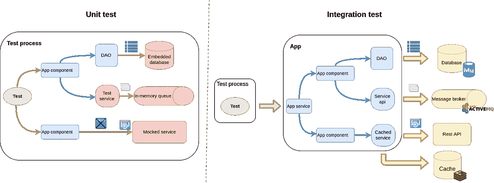
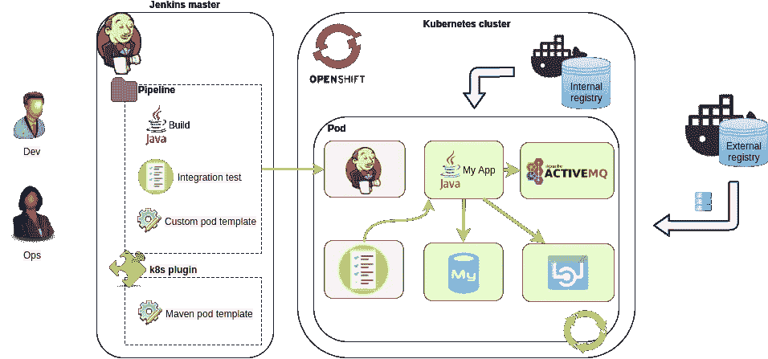
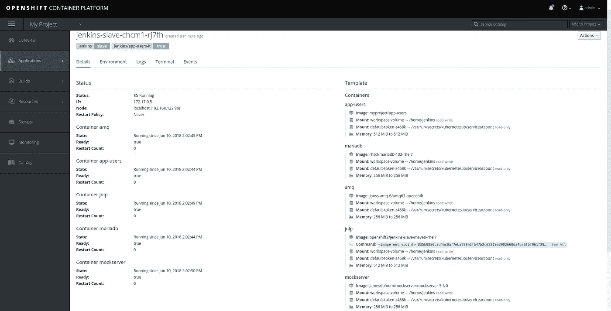

# 在 Kubernetes 中运行集成测试

> 原文：<https://itnext.io/running-integration-tests-with-kubernetes-ae0fb71e207b?source=collection_archive---------0----------------------->

Linux 容器改变了我们运行、构建和管理应用程序的方式。随着越来越多的和[平台成为*云原生平台，*容器在每个企业的基础设施中扮演着越来越重要的角色。Kubernetes 是目前最知名的容器管理解决方案，无论它们运行在私有、公共还是混合云中。](https://www.microsoft.com/en-us/cloud-platform/containers)

有了容器应用平台，我们可以动态地创建一个完整的环境来运行一个任务，这个任务后来被丢弃了。在之前的一篇文章中，我们介绍了如何在容器中运行[构建和单元测试。现在，让我们看看如何通过启动多个容器来运行集成测试，以提供一个完整的测试环境。](https://medium.com/@bszeti/running-jenkins-builds-in-containers-458e90ff2a7b)

> 注意:这篇文章是[在容器中运行 Jenkins 构建](https://medium.com/@bszeti/running-jenkins-builds-in-containers-458e90ff2a7b)的后续文章，所以建议先快速浏览一下那篇文章，以便熟悉解决方案的基本原理。

假设我们有一个后端应用程序，它依赖于其他服务，如数据库、消息代理或 web 服务。在单元测试期间，我们尝试使用嵌入式解决方案或者简单地模拟这些端点，以确保不需要网络连接。这要求我们的代码根据测试的范围进行修改。

集成测试的目的是验证应用程序如何与整个解决方案堆栈的其他部分一起工作。提供服务不仅仅取决于我们的代码库。整体解决方案是模块的混合(例如，具有存储过程的数据库、消息代理、具有服务器端脚本的分布式缓存)，这些模块必须以正确的方式连接在一起，以提供预期的功能。这只能通过实际运行所有这些部分，并且不在我们的应用程序中启用“测试模式”来测试。



> “单元测试*”*“集成测试*”*是否是[这个案例](https://martinfowler.com/articles/microservice-testing/)中的正确术语值得商榷。为了简单起见，我将那些在“一个进程内”运行的没有任何外部依赖的测试称为“单元测试*”*，而那些在“生产模式”下运行应用程序的测试称为“集成测试*”*。

为这样的测试维护一个静态环境可能很麻烦，而且浪费资源，这正是动态容器的短暂特性派上用场的地方。

> 这篇文章的代码可以在 https://github.com/bszeti/kubernetes-integration-test[找到](https://github.com/bszeti/kubernetes-integration-test)
> 
> 它包含一个示例 [Red Hat Fuse 7](https://www.redhat.com/en/technologies/jboss-middleware/fuse) 应用程序( */app-users* )，该应用程序从 [AQM](https://www.redhat.com/en/technologies/jboss-middleware/amq) 获取消息，从 MariaDB 查询数据，并调用 REST api。repo 还包含集成测试项目( */integration-test* )和本文中解释的不同 Jenkinsfiles。
> 
> 在组合这个例子时使用的版本:
> -红帽 CDK 3.4 版
> -open shift 3.9 版
> -Kubernetes 1.9 版
> -Jenkins images 3.9 版
> -Jenkins Kubernetes-插件 1.7 版

## 每次都是新的开始

我们希望通过集成测试实现以下目标:

*   开始测试我们的应用程序的生产就绪包。
*   启动所需的所有依赖系统的实例。
*   运行仅通过公共服务端点与应用程序交互的测试。
*   在两次执行之间没有什么是持久的，所以我们不必担心恢复初始状态。
*   资源仅在测试执行期间分配。



解决方案基于 [Jenkins](https://jenkins.io/) 和[Jenkins-kubernetes-pluginT30。Jenkins 可以在不同的](https://github.com/jenkinsci/kubernetes-plugin)[代理节点](https://wiki.jenkins.io/display/JENKINS/Distributed+builds)上运行任务，而插件使得在 Kubernetes 上动态创建这些节点成为可能。代理节点仅在任务执行时创建，之后会被删除。

我们需要首先定义代理节点 pod 模板。OpenShift 的 [jenkins-master](https://access.redhat.com/containers/?tab=overview#/registry.access.redhat.com/openshift3/jenkins-2-rhel7) 映像带有用于 *maven* 和 *nodejs* 构建的[预定义 pod 模板](https://github.com/openshift/jenkins/blob/master/2/contrib/jenkins/kube-slave-common.sh)，管理员可以将这种“静态”pod 模板添加到插件配置中。

幸运的是，如果我们使用 [Jenkins pipeline](https://jenkins.io/doc/book/pipeline/syntax/) ，也可以在项目中直接为代理节点定义 pod 模板。这显然是一种更灵活的方式，因为整个执行环境可以由开发团队用代码来维护。让我们看一个例子:

这个管道将创建所有的容器，这些容器在同一个 pod 中运行给定的 Docker 映像。这意味着容器将共享 *localhost* 接口，因此服务可以访问彼此的端口(但是我们必须考虑端口绑定冲突)。这是 OpenShift web 控制台中运行窗格的外观:



这些图像由它们的 Docker url 设置(这里不支持 OpenShift 图像流)，因此集群必须访问这些注册表。在上面的例子中，我们之前在同一个 Kubernetes 集群中构建了应用程序的映像，现在从内部注册表中提取它:*172 . 30 . 1 . 1(docker-registry . default . SVC)*。这个映像实际上是我们的发布包，可以部署到开发、测试或生产环境中。它从一个 [*k8sit*](https://github.com/bszeti/kubernetes-integration-test/blob/master/app-users/src/main/resources/application-k8sit.properties) 应用程序属性概要文件开始，其中连接 URL 指向 *127.0.0.1。*

> 考虑运行 java 进程的容器的内存使用是很重要的。java 的当前版本(v1.8，v1.9)默认忽略了[容器内存](https://docs.openshift.com/container-platform/3.9/dev_guide/application_memory_sizing.html#sizing-openjdk)的限制，并设置了更高的堆大小。3.9 版 [jenkins-slave 镜像](https://access.redhat.com/containers/?tab=overview#/search/jenkins%2520slave)通过[环境变量](https://docs.openshift.com/container-platform/3.9/using_images/other_images/jenkins.html#jenkins-environment-variables)支持内存限制，比早期版本好得多。设置*JNLP _ 最大 _ 堆 _ 上限 _MB=64* 足以让我们在 512MiB 的限制下运行 maven 任务。

pod 内的所有容器都有一个共享的*空目录*卷，安装在 */home/jenkins* (默认 *workingDir* )。Jenkins 代理使用它在容器中运行管道步骤脚本，这是我们检查集成测试存储库的地方。这也是执行这些步骤的当前控制器，除非它们在 *dir('relative_dir')* 块中。以上示例的管道步骤如下:

管道步骤在 *jnlp* 容器上运行，除非它们在*容器(' container_name')* 块内:

*   首先，我们检查集成项目的源代码。在这种情况下，它位于回购协议中的*集成测试*子目录中。
*   我们有 *sql/setup.sh* 脚本来创建表并在数据库中加载测试数据。它需要 *mysql* 工具，所以必须在 *mariadb* 容器中运行。
*   我们的应用程序( *app-users* )调用了一个 Rest API。我们没有启动这个服务的映像，所以我们使用 [MockServer](http://mock-server.com/) 来启动 http 端点。它是由 *mockserver/setup.sh.* 配置的
*   集成测试是用 Java 和 Junit 编写的，由 Maven 执行。它可能是任何其他东西—这只是我们熟悉的堆栈。

在 [Kubernetes resource](https://v1-9.docs.kubernetes.io/docs/reference/generated/kubernetes-api/v1.9/#pod-v1-core) api 之后的 [podTemplate](https://github.com/jenkinsci/kubernetes-plugin#pod-and-container-template-configuration) 和 [containerTemplate](https://github.com/jenkinsci/kubernetes-plugin#container-configuration) 有大量的配置参数，只是略有不同。例如，环境变量既可以在容器级别定义，也可以在 pod 级别定义。可以将卷添加到 pod，但是它们被装载到每个容器的同一个*装载路径:*

```
podTemplate(...
  containers: [...], 
  volumes:[
      configMapVolume(mountPath: '/etc/myconfig', 
        configMapName: 'my-settings'),
      persistentVolumeClaim(mountPath: '/home/jenkins/myvolume', 
        claimName:'myclaim')
      ],
  envVars: [
     envVar(key: 'ENV_NAME', value: 'my-k8sit')
   ]
)
```

## 听起来很容易，但是…

在同一个 pod 中运行多个容器是连接它们的好方法，但是如果我们的容器有不同用户 id 的入口点，我们可能会遇到一个问题。Docker 映像曾经以根用户*的身份运行进程，但是由于[安全问题](https://opensource.com/business/14/7/docker-security-selinux)，不建议在生产环境中使用，因此许多映像切换到非根用户。不幸的是，不同的映像可能使用不同的*uid*(docker file 中的用户)，如果它们使用相同的卷，这可能会导致文件权限问题。*

在这种情况下，冲突的来源是 *workingDir* 卷(*/home/Jenkins/workspace/*)上的 Jenkins 工作区。这用于管道执行和保存每个容器中的步骤输出。如果我们在*容器(…)* 块中有步骤，并且这个映像中的 *uid* 与 *jnlp* 容器中的不同(非根),我们将得到以下错误:

```
touch: cannot touch '/home/jenkins/workspace/k8sit-basic/integration-test@tmp/durable-aa8f5204/jenkins-log.txt': Permission denied
```

让我们来看看我们的例子中使用的图像中的*用户*:

*   詹金斯-slave-maven : uid 1001，guid 0
*   mariadb : uid 27，guid 27
*   amq : uid 185，guid 0
*   [mockserver](https://github.com/jamesdbloom/mockserver/blob/master/docker/Dockerfile) : uid 0，guid 0(需要 [*anyuid*](https://blog.openshift.com/understanding-service-accounts-sccs/) )
*   [fuse-Java-open shift](https://github.com/fabric8io-images/s2i/blob/master/java/images/rhel/Dockerfile):uid 185，guid 0

*jnlp* 容器中默认的 *umask* 是 0022，所以 uid 为 185 和 uid 为 27 的容器中的步骤会遇到权限问题。解决方法是更改 *jnlp* 容器中的默认 *umask* ，以便任何 *uid:* 都可以访问*工作区*

在运行集成测试之前，查看首先构建应用程序和 Docker 映像的整个 Jenkins file:[kubernetes-integration-test/Jenkins file](https://github.com/bszeti/kubernetes-integration-test/blob/master/Jenkinsfile)

> 在这些例子中，集成测试在 *jnlp* 容器上运行，因为我们为我们的测试项目选择了 Java 和 Maven，并且[*Jenkins-slave-Maven*](https://access.redhat.com/containers/?tab=overview#/registry.access.redhat.com/openshift3/jenkins-slave-maven-rhel7)映像可以执行它。这当然不是强制性的，我们可以使用[*Jenkins-slave-base*](https://access.redhat.com/containers/?tab=overview#/registry.access.redhat.com/openshift3/jenkins-slave-base-rhel7)镜像作为 *jnlp* 并有一个单独的容器来执行测试。请看一个例子，我们有意将 *jnlp* 分开，并为 maven 使用另一个容器:[kubernetes-integration-test/Jenkins file-jnlp-base](https://github.com/bszeti/kubernetes-integration-test/blob/master/Jenkinsfile-jnlp-base)

## Yaml 模板

podTemplate 和 containerTemplate 定义支持许多配置，但是它们缺少一些参数。例如:

*   无法从 ConfigMap 分配环境变量，只能从 Secret 分配。
*   无法为容器设置就绪探测器。Kubernetes 报告说，如果没有它们，pod 会在启动容器后立即运行。Jenkins 将在流程实际准备好接受请求之前开始执行这些步骤。这可能会由于比赛条件而导致失败。这些示例管道通常工作正常，因为 *checkout scm* 为容器启动提供了足够的时间。当然一个 [*睡眠*](https://jenkins.io/doc/pipeline/steps/workflow-basic-steps/#code-sleep-code-sleep) 是有帮助的，但是定义就绪探测器才是正确的方法。

作为最终的解决方案，kubernetes-plugin (v1.5+)中的 podTemplate()增加了一个 *yaml* 参数。它支持完整的 Kubernetes Pod [资源定义](https://v1-9.docs.kubernetes.io/docs/reference/generated/kubernetes-api/v1.9/#pod-v1-core)，因此我们可以为 Pod 定义任何配置:

> 确保更新 Jenkins 中的 Kubernetes 插件(到 1.5 以上)，否则 yaml 参数会被忽略。

Yaml 定义和其他 podTemplate 参数应该以某种方式合并，但是只使用其中一个不容易出错。在管道中定义 yaml 内联可能很难理解，请看这个从[文件](https://github.com/bszeti/kubernetes-integration-test/blob/master/pod.yaml):[kubernetes-integration-test/Jenkins file-YAML](https://github.com/bszeti/kubernetes-integration-test/blob/master/Jenkinsfile-yaml)中加载它的例子

## 声明性管道语法

上面所有的示例管道都使用了 [*脚本管道*](https://jenkins.io/doc/book/pipeline/syntax/#scripted-pipeline) 语法，这实际上是一个带有[管道步骤](https://jenkins.io/doc/pipeline/steps/)的 groovy 脚本。 [*声明管道*](https://jenkins.io/doc/book/pipeline/syntax/#declarative-pipeline) 语法是一种新的方法，通过提供较少的灵活性和不允许“groovy hacks”来在脚本上实施更多的结构。这会产生更干净的代码，但是在复杂的情况下，您可能必须切换回脚本语法。

在声明性管道中，kubernetes-plugin (v1.7+) [只支持 yaml](https://github.com/jenkinsci/kubernetes-plugin#declarative-pipeline) 定义来定义 pod:

也可以为每个阶段设置不同的代理，如:
[kubernetes-integration-test/Jenkins file-declarative](https://github.com/bszeti/kubernetes-integration-test/blob/master/Jenkinsfile-declarative)

## 在 Minishift 上试试

如果您想尝试上述解决方案，您需要访问 Kubernetes 集群。在 Red Hat，我们使用 [OpenShift](https://www.redhat.com/en/technologies/cloud-computing/openshift) ，这是 k8s 的企业版。有几种方法可以访问完整规模的集群:

*   [在您自己的基础设施上开放移位容器平台](https://www.openshift.com/products/container-platform/)
*   [OpenShift 专用](https://www.openshift.com/products/dedicated/)集群托管在公共云上
*   [OpenShift Online](https://www.openshift.com/products/online/) 按需公共环境

还可以在本地机器上运行一个小型的单节点集群，这可能是最简单的尝试方式。让我们看看如何设置[红帽 CDK](https://developers.redhat.com/products/cdk/) (或[迷你库贝](https://kubernetes.io/docs/getting-started-guides/minikube/))来运行我们的测试。

下载后，[准备](https://access.redhat.com/documentation/en-us/red_hat_container_development_kit/3.4/html/getting_started_guide/index)Minishift 环境:

*   运行设置:
    `minishift setup-cdk`
*   将内部 Docker 注册表设置为不安全:
    `minishift config set insecure-registry 172.30.0.0/16` 这是必需的，因为 kubernetes-plugin 直接从非 https 的内部注册表中提取图像。
*   启动 Minishift 虚拟机(使用你的免费[红帽账号](https://developers.redhat.com/register/) ):
    `minishift --username me@mymail.com --password ... --memory 4GB start`
*   记下控制台 url，或者您可以通过:
    `minishift console --url`获得它
*   添加 oc 工具到
    路径:`eval $(minishift oc-env)`
*   登录 open shift API(admin/admin):
    `oc login [https://192.168.42.84:8443](https://192.168.42.84:8443)`

使用可用模板在集群内启动一个 Jenkins 主服务器:
`oc new-app --template=jenkins-persistent -p MEMORY_LIMIT=1024Mi`

一旦 Jenkins 启动，它应该可以通过模板创建的路由使用，例如(*https://Jenkins-my project . 192 . 168 . 42 . 84 . nip . io)*。登录与 OpenShift (admin/admin)集成。

创建一个新的*管道*项目，该项目从指向具有 [*Jenkinsfile*](https://github.com/bszeti/kubernetes-integration-test/blob/master/Jenkinsfile) 的 *Git* 库(例如[https://github.com/bszeti/kubernetes-integration-test.git](https://github.com/bszeti/kubernetes-integration-test.git))的 SCM 获取*管道脚本来执行。然后简单的*现在建*。*

第一次运行需要更长时间，因为图像是从 Docker 注册表下载的。如果一切顺利，我们可以在 Jenkins build 的*控制台输出*上看到测试执行。可以在 OpenShift 控制台上的 *My Project / pods 下看到动态创建的 Pods。*

如果出现问题，请尝试通过以下方式进行调查:

*   Jenkins 构建输出
*   詹金斯主吊舱日志
*   Jenkins kubernetes-插件配置
*   创建 pod 的事件( *maven* 或*集成测试*
*   已创建窗格的日志

如果您想让额外的执行更快，您可以使用一个卷作为本地 maven 存储库，这样 maven 就不必每次都下载依赖项。创建一个 PersistentVolumeClaim:

```
# oc create -f - <<EOF
kind: PersistentVolumeClaim
apiVersion: v1
metadata:
  name: mavenlocalrepo
spec:
  accessModes:
    - ReadWriteOnce
  resources:
    requests:
      storage: 10Gi
EOF
```

将该卷添加到 podTemplate(以及可选的 kubernetes-plugin 中的 *maven* 模板)。参见[kubernetes-integration-test/Jenkins file-mavenlocalrepo](https://github.com/bszeti/kubernetes-integration-test/blob/master/Jenkinsfile-mavenlocalrepo):

```
volumes: [ 
  persistentVolumeClaim( mountPath: '/home/jenkins/.m2/repository', 
    claimName: 'mavenlocalrepo') 
]
```

> 注意:Maven 本地存储库声称是“非线程安全的”,不应该被多个构建同时使用。我们在这里使用 ReadWriteOnce 声明，它一次只能装载到一个 pod。

jenkins-2-rhel7:v3.9 镜像安装了 kubernetes-plugin v1.2。要运行[Jenkins file-declarative](https://github.com/bszeti/kubernetes-integration-test/blob/master/Jenkinsfile-declarative)和 [Jenkinsfile-yaml](https://github.com/bszeti/kubernetes-integration-test/blob/master/Jenkinsfile-yaml) 示例，您需要将 Jenkins 中的插件更新到 v1.7+。

要在停止 Minishift 后完全清除，请删除 *~/。微移*目录。

## 限制

我还想在这里提到上述解决方案的某些方面。每个项目都是不同的，因此了解这些因素对您的影响非常重要:

*   使用*Jenkins-kubernetes-plugin*创建测试环境独立于集成测试本身。测试可以用任何语言编写，可以用任何测试框架执行——这是一项巨大的能力，但也是一项重大的责任。
*   整个测试 pod 在测试执行之前创建，之后关闭。这里没有提供在测试执行期间管理容器的解决方案。可以用不同的 pod 模板将您的测试划分到不同的阶段，但是这会增加很多复杂性。
*   容器在第一个管道步骤执行之前启动。来自集成测试项目的文件在那时是不可访问的，所以我们不能运行准备脚本或者为那些过程提供配置文件。
*   所有容器都属于同一个 pod，因此它们必须在同一个节点上运行。如果我们需要许多容器，而 pod 需要太多资源，则可能没有节点可用于运行 pod。
*   集成测试环境的规模应该保持在较低的水平。尽管可以在一个 pod 内启动多个微服务并运行端到端测试，但是所需容器的数量会迅速增加。这种环境也不是测试高可用性和可伸缩性需求的理想环境。
*   每次执行都会重新创建测试 pod，但是很明显，容器的状态仍然会在运行期间保持不变。这意味着单独的测试用例并不是相互独立的。如果需要的话，在它们之间做一些清理是测试项目的责任。

## 摘要

通过使用 Jenkins pipeline 和 kubernetes-plugin，在由代码动态创建的环境中运行集成测试相对容易。我们只需要一个 Kubernetes 集群和一些容器经验。幸运的是，越来越多的平台在公共注册中心之一提供官方 Docker 图像。最坏的情况是我们必须自己造一些。准备管道和集成测试的忙碌回报很快，特别是当我们想要在应用程序的生命周期中尝试不同的配置或依赖版本升级时。

测试愉快！

> 感谢[戴维·约翰斯顿](https://medium.com/u/5cf86c655e2a?source=post_page-----ae0fb71e207b--------------------------------)的贡献。