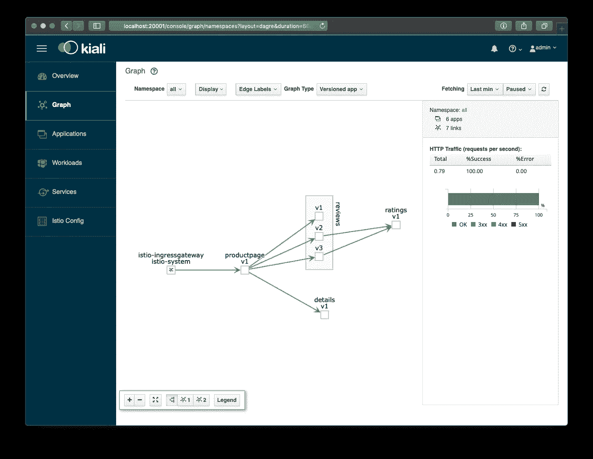
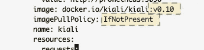

# 在亚马逊 EKS 上运行 Istio 和 Kiali

> 原文：<https://itnext.io/running-istio-and-kiali-on-amazon-eks-a94c21279023?source=collection_archive---------1----------------------->

前段时间， [Arun Gupta](https://twitter.com/arungupta/) 询问了在亚马逊 EKS 上使用 [Kiali](https://www.kiali.io/) 和 [Istio](https://istio.io/) 的步骤。我们交换了一些电子邮件，但最终我没有成功(实际上我成功了，但直到今天才知道:-)



在亚马逊 EKS 上运行的 Kiali v0.10 截图

与此同时，Arun [在推特上说他成功了](https://twitter.com/arungupta/status/1081429871283171329)，但是我仍然不知道缺失的部分。因此，我四处查看并找到了他的示例 repo，它展示了如何在 EKS 上安装 Istio。我按照步骤操作，在去 Istio 1.0.5 的途中更新了它，并启用了 Kiali。

我还是没有看到基亚利。多逛了一会儿，我找到了 *kubectl port-forward* (我通常不使用，所以不习惯，所以之前没看到):

```
**$** kubectl -n istio-system port-forward svc/kiali 20001:20001 &
```

这样，Kiali 服务/ pod 的端口 20001 被转发到 localhost:20001，我们可以在[http://localhost:20001/](http://localhost:20001/)上轻松访问 Kiali

我已经对 Arun 的回购提出了[拉动请求，以纳入我的发现。1 月 14 日更新:这个现在已经合并了。](https://github.com/aws-samples/istio-on-amazon-eks/pull/1)

## 跟随最新的 Kiali

如果您想了解最新的 Kiali 开发，您可以编辑部署配置来获取映像的 *:latest* 标记

```
kubectledit deployment/kiali -n istio-system
```



部署描述符摘录

将 *v0.10* 更改为*最新的*，并且将策略从*如果不存在*更改为*总是。**后者不建议用于生产，但你也不想跟进那里的开发:-)要获得新版本，只需删除 Kiali pod，Kubernetes 将会提供最新最棒的版本。*

```
**kubectl* delete pod -l app=kiali -n istio-system*
```

*刷新 Kiali 应用程序后，您需要重新启动端口转发，因为它与 pod 相关联，而旧的 Kiali pod 已经不存在了。*

## *附言:*

*我的同事 [Mazz](https://medium.com/@jmazzite) 告诉我，这也是现在 Istio 文档中提到的[。在此之上，下一个 1.0.x 版本的 Istio 还将引入一个更新版本的 Kiali(很可能是 v0.12)。](https://istio.io/docs/tasks/telemetry/kiali/#generating-a-service-graph)*

*感谢我的同事 Joel 为我提供了一个比我在帖子中原来的命令更简单的端口转发命令*