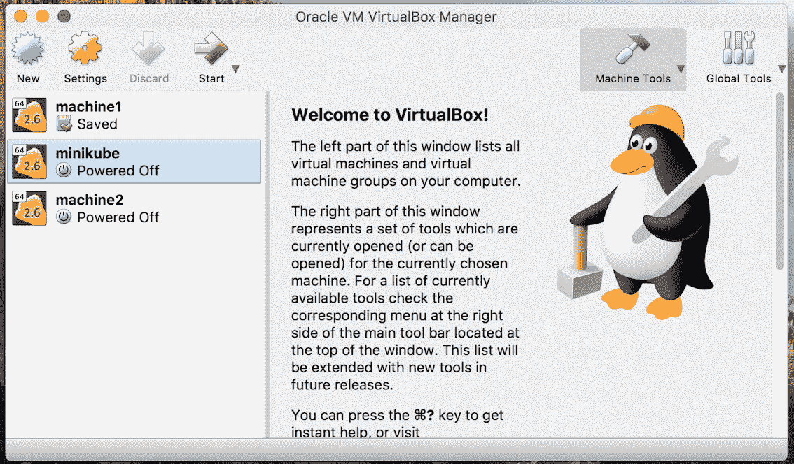
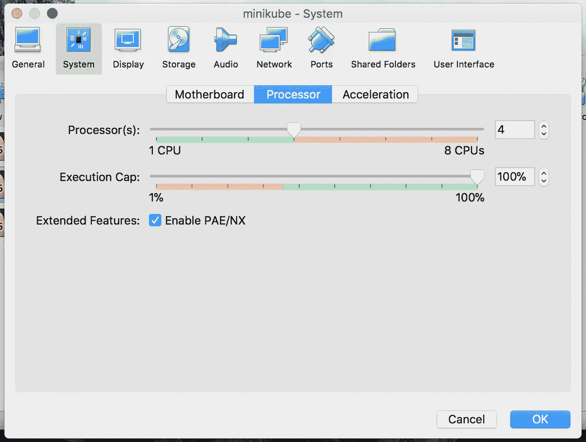
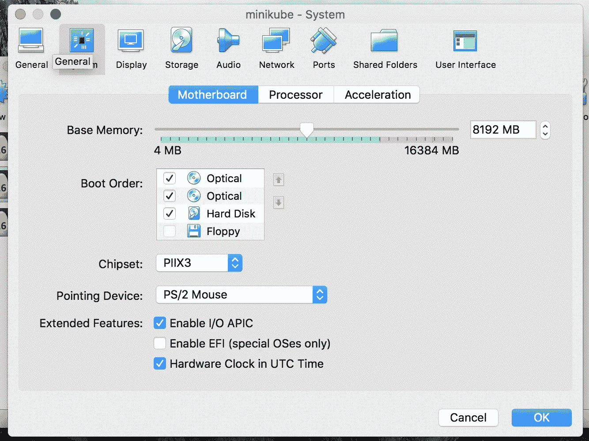
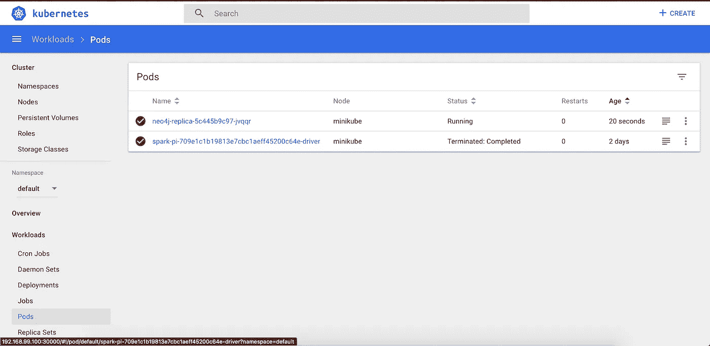

# 在 Minikube Kubernetes 集群上运行 Spark 作业

> 原文：<https://itnext.io/running-spark-job-on-kubernetes-minikube-958cadaddd55?source=collection_archive---------3----------------------->

照片由[古伊列梅·崔林](https://unsplash.com/@guiccunha?utm_source=medium&utm_medium=referral)在 [Unsplash](https://unsplash.com?utm_source=medium&utm_medium=referral) 上拍摄

[*点击这里在 LinkedIn 上分享这篇文章*](https://www.linkedin.com/cws/share?url=https%3A%2F%2Fitnext.io%2Frunning-spark-job-on-kubernetes-minikube-958cadaddd55)

ubernetes 是最近的另一个行业流行语，我正在用 Kubernetes 尝试一些不同的东西。2018 年 2 月 28 日，Apache spark 发布了 v2.3.0，我已经在从事 Apache spark 的工作，新发布的版本增加了新的 kubernetes 调度器后端，支持 Spark 作业向 Kubernetes 管理的集群的原生提交。该功能目前仍处于试验阶段，但我想尝试一下。

我写这篇文章是因为我必须搜索很多东西才能让它工作，而且没有一个地方可以获得关于如何在本地 kubernetes 集群上运行 spark job 的确切信息。我认为写一篇关于我的发现的文章可以让其他人不经历和我一样的痛苦。

我们将了解如何在本地机器上使用 minikube 设置 Kubernetes 集群，以及如何在其上运行 apache spark 作业。我们不打算为此编写任何代码，Apache Spark 发行版中已经有几个可用的示例，我们将使用同一个示例 jar 并在我们的 kubernetes 集群上运行“SparkPi”程序。

## 先决条件

在我们开始之前，请确保您的本地计算机上安装了以下先决条件。

> 我在 Mac High Sierra 上运行工具。

*   Apache Spark(2 . 3 . 0 版)
*   Kubernetes(第 1.9.3 版)
*   Docker (v17.12.X CE)
*   迷你库贝
*   VirtualBox

# 启动 Minikube

我们可以通过简单地运行下面的命令在本地启动 minikube。

Minikube 是一个让本地运行 Kubernetes 变得容易的工具。Minikube 在本地机器上的一个 VM 中运行一个单节点 Kubernetes 集群。它使我们能够尝试 Kubernetes 或用它进行日常开发。

当 minikube 启动时，它以单节点配置启动，默认情况下占用`1Gb`内存和`2`CPU 内核，但是，对于运行 spark，这一要求是不够的，作业将失败(正如我多次尝试的那样)，因此我们必须为 minikube 集群增加内存和 CPU 内核。

有三种不同的方法可以做到这一点。然而，对我来说，并不是所有的工作，这就是我如何知道不同的方式来改变 minikube 配置。您可以使用以下任何一种方法来更改配置。

## 1.将配置传递给 Minikube 启动命令

您可以直接将内存和 CPU 选项传递给 minikube start 命令，如下所示:

这将启动一个具有 8Gb 内存和 4 个 CPU 内核的 minikube 集群(不知何故对我来说这不起作用)。

## 2.修改 Minikube 配置

我们可以在 minikube cli 中使用`config`命令更改 minikube 配置。`config`命令允许为 minikube 设置不同的配置选项，如内存、CPU、虚拟机驱动程序、磁盘大小等。要查看所有可用选项，使用`> minikube config`命令会列出所有可修改的可用选项。

使用`config`命令设置配置后，我们需要删除之前运行的集群并启动一个新的集群。要删除 minikube 集群，运行`> minikube delete`并重新运行 start minikube 命令。

## 3.使用 VirtualBox 更改配置

对我来说，以上两个选项都不起作用，如果你和我一样，你可以使用最后一个选项，这个选项对我有效，希望对你也有效。在你的机器上打开 VirtualBox 应用程序，选择你的虚拟机，如下图所示。`RightClick -> Settings`在您的虚拟机上，这将打开 Minikube 虚拟机的配置页面。

> 注意:要使用 VirtualBox 更改配置，首先需要关闭正在运行的虚拟机。

在选项`System -> Motherboard`中，你可以使用滑块改变虚拟机的内存，在我的例子中，我给了它`8192MB`的内存。

要更改 CPU 配置，转到`Processor`选项卡并将其更改为`4`。你也可以为我尝试其他的选择。不要将其更改为小于 2，否则将无法工作。😛

配置更改完成后，使用 VirtualBox app 或使用上面给出的`> minikube start`命令启动虚拟机。

您的集群正在运行，现在您需要有一个 spark 的 docker 映像。接下来让我们看看如何构建图像。

# 为 Spark 创建 Docker 图像

确保您的机器上安装了 Docker，并且提取了火花分布。

进入解压后的 spark 文件夹，运行下面的命令创建一个 spark docker 映像

> 一些输出日志被排除在外。

如果您运行`> docker image ls`，您将看到 docker 构建现在是可用的。记下这个图像名，我们需要将图像名提供给`spark-submit`命令。

上面的命令有一个`push`选项，它使您能够将 docker 映像推送到您自己的存储库中，这反过来将使您的生产 kubernetes 能够从已配置的 docker 存储库中提取 Docker 映像。运行不带任何选项的相同命令来查看其用法。

该命令可能会不起作用，并给出如下错误:

这是因为`docker-image-tool.sh`文件有问题。我在 Apache Spark JIRA 提出了一个错误，你可以在这里看到。

这个问题正在修复中，但是，为了继续这篇文章，你可以做的是打开`bin`文件夹中的`docker-image-tool.sh`文件，在第`59`行后添加`BUILD_ARGS=()`，保存文件并再次运行命令，它就会工作。

对于那些人来说，如果上面的命令在没有解决方法的情况下也能工作，那么这个问题可能在你读这篇文章的时候就已经解决了，你不需要做任何事情！！！

# 提交 Spark 作业

现在让我们向集群提交我们的`SparkPi`作业。我们的集群已经准备好了，我们有了 docker 映像。运行下面的命令在 kubernetes 集群上提交 spark 作业。`spark-submit`脚本负责设置 Spark 的类路径及其依赖项，并且可以支持 Spark 支持的不同集群管理器和部署模式:

用于在 kubernetes 上运行的选项有:

*   `--class`:应用程序的入口点(例如 org . Apache . spark . examples . sparkpi)
*   `-- master`:Kubernetes 集群的主 URL(例如 k8s://[https://192 . 168 . 99 . 100:8443](https://192.168.99.100:8443))
*   `-- deploy-mode`:是将驱动程序部署在工作节点(集群)上，还是作为外部客户端(客户端)部署在本地(默认:客户端)
*   `-- conf spark.executor.instances=3`:配置属性，指定在运行 spark 作业时使用多少个执行器实例。
*   `- - conf spark.kubernetes.container.image=spark-docker`:配置属性，指定使用哪个 docker 图像，此处提供来自‘docker 图像 ls’命令的相同 docker 名称。
*   `local:///opt/spark/examples/jars/spark-examples_2.11–2.3.0.jar`:包含应用程序和所有依赖项的捆绑 jar 的路径。URL 必须在集群内部全局可见，例如，hdfs:// path 或所有节点上都存在的 local:// path。

包 jar 应该可以通过 HDFS、HTTP 在集群范围内使用，或者应该可以在每个打包的 docker 映像中使用，以便它可以用于我们 spark 程序中的所有 executor 节点。“local://”地址意味着 spark 驱动程序可以将 jar 作为本地文件在每个已初始化的 pod 上使用，并且不需要 IO 从任何地方拉 jar，这在应用程序 jar 很大时工作良好，应用程序 jar 被推送到每个工作节点或使用任何共享文件系统共享。

幸运的是，我们的 spark docker 映像文件将示例 jar 打包在 docker 容器中，因此我们可以使用它。然而，如何包装我们自己的应用程序代码，并把它放在 HDFS 上或作为一个单独的 docker 图像，我将把它作为一个单独的帖子来写。

要检查 pods 是否已启动以及 spark 作业是否正在运行，请打开 minikube 中的 kubernetes dashboard。

# 查看 Minikube 仪表板和 Kubernetes 日志

要检查我们提交的作业的状态，我们可以使用 kubernetes 仪表板或查看 kubernetes 日志。Minikube 附带了作为插件的 dashboard，可以使用下面的命令启动。

用于 SparkPi 作业的 Kuberenetes Pod

导航到上述命令给出的 URL 以查看仪表板。仪表板提供了大量关于集群内存使用、CPU 使用、pod、服务、副本集等信息。我们还可以直接通过控制面板查看服务日志。但是，如果您不想进入仪表板，您可以使用`> kubectl logs <pod name>` 命令查看 Spark Driver 日志:

如果你在日志中看到程序已经计算了圆周率值，容器最终停止。

# 关闭集群

关闭集群非常容易，使用`> minikube stop`它将停止集群。

希望这有助于您尝试在本地 kubernetes 集群上运行 apache spark。如果你不明白任何步骤或在遵循这些步骤时出现任何错误，请发表评论，我会尽量在帖子中添加更多细节。此外，请让我知道你是否喜欢它，并通过分享来帮助他人。

快乐编码…

# 参考

1.  [阿帕奇 Spark 文档](https://spark.apache.org/docs/latest/running-on-kubernetes.html)
2.  [Minikube Github](https://github.com/kubernetes/minikube)

***原帖出自:***[***iamninad.com***](https://iamninad.com/running-spark-job-on-kubernetes-minikube/)