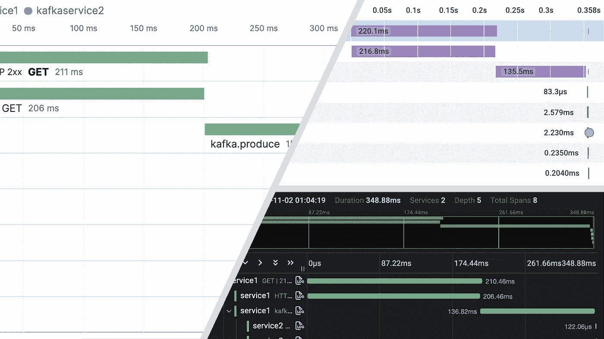
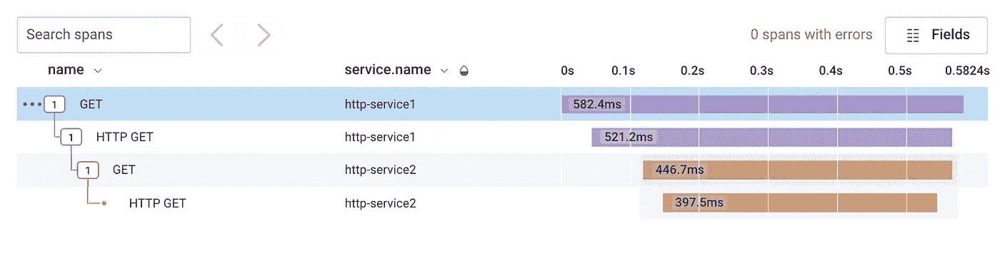
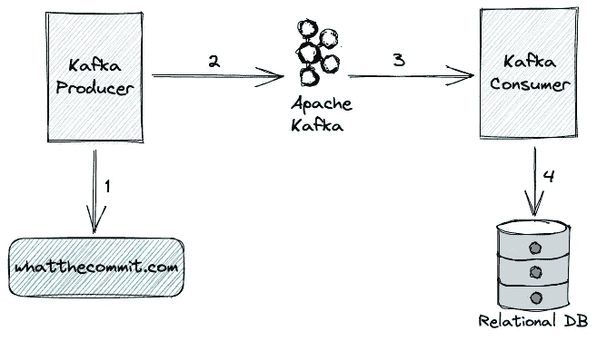
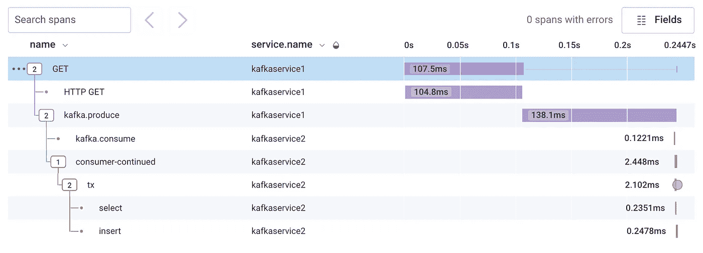
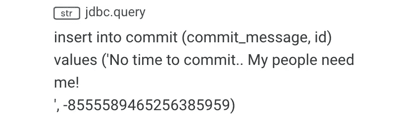
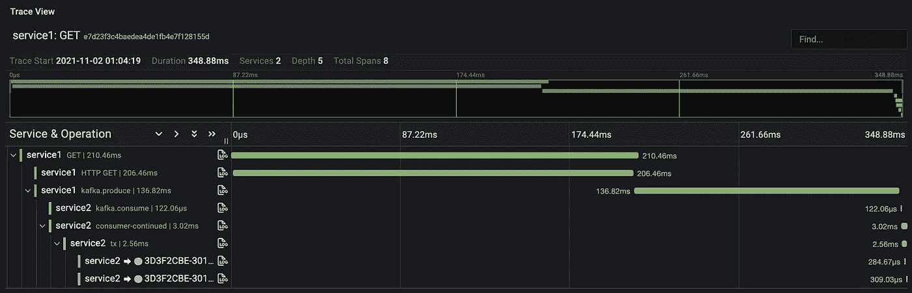
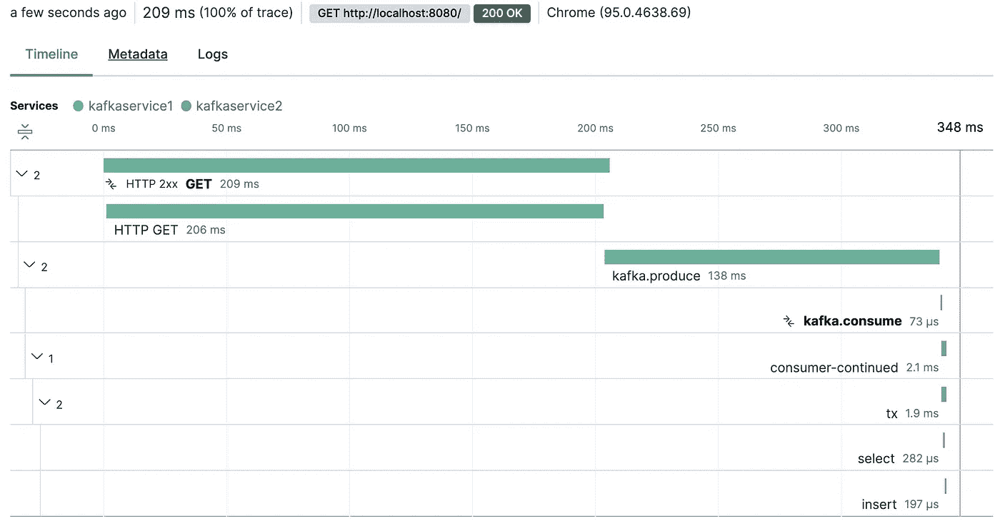
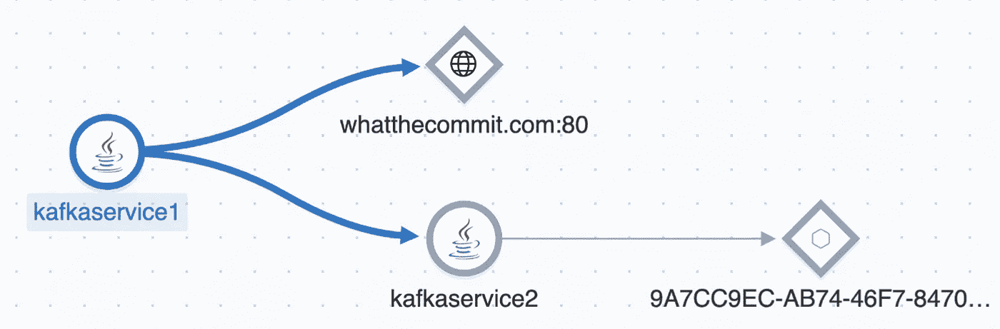

# 运行 Spring Boot 应用程序？用 OpenTelemetry 在几分钟内开始追踪！

> 原文：<https://itnext.io/running-spring-boot-apps-start-tracing-with-opentelemetry-in-minutes-a5d3dffc1ce1?source=collection_archive---------0----------------------->



使用 OpenTelemetry 的分布式跟踪(无供应商限制！)—从左顺时针:Elastic APM、Honeycomb 和 Grafana Tempo

说真的。在 Spring Boot 应用程序中启用分布式跟踪就像添加一些依赖项一样简单。但这种情况已经持续了相当长一段时间。那么有什么新的讨论呢？

打开遥测。

OpenTelemetry(或简称 OTEL)已经设法发展成为一个开放标准，正在被这个生态系统中的所有主要参与者采用。这允许您通过一组多语言服务来跟踪请求，而不必绑定到供应商的实现。

如果您正在编写一个 Spring Boot 应用程序(或任何其他框架)，您应该考虑使用 OpenTelemetry 进行跟踪的。

OTEL 图书馆提供各种不同成熟度的语言。你可以在 [OTEL 文档](https://opentelemetry.io/docs/)找到更多关于它的信息。

在这篇博客中，我将向您展示如何在 Spring Boot 启用追踪，并展示开放标准的威力。

## 春云侦探+ OpenTelemetry

OpenTelemetry 提供了一个代理(JAR ),用于与 Java 应用程序连接，以生成跟踪。但是谁真的想和代理商打交道呢？感谢 Spring Cloud Sleuth 抽象，它将仪器委托给 OpenTelemetry，并允许我们快速启动和运行。

下面是如何在现有的 Spring Boot 应用程序上启用它:

使用 Spring Cloud Sleuth 和 OpenTelemetry 启用跟踪

参见要点上的[第一条注释](https://gist.github.com/xsreality/d8508c5ef82b05f07acb1da0485fb7dc#gistcomment-3945863)以获得依赖关系的解释。

这足以生成跨度。实际生成的内容取决于所使用的 Spring 特性。休息控制器？✅.RestTemplate/WebClient？✅.春季数据 JPA/JDBC？✅.阿帕奇卡夫卡？✅.查看 [Sleuth 集成](https://docs.spring.io/spring-cloud-sleuth/docs/current-SNAPSHOT/reference/html/integrations.html)的完整列表。注意，这些都是即将到来的 Spring Boot 2.6 版本的一部分。

让我们通过一个例子来看看它是如何工作的。

## 示例 1:通过 HTTP 调用进行通信的服务


通过 HTTP 通信的服务

1.  HTTP 服务 1 对 HTTP 服务 2 进行`GET`调用。
2.  HTTP 服务 2 向 whatthecommit.com 发出一个`GET`呼叫。
3.  HTTP 服务 2 将来自 whatthecommit.com 的响应返回给 HTTP 服务 1。

源代码可在 https://github.com/xsreality/spring-boot-tracing-demo[获得](https://github.com/xsreality/spring-boot-tracing-demo)。

运行应用程序会创建跟踪和跨度 id，这些 id 通过[回退 MDC](http://logback.qos.ch/manual/mdc.html) 包含在日志行中。如下所示:

```
2021-11-06 00:10:02.278  INFO [http-service2,8a45749d445c4e5c4846c931d7f488c5,36a8075ff900ddd4] 9068 --- [nio-8081-exec-1] com.example.HomeController : Another bug bites the dust
```

如果您的应用程序使用定制的日志模式，并且您在日志中看不到跟踪 id，那么切换到 Spring 使用的默认模式，或者至少使用`LOG_LEVEL_PATTERN`变量:

```
<property name="CONSOLE_LOG_PATTERN"
          value="%clr(%d{yyyy-MM-dd HH:mm:ss.SSS}){faint} %clr(${LOG_LEVEL_PATTERN:-%5p}) %clr(${PID:- }){magenta} %clr(---){faint} %clr([%15.15t]){faint} %clr(%-40.40logger{39}){cyan} %clr(:){faint} %m%n${LOG_EXCEPTION_CONVERSION_WORD:-%wEx}"/>
```

跟踪和 Span ID 生成确认了使用 OTEL 进行跟踪是可行的。这是通过理解 OTEL 跨度的工具可视化后的效果。



用蜂巢可视化 HTTP 上的痕迹

不要担心，我们马上会看到如何导出跨度。

## 示例 2:通过 Apache Kafka 进行通信的服务



通过 Apache Kafka 进行通信的服务

1.  卡夫卡制片人给 whatthecommit.com 打了一个`GET`电话。
2.  卡夫卡制作人*制作*阿帕奇卡夫卡第一步的回应。
3.  卡夫卡消费者*消费*来自阿帕奇卡夫卡的消息。
4.  消费后，卡夫卡消费者将记录存储在 H2 的内存 DB 中。

**注:**通过阿帕奇卡夫卡和 JDBC 查询捕捉踪迹需要 Spring Boot 2.6 和 Spring Cloud 2021.0，后者截至 2021 年 11 月 8 日尚未发布。但是发布在即，我很高兴能分享新的功能！

JDBC 查询跟踪需要包括一个额外的库来代理 JDBC 数据源。您有两个选项— [p6spy](https://github.com/p6spy/p6spy) 和[数据源代理](https://github.com/ttddyy/datasource-proxy)。当我在一个 JDBC 重型应用程序中使用后者时，遇到了一些奇怪的问题。P6Spy 完美地为我工作。但是我知道的还不够多，不能推荐一个胜过另一个。检查 [pom.xml](https://github.com/xsreality/spring-boot-tracing-demo/blob/main/otel-kafka/kafkaservice2/pom.xml#L29) 以获得要包含的确切依赖关系。

# 将跨度导出到仪器后端

未出口的跨度就像未开封的糖果盒。它们需要由一个仪器后端来消费，以便充分享受。这就是 OTEL 开放标准的闪光点。任何支持 OTEL 协议(OTLP)的系统都可以用于导出轨迹。越来越多的系统增加了对 OTEL 的支持，所以我们有选择了！在这里，我将向您展示 3 种工具——蜂巢、Grafana Tempo 和弹性 APM。让我们将第二个例子的痕迹导出到 Honeycomb 并检查可视化效果。

导出跨度很容易。只需在 application.yaml 中添加以下属性

```
spring.sleuth.otel.exporter.otlp.endpoint: https://api.honeycomb.io
spring.sleuth.otel.exporter.otlp.headers.x-honeycomb-team: xxx
spring.sleuth.otel.exporter.otlp.headers.x-honeycomb-dataset: dataset
```

你必须在蜂巢注册一个账户(这是免费的！)并创建数据集和 API 键。



可视化《蜂巢》中阿帕奇卡夫卡的痕迹



跨度属性

单击任意跨度以查看属性。例如，`insert` span 具有`jdbc.query`属性，该属性捕获精确的查询。

让我们看看这些跨度在 Grafana Tempo 中是什么样的。您可以在 Grafana Cloud 上注册以获取配置值。设置以下属性:

```
spring.sleuth.otel.exporter.otlp.endpoint=https://tempo-eu-west-0.grafana.net
spring.sleuth.otel.exporter.otlp.headers.authorization=Basic MTA5...
```



在格拉法纳节奏中想象阿帕奇卡夫卡的痕迹

如果您已经为日志准备好了弹性堆栈，那么您也可以导出跟踪。

```
spring.sleuth.otel.exporter.otlp.endpoint=https://xxx.azure.elastic-cloud.com
spring.sleuth.otel.exporter.otlp.headers.authorization=Bearer XXX
```



在弹性 APM 中可视化阿帕奇卡夫卡上的痕迹



弹性 APM 中的服务地图

弹性 APM 在服务地图页面上显示服务之间的依赖关系。具有随机名称的服务是数据库，不确定它为什么不这样识别它。

这就是如何使用 OpenTelemetry 来避免供应商锁定！

就个人而言，我喜欢对蜂巢的解释，因为它允许按照您的意愿查询和聚集 span 属性。我很想在实际生产中尝试一下。

# 很高兴知道

## 基于跟踪 ID 比率的采样

当我研究这个主题时，有一件事难倒了我，那就是并不是所有的跟踪都被导出到仪器后端。只是在执行了几次服务之后，我才导出了一个跟踪。这是相当恼人的，直到我偶然发现了一个与采样有关的重要配置。

使用 Spring Cloud Sleuth OTel 时，默认情况下只有 1/10 的痕迹被导出！这是因为基于[跟踪 ID 比率的](https://github.com/open-telemetry/opentelemetry-java/blob/main/sdk/trace/src/main/java/io/opentelemetry/sdk/trace/samplers/TraceIdRatioBasedSampler.java)采样正在使用，配置的默认值`spring.sleuth.otel.config.trace-id-ratio-based`被设置为`0.1`！虽然这适用于高流量的生产，以避免跟踪系统过载和影响应用程序的性能，但在测试时，您确实希望看到导出的每个跟踪。所以，现在就把配置设为`1.0`，以后再感谢我吧！在这里[阅读更多信息](https://github.com/open-telemetry/opentelemetry-java/blob/main/sdk/trace/src/main/java/io/opentelemetry/sdk/trace/samplers/TraceIdRatioBasedSampler.java)和[这里](https://spring-cloud-incubator.github.io/spring-cloud-sleuth-otel/docs/current/reference/html/appendix.html#common-application-properties)。

## OTEL Java 工具库的稳定发布

OTEL Java 库没有被标记为稳定的。您可以在下面的链接跟踪剩余项目的进度。在我写这篇文章的时候，99 个任务中的 96 个已经完成了，所以我们已经很接近了！

[](https://github.com/open-telemetry/opentelemetry-java-instrumentation/issues/2713) [## 将所有仪器转换为新的仪器 API 版本#2713 …

### 跟踪/讨论将新仪器转换为#2596 中定义的仪器 API 的问题。请添加您的…

github.com](https://github.com/open-telemetry/opentelemetry-java-instrumentation/issues/2713) 

## 跟踪没有参数值的 JDBC 查询

当使用 [p6spy](https://github.com/p6spy/p6spy) 跟踪 JDBC 查询时，默认情况下，查询将包括参数值。在大多数情况下，这可能不是一个好主意，因为数据可能是敏感的，您不希望它在您的数据库之外的任何地方。通过将配置`spring.sleuth.jdbc.p6spy.tracing.include-parameter-values`设置为`false`，可以用`?`替换参数值。

所以你不会抓住`insert into commit (commit_message, id) values (‘The universe is possible ‘, 4497884046194566862)`，而是会抓住`insert into commit (commit_message, id) values (?, ?)`。

## 限制 JDBC 追踪范围

弹簧侦探 JDBC 捕捉到三种类型的痕迹——`query`、`fetch`和`connection`。`query`轨迹很有趣，应该总是被捕获，但是我没有发现`fetch`和`connection`轨迹那么有趣。您可以通过配置`spring.sleuth.jdbc.includes`选择要捕获的轨迹。因此，为了只捕获 JDBC 查询，将配置设置为`query`。

## 延伸《卡夫卡的消费者》中的痕迹

目前，Kafka 消费者跟踪有一个限制，即自动关闭范围，这意味着跟踪消息的处理将产生一个新的跟踪 ID，而不是继续现有的跟踪。你可以在下面的链接找到更多关于它的细节和修复。这里有一个[工作实例](https://github.com/xsreality/spring-boot-tracing-demo/blob/main/otel-kafka/kafkaservice2/src/main/java/com/example/service2/TracingConsumer.java#L31)。

[](https://github.com/spring-cloud-incubator/spring-cloud-sleuth-otel/issues/65#issuecomment-933256945) [## traceId 没有在 kafka 第 65 期 spring-cloud-incubator/spring-cloud-sleuth-otel 上传播

### 此时您不能执行该操作。您已使用另一个标签页或窗口登录。您已在另一个选项卡中注销，或者…

github.com](https://github.com/spring-cloud-incubator/spring-cloud-sleuth-otel/issues/65#issuecomment-933256945) 

# 结论

如您所见，Spring Cloud Sleuth 和 OpenTelemetry 是一个强大的组合，可以利用您现有的 Spring Boot 应用程序，为您提供超越日志和指标的洞察力。如果您还没有探索分布式跟踪，现在是时候这样做了。你的备用泳池会感谢你的！

# 资源

1.  此处显示的所有示例均可在[https://github.com/xsreality/spring-boot-tracing-demo](https://github.com/xsreality/spring-boot-tracing-demo)获得
2.  [春云侦探 OTel 文档](https://spring-cloud-incubator.github.io/spring-cloud-sleuth-otel/docs/current/reference/html/index.html)
3.  跟踪 OTEL Java Instrumentation 工作在[https://github . com/open-telemetry/open telemetry-Java-Instrumentation/issues/2713](https://github.com/open-telemetry/opentelemetry-java-instrumentation/issues/2713)
4.  [在**即将发布的 Spring Cloud 2021.0 中支持 Spring Cloud Sleuth**](https://docs.spring.io/spring-cloud-sleuth/docs/current-SNAPSHOT/reference/html/integrations.html) 的集成。*