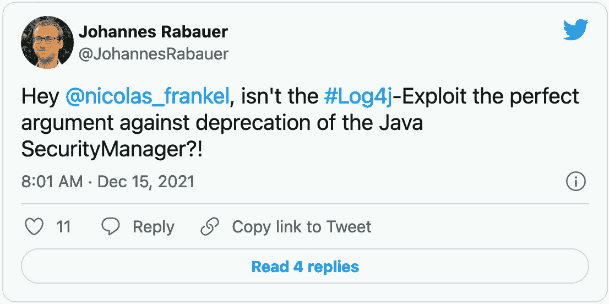

# 您正在运行不受信任的代码！

> 原文：<https://itnext.io/running-untrusted-code-844ce4ad499a?source=collection_archive---------3----------------------->


去年 12 月，Log4Shell 缩短了 JVM 世界里很多人的夜晚。更糟糕的是，使用地震类比在最初的地震后引起了许多余震。我立即在 Log4Shell 和安全管理器之间建立了联系。起初，我不想写它，但我已经收到这样做的请求，我不能走开。



[https://Twitter . com/Johannes rabauer/status/1471012592495865860](https://twitter.com/JohannesRabauer/status/1471012592495865860)

提醒一下，Oracle 团队不赞成在 Java 17 中使用安全管理器。它做出这一决定的一个理由是，它最初是为了防范小程序而设计的。小程序是从互联网上下载的，所以它们必须被认为是不可信的代码。因此，我们必须在沙箱中运行它们。

虽然他们从来没有这样说过，但是这种说法有一个隐含的结果:因为小程序现在被否决了，所以我们只运行可信的代码。*因此*，我们可以放开安全经理了。这显然是错误的，我会在这篇文章中解释原因。

运行在基础设施内部的代码可以被信任的前提是危险的——无论是在内部还是在云中。让我列举一些支持这种说法的论据。

# 图书馆不可信

明智的开发人员不会重新发明轮子:他们使用现有的库和/或框架。

显然，从安全的角度来看，这意味着这种第三方代码的用户应该仔细审核它。我们应该寻找缺陷:错误和漏洞。

在这个行业的二十年里，我从未见过这样的审计。

人们可能会赞成定制代码。可惜，这解决不了任何问题。定制代码遭受同样的问题、错误和漏洞。更糟糕的是，它没有得到与标准库相同的关注，因此研究人员无法花费时间来发现这些问题，这是没有成本的。

# 构建不可信

假设您拥有审计代码所需的所有资源——时间、金钱和技能。进一步想象一下，审计没有发现任何可疑之处。最后，想象一下审计的结论是 100%可靠的。

问题是没有什么能保证 JAR 是从源代码构建的结果，即使构建是公共的。恶意的提供者可以用另一个替换真正的 JAR。

# 身份不可信

供应商可以在罐子上签名以保证它是真的。签名基于非对称加密技术:

1.  提供者用自己的私钥对 JAR 进行签名
2.  它用私钥生成一个公钥
3.  人们可以使用公钥读取签名，并检查提供者是否签署了 JAR。

因此，任何人都可以验证 JAR 来自特定的提供者。

JDK 提供了`jarsigner`工具来签署罐子。不幸的是，大多数图书馆都不使用它。例如，我已经验证了以下依赖关系:

*   `org.slf4j:slf4j-api:1.7.32`
*   `com.fasterxml.jackson.core:jackson-core:2.13.0`
*   `org.mockito:mockito-core:4.1.0`
*   `org.junit.jupiter:junit-jupiter-api:5.8.2`
*   `org.apache.commons:commons-collections4:4.4`
*   `org.eclipse.collections:eclipse-collections:10.4.0`
*   `com.google.protobuf:protobuf-java:3.18.0`
*   `com.itextpdf:itextpdf:5.5.13.2`
*   `com.zaxxer:HikariCP:5.0.0`
*   `com.vladmihalcea.flexy-pool:flexy-pool-core:2.2.3`
*   `org.springframework:spring-beans:5.3.13`
*   `jakarta.platform:jakarta.jakartaee-api:9.1.0`

在上面的十二个罐子中，只有一个签有`jarsigner`的。如果你感兴趣，这是 Eclipse 收藏。

然而，为了对抗[供应链攻击](https://en.wikipedia.org/wiki/Supply_chain_attack)，工件库已经开始要求签名工件。例如，Sonatype [要求每个上传的文件都有一个签名](https://central.sonatype.org/publish/requirements/#sign-files-with-gpgpgp)，*即*，POM，JAR，sources JAR，JavaDocs JAR 等等。

可以用 Maven 验证签名:

```
mvn org.simplify4u.plugins:pgpverify-maven-plugin:show -Dartifact=com.zaxxer:HikariCP:5.0.0
```

它输出以下内容:

```
Artifact:
        groupId:     com.zaxxer
        artifactId:  HikariCP
        type:        jar
        version:     5.0.0PGP signature:
        version:     4
        algorithm:   SHA256withRSA
        keyId:       0x4CC08E7F47C3EC76
        create date: Wed Jul 14 04:49:52 CEST 2021
        status:      validPGP key:
        version:     4
        algorithm:   RSA (Encrypt or Sign)
        bits:        2048
        fingerprint: 0xF3A90E6B10E809F851AB4FC54CC08E7F47C3EC76
        create date: Wed Sep 18 02:51:23 CEST 2013
        uids:        [Brett Wooldridge (Sonatype) <brett.wooldridge@gmail.com>]
```

然而，这些都没有多大意义。签名并不断言提供者的身份。它告诉引用的电子邮件的私钥用引用的电子邮件的私钥对其进行签名。没有什么可以阻止恶意参与者使用相同的电子邮件或类似的电子邮件创建另一个私钥。

# 功能不可信

在这一点上，我认为情况看起来相当糟糕。但比那更糟。以上都不能解释 Log4J 漏洞。核心原因是它提供了大多数开发者既不需要也不使用的功能。

我不想深究太多的细节，因为它已经在许多地方解释过了。可以说 Log4J 提供了[查找](https://logging.apache.org/log4j/2.x/manual/lookups.html)。查找是与另一个系统的集成，它允许丰富日志而不仅仅是消息。例如，Spring Boot 查找允许获取 Spring Boot 的属性。丰富日志是有意义的，比如用`spring.application.name`。

在所有可用的查找中，有些似乎有点可疑。例如，环境变量、系统属性，甚至 JNDI。后者是 Log4J 漏洞的根本原因。

这种隐藏的特性并不是 Log4J 特有的。我碰巧知道 H2 数据库驱动程序中有一个基于 Swing 的 GUI 管理应用程序。我只是偶然知道了这件事。

问题是开发人员使用一个库作为他们的核心功能，*，例如，*，日志。如果一个人止步于此，他将永远不会知道图书馆的全部能力。因此，当库做了一些它不应该做的事情时，比如从远程 JNDI 资源树中读取*，比如*，人们会感到惊讶。

# JVM 不可信

我承认这一部分的标题是误导，但我不能找到一个好的后续系列。这是上一节的后续，这次应用于 JVM。

JVM 提供了大量的特性，您只使用了其中的一两个。最明显的问题是 Attach API。这个 API 从 Java 1.6 开始可用，它允许一个 JVM 更新已经加载到另一个 JVM 中的字节码。是的，你没看错:你可以改变正在运行的应用程序的字节码。更糟糕的是，如果重启 JVM，代码会被再次加载，不会留下任何痕迹。

如果您想在生产中快速地对某个补丁进行猴子式修补，这是一个很酷的特性。
然而:

*   大多数人不使用它
*   大多数人不知道这件事
*   需要明确禁用该功能。默认情况下是打开的。

我可以建议你明天做的第一件事是检查你的基础设施并禁用它吗？

# 安全管理器可以被信任

我希望在这一点上，你明白这个问题。你运行的很多代码都不可信。更糟糕的是，我只考虑常规应用程序:构建在插件架构上的软件运行定义上不可信的代码。

安全管理器是一个 JVM 组件，它允许您定义一个应用程序可以做什么的白名单，而不管应用程序代码是什么。它解决了上述所有问题:你可以运行任何代码，但只允许它做有限的事情。

安全管理器有几个缺点；其中最主要的是配置权限很无聊。但是，有一些工具可以生成策略文件。因为它们是自动化的，所以您需要仔细检查发现的权限。阅读大约 500 行配置比阅读 10k 或 100k 行代码更容易。

由于许多人不知道工具，很少有人使用安全管理器。但当它是，它是非常有益的。为了证明我的说法，你可以阅读[这篇帖子](https://xeraa.net/blog/2021_mitigate-log4j2-log4shell-elasticsearch/)或者跳到结论:*尽管 Elasticsearch 嵌入了一个易受攻击的 Log4J 版本，但它不容易受到 Log4Shell 的影响！*

# 结论

安全性是非功能性需求。NFRs 没有带来任何竞争优势，而且要花钱。简而言之，他们将预算从业务需求转移到`/dev/null`。至少大部分业务部门是这么看的。

我认为我们应该通过风险评估来处理安全问题。它要求首先列出所有可能的风险。恐怕对安全管理器的反对只是增加了几行风险，都与运行不受信任的代码有关。

请注意，关于安全管理器贬值的辩论并不是民间的。自从我站在**一边反对**贬值，我就一直受到公开攻击，甚至到了公然欺凌的地步。其他支持我的声音也受到了类似的待遇。

我不期望对这篇文章的反应会有任何不同。然而，我必须告诉社区成员发生了什么，我们失去了什么。

感谢彼得·菲尔斯通和[吉尔特詹·维伦加](https://twitter.com/GeertjanW)对这篇文章的帮助。

**更进一步:**

*   [缓解弹性搜索中的 log 4 J2/log 4 shell](https://xeraa.net/blog/2021_mitigate-log4j2-log4shell-elasticsearch/)
*   [“JEP 411:它对 Java 的安全模型意味着什么，为什么你应该应用最小特权原则”](https://foojay.io/today/jep-411-what-it-means-for-javas-security-model/)
*   [最小特权原则以及 JEP 411 将如何对 Java 安全性产生负面影响](https://foojay.io/today/why-jep-411-will-have-a-negative-impact-on-java-security/)
*   [JVM 安全焦点](https://blog.frankel.ch/focus/jvm-security/)

*原载于* [*一个 Java 怪胎*](https://blog.frankel.ch/running-untrusted-code/)*2022 年 1 月 22 日*