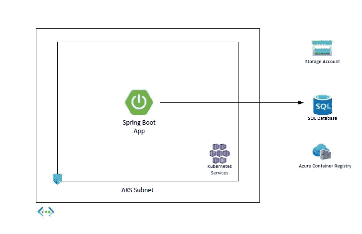
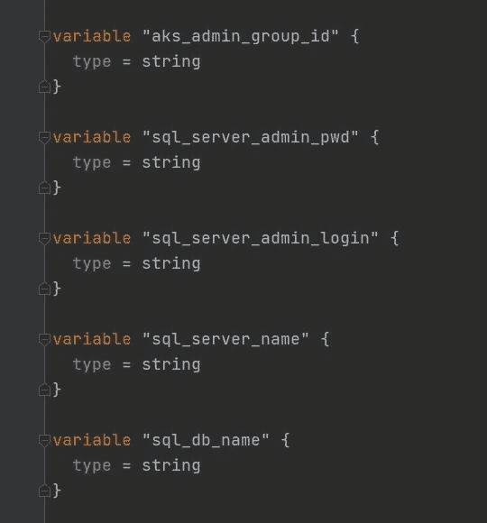
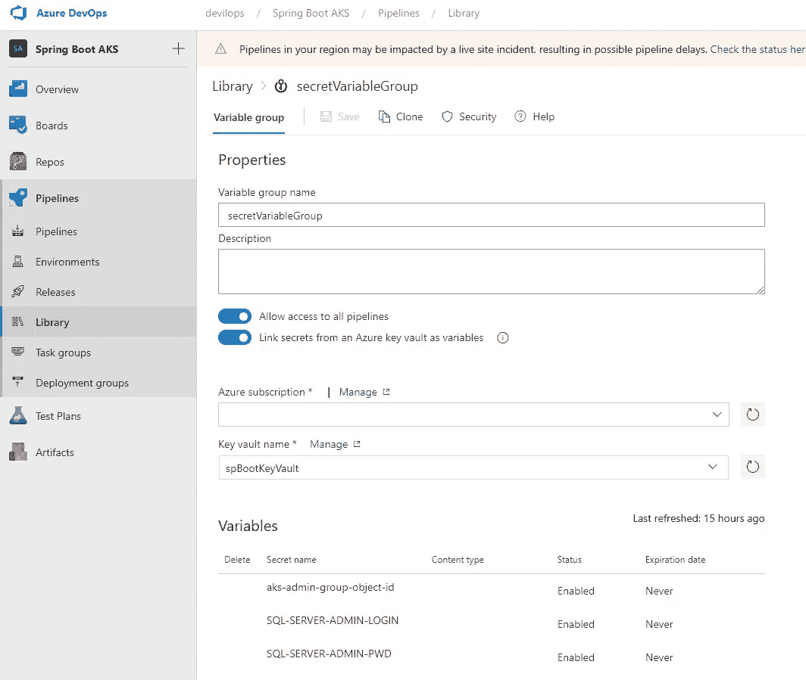
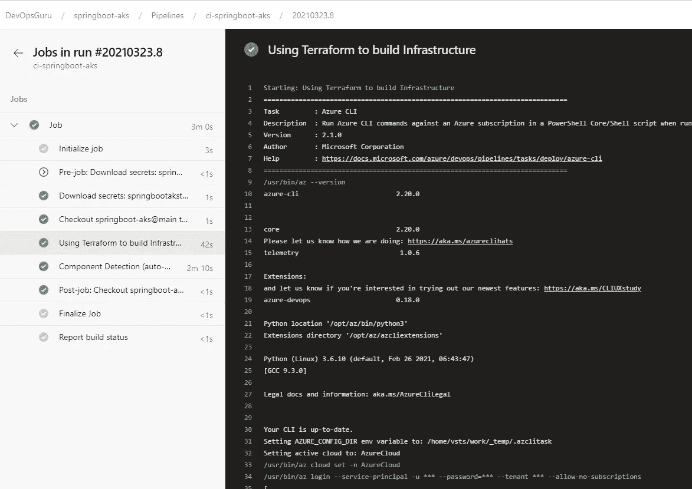
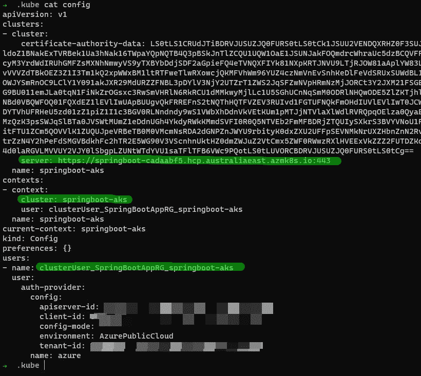
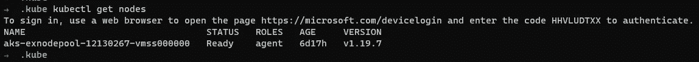
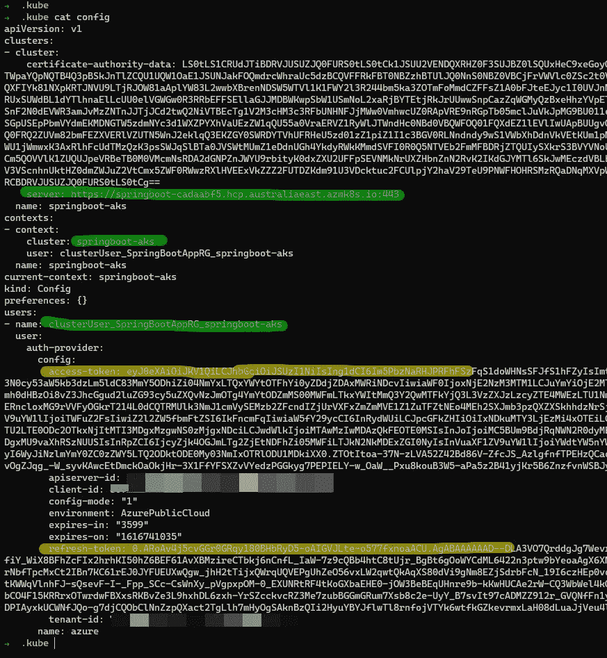
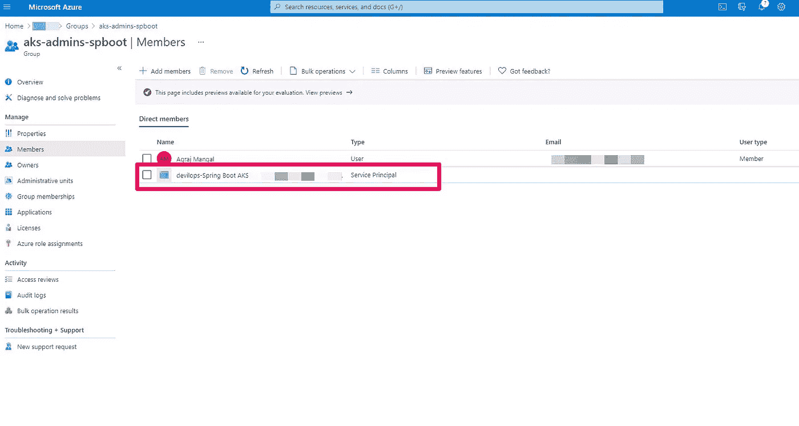
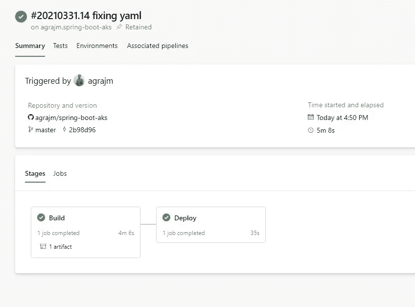

# 在 AKS 上安全运行您的微服务

> 原文：<https://itnext.io/running-your-microservices-securely-on-aks-417a110b2e76?source=collection_archive---------0----------------------->

Azure 提供了不同的方式来构建和运行您的微服务，从[服务架构](https://docs.microsoft.com/en-us/azure/service-fabric/)到 [Azure Kubernetes 服务](https://docs.microsoft.com/en-us/azure/aks/)到[应用服务](https://docs.microsoft.com/en-us/azure/app-service/)到 [Azure Spring 云](https://azure.microsoft.com/en-au/services/spring-cloud/)甚至是在 Azure 上以 IAAS 模式运行 [Docker Enterprise](https://azuremarketplace.microsoft.com/en-us/marketplace/apps?search=docker%20enterprise&page=1) 和[Apache Mesos](https://azuremarketplace.microsoft.com/en-us/marketplace/apps/mesosphere.dcos?tab=Overview)——计算的选择取决于很多因素，不排除这些服务的亲和力和知识、市场宣传(尤其是在 Kubernetes 的情况下)、现有服务的兼容性在本文中，我们不会试图比较 Azure 中的这些计算选项，而是专注于在 Azure Kubernetes 服务中“安全地”运行您的微服务。为了使它更具可读性，我计划把它分成一系列的步骤和文章。

1.  在本地创建 Spring Boot 应用程序并使用 Azure SQL 数据库
2.  使用 Terraform 和 Azure DevOps 在 Azure 上部署初始基础设施
3.  使用 AKS 托管 Azure AD 集成代替群集身份的服务主体，并使用 Azure AD Pod 身份将托管身份与 Pod 相关联。
4.  使用 Azure Devops 管道对接 Spring Boot 应用并在 AKS 上部署。
5.  使用 KeyVault 管理应用程序的机密，而不是使用 Base 64 编码的 kubernetes 机密。
6.  使用密钥库、Azure SQL 和容器注册表的专用链接保护通信 b/w PAAS 服务和 AKS 群集。
7.  使用 Azure Policy Add-on for AKS 来实施基本治理(无特权 pod，仅允许来自特定 ACR 的映像等。)
8.  使用 Kubernetes 网络策略来限制出入流量 b/w 名称空间或 b/w pods & services。
9.  使用带有应用程序网关或前门或 API 管理的 Web 应用程序防火墙(WAF)来防范常见的漏洞，如 XSS、SQL 注入、CSRF 攻击等。

为了保护您的部署，您还可以做许多本系列中没有涉及到的事情，至少在最初是这样的(但是您必须考虑您的用例)

*   使用私有 AKS 集群并部署 Bastion 和 Jumpbox 来访问。然后，您必须使用自托管代理，而不是使用 Microsoft 托管的 Azure DevOps 代理来部署到私有 AKS 集群。
*   使用防火墙(如 [Azure Firewall](https://docs.microsoft.com/en-us/azure/firewall/overview) 或任何其他 NVA)来控制入站&输出过滤，检测&阻止恶意流量——通常，我们建议在典型的中心辐射拓扑中的中心虚拟网络中部署防火墙，该拓扑可以集中控制多个辐射虚拟网络
*   Azure 机密计算:AKS 现在支持运行机密计算节点(使用英特尔 SGX 处理器)来保护您使用中的数据。详情[此处](https://docs.microsoft.com/en-us/azure/confidential-computing/confidential-nodes-aks-overview)
*   使用 [Kured](https://github.com/weaveworks/kured) 的节点安全性—管理和维护数据平面节点(虚拟机)是一种共同责任。虽然 Azure platform 会自动应用操作系统安全补丁，但它不能也不应该重启您的虚拟机(在某些情况下可能需要重启)，因此客户有责任在需要时监控并重启这些节点&。使用像 [Kured](https://github.com/weaveworks/kured) 这样的开源解决方案真的很有帮助。
*   在 DevOps 管道中使用容器映像之前，扫描容器映像中的漏洞。或者启用[Azure Defender for container registries](https://docs.microsoft.com/en-us/azure/security-center/defender-for-container-registries-introduction)，如果它发现您的图像有问题，会通知您

# 我们开始吧

> 第一步:本地 Spring Boot 应用+ Azure SQL

为了快速开始，我们将使用 [Spring Boot SQL 快速入门](https://github.com/Azure-Samples/quickstart-spring-data-jdbc-sql-server)作为起点，为您提供一个在本地运行并在 Azure 中访问 SQL Server 的 Spring Boot 应用。一旦你运行了，让我们进入下一步

> 步骤 2:在 Azure 中部署初始基础设施

我们在 Azure 中的初始基础设施包括

1.  只有一个子网来托管我们的 AKS 集群的虚拟网络(是的，我们随后将在此虚拟网络中添加更多子网)
2.  一个非常基本的 AKS 集群，启用了 [Azure CNI](https://docs.microsoft.com/en-us/azure/aks/configure-azure-cni) 网络插件，而不是默认的 Kubenet 插件，并使用 [AKS 管理的 Azure AD](https://docs.microsoft.com/en-us/azure/aks/managed-aad) 而不是传统的 Azure AD 集成和 Azure Container registry 实例来保存微服务的 docker 映像。
3.  SQL server、无服务器 SQL 数据库和用于保存审核日志的存储帐户



初始部署架构

创建上述内容的所有 terraform 代码都位于[这里](https://github.com/agrajm/spring-boot-aks/tree/master/src/terraform)。作为最佳实践，我们将使用 Azure Storage 作为 terraform 的远程后端来存储 Terraform 状态。我有一个构建管道，它创建了一个资源组、一个存储帐户和一个保存存储帐户访问密钥的密钥库。这个存储帐户将保存我们的地形状态文件。

为 Terraform 远程后端设置 Azure 资源

请注意，此存储帐户`TF_STATE_STORAGE_ACCOUNT_NAME`和密钥库`KEYVAULT_NAME`与应用程序将使用的不同。如果你需要更多的细节，请参考朱利安的[这篇优秀的博客](https://blog.jcorioland.io/archives/2019/09/09/terraform-microsoft-azure-remote-state-management.html)。

我将使用 Azure DevOps 管道为这个项目建立和发布管道，一切(包括初始基础设施)将通过管道[部署](https://github.com/agrajm/spring-boot-aks/blob/master/infra-pipeline.yml)。在使用 Azure Devops 运行这个简单的 Terraform 模板时，我学到了一些东西，我想强调一下:

1.  **使用 AZ CLI 任务运行 Terraform**
    我使用以下代码片段通过 Azure CLI 任务部署 Terraform 代码

部署 Terraform 代码的示例 AZ CLI 任务

除了通过`azureSubscription`附加服务连接并将`workingDirectory`更改为指向包含 terraform 代码的目录的常规内容之外，还要特别注意

*   `addSpnToEnvironment: true` —这将服务连接的服务主体和键添加到脚本执行环境中，您可以通过`$env:servicePrincipalID`、`$env:servicePrincipalKey`和`$env:tenantId`访问该脚本执行环境，我们在上面的代码片段中使用这些脚本来配置执行 Terraform `init/plan/apply/destroy`所需的环境变量。
*   terraform `init`命令使用远程存储并指定`storage account`名称、`container`和`key`来存储状态。要让 terraform 能够访问存储帐户，请使用与帐户相关联的访问密钥或 SAS 令牌。我已经在上面使用的 keyvault 中存储了存储帐户的访问密钥，但是您也可以在 Azure DevOps 中使用变量组，并将其与 keyvault 相关联，以获取机密并使它们作为环境变量可用。

**2。通过 Azure DevOps 变量覆盖 terraform 变量**

现在，我们已经在 terraform 代码中使用了一些变量来保存 SQL server 和 SQL 数据库名称以及登录详细信息。此外，在我们部署这个 terraform 代码之前，我们必须为 AKS 集群管理员创建一个 Azure AD 组，并将其 objectId 分配给 terraform 变量— `aks_admin_group_id` —这个 AAD 组的成员将拥有对我们集群的管理员访问权限。



Terraform 模板中的变量

其中一些值是机密，应该位于密钥库中，而不是作为配置的一部分，所以我在 Azure DevOps 中创建了一个变量组，将其链接到包含机密值的密钥库



secretVariableGroup 组持有密钥库中的密钥

默认情况下，所有的秘密都可以作为任务中的环境变量，所以只需通过将`TF_VAR_`附加到变量名来替换变量值，这样，如果您在 terraform 中的变量被命名为`sql_server_admin_login`，您可以通过指定`TF_VAR_sql_server_admin_login`来覆盖它，就像我们在执行`terraform plan`之前所做的那样

将 Azure DevOps 变量用于 Terraform 变量

第 2–5 行用于指定多个变量组(机密和非机密),这对于将变量划分到多个可重用的组中总是有好处的，这些组可以在相关的管道中共享。

第 32–37 行将这些组中的秘密和变量公开为 Terraform 变量，遵循我们的约定`TF_VAR_<variable_name>`——现在我们可以执行管道的`plan`和`apply`阶段，并在 Azure 中部署基础设施。



管道成功部署到 Azure

转到门户网站，确认您的基础架构已经正确部署。

> 第三步:对 Spring Boot 应用程序进行分类

现在我们已经在 Azure 中有了所需的基础架构，让我们开始向我们的[项目](https://github.com/agrajm/spring-boot-aks)添加 Dockerfile 我们将使用多阶段构建方法和 Spring Boot 的[分层 Jar](https://spring.io/blog/2020/01/27/creating-docker-images-with-spring-boot-2-3-0-m1) 模式，并在我们的映像中提取不同的层，而不是使用 fat jar

我们春天的档案

您可以使用以下命令在本地测试它

```
docker build . -t agrajm/spring-boot-aks:v1.0 
```

这将在本地构建它，并为您创建一个本地映像，您可以如下运行:

```
docker run -it -p8080:8080 \
-e SPRING_DATASOURCE_URL="<Your_DB_Conn_String>" \
-e SPRING_DATASOURCE_USERNAME="<Your_DB_UserName>" \
-e SPRING_DATASOURCE_PASSWORD="<Your_DB_Password>" \
agrajm/spring-boot-aks:v1.0
```

> 步骤 4:部署到 AKS —输入 kubelogin for DevOps！

让我们首先尝试在本地部署到我们的 AKS 集群——我们需要首先对其进行身份验证。为此，请键入

```
az aks get-credentials --resource-group <RG_NAME> --name <AKS_CLUSTER_NAME>
```

这将创建或更新您的`KUBECONFIG`,详细说明如何针对 AKS 集群进行认证。我的配置目前看起来像



已编辑~/。kube/配置

当我试图使用 kubectl 获取这个集群的节点时



它要求我使用我的 Azure AD 实例进行身份验证，因为我们的集群正在使用 AKS 托管的 Azure AD 集成——一旦我打开一个新选项卡并执行`devicelogin`,并将代码&我的凭据放入其中，它就会向我发出一个临时访问&刷新令牌，该令牌会在同一个`./kube/config`中更新，如下所示:



成功登录后访问和刷新令牌

现在我们可以使用`kubectl apply`将我们的应用程序部署到 AKS，但是我们必须为我们的 Spring Boot 应用程序创建部署 YAML。让我们使用下面的部署配置

Kubernetes 的部署

现在您已经通过了集群的身份验证，您可以使用`kubectl`简单地应用更改

```
kubectl apply -f depoloy/spring-boot-deployment.yaml
```

这将起作用，因为我当前登录的用户已经是 AAD 组的一部分，AAD 组是 AKS 的管理组，但这将如何与您的管道一起工作-您无法从您的管道响应`devicelogin`挑战-进入 [Kubelogin](https://github.com/Azure/kubelogin/) ！

即使使用 AAD 管理的 AKS 集群，kubelogin 也允许我们使用服务主体或最新版本进行非交互式登录——甚至使用 Azure CLI 令牌，这使其非常适合在 CI/CD 场景中使用。我们将使用后一种选择。因此，与我们的 Azure CLI 关联的服务主体也必须添加到同一个 AAD 组中，以便能够向群集进行身份验证并向其部署应用程序。

此外，由于默认情况下`kubelogin`不会安装在我的微软托管构建代理正在使用的最新 ubuntu 映像上，我必须先安装它，然后才能使用它。使用它的管道代码片段

kube login convert-kube config-l azure CLI

主命令是`kubelogin convert-kubeconfig -l azurecli`，它允许您使用服务主体的底层令牌，该服务主体由 Azure CLI 任务用于您的管道。您必须将该 SP 添加到您的 AAD 组，就像我对 AKS Admin AAD 组所做的那样



将您的部署 SP 添加到 AKS Admin AAD 组

现在，AZDO 管道应该能够认证 Spring Boot 应用程序并将其部署到您的 AKS 集群。



# 后续步骤

到目前为止，我们已经在 AKS 中部署了一个可以与 Azure SQL 数据库对话的 Spring boot 应用程序。但这只是冰山一角，我们需要把我在开始时承诺的所有安全控制措施都放进去——在下一组文章中，我们将继续这一旅程，共同学习如何在 AKS 上保护您的微服务(Spring Boot 等)。直到那时，快乐的黑客！