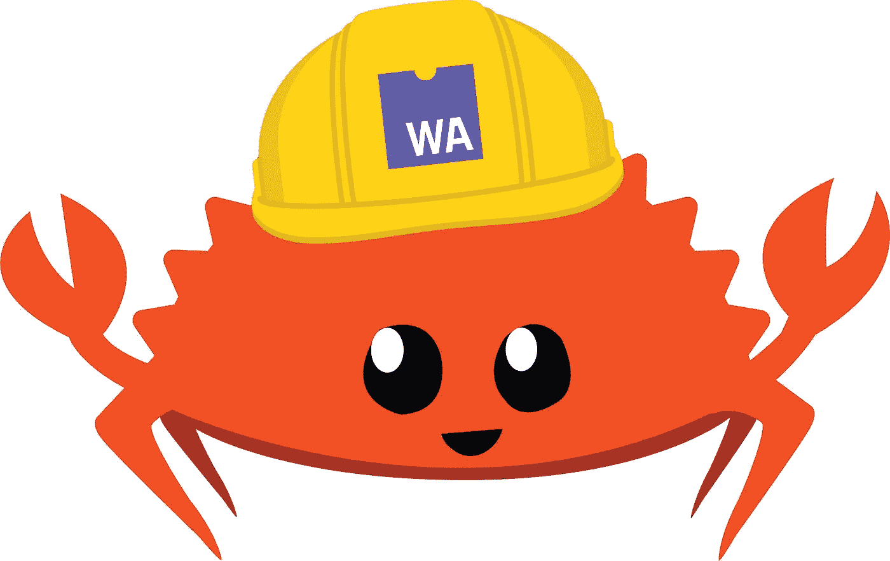

# 前端生锈

> 原文：<https://itnext.io/rust-front-end-e5aa3ad54b30?source=collection_archive---------2----------------------->



到目前为止，JavaScript 是浏览器中唯一普遍存在的语言。它使得 JavaScript 比它的设计(和它的相关缺陷)允许的更受欢迎。因此:

*   JavaScript 开发人员的数量已经有了巨大而稳定的增长
*   围绕前端 JavaScript 的生态系统已经变得更大、更复杂
*   变化的速度越来越快，以至于开发人员抱怨 JavaScript 疲劳
*   有趣的是，JavaScript 通过 Node.js 偷偷潜入后端
*   等等。

我不想就 JavaScript 的优点发起一场圣战，但我想，它之所以能存活至今，是因为它在浏览器中的作用。特别是，当前的架构将执行代码的责任从服务器转移到了客户端，这给后者带来了很大的压力。提高性能的方法不多:要么购买更大的客户机，要么改进 JavaScript 引擎。

来了 [WebAssembly](https://webassembly.org/) 。

> *WebAssembly(缩写 Wasm)是一种基于堆栈的虚拟机的二进制指令格式。Wasm 被设计为编程语言的可移植编译目标，支持客户端和服务器应用程序在 web 上的部署。*

Wasm 并不是为了完全取代浏览器中的 JavaScript 而设计的(还没有？)，而是为了提高整体性能。虽然 Rust 是为系统编程而设计的，但它提供了对 WebAssembly 的编译。

这是开始锈焦点系列的第五篇文章。其他职位包括:

1.  [我的第一杯铁锈](https://blog.frankel.ch/start-rust/1/)
2.  [我的第二杯铁锈](https://blog.frankel.ch/start-rust/2/)
3.  [生锈练习—第一部分](https://blog.frankel.ch/start-rust/3/)
4.  [生锈练习—第二部分](https://blog.frankel.ch/start-rust/4/)
5.  *前端生锈*(本岗位)

# Rust 和 web 组装

学锈是一个漫长的过程；学习 Rust 和 WebAssembly 更是如此。幸运的是，好心人已经让旅程变得轻松了一些。他们专门为这个主题写了一整本免费的在线教程，可以在友好的开源许可下获得。

作为学习者和培训师，我知道创建一个好的教程有多难:

1.  要么你提供一个一步一步前进的路径，一路上都有解决方案，这就变成了一个复制粘贴的问题
2.  或者你提供一些不太详细的东西，但是你冒着一些学习者被阻止和不能完成的风险

这本书避免了这两个陷阱，因为它遵循第一种模式，但在每章的结尾提供了可选的问题。为了避免阻塞问题，每个问题都提供了一个通用的提示来引导学习者找到解决方案。如果你不能(或不想)解决一个特定的问题，你可以继续下一章。注意，在[关联的 Git 存储库](https://github.com/ajavageek/rust-game-of-life)中，每次提交要么引用一个标准的复制粘贴步骤，要么引用一个要解决的问题。

此外，这本书提供了两个部分，适当的教程和参考部分。因此，您可以在教程中查找相关的文档，并在教程结束后加深理解。

# 生锈的项目

教程的第一步集中在[设置](https://rustwasm.github.io/docs/book/game-of-life/setup.html)上。它很短，是最“抄袭”的。原因是它利用了 [cargo-generate](https://github.com/cargo-generate/cargo-generate) ，这是一个 cargo 插件，允许通过使用现有的 Git 存储库作为模板来创建一个新项目。在我们的例子中，模板是一个准备编译成 Wasm 的 [Rust 项目](https://github.com/rustwasm/wasm-pack-template)。该项目的结构是:

```
wasm-game-of-life/
├── Cargo.toml
└── src
    ├── lib.rs
    └── utils.rs
```

这是“标准”Rust 项目的结构。现在是查看`Cargo.toml`文件的好时机。它扮演了一个`pom.xml`的角色，列出了关于包、依赖项、编译提示等的元信息。

```
[package]                                              # 1
name = "wasm-game-of-life"
version = "0.1.0"
authors = ["Nicolas Frankel <nicolas@frankel.ch>"]
edition = "2018"[lib]                                                  # 2
crate-type = ["cdylib", "rlib"]                        # 3[features]
default = ["console_error_panic_hook"][dependencies]
wasm-bindgen = "0.2.63"                                # 4# Rest of the file omitted for clarity purposes
```

1.  关于包的元信息
2.  生成一个库，而不是二进制
3.  产生一个锈库和一个动态系统库
4.  产生 Wasm 的依赖项

# 集成前端

目前这个项目并不十分有趣:你看不到奇迹发生。教程的下一步是添加一个 web 接口，与编译到 Wasm 的 Rust 代码进行交互。

和上一步一样，一个命令允许从 GitHub 复制代码。这里的命令是`npm`，模板是 [create-wasm-app](https://github.com/rustwasm/create-wasm-app) 。让我们运行命令:

```
npm init wasm-app www
```

这将输出以下结构:

```
wasm-game-of-life/
└── www/
    ├── package.json                   
    ├── webpack.config.js               
    ├── index.js                       
    ├── bootstrap.js                   
    └── index.html
```

NPM 项目`Cargo.toml`的镜像，配置为 Wasm Webpack 配置进入“应用”的主入口点:调用`index.js`的 Wasm 代码异步加载器包装器

此时，如果我们完成了所需的构建步骤，就有可能执行整个代码链:

1.  将 Rust 代码编译到 Wasm
2.  生成 JavaScript 适配器代码。只需调用一次`wasm-pack`，就可以运行第一步和前一步。检查`pkg`文件夹中生成的文件。
3.  得到 NPM 与`npm install`的依赖关系
4.  用`npm run start`运行本地网络服务器

浏览到 [http://localhost:8080](http://localhost:8080) 应该会显示一条简单的`alert()`消息。

本节末尾的练习是将`alert()`改为`prompt()`以提供参数化。您应该相应地更改 Rust 代码并重新编译它。web 服务器应该动态地重新加载新代码，以便刷新页面时显示更新后的代码。

我在这篇文章背后的想法不是重做整个教程，而是专注于有趣的部分。由于前端生锈，它归结为:

1.  从 JavaScript 调用 Rust
2.  从 Rust 调用 JavaScript
3.  从 Rust 调用浏览器 API

# 从 JavaScript 调用 Rust

要从 JavaScript 调用 Rust，需要将 Rust 代码编译成 Wasm，并提供瘦 JavaScript 包装器。对于模板项目，这已经配置好了。你只需要在你想使用的 Rust 功能上使用`wasm-bindgen`宏。

```
#[wasm_bindgen]           # 1
pub fn foo() {
    // do something
}
```

1.  神奇宏！

在 JavaScript 方面:

```
import * as wasm from "hello-wasm-pack";       // 1wasm.foo();                                    // 2
```

1.  将`hello-wasm-pack`包中的所有内容导入到`wasm`名称空间中
2.  你现在可以调用`foo()`

# 从 Rust 调用 JavaScript

教程背后的指导原则是[康威的《生活的游戏](https://en.wikipedia.org/wiki/Conway%27s_Game_of_Life)。要初始化电路板，一种方法是随机将每个单元设置为死或活。因为随机化应该在运行时发生，所以我们需要使用 JavaScript 的`Math.random()`。因此，我们还需要从 Rust 调用 JavaScript 函数。

基本设置通过`extern`关键字使用外部函数接口:

```
#[wasm_bindgen]
extern "C" {                                 # 1
    #[wasm_bindgen(js_namespace = Math)]     # 2
    fn random() -> f64;
}#[wasm_bindgen]
fn random_boolean() -> bool {
    random() < 0.5                           # 3
}
```

1.  这不是 C 代码，但无论如何这是正确的语法
2.  生成 Rust 接口，这样它就可以编译
3.  使用它

虽然这种方法可行，但是非常容易出错。或者，`js-sys`板条箱提供所有现成可用的绑定:

> *绑定到 JavaScript 的标准内置对象，包括它们的方法和属性。*
> 
> 这不包括任何 Web、节点或任何其他 JS 环境 API。只有 ECMAScript 标准保证在全局范围内存在的东西。
> 
> [https://developer . Mozilla . org/en-US/docs/Web/JavaScript/Reference/Global _ Objects](https://developer.mozilla.org/en-US/docs/Web/JavaScript/Reference/Global_Objects)
> 
> — [机箱 js_sys](https://rustwasm.github.io/wasm-bindgen/api/js_sys/)

要设置板条箱，您只需将它添加到 Toml:

```
[dependencies]
js-sys = { version = "0.3.50", optional = true }  # 1[features]
default = ["js-sys"]                              # 2
```

1.  将依赖项添加为可选项
2.  激活可选功能

说实话，我不明白为什么要设置依赖关系`optional`并在另一行激活它。我暂时就说到这里。

前面的配置允许以下代码:

```
use js_sys::Math;               # 1#[wasm_bindgen]
fn random_boolean() -> bool {
    Math::random() < 0.5        # 2
}
```

1.  使用`js_sys`箱中的`Math`
2.  用 Rust 编译器编译好，并在运行时调用 JavaScript 的`Math.random()`

# 从 Rust 调用浏览器 API

`js-sys`箱允许我们在 Rust 代码中调用 JavaScript APIs。然而，要调用客户端 API，例如`console-log`，就需要`web_sys`箱。

> *Web API 的原始 API 绑定*
> 
> 这是一个从浏览器 WebIDL 程序生成的 crate，它提供了浏览器在 web 上提供的所有 API 的绑定。
> 
> 默认情况下，这个板条箱在编译时包含的内容非常少，因为几乎所有暴露的 API 都由 Cargo 特性控制。在 crates/web-sys/Cargo.toml 中可以找到详尽的功能列表，但是 web-sys 的经验法则是每种类型都有自己的 Cargo 功能(以类型命名)。使用 API 需要启用 API 中使用的所有类型的特性，API 应该在文档中提到它们需要什么特性。
> 
> — [板条箱 web_sys](https://rustwasm.github.io/wasm-bindgen/api/web_sys/)

下面是如何配置它:

```
[dependencies]
web-sys = { version = "0.3", features = ["console"] }
```

我们可以这样使用板条箱:

```
extern crate web_sys;                                 # 1use web_sys::console;                                 # 2#[wasm_bindgen]
impl Foo {
    pub fn new() -> Foo {
        utils::set_panic_hook();
        Universe {}
    } pub fn log(&self) {
        console::log_1("Hello from console".into());  # 3
    }
}
```

1.  要求`web-sys`创建。我不确定是否(或为什么)需要`extern`。
2.  使用`console`包
3.  `console::log_1()`在运行时翻译成带有一个参数的`console.log()`

# 结论

在本帖中，我们详细介绍了在浏览器中使用 Rust 的三个要点:从 JavaScript 调用 Rust，从 Rust 调用 JavaScript，从 Rust 调用浏览器 API。

这是最后的结果。我只能鼓励你自己尝试一下教程。

这篇文章的完整源代码可以在 Github 上找到。

# 为了更进一步:

*   [锈与 web 组装书](https://rustwasm.github.io/docs/book/)
*   [舱单格式参考](https://doc.rust-lang.org/cargo/reference/manifest.html)
*   [联动](https://doc.rust-lang.org/reference/linkage.html)
*   [wasm-bindgen 指南](https://rustwasm.github.io/docs/wasm-bindgen/)

*原载于* [*一个 Java 极客*](https://blog.frankel.ch/start-rust/5/)*2021 年 7 月 4 日*