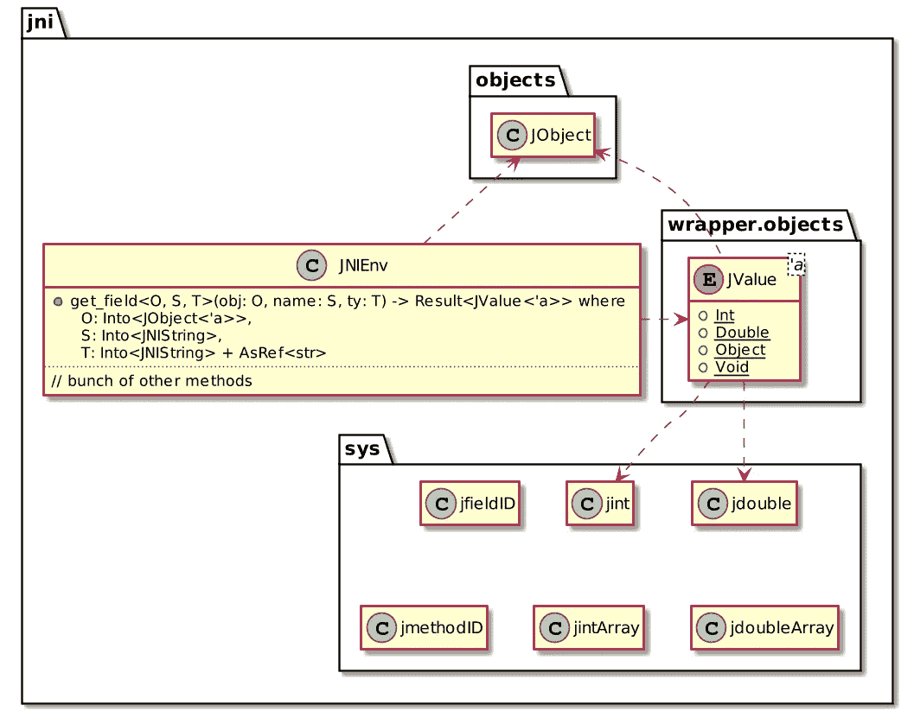

# Rust 和 JVM

> 原文：<https://itnext.io/rust-jvm-ab4de9f14eb6?source=collection_archive---------5----------------------->


到目前为止，我们已经学习了 Rust 语法的基础知识，开发了一个自定义的 Kubernetes 控制器，并与 Wasm 的前端集成。

这是开始锈焦点系列的第 7 篇文章。其他职位包括:

*   [我的第一杯铁锈](https://blog.frankel.ch/start-rust/1/)
*   [我的第二杯铁锈](https://blog.frankel.ch/start-rust/2/)
*   [沙沙声练习—第一部分](https://blog.frankel.ch/start-rust/3/)
*   [生锈练习—第二部分](https://blog.frankel.ch/start-rust/4/)
*   [前端生锈](https://blog.frankel.ch/start-rust/5/)
*   [用于 Kubernetes 的生锈控制器](https://blog.frankel.ch/start-rust/6/)
*   *Rust 和 JVM(本帖)*

我使用 JVM 已经二十年了，主要是在 Java 中。JVM 是一项了不起的技术。IMHO，它最显著的好处是能够让原生代码适应当前的工作负载；如果工作负载发生变化，并且本机代码不是最佳的，它将相应地重新编译*字节码*。

另一方面，当不再需要对象时，JVM 会自动从内存中释放它们。这个过程被称为*垃圾收集*。在没有 GC 的语言中，开发人员必须负责释放对象。对于遗留语言和大型代码库，发布并没有得到一致的应用，并且在产品中发现了错误。

虽然 GC 算法随着时间的推移已经有所改进，但是 GC 本身仍然是一个庞大复杂的机器。微调 GC 是复杂的，并且严重依赖于上下文。昨天行得通的今天可能行不通。总而言之，在您的环境中配置 JVM 来最好地处理 GC 就像变魔术一样。

随着围绕 JVM 的生态系统得到很好的发展，使用 JVM 开发应用程序并将需要可预测性的部分委托给 Rust 是有意义的。

# JVM-Rust 集成的现有替代方案

在这篇文章的研究过程中，我发现了几个 JVM-Rust 集成的方法:

*   Asmble:

> Asmble 是一个将 WebAssembly 代码编译成 JVM 字节码的编译器。它还包含一个解释器和实用程序，用于从命令行和 JVM 语言处理 WASM 代码。
> 
> —[https://github.com/cretz/asmble](https://github.com/cretz/asmble)

Asmble 是在 MIT 许可下发布的，但是没有被积极维护(最后一次提交是在 2 年前)。

*   GraalVM:

> GraalVM 是一个高性能的 JDK 发行版，旨在加速用 Java 和其他 JVM 语言编写的应用程序的执行，并支持 JavaScript、Ruby、Python 和许多其他流行语言。GraalVM 的多语言功能使得在一个应用程序中混合多种编程语言成为可能，同时消除了外语调用成本。
> 
> ——[https://www.graalvm.org/](https://www.graalvm.org/)

GraalVM 允许运行 [LLVM 位代码](https://llvm.org/)。Rust 可以编译成 LLVM。因此， [GraalVM 可以运行 Rust 生成的 LLVM 代码](https://www.graalvm.org/reference-manual/llvm/Compiling/)以及 Java/Scala/Kotlin/Groovy 生成的*字节码*。

*   jni 机箱:

> 这个机箱提供了一种(大部分)安全的方法来使用 JNI 在 Java 中实现方法。因为谁想*居然*写 Java？
> 
> —[https://docs.rs/jni/0.19.0/jni/](https://docs.rs/jni/0.19.0/jni/)

过去，JNI 一直是集成 C/C++和 Java 的方式。虽然这不是最迷人的方法，但它不需要特定的平台，而且稳定。由于这个原因，我将在下一节中详细描述它。

# 通过 JNI 集成 Java 和 Rust

从鸟瞰图来看，集成 Java 和 Rust 需要以下步骤:

1.  用 Java 创建“框架”方法
2.  从它们生成 C 头文件
3.  在 Rust 中实现它们
4.  编译 Rust 生成系统库
5.  从 Java 程序加载库
6.  调用第一步中定义的方法。至此，库包含了实现，集成完成了。

老前辈们会意识到，当你需要与 C 或 C++集成时，这些步骤是相同的。这是因为它们也能生成一个系统库。让我们详细看一下每个步骤。

# Java 框架方法

我们首先需要创建 Java 框架方法。在 Java 中，我们知道方法需要有一个主体，除非它们是`abstract`。或者，它们可以是`native`:一个本地方法将其实现委托给一个库。

```
public native int doubleRust(int input);
```

接下来，我们需要生成相应的 C 头文件。为了自动化生成，我们可以利用 Maven 编译器插件:

```
<plugin>
    <artifactId>maven-compiler-plugin</artifactId>
    <version>3.8.1</version>
    <configuration>
        <compilerArgs>
            <arg>-h</arg>                           <!--1-->
            <arg>target/headers</arg>               <!--2-->
        </compilerArgs>
    </configuration>
</plugin>
```

1.  生成头文件…
2.  …在这个位置

上述 Java 代码片段生成的头应该如下所示:

```
#include #ifndef _Included_ch_frankel_blog_rust_Main
#define _Included_ch_frankel_blog_rust_Main
#ifdef __cplusplus
extern "C" {
#endif
/*
 * Class:     ch_frankel_blog_rust_Main
 * Method:    doubleRust
 * Signature: (I)I
 */
JNIEXPORT jint JNICALL Java_ch_frankel_blog_rust_Main_doubleRust
  (JNIEnv *, jobject, jint);#ifdef __cplusplus
}
#endif
#endif
```

# Rust 实现

现在，我们可以开始 Rust 实现了。让我们创建一个新项目:

```
cargo new lib-rust[package]
name = "dummymath"
version = "0.1.0"
authors = ["Nicolas Frankel "]
edition = "2018"[dependencies]
jni = "0.19.0"                                     // 1[lib]
crate_type = ["cdylib"]                            // 2
```

1.  使用`jni`板条箱
2.  生成一个*系统*库。有几种板条箱类型可用:`cdylib`用于动态系统库，可以从其他语言加载。您可以在文档中查看所有其他可用类型[。](https://doc.rust-lang.org/reference/linkage.html)

以下是板条箱提供的 API 的节略:



API 一对一地映射到生成的 C 代码。我们可以相应地使用它:

```
#[no_mangle]
pub extern "system" fn Java_ch_frankel_blog_rust_Main_doubleRust(_env: JNIEnv, _obj: JObject, x: jint) -> jint {
    x * 2
}
```

上面的代码中发生了很多事情。下面详细说一下。

*   `no_mangle`宏告诉编译器在编译后的代码中保持相同的函数签名。这是至关重要的，因为 JVM 将使用这个签名。
*   大多数时候，我们在 Rust 函数中使用`extern`来将实现委托给其他语言:这被称为 FFI。这和我们在 Java 里用`native`做的一样。不过 Rust 也用`extern`反过来用*即*，让函数可以从其他语言调用。
*   签名本身应该精确地模仿 C 头文件中的代码，因此有了这个有趣的名字
*   最后，`x`是一个`jint`，是`i32`的别名。

我们现在可以构建项目了:

```
cargo build
```

构建器产生一个依赖于系统库。比如在 OSX 上，神器有一个`dylib`扩展名；在 Linux 上，它会有一个`so`等。

# 使用 Java 端的库

最后一部分是在 Java 端使用生成的库。它需要首先加载它。为此，有两种方法可用，`System.load(filename)`和`System.loadLibrary(libname)`。

`load()`需要库的绝对路径，包括其扩展名，*如*，`/path/to/lib.so`。对于需要跨系统工作的应用程序来说，这是不现实的。`loadLibrary()`允许您只传递库的名称-不带扩展名。注意库被加载到由`java.library.path`系统属性指示的位置。

```
public class Main { static {
        System.loadLibrary("dummymath");
    }
}
```

请注意，在 Mac OS 上，`lib`前缀是**而不是**库名称的一部分。

# 使用对象

上面的代码非常简单:它包含一个纯粹的函数，根据定义，这个函数只依赖于它的输入参数。假设我们想要更复杂一点的东西。我们想出了一个新方法，将参数与来自对象状态的另一个参数相乘:

```
public class Main { private int state; public Main(int state) {
        this.state = state;
    } public static void main(String[] args) {
        try {
            var arg1 = Integer.parseInt(args[1]);
            var arg2 = Integer.parseInt(args[2]);
            var result = new Main(arg1).timesRust(arg2);                // 1
            System.out.println(arg1 + "x" + arg2 + " = " + result);
        } catch (NumberFormatException e) {
            throw new IllegalArgumentException("Arguments must be ints");
        }
    } public native int timesRust(int input);
}
```

1.  应该计算`arg1 * arg2`

`native`方法看起来和上面完全一样，但是它的名字。因此，生成的 C 头看起来也是一样的。奇迹需要发生在生锈的一面。

在 pure 函数中，我们没有使用`JNIEnv`和`JObject`参数:`JObject`代表 Java 对象，*即*、`Main`和`JNIEnv`允许访问其数据(或行为)。

```
#[no_mangle]
pub extern "system" fn Java_ch_frankel_blog_rust_Main_timesRust(env: JNIEnv, obj: JObject, x: jint) -> jint {                    // 1
    let state = env.get_field(obj, "state", "I");            // 2
    state.unwrap().i().unwrap() * x                         // 3
}
```

1.  同上
2.  传递对象的引用、Java 中的字段名及其类型。类型是指正确的 [JVM 类型签名](https://docs.oracle.com/en/java/javase/11/docs/specs/jni/types.html#type-signatures)，*例如* `"I"`对应`int`。
3.  `state`是一个`Result<JValue>`。我们需要将其解包到一个`JValue`，然后通过`i()`将其“造型”到一个`Result<jint>`

# 结论

在这篇文章中，我们看到了如何从 Java 调用 Rust。它包括标记要委托为`native`的方法，生成 C 头文件，以及使用`jni`箱。我们只是用简单的例子触及了表面:然而，我们已经为更复杂的用法铺平了道路。

这篇文章的完整源代码可以在 [Github](https://github.com/ajavageek/rust-jvm) 上找到。

**更进一步:**

*   [联动](https://doc.rust-lang.org/reference/linkage.html)
*   [关键字 extern](https://doc.rust-lang.org/std/keyword.extern.html)
*   [从其他语言调用 Rust 函数](https://doc.rust-lang.org/book/ch19-01-unsafe-rust.html#calling-rust-functions-from-other-languages)
*   [JNI 规范](https://docs.oracle.com/en/java/javase/11/docs/specs/jni/)

*原载于* [*一个 Java 极客*](https://blog.frankel.ch/start-rust/7/)*2021 年 7 月 18 日*