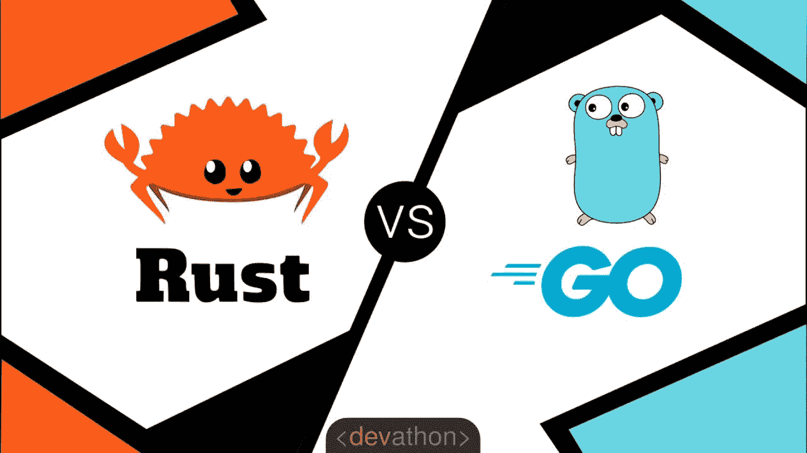

# Rust vs. GO

> 原文：<https://itnext.io/rust-vs-go-cc38b7048181?source=collection_archive---------0----------------------->

[杰伊·海克](https://unsplash.com/@jayrheike?utm_source=medium&utm_medium=referral)在 [Unsplash](https://unsplash.com?utm_source=medium&utm_medium=referral) 上的照片

# 介绍

我使用 [**Go**](https://go.dev/) 已经有一段时间了，现在我已经开发了很多应用程序；与此同时，我一直听到很多关于 [**Rust**](https://www.rust-lang.org/) 的好消息，所以最近我决定花时间**学习 Rust** 。尽管这两种语言是为实现不同的目标而创造的，但它们有许多相似之处。在过去的几个月里，我一直在记笔记，试图将我的未来围绕在每种语言都更适合的用例上。这篇文章是这项研究的高潮。我的目标是从不同的角度比较这两种语言，这样任何人，无论其角色如何，都可以对每种语言的异同有一个完整的了解。

[**Go**](https://go.dev/) 和 [**Rust**](https://www.rust-lang.org/) 都是相对而言的**新**语言(Rust 是块中的新成员)，它们试图克服对 **C++、**的**的批评，虽然语法相似，但它们都是出于不同的设计目标而创建的。**

**简而言之， [**Go**](https://go.dev/) 旨在**简化**开发，使其对任何开发人员都有吸引力和可访问性，不管他们的经验如何。它是用**多核处理器**设计的，目的是简化并发程序的并行执行，同时仍然被认为是一种 [**通用编程语言**](https://en.wikipedia.org/wiki/General-purpose_programming_language) 。**

**[**Rust**](https://www.rust-lang.org/) 另一方面，是一种 [**系统编程语言**](https://en.wikipedia.org/wiki/System_programming_language) ，它是为了解决 C++的内存安全问题和其他问题而创建的，同时保持 C++以其惊人的**性能**。**

****

**两者都是伟大的语言，可以为**并发**应用程序和流处理实现巨大的**性能**，但是它们的设计目标非常不同。在这篇文章中，我将试着给你一个两种语言的快速概述，它们的优点和缺点，并回顾一些真实的使用案例，我们将推荐一种语言。**

# **简单地说**

**[**Go**](https://golang.org/) 是由**谷歌**创造的，它在句法上[类似于](https://en.wikipedia.org/wiki/Syntax_(programming_languages)) [**C**](https://en.wikipedia.org/wiki/C_(programming_language)) **。**它的目标是通过添加[内存安全](https://en.wikipedia.org/wiki/Memory_safety)、[、垃圾收集、](https://en.wikipedia.org/wiki/Garbage_collection_(computer_science))和[结构类型](https://en.wikipedia.org/wiki/Structural_type_system)来克服 C *++* 中存在的不安全操作。这是非常容易学习和简单使用。它专为多核机器设计，以最大限度地提高并发程序的并行性。它使用非常轻量级的绿色线程 [**Go 例程**](https://golangbot.com/goroutines/) 进行并发编程。**

> **Go 可以快速编译成机器码，同时具有垃圾收集的便利和运行时反射的能力。它是一种快速的静态类型的编译语言，感觉像是一种动态类型的解释语言。[2]**

**Go **的占地面积**很小，但是它涵盖了许多用例，比如微服务、流处理、CLIs 等等。Golang 为在不同平台上生成二进制文件提供了出色的支持，而无需在目标上安装 Go。由于其小而有效的二进制大小，它非常适合打包在容器中的云本机应用程序。你的应用程序容器可以打包成一个[小容器](https://github.com/GoogleContainerTools/distroless/blob/master/examples/go/Dockerfile)(~ 8–15MB)，可以在几秒钟内部署，这使得它成为微服务比 JVM 语言更好的选择。欲了解更多信息，请查看我关于在 Kubernetes 中部署 [**Go 微服务的文章。**](/grpc-go-microservices-on-kubernetes-bcb6267e9f53)**

****

# **去职业**

*   ****超快的编译器**，感觉像是解释语言。出色的开发人员体验。**快速的开发过程和提高的生产率**。**
*   ****简单安全**，我喜欢 GO 的一点是，它通常只有一种表达问题的方式，这加快了开发、代码审查以及整个开发过程。**
*   **对初级和高级开发人员来说都很棒。学习和采用非常容易，因为它不需要虚拟环境。**
*   ****云原生应用和 Kubernetes** 的完美选择。由于体积小，没有预热次数和速度。**
*   ****并发**立易拜 [**走套路**](https://golangbot.com/goroutines/) 。**
*   **伟大的标准库，其中包括一个网络服务器。**
*   **GO 可以用在**广泛的** [**用例**](http://go-lang.cat-v.org/go-code) **:** CLIs、web 应用、流处理等。**
*   ****资源使用率低**。你可以在一台服务器上运行数百万个围棋程序。与 JVM 相比，它使用很少的 RAM 和 CPU，这使得运行要便宜得多。**

# **去监狱**

*   **是**不简洁**而且很难保持代码干爽。**
*   ****太简单**，像泛型这种基本的东西在 Go 里是没有的，虽然很快会有[加入](https://blog.tempus-ex.com/generics-in-go-how-they-work-and-how-to-play-with-them/)。**
*   **这是一种相对**的新语言**，没有太多的库或教程。**
*   **[**依赖管理**](https://medium.com/@khorlee/dependency-management-in-go-lang-using-go-commands-7900a7b2f760) **有点违背直觉**并且难以管理，但是自从添加了`go mod`之后已经有所改善。好消息是，`go mod`是语言的一部分，而不是像 Scala 中的`sbt`那样的独立项目，尽管`sbt`要强大得多。**
*   **[**错误处理**](https://blog.golang.org/error-handling-and-go) **繁琐**。**
*   **与 Rust 相比，它没有那么优雅、强大和灵活。**
*   ****和 **C++相比**有点不成熟。****

# **使用案例**

*   ****CLI 和脚本**:像 *kubectl* 这样的 CLI 大多使用 Go。**
*   ****网络应用**。因为它是高度并发的，并且不需要太多资源，所以非常适合处理 HTTP 请求。**
*   ****流应用**。使用 Go 例程，Go 可以极快地处理数百万个事件。它是 Scala 中 Akka 流的竞争对手。**
*   ****微服务**。由于体积小、速度快、监控能力强，Go 是云原生微服务的绝佳选择。**
*   ****无服务器和云应用**。Go 是[无服务器功能](https://cloud.google.com/functions/)的完美选择，特别是在 Google Cloud 中。**

# **简而言之就是生锈**

**[**Rust**](https://en.wikipedia.org/wiki/Rust_(programming_language)) 也是**新** **语言**早在 2006 年 [**Mozilla**](https://www.mozilla.org/en-US/about/) 中就开始了，但直到 2015 年才达到第一个稳定版本。Rust 自发布以来越来越受欢迎，特别是在过去 5 年里，许多公司如 [**AWS**](https://firecracker-microvm.github.io/) 、微软、[脸书](https://serokell.io/blog/rust-companies)、Mozilla、 [Dropbox](https://www.dropbox.com/) 或 [Cloudfare](https://github.com/cloudflare) 。自 2016 年以来，Rust 每年都在[**Stack Overflow**](https://en.wikipedia.org/wiki/Stack_Overflow)开发者调查中被评为*“最受欢迎的编程语言”*，没有其他语言达到过这一目标，因此它很受欢迎**

> ****Rust** 是一种[多范式](https://en.wikipedia.org/wiki/Multi-paradigm_programming_language)、[通用编程语言](https://en.wikipedia.org/wiki/General-purpose_programming_language)，是为[性能](https://en.wikipedia.org/wiki/Computer_performance)和安全，尤其是安全[并发](https://en.wikipedia.org/wiki/Concurrency_(computer_science))而设计的。[【12】](https://en.wikipedia.org/wiki/Rust_(programming_language)#cite_note-15)[【13】](https://en.wikipedia.org/wiki/Rust_(programming_language)#cite_note-Rust_Project_FAQ-16)Rust[在语法上](https://en.wikipedia.org/wiki/Syntax_(programming_languages))类似于 [C++](https://en.wikipedia.org/wiki/C%2B%2B) ，[【14】](https://en.wikipedia.org/wiki/Rust_(programming_language)#cite_note-17)但是可以通过使用*借用检查器*来验证[引用](https://en.wikipedia.org/wiki/Reference_(computer_science))来保证[内存安全](https://en.wikipedia.org/wiki/Memory_safety)。[【15】](https://en.wikipedia.org/wiki/Rust_(programming_language)#cite_note-unsafe-18)Rust 无需[垃圾收集](https://en.wikipedia.org/wiki/Garbage_collection_(computer_science))即可实现内存安全，[引用计数](https://en.wikipedia.org/wiki/Reference_counting)可选。[【16】](https://en.wikipedia.org/wiki/Rust_(programming_language)#cite_note-19)[【17】](https://en.wikipedia.org/wiki/Rust_(programming_language)#cite_note-20)Rust 一直被称为[系统编程](https://en.wikipedia.org/wiki/Systems_programming)语言，除了[函数式编程](https://en.wikipedia.org/wiki/Functional_programming)等高级功能外，它还提供了[低级](https://en.wikipedia.org/wiki/Low-level_programming_language) [内存管理](https://en.wikipedia.org/wiki/Memory_management)的机制。— [维基百科](https://en.wikipedia.org/wiki/Rust_(programming_language))**

**Rust 最初是为了取代 c++(T1)而开发的，目的是让开发者更容易使用它，同时保持与 T2 相同的性能(T3)。C++已经存在了将近 50 年，它被用于开发视频游戏、操作系统、实时系统等等的低级编程。C 语言的问题在于它很难使用，特别是，它不是内存安全的，会产生许多最著名的错误和安全漏洞。c 开发人员需要确保程序是内存安全的，这在生产级应用中很难实现，这意味着在生产中经常会发现 bug，从而产生巨大的问题。这些限制导致了以控制和性能为代价的垃圾收集通用语言，如 Java。**

****

**因此，在 Rust 出现之前，程序员不得不在一种古老而危险的语言(C++)和一种较慢的通用语言(如 Java)之间做出艰难的选择。随着我们继续构建更大、更复杂的应用程序，垃圾收集语言在性能方面开始落后，因为它们没有从底层硬件榨取所有的能力。随着多核处理器的推出，需要优化接近硬件的代码，以制作更快、更便宜的程序。**

***那么，如果 Rust 是 C++的替代品，为什么我们要拿它和 Go 做比较呢？*在过去的 10 年里，Rust 有了很大的发展，许多库和工具被创造出来，以改善开发者的体验，让开发者更容易使用它，并扩大 Rust 适用的用例数量。这意味着 Rust 已经从一个取代 C++作为系统级编程的利基市场走向一个能够与 Go、Python 或 Java 竞争的高性能通用语言。与 Go 相比，Rust 将性能、低资源消耗和小二进制文件提升到了一个新的水平。**

**在前端， [**WebAssembly**](https://en.wikipedia.org/wiki/WebAssembly) 将 Rust 置于聚光灯下。 [WebAssembly](https://en.wikipedia.org/wiki/WebAssembly) 试图通过创建在浏览器上运行的高性能应用程序来克服浏览器中的 JavaScript 限制，Rust 是 WebAssembly 中的主要语言。**

**Rust 源代码在 [**LLVM**](https://llvm.org/)**

## **生锈特征**

**因为 Rust 是一种新语言，它没有 C++或 Java 等其他语言的历史影响力，这意味着它是根据其他语言的最佳实践和经验设计的。**

**Rust 的**功能非常丰富**，它拥有丰富的语法和强大的构造如 traits、 [**【类型系统】**](https://doc.rust-lang.org/book/ch19-04-advanced-types.html) 、[闭包](https://doc.rust-lang.org/book/ch19-05-advanced-functions-and-closures.html)、**泛型**、集合、[模式匹配、](https://learning-rust.github.io/docs/e6.combinators.html)组合子、选项等。你可以在其他强大的语言中看到，比如 Scala。**

**Rust 还可以编译成非常小的二进制文件，比 Go 还要小，因为它没有垃圾收集器。你可以在一个小于 10Mb 的小容器中创建 Rust 应用程序，这个容器比 Go 还小。**

**最重要的是，它有优秀的开箱即用的工具。 [**Cargo**](https://doc.rust-lang.org/cargo/) 可能是最好的软件包管理器，对 mono 库有很大的支持。它快速、可靠且易于使用。编译器很棒，信息非常清晰，大多数时候它会准确地告诉你需要做什么。**

**我第二喜欢的特性是 [**零成本抽象**](https://docs.rust-embedded.org/book/static-guarantees/zero-cost-abstractions.html) ，它非常强大。这意味着您可以创建抽象来开发易于使用的 API 和库，同时保持相同的性能，编译器将解析您的代码，并将其翻译成不会产生任何开销的高效代码。这意味着您可以使用更高级的编程概念，如泛型、集合等，但它们不会带来运行时成本，只有编译器时间成本，因此您可以保持代码整洁，同时仍能获得最高性能。**

**Rust **类型系统**也非常强大，类似于其他语言如 **Scala** 。Rust 支持 [**代数数据类型**](http://blog.madhukaraphatak.com/rust-scala-part-4/) **(ADTs)** 得益于其强大的`enums`，也支持高级 [**模式匹配**](https://doc.rust-lang.org/book/ch18-00-patterns.html) 。这些特性通常只在高级函数式编程语言中可用，Rust 将这些高级特性带到了低级编程中。**

**但是使 **Rust** 区别于其他语言的最具**创新性的**和**独特的** **特性**是 [**所有权模型**](https://doc.rust-lang.org/book/ch04-00-understanding-ownership.html) ，它允许 Rust 在编译时是内存安全的，允许您编写高效的内存安全代码，而无需显式分配和取消分配内存。**

**在 Rust 出现之前，您必须在低级编程语言之间做出选择，您负责管理内存并确保它是安全的，或者使用垃圾收集语言，如 Java 或 Go，这会导致性能下降和更大的二进制文件大小。Rust 为编译时的内存安全引入了一个新的范例。**

> *****所有权*** 是一组**规则**，这些规则**管理一个 Rust 程序如何管理内存。所有程序在运行时都必须管理它们使用计算机内存的方式。一些语言有垃圾收集，在程序运行时不断寻找不再使用的内存；在其他语言中，程序员必须显式地分配和释放内存。 **Rust** 使用了一种**第三种**第三种**方法**:内存是通过一个拥有一套规则的所有权系统来管理的，编译器会检查这些规则。如果违反了任何规则，程序就无法编译。所有权的任何特性都不会降低你的程序运行速度。—[https://doc . rust-lang . org/book/ch04-01-what-is-ownership . html](https://doc.rust-lang.org/book/ch04-01-what-is-ownership.html)****

**简而言之，这些是规则:**

*   **Rust 中的每个值都有一个变量，称为它的*所有者*。**
*   **一次只能有一个所有者。**
*   **当所有者超出范围时，该值将被丢弃。**

**有了这 3 条简单的规则，Rust 编译器就可以施展它的“魔法”，确保你的程序是安全的，在生产中不会有意外。**

**当 **Go** 使用引入开销的垃圾收集器解决了内存安全问题时， **Rust** 决定使用这种新模式来创建更小更快的程序。**

**这种新模式的主要问题是**需要时间来适应**它，作为一名开发人员，你需要花时间来很好地理解这种模式，以避免无尽的挫折，这就是为什么 Rust 的学习曲线比其他语言如 Go 高得多，但一旦你习惯了这种新模式，你就可以像其他语言一样快地编写程序。**

# **Rust Pros**

*   **极其**快速**和**高效。****
*   ****特性丰富**:闭包、模式匹配、集合、泛型等。**
*   **简洁易读。**
*   **[**WebAssembly**](https://en.wikipedia.org/wiki/WebAssembly) 支持。**
*   **[**货**](https://doc.rust-lang.org/cargo/) 是一个优秀的包经理。比 Go 更好的依赖管理。**
*   **它与 C 兼容，可以与现有的 C 程序交互。**
*   **真正的开源社区。**
*   **[低能耗](https://thenewstack.io/which-programming-languages-use-the-least-electricity/)低成本。**
*   **出色的成长和知名度的提高。**
*   **伟大的**错误处理**，特意对比了一下围棋。**
*   **非常小的二进制大小，比 Go 小，因为它没有垃圾收集器。**
*   **快速编译器，但比围棋慢一点。**
*   **低资源使用率但这取决于你如何构建程序，但一般来说它会比 Go 用得少，因为内存是在程序运行时释放的，而不是由垃圾收集器释放的。**

# **防锈产品**

*   ****不成熟**，还很新。在生产环境中运行的生产级应用程序并不多，尽管其增长速度很快。**
*   **学习有点困难，尤其是**所有权模式**需要一些时间来适应。**
*   **编写 Rust 程序比其他语言如 Go 要花更长的时间，这是因为你需要遵循编译器设定的严格规则。**
*   ****没有对并发**、异步编程和绿色线程的本地支持，就像 Go 一样。这是由设计决定的，Rust 对操作系统线程有基本的支持，但是对于真实世界的异步编程，你需要使用库。 [**futures-rs**](https://github.com/rust-lang/futures-rs) 库包括零成本异步编程的基础。它包括像`Stream`这样的关键特征定义，以及像`join!`、`select!`这样的实用程序，以及各种支持表达性异步控制流的未来组合器方法。还有许多可用于并发编程的库和引擎，其中最著名和最强大的是 [**Tokio**](https://tokio.rs/) 。**

# **Rust 用例**

*   ****CPU** **密集型**应用如游戏、操作系统等。**
*   **嵌入式系统**
*   **应用程序运行时。比如 Node.js 的创建者已经创建了 [**Deno**](https://deno.land/) 作为新一代的 JavaScript 运行时，这是用 Rust 写的。**
*   ****微服务:API**如 **REST** 端点。Rust 有一些**最快的 web 框架**比如 [**Actix**](https://actix.rs/) 。**
*   **[**WebAssembly**](https://en.wikipedia.org/wiki/WebAssembly) 在浏览器中执行高效代码。它还可以用来在服务网格中编写高效的过滤器，如 Istio、Istio、T37、T38、T40。**
*   **[网页开发](https://yew.rs/)**
*   **加密货币。**

**因为它的复杂性，我不会用 Rust 来创建 CLI 和简单的脚本，但这是可能的。**

# **Rust vs GO**

**简而言之，这两种新语言很棒，比解释语言或基于 JVM 的语言性能更好，使用的资源更少。**

**然而，每种语言都是为不同的目的而创造的。**

****Go** 的目标是**简单**和易于使用。它是一种 [**通用** **用途**](https://en.wikipedia.org/wiki/General-purpose_programming_language) 语言。这对于微服务之类的小项目和 DevOps 工具来说非常棒。它还提供了一个非常**简单的** **语言内置的并发**模型，允许你以非常简单的方式编写高性能代码。这使得 Go 成为一种非常强大的语言，也是它受欢迎的关键。在几个小时内，你就可以开发出一个产品级的微服务。Go 可以应用在从 CLI 到 web 应用的广泛用例中。**

****Rust** 另一方面是一种 [**系统编程语言**](https://en.wikipedia.org/wiki/System_programming_language) 专注于性能、低资源使用率和低级细节。虽然 Go 只是借用了一些 C 语法来创建一种通用语言，但 Rust 的目标是通过创建一种更简单、更新的编程语言来完全取代 C++。此外，Rust [零成本抽象](https://docs.rust-embedded.org/book/static-guarantees/zero-cost-abstractions.html)特性和惊人的[构建系统](https://doc.rust-lang.org/cargo/reference/workspaces.html)允许开发人员创建易于使用但仍具有高性能的库，用于通用任务，如 REST APIs、流处理等，这让 Rust 可以与 Go 竞争。**

**虽然 Go 主要用于简单的微服务，但 Rust 可以用于构建包含数百万行代码的复杂软件。再者，Rust 可以用在嵌入式设备上，edge 上或者 WebAssembly 中；Go 支持有限的环境。**

# **表演**

**一般来说, **Rust 会比 Go** 表现更好，但不会好太多，而且会因使用情况而异，这是因为垃圾收集器的缘故。根据 **GC** 运行的频率，结果可能会发生变化。这是围棋的一个缺点:**预见性**。虽然性能差异可能不是很大，但 Rust 性能是可以预测的。**

**你可以在这里找到一些初步的对比[。如你所见，在围棋中，很容易出现严重影响性能的错误。换句话说，如果你不密切关注和理解 Go 是如何工作的，你的代码将不会执行得很好，可能会有运行时缺陷，而在 Rust 中，编译器会指导你并强迫你编写高性能和安全的代码。](https://medium.com/@marek.michalik/c-vs-rust-vs-go-performance-analysis-945ab749056c)**

**在**并发**方面，两种语言同样出色。Rust 仍然更具性能，但它没有语言中内置的并发性，你需要使用像 [Tokio](https://tokio.rs/) 这样的库，而 Go 有令人惊叹的 Go 例程和运行良好的通道。在我看来，如果您的瓶颈是由阻塞操作引起的，并且您需要并发性和并行性，而不是 CPU 密集型任务，那么在性能方面不会有太大的差异，但 Go 将更容易使用。**

# **推荐**

# **如果你是开发人员…**

*   **如果你是初级开发人员和/或你没有 Java 经验，但有 Python 或 C++经验，学习 GO。**
*   **如果你花不起时间去掌握一门新语言，那就去学吧。**
*   **如果你信奉 DevOps 文化，就去学围棋吧。**
*   **如果你正在使用谷歌云学习围棋。**
*   **如果你想在许多垂直行业获得许多工作机会，那就去学习吧。**
*   **使用 GO 编写脚本和命令行工具、POC 或 fast APIs。**
*   **如果你想进入加密货币领域，就要学习 Rust。**
*   **如果你是高级开发人员和/或 C 开发人员，请学习 Rust。**
*   **如果你想找高薪工作，但不是很多，那就学会生锈吧。**
*   **如果你想在嵌入式系统或 **WebAssembly** 和其他现代工具上工作，学习 Rust。**
*   **如果你想用超快的代码打动你的老板，那就学习 Rust 吧。**
*   **如果您想使用 [ADTs](http://blog.madhukaraphatak.com/rust-scala-part-4/) 和高级类型构建复杂的应用程序，请学习 Rust。**
*   **如果你想在云计算、初创企业和酷项目中工作，就去学 Rust 或 GO。**

**简而言之，**围棋**好玩又酷，**易学**简单。在 3 个月内，您就可以为现实世界的使用编写生产就绪的应用程序。 **Rust** 是 **complex** 和具有挑战性，但也是值得的，报酬很高，也更有声望。这两种语言都是趋势，如果你学会了它们，你将会在云或者 Kubernetes 上从事有趣的项目。但是围棋还是受欢迎得多。**

# **如果你是技术主管…**

*   **使用 GO 可以访问许多库和 API，或者作为无服务器功能运行您的程序。Rust 还是有点不成熟。**
*   **将 GO 用于自定义脚本、小型作业和 CLI。**
*   **使用 GO 进行简单的并发和事件处理。**
*   **如果你在云中运行，特别是谷歌云，使用 GO。**
*   **小型项目使用 GO。**
*   **如果您的团队已经了解 C，并且您想编写更安全的代码，请使用 Rust。**
*   **将 Rust 用于高度并发的复杂分布式系统，这些系统可以充分利用硬件资源并提供可预测的性能。**
*   **使用 Rust 来重写你的应用程序中需要高性能的部分，你可以用另一种语言来写剩下的部分。**
*   **用 Rust 远离 C，两者兼容。**
*   **如果你在一家生产 bug 非常昂贵的公司工作，比如医疗保健、航空等，就使用 Rust。**
*   **如果你的问题可以用现有的成熟库如 [Tokio](https://tokio.rs/) 、 [Rocket](https://rocket.rs/) 、 [Actix](https://actix.rs/) 等解决，就用 Rust。不需要太多的努力，你就会得到很好的表现。**
*   **使用 Rust 生成最少的二进制文件以部署在 edge 或嵌入式系统上。**
*   **对大型或单一项目使用 Rust**
*   **模块化是关键的大代码库的用户信任**

**总之，这两种语言都编译成消耗很少资源的二进制文件，Rust 速度更快，占用空间更小，但是除非你的团队已经了解 c，否则很难学习。**

# **如果你是经理…**

*   **使用 GO 进行**无服务器**计算和 FaaS。**
*   **如果你在 Google Cloud 上运行，使用 GO，因为大多数 GCP 服务都是基于 GO APIs 的。**
*   **将 Rust 用于关键的并发应用、单片或实时系统。**
*   **使用 Rust 吸引高技能开发人员。**
*   **对大型代码库和复杂项目使用 Rust。**
*   **使用 Rust 构建 [**更环保的**](https://thenewstack.io/which-programming-languages-use-the-least-electricity/) 项目。**
*   **如果你想增加一门新的语言，但又不能花太多时间去学习，那么 GO 比 Rust 更容易被接受。**
*   **使用任何微服务或 Kubernetes。**

**简而言之， **Rust** 运行成本更低，性能更好，而且 Rust 的程序员非常优秀，如果你使用 Rust，你会吸引人才。问题是 Rust 的开发者并不多，而且很难找到他们。另一方面，GO 更受欢迎，并不难找到开发商。这两种语言都是趋势，并且使用很少的资源表现很好。c 甚至 Python 团队会发现移植比懂其他语言的团队更容易 Rust。**

# **结论**

**Rust 是我最喜欢的新语言，它是新的、令人耳目一新的、高性能的、丰富的和可扩展的。习惯它需要一些时间，你可能会因为所有权模型而对编译器感到沮丧，但是一旦你习惯了它并理解了规则，它就变得容易了。**

**另一方面，GO 更容易使用，也更受欢迎。许多 SDK 都有 GO 客户端，但是 Rust 客户端很少，所以在开始一个新项目之前要检查这一点。例如， [Redis](https://redis.io/) 、 [ElasticSearch](https://www.elastic.co/elasticsearch/) 、 [S3](https://docs.aws.amazon.com/AmazonS3/latest/userguide/Welcome.html) 等都有 **Rust** 的客户，但其他很多都缺失或太不成熟。**

**我会推荐任何人学习这两种语言，因为它们越来越受欢迎。大概 **GO 投资回报率更好**；它更容易学习，而且有更多的工作机会。Rust 仍然是一个很新的概念，在我们看到 Rust 成为大多数工作机会的一个要求之前，还需要一段时间。然而，我鼓励每个人学习 Rust，它会让你成为更好的程序员。一旦你熟悉了 Rust，试着识别你的应用程序中可以从中受益的组件，并在 Rust 中重新实现它们以提高性能。**

**总的来说，截至 2022 年， **GO** 是启动新项目的顶级语言和**更安全的选择**，尤其是在开发云原生应用时。然而，如果你在科技公司工作，规模和性能非常重要，你应该考虑一下铁锈 T21。Rust 的其他用例包括嵌入式系统、高性能应用、WebAssembly、加密货币、并发应用以及任何需要**控制底层硬件**的复杂应用。**

**但对我个人来说， **Rust** 的**最好的一点**是它的 [**低能耗**](https://thenewstack.io/which-programming-languages-use-the-least-electricity/) ，Java 几乎是两倍的能耗， **Go 几乎是 3 倍的能耗！**。随着我们星球上人口的增长，气候变化成为一个问题，我们应该努力提高能源效率，减少碳足迹。软件几乎无处不在，运行软件所需的能量对地球有着毁灭性的影响；减少能源消耗将对我们的星球产生巨大的影响(也包括你的云账单！)，而且这个很重要。作为开发者，我们应该意识到这一点，并努力学习更多的**节能语言**，以便为创造一个更加**可持续发展的**星球做出贡献。**

****

**与 C 语言一样，Rust 是最有效的语言**

****更新**:我目前在坦桑尼亚帮助当地的一所学校，我创建了一个 [**GoFundMe 活动**](https://www.gofundme.com/f/help-the-mango-school-children-in-tanzania) 来帮助孩子们，通过这个[链接](https://www.gofundme.com/f/help-the-mango-school-children-in-tanzania)来捐款，每一点帮助！**

***记得来* ***拍拍*** *如果你喜欢这篇文章* [***关注*******me****](https://javier-ramos.medium.com/subscribe)**或* [***订阅***](https://javier-ramos.medium.com/membership) *获取更多更新！****

***[**订阅**](https://javier-ramos.medium.com/subscribe) 获得**通知**当我发表一篇文章和 [**加入 Medium.com**](https://javier-ramos.medium.com/membership)访问数百万或文章！***