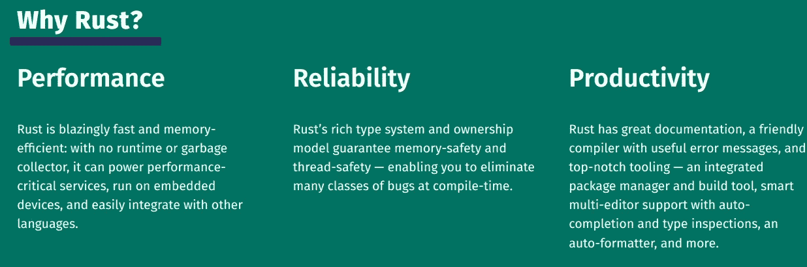
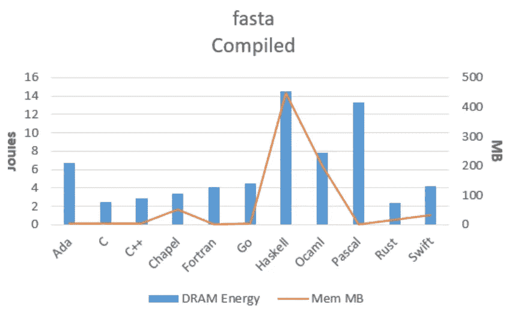

# Rust vs Scala

> 原文：<https://itnext.io/rust-vs-scala-513ebf92bd4a?source=collection_archive---------0----------------------->

[杰伊·海克](https://unsplash.com/@jayrheike?utm_source=medium&utm_medium=referral)在 [Unsplash](https://unsplash.com?utm_source=medium&utm_medium=referral) 上的照片

# 介绍

我使用 [**Scala**](https://scala-lang.org/) 已经有几年了，构建了广泛的应用，从流处理到**数据管道**；与此同时，我一直听到很多关于 [**锈**](https://www.rust-lang.org/) 的好消息，所以最近我决定花时间学习**锈**。

尽管这两种语言是为实现不同的目标而创造的，但它们有一些相似之处。在过去的几个月里，我一直在记笔记，试图将我的未来围绕在每种语言都更适合的用例上。这篇文章是这项研究的高潮。我的目标是从不同的角度对两种语言进行比较，这样任何人，无论其角色如何，都可以对每种语言的异同有一个完整的了解。

这两种语言都是伟大的语言，可以为并发应用程序实现巨大的性能，但是它们的设计非常不同。Scala 是一种更古老、更成熟的编程语言，在并发编程和大数据处理等领域找到了自己的位置。另一方面，Rust 是一种较新的语言，是为了克服对 C++的批评而创建的，因为它是新的，它采用了其他语言的许多结构，同时解决了旧语言的许多问题。

**Scala** 基于 JVM，被认为是 [**通用编程语言**](https://en.wikipedia.org/wiki/General-purpose_programming_language) 。 [**Rust**](https://www.rust-lang.org/) 另一方面，是一种 [**系统编程语言**](https://en.wikipedia.org/wiki/System_programming_language) ，它是为了解决 C++的内存安全问题和其他问题而创建的，同时保持 C++以其惊人的**性能**。

在这篇文章中，我将试着给你一个两种语言的快速概述，它们的**优点和缺点**，并回顾一些真实的单词用例，我们将推荐一种语言而不是另一种。

# 简单来说 Scala

[**Scala**](https://www.scala-lang.org/) 是学者们创造的编程语言，它是运行在[**JVM**](https://en.wikipedia.org/wiki/Java_virtual_machine) 上的 **Java** 的第一个替代品。它将自己定义为:

> Scala 是一种现代的多范例编程语言，旨在以简洁、优雅和类型安全的方式表达常见的编程模式。[1]

Scala 兼具功能性和面向对象性，提供了两者的优势。它有一种灵活的方式来定义你的程序，由你来决定如何描述它们:从纯粹的函数式编程到纯粹的面向对象编程。

和 Java 一样，Scala 也是面向对象的:

> *Scala 是一种纯粹的面向对象语言，因为* [*每个值都是一个对象*](https://docs.scala-lang.org/tour/unified-types.html) *。对象的类型和行为由* [*类*](https://docs.scala-lang.org/tour/classes.html) *和* [*特征*](https://docs.scala-lang.org/tour/traits.html) *描述。[1]*

它还提供了对[功能编程](https://en.wikipedia.org/wiki/Functional_programming)和一个强大的[静态](https://en.wikipedia.org/wiki/Static_typing) [类型系统](https://en.wikipedia.org/wiki/Type_system)的支持。与 Java 不同，Scala 拥有 [Scheme](https://en.wikipedia.org/wiki/Scheme_(programming_language)) 、 [Standard ML](https://en.wikipedia.org/wiki/Standard_ML) 、 [Haskell](https://en.wikipedia.org/wiki/Haskell_(programming_language)) 等[函数式编程](https://en.wikipedia.org/wiki/Functional_programming)语言的诸多特性，包括[curry](https://en.wikipedia.org/wiki/Currying)、[类型推理](https://en.wikipedia.org/wiki/Type_inference)、[不变性](https://en.wikipedia.org/wiki/Immutability)、[懒求值](https://en.wikipedia.org/wiki/Lazy_evaluation)、[模式匹配](https://en.wikipedia.org/wiki/Pattern_matching)。它还有一个高级类型系统，支持[代数数据类型](https://en.wikipedia.org/wiki/Algebraic_data_type)、[协方差和逆变](https://en.wikipedia.org/wiki/Covariance_and_contravariance_(computer_science))、[高阶类型](https://en.wikipedia.org/wiki/Higher-order_type_operator)(但不支持[高阶类型](https://en.wikipedia.org/wiki/Parametric_polymorphism))和[匿名类型](https://en.wikipedia.org/wiki/Anonymous_type)。

> Scala 也是一种函数式语言，因为每个函数都是一个值。Scala 提供了定义匿名函数的[轻量级语法](https://docs.scala-lang.org/tour/basics.html#functions)，支持[高阶函数](https://docs.scala-lang.org/tour/higher-order-functions.html)，允许函数[嵌套](https://docs.scala-lang.org/tour/nested-functions.html)，支持[curry](https://docs.scala-lang.org/tour/multiple-parameter-lists.html)。[1]

Java 中没有的 Scala 的其他特性包括[操作符重载](https://en.wikipedia.org/wiki/Operator_overloading)、可选参数、[命名参数](https://en.wikipedia.org/wiki/Named_parameter)和[原始字符串](https://en.wikipedia.org/wiki/Raw_string)。相反，Scala 中没有的 Java 的一个特性是[检查异常](https://en.wikipedia.org/wiki/Checked_exception)，这已经被证明是有争议的。

**Scala 在大数据**和其他用例中被大量使用。Twitter 等公司转向 Scala，特别是因为更好的并发支持。Scala 很强大，但是很难学，并且仍然存在一些与 Java 的兼容性问题。

Scala 使用的两个关键驱动因素是基于 actor 系统的用于并发编程的 [**Akka**](https://akka.io/) 框架和用于大数据**的 [**Spark**](https://spark.apache.org/) 处理引擎。由于其学术性质，除了 Akka 或 Spark 之外，Scala 在现实世界中没有找到太多的用法。虽然在金融机构大量使用。**

# **Scala Pros**

*   **运行在 [**JVM**](https://en.wikipedia.org/wiki/Java_virtual_machine) 上。它附带了多年来构建的所有 JVM 优化，并且与 Java 兼容。**
*   **非常简洁，与 Java 或 GO 相比，它需要更少的样板代码。**
*   ****功能性和面向对象**。**
*   **[**型系统**](https://dzone.com/articles/scala-type-system-in-depth) 非常强大。您可以为您的库构建自定义 DSL，在编译时执行检查等等。它还支持 [ADTs](https://docs.scala-lang.org/scala3/book/types-adts-gadts.html) 。**
*   **函数式编程的所有 [**优点**](https://medium.com/@devisha.singh/7-unbeatable-advantages-of-functional-programming-b5d1af1edbe1) 。**
*   **基于 actor 模型的 Akka 生态系统使其成为并发系统的最佳选择。**
*   **强大的 [**构建**](https://www.scala-sbt.org/) 工具。**
*   ****多才多艺**。Scala 可以用来表达任何类型的问题。**

# **Scala Cons**

*   ****复杂。**难学难精通。通常由高级程序员使用。**
*   ****太宽泛**，同样的事情有一百种表达方式，每个 Scala 开发者都有自己的风格，在大型项目中很难保持代码的一致性。**
*   **一些**与 Java** 的兼容性问题；同样，如果你需要使用 Java 库，它会剥夺 Scala 的优势。**
*   ****慢编译器。虽然有像 Bloop 这样的工具可以缓解这些问题。****
*   ****它继承了云原生应用程序的 JVM 问题**，如容器尺寸大、启动时间慢、难以调优、部署慢等。**
*   **尽管 Scala 非常通用，但它只是找到了某些利基市场，并没有被广泛采用。**

# **用例**

*   ****大数据和分析**。由于其强大的类型系统和可扩展性，大数据世界中很多工具如 [**Spark**](https://spark.apache.org/) 都使用 Scala。它是数据工程师和大规模流和批处理引擎的首选语言。**
*   ****并发系统和实时应用**。 [**Akka**](https://akka.io/) 框架因其对并发系统的可伸缩性而闻名，并广泛应用于交易服务和其他使用 JVM 的高并发系统。**
*   ****高并发 API**。 [**Play 框架**](https://www.playframework.com/) 提供了一个高度并发的 web 框架来构建由 **Akka** 支持的应用和 API。**
*   ****独石**。Scala 是大型整体应用的绝佳选择，甚至是分布式应用。使用 Akka 集群，你可以在一个应用中创建高度分布式的应用。**
*   **一般来说，Scala 是用来为特定领域构建框架和库的，就像 Akka 或 Spark 一样。**

# **简而言之就是生锈**

**[**Rust**](https://en.wikipedia.org/wiki/Rust_(programming_language)) 是一个**新的** **语言**，它早在 2006 年就在 [**Mozilla**](https://www.mozilla.org/en-US/about/) 中开始使用，但直到 2015 年才首次稳定发布。Rust 自发布以来越来越受欢迎，特别是在过去 5 年里，许多公司如**、微软、[脸书](https://serokell.io/blog/rust-companies)、Mozilla、 [Dropbox](https://www.dropbox.com/) 或 [Cloudfare](https://github.com/cloudflare) 。自 2016 年以来，Rust 每年都在[**Stack Overflow**](https://en.wikipedia.org/wiki/Stack_Overflow)开发者调查中被评为*“最受欢迎的编程语言”*，没有其他语言达到过这一水平，因此它很受欢迎****

> ******Rust** 是一种[多范式](https://en.wikipedia.org/wiki/Multi-paradigm_programming_language)、[通用编程语言](https://en.wikipedia.org/wiki/General-purpose_programming_language)，是为[性能](https://en.wikipedia.org/wiki/Computer_performance)和安全，尤其是安全[并发](https://en.wikipedia.org/wiki/Concurrency_(computer_science))而设计的。[【12】](https://en.wikipedia.org/wiki/Rust_(programming_language)#cite_note-15)[【13】](https://en.wikipedia.org/wiki/Rust_(programming_language)#cite_note-Rust_Project_FAQ-16)Rust[在语法上](https://en.wikipedia.org/wiki/Syntax_(programming_languages))类似于 [C++](https://en.wikipedia.org/wiki/C%2B%2B) ，[【14】](https://en.wikipedia.org/wiki/Rust_(programming_language)#cite_note-17)但是可以通过使用*借用检查器*来验证[引用](https://en.wikipedia.org/wiki/Reference_(computer_science))来保证[内存安全](https://en.wikipedia.org/wiki/Memory_safety)。[【15】](https://en.wikipedia.org/wiki/Rust_(programming_language)#cite_note-unsafe-18)Rust 无需[垃圾收集](https://en.wikipedia.org/wiki/Garbage_collection_(computer_science))即可实现内存安全，[引用计数](https://en.wikipedia.org/wiki/Reference_counting)可选。[【16】](https://en.wikipedia.org/wiki/Rust_(programming_language)#cite_note-19)[【17】](https://en.wikipedia.org/wiki/Rust_(programming_language)#cite_note-20)Rust 一直被称为[系统编程](https://en.wikipedia.org/wiki/Systems_programming)语言，除了[函数式编程](https://en.wikipedia.org/wiki/Functional_programming)等高级功能外，它还提供了[低级](https://en.wikipedia.org/wiki/Low-level_programming_language) [内存管理](https://en.wikipedia.org/wiki/Memory_management)的机制。— [维基百科](https://en.wikipedia.org/wiki/Rust_(programming_language))****

****Rust 最初是为了取代 c++(T1)而开发的，目的是让开发者更容易使用它，同时保持与 T2 相同的性能(T3)。C++已经存在了将近 50 年，它被用于开发视频游戏、操作系统、实时系统等等的低级编程。C 语言的问题在于它很难使用，特别是，它不是内存安全的，会产生许多最著名的错误和安全漏洞。c 开发人员需要确保程序是内存安全的，这在生产级应用中很难实现，这意味着在生产中经常会发现 bug，从而产生巨大的问题。这些限制导致了以控制和性能为代价的垃圾收集通用语言，如 Java。****

********

****因此，在 Rust 出现之前，程序员不得不在一种古老而危险的语言(C++)和一种较慢的通用语言(如 Java)之间做出艰难的选择。随着我们继续构建更大、更复杂的应用程序，垃圾收集语言在性能方面开始落后，因为它们没有从底层硬件榨取所有的能力。随着多核处理器的推出，需要优化接近硬件的代码，以制作更快、更便宜的程序。****

*****那么，如果 Rust 是 C++的替代品，为什么我们要把它和* ***Scala*** *做比较呢？*在过去的 10 年里，Rust 有了很大的发展，许多库和工具被创造出来，以改善开发者的体验，让开发者更容易使用它，并扩展 Rust 适用的用例的数量。这意味着 Rust 已经从一个利基市场取代 C++作为系统级编程，走向一种高性能的通用语言，能够与 Go、Python 或 **Scala** 竞争。与其他语言相比，Rust 将性能、低资源消耗和小二进制代码提升到了一个新的水平。****

****在前端， [**WebAssembly**](https://en.wikipedia.org/wiki/WebAssembly) 将 Rust 置于聚光灯下。 [WebAssembly](https://en.wikipedia.org/wiki/WebAssembly) 试图通过创建在浏览器上运行的高性能应用程序来克服浏览器中的 JavaScript 限制，Rust 是 WebAssembly 中的主要语言。****

****在 [**LLVM**](https://llvm.org/) 的帮助下，源代码被编译成本地代码，因此它可以在所有 LLVM 支持的平台上使用，这使得它非常具有可移植性，但不如 c。Rust 是一个真正的**开源**项目，拥有一个非常强大和开放的社区，这是它成功和快速扩展的关键。****

## ****生锈特征****

****因为 Rust 是一种新语言，它没有 C++或 Java 等其他语言的历史影响力，这意味着它是根据其他语言的最佳实践和经验设计的。****

****Rust 的特性非常丰富，它有丰富的语法和强大的构造，如 traits、强大的[类型系统](https://doc.rust-lang.org/book/ch19-04-advanced-types.html)、[闭包](https://doc.rust-lang.org/book/ch19-05-advanced-functions-and-closures.html)、泛型、集合、模式匹配、[组合子](https://learning-rust.github.io/docs/e6.combinators.html)、选项等。你可以在其他强大的语言中看到，比如 Scala。****

****最重要的是，它有优秀的开箱即用的工具。 [**Cargo**](https://doc.rust-lang.org/cargo/) 可能是最好的软件包管理器，对 mono 库有很大的支持。它快速、可靠且易于使用。编译器很棒，信息非常清晰，大多数时候它会准确地告诉你需要做什么。****

****我第二喜欢的特性是 [**零成本抽象**](https://docs.rust-embedded.org/book/static-guarantees/zero-cost-abstractions.html) ，它非常强大。这意味着您可以创建抽象来开发易于使用的 API 和库，同时保持相同的性能，编译器将解析您的代码，并将其翻译成不会产生任何开销的高效代码。这意味着您可以使用更高级的编程概念，如泛型、集合等，但它们不会带来运行时成本，只有编译器时间成本，因此您可以保持代码整洁，同时仍能获得最高性能。****

****Rust **型系统**也极其强大，类似于 **Scala** 。Rust 支持 [**代数数据类型**](http://blog.madhukaraphatak.com/rust-scala-part-4/) **(ADTs)** 得益于其强大的`enums`，也支持高级 [**模式匹配**](https://doc.rust-lang.org/book/ch18-00-patterns.html) 。这些特性通常只在高级函数式编程语言中可用，Rust 将这些高级特性带到了低级编程中。****

****但是使 **Rust** 区别于其他语言的最具**创新性的**和**独特的** **特性**是 [**所有权模型**](https://doc.rust-lang.org/book/ch04-00-understanding-ownership.html) ，它允许 Rust 在编译时是内存安全的，允许您编写高效的内存安全代码，而无需显式分配和取消分配内存。****

****在 Rust 出现之前，您必须在低级编程语言之间做出选择，您负责管理内存并确保它是安全的，或者使用垃圾收集语言，如 Java 或 Go，这会导致性能下降和更大的二进制文件大小。Rust 为编译时的内存安全引入了一个新的范例。****

> *******所有权*** 是一组**规则**，这些规则**管理一个 Rust 程序如何管理内存。所有程序在运行时都必须管理它们使用计算机内存的方式。一些语言有垃圾收集，在程序运行时不断寻找不再使用的内存；在其他语言中，程序员必须显式地分配和释放内存。 **Rust** 使用了一种**第三种**第三种**方法**:内存是通过一个拥有一套规则的所有权系统来管理的，编译器会检查这些规则。如果违反了任何规则，程序就无法编译。所有权的任何特性都不会降低你的程序运行速度。—[https://doc . rust-lang . org/book/ch04-01-what-is-ownership . html](https://doc.rust-lang.org/book/ch04-01-what-is-ownership.html)******

**简而言之，这些是规则:**

*   **Rust 中的每个值都有一个变量，称为它的*所有者*。**
*   **一次只能有一个所有者。**
*   **当所有者超出范围时，该值将被丢弃。**

**有了这 3 条简单的规则，Rust 编译器就可以施展它的“魔法”，确保你的程序是安全的，在生产中不会有意外。**

**虽然 **Scala/Java** 使用**垃圾收集器**解决了内存安全问题，但是 **Rust** 决定使用这种新模式来创建更小更快的程序。**

**这个新模型的主要问题是**需要时间来适应**它，作为一个开发者你需要花时间来很好地理解这个模型，以避免无尽的挫折，这就是为什么 Rust 的学习曲线比其他语言如 Go 高得多，但类似于 **Scala** 。**

# **Rust Pros**

*   **极其**快速**和**高效。****
*   ****特性丰富**:闭包、模式匹配、集合、泛型等。**
*   **简洁易读。**
*   **[腹板装配](https://en.wikipedia.org/wiki/WebAssembly)支架。**
*   **[**Cargo**](https://doc.rust-lang.org/cargo/) 是一个优秀的包装经理。**
*   **它与 C 兼容，可以与现有的 C 程序交互。**
*   **真正的开源和充满活力的社区。**
*   **[低能耗](https://thenewstack.io/which-programming-languages-use-the-least-electricity/)低成本。**
*   **出色的成长和知名度的提高。**
*   **出色的错误处理。**

# **防锈产品**

*   ****不成熟**，还很新。在生产环境中运行的生产级应用程序并不多，尽管其增长速度很快。**
*   **有点**难学**，特别是**所有权模式**需要一些时间来适应。**
*   **编写 Rust 程序比其他语言如 Go 要花更长的时间，这是因为你需要遵循编译器设定的严格规则。**
*   ****没有对并发**、异步编程和绿色线程的本地支持。这是由设计决定的，Rust 对操作系统线程有基本的支持，但是对于真实世界的异步编程，你需要使用库。 [**futures-rs**](https://github.com/rust-lang/futures-rs) 库包括零成本异步编程的基础。它包括像`Stream`这样的关键特征定义，以及像`join!`、`select!`这样的实用程序，以及各种支持表达性异步控制流的未来组合器方法。还有许多可用于并发编程的库和引擎，其中最著名和最强大的是 [**Tokio**](https://tokio.rs/) 。**

# **Rust 用例**

*   ****CPU** **密集型**应用如游戏、操作系统等。**
*   **嵌入式系统**
*   **应用程序运行时。比如 Node.js 的创建者已经创建了 [**Deno**](https://deno.land/) 作为新一代的 JavaScript 运行时，这是用 Rust 写的。**
*   ****微服务:API**如 **REST** 端点。Rust 有一些**最快的 web 框架**比如 [**Actix**](https://actix.rs/) 。**
*   **[**WebAssembly**](https://en.wikipedia.org/wiki/WebAssembly) 在浏览器中执行高效代码。它还可以用来在服务网格中编写高效的过滤器，如 Istio、Istio、T37、T38、T40。**
*   **[网页开发](https://yew.rs/)**
*   **加密货币。**

**因为它的复杂性，我不会用 Rust 来创建 CLI 和简单的脚本，但这是可能的。**

# **Rust vs Scala**

**机器人编程语言是强类型的，它们是安全的，高度并发的，每秒可以处理数百万条记录。**

****对于大数据/数据处理，Scala 是最佳选择**。Rust 在大数据领域仍处于起步阶段；尽管有一些非常有趣的项目正在开发中，而且发展速度很快。 [**数据融合**](https://github.com/apache/arrow-datafusion) 是一个有趣的项目，旨在取代 **Spark** 进行基于 [Apache Arrow](https://arrow.apache.org/) 的超快速并行数据处理。欲了解更多信息，请查看此 [**文章**](https://towardsdatascience.com/data-processing-in-rust-with-datafusion-arrow-56df5432de68) 。**

****对于流处理，Scala 拥有更广阔的生态系统。** **Akka** 本身就是一个怪兽，可以自己管理大量的请求，没有任何依赖性，它还提供了更多的特性，比如**背压。**在 Rust 中，你有 [**Tokio**](https://tokio.rs/) ，它也支持[流处理](https://tokio.rs/tokio/tutorial/streams)，但没有相同级别的特性，因为它比基于[演员模型](https://en.wikipedia.org/wiki/Actor_model)的 **Akka** 生态系统级别低。尽管如此， **Tokio** 比 **Akka** 快得多，因为它没有管理演员的额外开销。在 **Rust** 中也有一个 actor 库叫做 [**Actix**](https://github.com/actix/actix) 是它基于 actor 的 web 框架[**Actix-web**](https://github.com/actix/actix-web)Rust 中最知名的库之一，因为它是市场上最快的 HTTP 服务器之一，远远胜过任何 Scala HTTP 服务器。**

****对于 web 应用**,**Scala**[**Play Framework**](https://www.playframework.com/)更适合于有状态的 web 应用或者有足够时间让 JVM 优化应用的长期应用。Scala 非常适合小型服务或大型平台。如果需要和 Akka 集成也是不错的选择。另一方面， **Rust 更适合需要高性能的微服务和云原生应用**，但由于其可扩展的[**工作空间**](https://learning-rust.github.io/docs/d5.workspaces.html) **，也可用于单片..**这种**锈** [**火箭**](https://rocket.rs/) 或 [**Actix-web**](https://github.com/actix/actix-web) 功能极其强大且易于使用。**

****Scala 是一种高级语言**，它是在学术界创建的，不是为了解决任何特殊或特定的问题，而是从头开始创建一种非常丰富的语言**它可以利用 JVM 的功能，包括其可移植性和性能优化，但它也承载了影响性能的 JVM 及其垃圾收集器的重量。 **Rust** 另一方面是一种 [**系统编程语言**](https://en.wikipedia.org/wiki/System_programming_language) 专注于性能、低资源使用和低级细节。 **Rust** 旨在通过创造一种更简单更新的编程语言来完全取代 C++。此外，Rust [的零成本抽象](https://docs.rust-embedded.org/book/static-guarantees/zero-cost-abstractions.html)特性和惊人的[构建系统](https://doc.rust-lang.org/cargo/reference/workspaces.html)允许开发人员创建易于使用但仍然高性能的库，用于通用任务，如 REST APIs、流处理等等，这使得 Rust 可以与 Scala 竞争。****

****Scala 在几个方面比 Rust** 更成熟，就**函数式编程而言** Scala 比 Rust 更先进，但 **Rust** 也不甘落后，它只是缺少一些功能 [**更高级的类型**](https://www.baeldung.com/scala/higher-kinded-types) 或检查尾部递归，但它们很快就会推出。**

****Rust** 在概念上是纯粹的，因为 **Scala** 已经被改造成了 **JVM** ，所以它有它的局限性，并且为你的心智模型增加了一个额外的抽象层。 **WebAssembly** 是为在 web 和嵌入式系统中运行而从头开始构建的，它是现代的、安全的和轻量级的。它甚至打算不仅取代 JVM，而且完全取代容器 T21。Rust 对 WebAssembly 有一流的支持，它是 WebAssembly 的主要语言。**

**Rust 是系统编程、微服务、CPU 密集型任务、web 等等的更好选择。 **Scala** 对于**大数据** (Spark 和 Hadoop 生态系统)来说会更好，主要是因为相比 Rust 来说工具更加丰富和成熟。**

# **表演**

**Rust 将在所有领域胜过 Scala，这是因为 Rust 是为速度而生，作为 C 的替代品，而 Scala 只是专注于语言本身。**

**对于某些应用程序， **JVM** 实时( [**JIT**](https://www.geeksforgeeks.org/just-in-time-compiler/) )编译器可以执行优化，从而提高运行时的性能，Rust 是提前编译的，因此不会发生这种情况。这意味着 **Scala** 可能需要时间预热以达到一定的性能水平，而 Rust 从一开始就会表现良好，这是运行**无服务器**函数([**【FaaS】**](https://www.ibm.com/cloud/learn/faas))时的优势。**

**在 **Rust** 中，编译器将指导你确保编写安全的代码，并提示你获得良好的性能，但仍然相对容易编写性能比 Scala 更差的糟糕的 Rust 代码，这就是为什么正确学习语言、理解所有权模型和内存如何工作很重要，这样你就不会陷入克隆数据的坏习惯，这会增加内存使用量并降低性能；但是总的来说，**仅仅通过在 Rust 中重写你的代码，你应该会得到很大的性能提升。****

****Scala** 具有使用 JVM 优化和丰富生态系统的优势，例如 [**Akka**](https://akka.io/) 框架具有许多 Rust 所缺乏的流处理和并发编程的特性和优化，可以帮助您轻松构建高性能应用。**

**最后，Rust 的 CPU、内存和二进制文件的大小将大大降低，从而成为一种更节能、成本更低的语言，这将减少您的云账单。**

# **推荐**

# **如果你是开发人员…**

*   **如果你是一名高级 Java 开发人员，想转向更高级的语言，学习 Scala。**
*   **如果您已经使用了 JVM 和/或在本地运行，请学习 Scala。**
*   **如果你正在使用 Akka 和 Spark 寻找高薪工作，学习 Scala。**
*   **如果你在大数据方面投入很大，学习 Scala。**
*   **如果你想在金融机构等更传统的行业工作，学习 Scala。**
*   **如果你想进入加密货币领域，就要学习 Rust。**
*   **如果你是高级开发人员和/或 C 开发人员，请学习 Rust。**
*   **如果你想找高薪工作，但不是很多，那就学会生锈吧。**
*   **如果你想在嵌入式系统或 **WebAssembly** 和其他现代工具上工作，学习 Rust。**
*   **如果你想用超快的代码打动你的老板，那就学习 Rust 吧。**
*   **如果您想使用 [ADTs](http://blog.madhukaraphatak.com/rust-scala-part-4/) 和高级类型构建复杂的应用程序，请学习 Rust。**
*   **如果你想在云中工作，在初创企业和酷项目中工作，就要学习 Rust。**

**这两种语言都很复杂，需要一点学习过程。**

****Scala** 很有趣，**很复杂**很有挑战性，但也很有价值，报酬很高，也更有声望，尤其是在大数据领域。**

**Rust**是**复杂的**，具有挑战性，但也是值得的，报酬很高，也有声望。****

**Rust 的发展速度比 Scala 快得多，趋势表明 Scala 的使用正在随着时间的推移而减少，因为 Rust 和 Golang 等其他语言接管了 Scala 中的一些用例，Java 增加了 Scala 中的一些功能。**

# **如果你是技术主管…**

*   **如果你依赖 JVM 或者你的开发团队已经熟悉 Java，那么使用 Scala。**
*   **对于利用 JVM 优化的高并发分布式系统，使用 Scala。**
*   **大数据用 Scala，特别是 Spark。**
*   **如果您的 Java 应用程序有伸缩问题，请使用 Scala。**
*   **如果您的团队已经了解 C，并且您想编写更安全的代码，请使用 Rust。**
*   **将 Rust 用于高度并发的复杂分布式系统，这些系统可以充分利用硬件资源并提供可预测的性能。**
*   **使用 Rust 来重写你的应用程序中需要高性能的部分，你可以用另一种语言来写剩下的部分。**
*   **用 Rust 远离 C，两者兼容。**
*   **如果你在一家生产 bug 非常昂贵的公司工作，比如医疗保健、航空等，就使用 Rust。**
*   **如果你的问题可以用现有的成熟库解决，比如 [Tokio](https://tokio.rs/) 、 [Rocket](https://rocket.rs/) 、 [Actix](https://actix.rs/) 等，就使用 Rust。不需要太多的努力，你就会得到很好的表现。**
*   **使用 Rust 生成最少的二进制文件以部署在 edge 或嵌入式系统上。**
*   **对大型或单一项目使用 Rust**
*   **模块化是关键的大代码库的用户信任**

**总之，这两种语言都可以用于**单片**和**微服务**，并且都可以用于**并发**编程，性能非常好。Rust 更擅长运行并行任务和优化资源，使其更加高效和廉价，它还创建了一个更小的二进制文件。对于**无服务器**和 **Kubernetes** 和 **Rust** 将更容易、更快、更高效。Scala 有更成熟的库，特别是大数据。**

# **如果你是经理…**

*   **将 Scala 用于传统的关键并发应用、单片或实时系统。**
*   **大数据使用**Scala**。**
*   **如果您已经在使用 Java，并且您的组织中的改变很困难且需要时间，请使用 Scala。**
*   **将 Rust 用于**新的**关键并发应用、单片或实时系统。**
*   **用铁锈建造 [**更环保的**](https://thenewstack.io/which-programming-languages-use-the-least-electricity/) 项目。**
*   **使用 Rust 或 Scala 吸引高技能开发人员。**
*   **对大型代码库和复杂项目使用 Rust 或 Scala。**
*   **对 Kubernetes 或 Serverless 中的微服务使用 Rust。**

**简而言之， **Rust** 运行成本更低，性能更好，而且 Rust 的程序员非常优秀，如果你使用 Rust，你会吸引人才。问题是 Rust 的开发者并不多，而且很难找到他们。 **Scala** 非常适合大型项目和**大数据**。如果你在使用 Java 的 JVM 上投入了大量资金，那么 Scala 是一个常见的下一步选择，而不是 Rust。**

# **结论**

**Rust 是我最喜欢的新语言，它是新的、令人耳目一新的、高性能的、丰富的和可扩展的。习惯它需要一些时间，你可能会因为所有权模型而对编译器感到沮丧，但是一旦你习惯了它并理解了规则，它就变得容易了。**

**对于我个人来说，**关于 **Rust** 最好的一点**就是它的 [**低能耗**](https://thenewstack.io/which-programming-languages-use-the-least-electricity/) ，JVM 几乎翻倍消耗。随着我们星球上人口的增长和气候变化成为一个问题，我们应该努力提高能源效率，减少我们的碳足迹。软件几乎无处不在，运行软件所需的能量对地球有着毁灭性的影响；减少能源消耗将对我们的星球产生巨大的影响(也包括你的云账单！)，而且这个很重要。作为开发者，我们应该意识到这一点，并努力学习更多的**节能语言**，以便为创造一个更加**可持续发展的**星球做出贡献。**

****

**与 C 语言一样，Rust 是最有效的语言**

**作为一名开发人员，**我喜欢用 Scala 解决问题，**，**它相当优雅、简洁、强大；和一乐使用**；然而，对于真实世界的场景，我发现很难证明 Scala 的使用是正确的，它像 Rust 一样难学，它更慢，而且它承载了 JVM 的重量:垃圾收集导致低效的性能、高内存消耗、安全漏洞、大尺寸容器等等。最重要的是， **Java** 也在迎头赶上，增加了 Scala 中的许多可用特性。这意味着对于不太复杂的应用来说， **Java 将是一个很好的选择**，你将拥有比 Scala 或 Rust 更多的开发人员。对于高性能代码，Rust 优于 Scala 所以**我发现除了大数据项目，很难找到 Scala 是第一选择的新项目用例。****

**我相信 [**WebAssembly**](https://webassembly.org/) 是未来，从长远来看，它可能会完全取代集装箱。Rust + WebAssembly 是一个强大的、可移植的轻量级解决方案。**

**我认为使用 **Rust** 的唯一**风险**，是**不成熟**，仍然没有官方的异步编程 API/库，一些函数构造如更高级的类型仍在开发中。除此之外，我认为 **Rust 已经找到了编程语言的甜蜜点，这要归功于所有权模型**创建了一种丰富但低水平/高性能的语言，每个人都可以使用。**

**Rust 正以指数速度增长，特别是它的社区在短短一年内增长了 300%,成为发展最快的语言。**

**如果您正在使用 Scala，并且没有性能瓶颈，那么就没有必要迁移到 Rust。Scala 是一门伟大的语言，特别是对于大数据，但是对于新项目，请考虑 Rust。**

**我喜欢这个事实，Rust 非常具有互操作性，所以你可以只移植你的部分代码 T21。使用不同的编程语言是可以的。许多公司将 Rust 用于性能很重要的核心组件，将其他编程语言用于其他用例。我认为这是正确的做法。**从重写 Rust 中的核心组件开始，并根据需要继续重构**，记住，如果某个东西有效，就没有必要去改变它！**

***记得来* ***拍拍*** *如果你喜欢这篇文章* [***关注*******me****](https://javier-ramos.medium.com/subscribe)**或* [***订阅***](https://javier-ramos.medium.com/membership) *获取更多更新！****

***[**订阅**](https://javier-ramos.medium.com/subscribe) 获得**通知**当我发表一篇文章 [**加入 Medium.com**](https://javier-ramos.medium.com/membership)访问数百万或文章！***