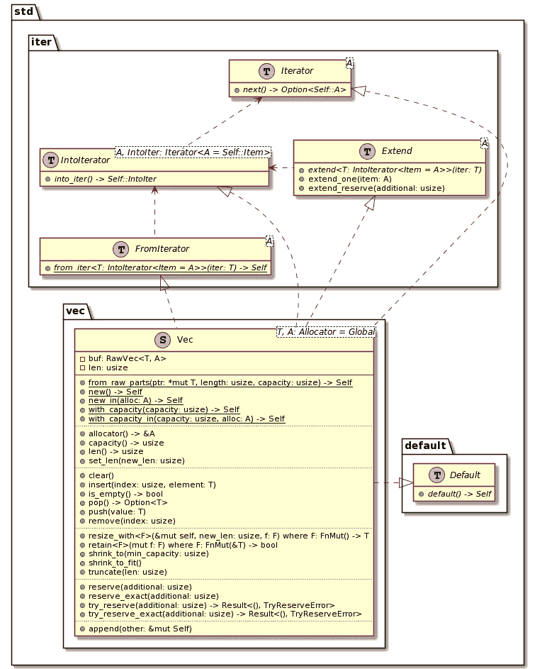
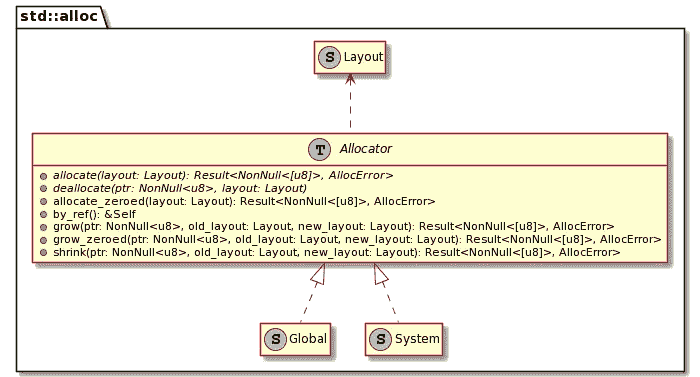

# 拉斯特矢量

> 原文：<https://itnext.io/rusts-vector-4a4a0f0e12eb?source=collection_archive---------2----------------------->


老实说:我最初想描述 Rust 中所有可用的集合以及它们的相关概念。然后，我开始钻研它，我觉得它太长了。出于这个原因，我将把范围限制在`Vec`类型。

*   [我的第一杯铁锈](https://blog.frankel.ch/start-rust/1/)
*   [我的第二杯铁锈](https://blog.frankel.ch/start-rust/2/)
*   [生锈练习—第一部分](https://blog.frankel.ch/start-rust/3/)
*   [生锈练习—第二部分](https://blog.frankel.ch/start-rust/4/)
*   [前端生锈](https://blog.frankel.ch/start-rust/5/)
*   [库伯内特公司的铁锈控制器](https://blog.frankel.ch/start-rust/6/)
*   [Rust 和 JVM](https://blog.frankel.ch/start-rust/7/)
*   [diceroller，一个样本生锈项目](https://blog.frankel.ch/start-rust/8/)
*   *锈氏矢量*(本帖)

这是我们将要深入研究的图表:



# 向量基础

来自[文档](https://doc.rust-lang.org/std/vec/struct.Vec.html):

> *连续的可增长数组类型，写为* `*Vec<T>*` *，读作‘vector’。*

就像 Java 的`ArrayList`，`Vec`是以数组为后盾的。当数组达到最大容量时，`Vec`会保留一个容量更大的新数组，并将元素从原始数组复制到新创建的数组中。然后，它解放了前者。请注意，集合可能会分配比所需更大的数组，以避免频繁的重新分配。

为了给`Vec`加值，我们需要使用一个额外的步骤*，例如*，`push()`函数:

```
let mut v = Vec::new();
v.push(1);
v.push(5);
```

创建新的`Vec`的函数在初始化它们时没有任何条目。如果我们想同时创建一个`Vec`和数值，Rust 提供了`vec!`宏。我们可以用下面的一行代码替换上面的代码:

```
let v = vec![1, 5];
```

在这一点上，如果你已经涉猎了一点 Rust，你可能没有学到什么新东西。与其描述`Vec`上的每一个函数——它们与其他语言中的函数非常相似——不如让我们探索一下。

# 向量和迭代器

*迭代器*是经典*设计模式:可重用面向对象软件的元素*一书中描述的设计模式；

> ***意图:*** *提供一个对象，该对象遍历某个聚合结构，抽象出关于该结构实现的假设。*
> 
> *—* [*迭代器模式*](https://wiki.c2.com/?IteratorPattern)

尽管这本书描述了*迭代器*，但是没有任何东西将这种模式局限于 OOP 语言。这是一个非常普遍的抽象概念。

Rust 提供了`Iterator`特征，`Vec`实现了它。因此，我们可以遍历它的值:

```
let v = vec![1, 5];
let mut iter = v.iter();                       // 1
loop {
    let value = iter.next();                   // 2
    if value.is_some() {
        println!("value: {}", value.unwrap());
    } else {
        break;
    }
}
```

1.  创建迭代器。因为调用`next()`会改变`iter`的状态，所以必须是*可变*。
2.  获取下一个值

如果我从一个错误的`break`语句中得到一美元，我现在肯定很富有。如果你打破得太早，你失去了价值观；太晚了，一切都会失控(双关语)。因此，`for`和迭代器是更好的选择。我们可以将上面的代码重写为:

```
let v = vec![1, 5];
for value in v.iter() {                        // 1
    println!("value: {}", value);
}
```

1.  更短，更安全，因此更好

# 要迭代的迭代器太多

有趣的是，我们可以稍微修改一下上面的代码，删除对`iter()`的调用。还能用！

```
let v = vec![1, 5];
for value in v {                               // 1
    println!("value: {}", value);
}
```

1.  神奇！

这实际上不是魔术，而是 Rust 的语法糖在起作用。`for`循环接受迭代器。然而，有些实例可以“动态地”转换成迭代器。该类型必须实现`IntoIterator`特征和它的`into_iter()`函数才有资格。从上图可以看出，`Vec`就是这种情况。

如果你问自己`iter()`和`into_inter()`之间的区别，安慰自己我也想知道。经过一番研究，我找到了这个绝妙的答案:

> ***TL；*博士:**
> 
> 根据上下文，`into_iter`返回的迭代器可能产生`T`、`&T`或`&mut T`中的任何一个。
> 
> 按照惯例，`iter`返回的迭代器将产生`&T`。
> 
> 按照惯例，`iter_mut`返回的迭代器将产生`&mut T`。
> 
> *—*[*ITER 和 into_iter 有什么区别？*](https://stackoverflow.com/questions/34733811/what-is-the-difference-between-iter-and-into-iter)

最后，由于`FromIterator`，你可以从创建一个`Vec` *。*

```
struct Foo {
    count: u8
}impl Iterator for Foo {                           // 1
    type Item = u8;
    fn next(&mut self) -> Option<Self::Item> {
        match self.count {
            0 => {
                self.count = self.count + 1;
                Option::Some(1)                   // 2
            }
            1 => {
                self.count = self.count + 1;
                Option::Some(5)                   // 2
            }
            _ => None                             // 2
        }
    }
}let i = Foo { count: 0 };
let v = Vec::from_iter(i);                        // 3
for value in v {
    println!("value: {}", value);
}
```

1.  实现我们自己的`Iterator`
2.  首先，返回`1`，然后是`5`，然后什么都没有
3.  从我们的迭代器中创建一个`Vec`

# 存储器分配

到目前为止我们忽略了`Vec`的一个方面:定义其实是`Vec<T, A: Allocator = Global>`。虽然`T`是`Vec`包含的项目类型，但是我们没有看`A`，也就是**分配内存**。我不会详细描述这个主题，因为我目前缺乏相关的知识。然而，我认为提到它很有趣，因为我所知道的其他语言都没有提供这种挂钩。

> *`*Allocator*`*的实现可以通过* `*Layout*` *描述分配、增长、收缩和解除分配任意数据块。**
> 
> **—*[*STD::alloc::Allocator*](https://doc.rust-lang.org/stable/std/alloc/trait.Allocator.html)*

**

*Rust 默认使用`Global`内存分配器。它委托给另一个分配器:它是`System`，除非你用`#[global_allocator]`属性注册一个。*

*有了`Vec<T, A>`，就有可能使用不同于集中定义的分配器。一个可能的用例是创建一个分配器，只为一个`Vec`实例跟踪分配的字节。*

# *结论*

*我对`Vec`的涉猎到此结束。在这篇文章中，我试图避免这类文章的通常处理，并探索一下周围的情况。虽然在大多数情况下不需要专用的内存分配器，但我认为这是一个很好的技巧，以防万一。*

***更进一步:***

*   *[模块标准::集合](https://doc.rust-lang.org/std/collections/index.html)*
*   *[用向量存储值列表](https://doc.rust-lang.org/book/ch08-01-vectors.html)*
*   *[结构标准::vec::Vec](https://doc.rust-lang.org/std/vec/struct.Vec.html)*
*   *[ITER 和 into_iter 有什么区别？](https://stackoverflow.com/questions/34733811/what-is-the-difference-between-iter-and-into-iter)*

**原载于* [*一个 Java 极客*](https://blog.frankel.ch/start-rust/9/)*2021 年 8 月 8 日**