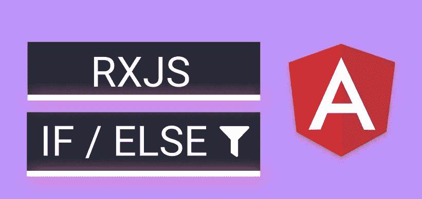
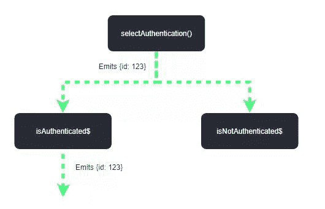

# RxJS & Angular:声明性 If / Else

> 原文：<https://itnext.io/rxjs-angular-declarative-if-else-1d16352a3766?source=collection_archive---------0----------------------->

## 关于 RxJS 过滤算子的注记

源代码: [**Github🚀**](https://github.com/Everduin94/erxk-article-playground/tree/main/src/app/state/workorders) **|** [**活生生的例子&片段🚀**](https://erxk-article-playground.web.app/articles/rxjsfilter)

## 文章目标**🎯**

利用 **RxJS 过滤器操作符。**使用一致的**声明式编程范例**、**、**来潜在地提高**代码清晰度**和**可读性**。

# 关键概念📝

*   [**控制流**](https://en.wikipedia.org/wiki/Control_flow) :是单个[语句](https://en.wikipedia.org/wiki/Statement_(computer_science))、[指令](https://en.wikipedia.org/wiki/Instruction_(computer_science))或[功能调用](https://en.wikipedia.org/wiki/Function_call)的顺序，一个 [*命令式*](https://en.wikipedia.org/wiki/Imperative_programming) [*程序*](https://en.wikipedia.org/wiki/Computer_program) 被[执行](https://en.wikipedia.org/wiki/Execution_(computing))或求值
*   [**选择**](https://en.wikipedia.org/wiki/Control_flow#Choice) :根据程序员指定的[布尔](https://en.wikipedia.org/wiki/Boolean_datatype) *条件*评估为真还是假，执行不同的计算或动作。
*   [**声明式编程**](https://en.wikipedia.org/wiki/Declarative_programming) :是一种[编程范式](https://en.wikipedia.org/wiki/Programming_paradigm)——一种构建计算机程序的结构和元素的风格——它表达了[计算](https://en.wikipedia.org/wiki/Computation)的逻辑，而没有描述其[控制流](https://en.wikipedia.org/wiki/Control_flow)
*   [**反应式编程**](https://en.wikipedia.org/wiki/Reactive_programming) **:** 是一个[声明式](https://en.wikipedia.org/wiki/Declarative_programming) [编程范例](https://en.wikipedia.org/wiki/Programming_paradigm)涉及[数据流](https://en.wikipedia.org/wiki/Stream_(computing))和变化的传播——RxJS 是一个反应式编程的库(因此 RxJS 是一个声明式范例)
*   [**RxJS 过滤运算符**](https://rxjs.dev/api/operators/filter) :通过只发射满足指定谓词的项目来过滤源可观测发射的项目。

# 解释和总结🧪

强调显式控制流是命令式编程与声明式编程的区别。

我们可以(包括我在内的大多数人可能会)将 RxJS 与命令式编程混合使用。像这样写条件语句(if / else ):

必要的

使用流(可观察的)、合成(合并)和过滤运算符。我们可以不写`if / else`也能得到同样的结果。

> 💡注意:命令式编程不是坏事，也不是反模式。—这只是达到相同结果的另一种方式。

宣言的

主要的优势( *imo* )是维护一个编程范例(声明性的)。我相信这提高了我们后面一些例子的清晰度和可读性。

## 过滤器如何工作

Filter 防止带有 falsey 谓词的可观察对象发出。我们可以使用[合并](https://rxjs-dev.firebaseapp.com/api/index/function/merge)将两个可观测量组合在一起。然后，我们通过传递谓词/条件从可观察对象中获得排放。

在我们的例子中，如果用户没有登录到中，那么`isNotAuthenticated$`将发出。将用户重定向到登录屏幕。`isAuthenticated$`会不会**不会**发射，所以它的重定向不会发射。

# 例子🎨

> 使用 Angular、Akita 和 Angular 内存 API

## 基本示例

> [根据状态枚举切换副作用](https://erxk-article-playground.web.app/articles/rxjsfilter)

用一个更实际的例子。我们有一个“工作订单”表。当一个特定的工作指令激活时，我们将根据它的状态触发逻辑。

[完整源代码](https://github.com/Everduin94/erxk-article-playground/blob/main/src/app/state/workorders/work-orders.service.ts) |注意:为了简洁起见，我只把副作用放在“ON_HOLD”中。

订阅`statusSideEffectsListener$`后。然后，我们通过一个传递谓词接收来自内部可观察对象的发射。

例如，如果工单状态为`ON_HOLD`，则只有`isOnHold$`中的逻辑会执行。

我们可以创建方便的方法来删除一些重复的代码。

## 嵌套示例

> [选择现有的或创建新的工单](https://erxk-article-playground.web.app/articles/rxjsfilter)

我们可以通过使用`switchMap`来创建嵌套条件的等价物。

将我们最初的例子向前推进一步。让我们使用相同的模式添加激活逻辑/副作用。然而，如果我们有一个活动的工单，我们只希望运行`statusSideEffectsListener$`逻辑。

[完整来源](https://github.com/Everduin94/erxk-article-playground/blob/main/src/app/state/workorders/work-orders.service.ts) | [用法](https://github.com/Everduin94/erxk-article-playground/blob/main/src/app/snippet/examples/rxjs-nested-filter.component.ts)

> 💡提示:返回`*Observable<void>*`，我们可以向其他读者表明`*Observable*`的结果没有用；因为它的目的是消除副作用。

使用与`statusSideEffectsListener$`相同的模式

*   `createNewWoListener$`正在创建新的工单
*   `loadExistingWoListener$`正在选择一个现有的工作指令
*   `deactivateWoListener$`正在取消选择一个已有的工单。请注意，在这个上下文中我们不会订阅`statusSideEffectsListener$`，因为我们不会`switchMap`它。

**重要:** `statusSideEffectsListener$`内部使用`take(1)`完成一次发射。防止它在每个活动的工作订单变更时发出。

## 作者注释

我在试着写一些简短的文章，避免长篇大论。关注核心思想，并提供源代码/示例作为参考。

让我说说你喜欢/不喜欢这种方法的地方。感谢阅读！

> ☁️[flotes](https://flotes.app)——尝试演示，不需要登录。或者免费报名。Flotes 是我记笔记和高效学习的方式，即使在我很忙的时候。

[Flotes](https://flotes.app)