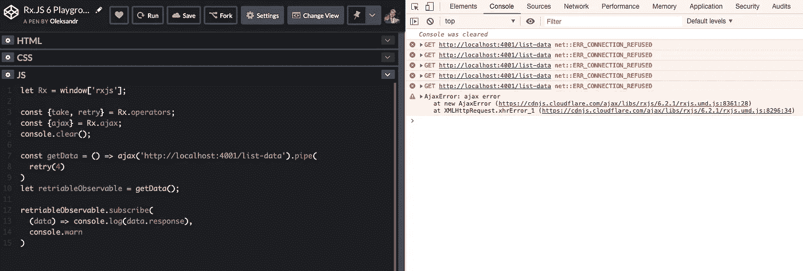
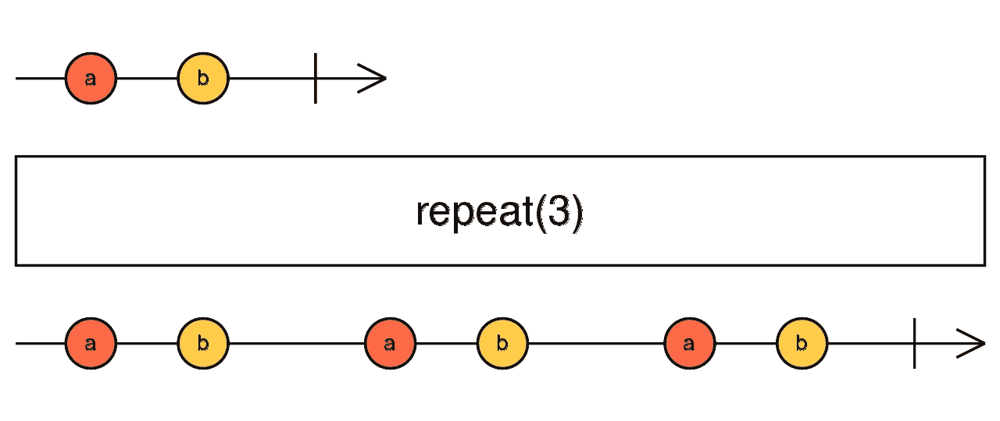
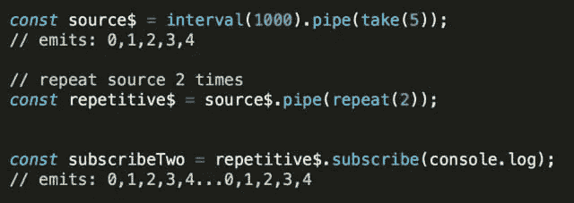

# RxJS 运算符:重试还是重复？

> 原文：<https://itnext.io/rxjs-operators-retry-vs-repeat-26028ca1744a?source=collection_archive---------7----------------------->

> 那么 RxJS 中重试和重复的区别是什么？学习这两个操作符的简洁用例有助于您更好地理解它们。

Elle Florio 的一个镜头

# 介绍

几年前，当我刚开始学习 RxJS 时，我不太明白为什么 RxJS 中有两个操作符用于重复逻辑。不仅我可能有这样的疑问，所以在本文中，我将回顾**重试**和**重复**操作符以及它们可能的用例。

# 重试…还是重复？

在 RxJS 中， **repeat** 和 **retry** 操作符都允许您有条件地重新订阅它们所应用到的终止源可观察对象。
两者都使源可观测序列将被重新启动。

主要区别是

**重复** —收到 onComplete()时重新订阅，但不是错误。
**重试** —收到 onError()时重新订阅。

就可能的用例而言:

> *如果你想重复成功的数据提取，使用* ***重复*** *。
> 如果您想在可观察对象中重复失败的数据提取—使用* ***重试*** *。*

现在，让我们通过示例详细了解一下它们。

# 重试

> ***【重试次数】***

它返回反映源可观测值的可观测值，但有一个错误。
如果源可观察调用出错，该方法将重新订阅为源可观察，最多有*次*次重新订阅

**计数** —失败前重试事件的次数。默认值为-1。

**重试**大理石图

这是一个处理不稳定网络连接的普通 JS 示例。我们进行可观察包装的 Ajax 调用并使用重试操作符。如果第一次 ajax 调用返回错误，重试操作符将再次执行 Ajax 请求三次。
如果其中一次尝试成功，它将为下一次用户回拨提供数据。
如果另外三次尝试都失败，则错误将通过错误回调处理程序传播给订户。

让我们试着在[代码笔](https://codepen.io/kievsash/pen/zXevvo?editors=0010)中运行它。

正如您所看到的，我们有一个失败的请求和 4 次重试尝试(它们都失败了，因为出于学习目的，我们试图到达不存在的 url)。

# 总结一下:

1.  **重试**返回镜像源可观察对象的可观察对象。
2.  如果源可观察调用出错，该方法将重新订阅源可观察(重复运行源序列)，最多可重新订阅 count param 值。
3.  如果其中一次重试运行成功，事件数据将提供给订户的下一个回调处理程序。如果所有重试运行都失败—错误将传播到 onError 处理程序。
4.  一个可能的用例— ajax 失败的请求重试。

# 重复

> ***【重复计数】***

返回一个可观察对象，该可观察对象最多重复源可观察对象发出的项目流*计数*次。

**计数** —源可观测项目重复的次数，计数为 0 将产生空可观测项目。默认值为-1。

**重复**大理石图

看看这个例子:

我们提取源序列并运行两次。
注意*重复*操作员将初始运行视为第一次运行。

现在让我们来看看更复杂的用例——比方说，我们有一个后端，但它不是一次带来所有数据，而是按页带来。因此，让我们实现从后端获取特定数量的分页数据部分:

在我描述这段代码之前——注意我们在 RxJS 的 **defer** 函数中包装了源可观察对象。每次当 *repeat* operator 重新运行 source observable 时——*defer*将为其工厂函数提供资金——因此我们的 url 将具有更新的计数器值。你可以在这里阅读更多关于*推迟*T21

现在让我们观察它是如何工作的:

1.  当我们订阅时，source 第一次调用 page = 0(计数器变量)。
2.  成功获取数据后，我们将数据发送给订阅者。然后源可观察性完成—因此*重复*开始工作—并重新运行源—在我们的例子中是*延迟*功能。
3.  Defer 函数调用其工厂函数，并返回带有新计数器值的 ajax observable。所以现在我们用 page = 1 请求 API。
4.  新的数据页也被发送给订阅者。

您可以尝试在 [codepen](https://codepen.io/kievsash/pen/EJrKoj?editors=0010) 中运行这段代码。

# 总结一下:

1.  **repeat** 返回一个可观察对象，它重复源可观察对象发出的项目流最多 *count* 次。
2.  **count** param —源可观察项目重复的次数，计数为 0 将产生空可观察项目。与 retry-repeat 运算符不同，它将初始源$ run 视为第一次尝试，因此该源将被重复(count-1)次。
3.  **重复** —从源序列接收到 onComplete()时重新订阅，但不是错误。
4.  如果您需要源可观测值以不同的参数重复——使用 RxJS 延迟函数。

# 我们能一起使用它们吗？

我们可以用这两个**重试**和**重复**吗？
肯定是的！如果您想要重复源请求，并在其中一个重复调用失败时重试—您可以使用两个运算符。

在这个例子中，我们用 **repeat** 操作符请求分页信息两次。如果某些请求失败，重试将重新运行它。

# retryWhen 和 repeatWhen

当我第一次看到 **retry** 和 **repeat** 操作符的例子时，我的想法是——我能在重试 ajax 调用之间增加一些延迟吗？
这是运算符 ***retryWhen*** 和 ***repeatWhen*** 发挥作用的时候——不过这是另一篇文章的主题——[让我们保持联系](https://twitter.com/El_Extremal)！

# 其他链接:

1.  [RxJS‘重复’操作者——初级死灵法师指南](https://blog.angularindepth.com/rxjs-repeat-operator-beginner-necromancer-guide-391a3b2ad3ad)。
2.  [Rx。iframe-d Angular SPA 中的 JS retryWhen 用例](https://medium.com/@alexanderposhtaruk/rx-js-replywhen-use-case-in-iframe-d-angular-spa-d86d35d3bce8)

> *Packtpub.com 和我准备了一整套* [*RxJS 课程*](https://www.packtpub.com/web-development/hands-rxjs-web-development-video) *，还有许多其他细节，告诉你如何用这个神奇的库解决你的日常开发任务。它对初学者来说可能很有趣，但也包含高级主题。看一看！*

*原发布于*[*https://dev . to*](https://dev.to/oleksandr/rxjs-operators-retry-vs-repeat-5gn)*。*

*你喜欢这篇文章吗？* [***发微博***](https://clicktotweet.com/az3L1) *关注我* [***发微博***](https://twitter.com/El_Extremal)*🤓*！**