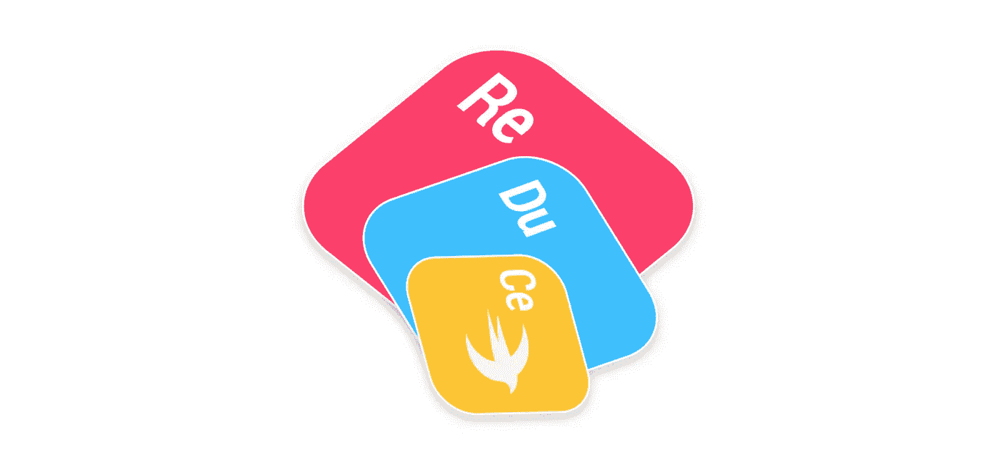

# RxReduce:反应式状态容器架构—第 2 部分

> 原文：<https://itnext.io/rxreduce-reactive-state-container-architecture-part-2-62a9b9f4e441?source=collection_archive---------2----------------------->

RxReduce:一种反应式状态容器架构

正如我们在“ [RxReduce:一个反应式状态容器架构第 1 部分](https://medium.com/@thibault.wittemberg/rxreduce-reactive-state-container-architecture-part-1-940480a0f838)”中所看到的，**状态**是应用程序中的核心问题。我强烈邀请你看看这第一篇文章。到目前为止，我们还没有介绍反应式编程的概念，以及它如何解决我在传统的**状态容器**实现中遇到的一些问题。我们将看到 RxSwiftCommunity 的开源框架 [RxReduce](https://github.com/RxSwiftCommunity/RxReduce) 如何帮助您以一种被动的方式处理**状态**、其突变以及与副作用相关的异步工作。

# 担忧

*   存储使用观察者模式:**存储**的职责之一是将**状态**突变传播给应用程序的其余部分。为此，通常使用一个**观察器**模式，这样观察器将被通知新的**状态**值。在传统的方法中，观察者将在**存储**中注册/注销自己，这意味着要处理大量的样板代码。
*   副作用:在[第 1 部分](https://medium.com/@thibault.wittemberg/rxreduce-reactive-state-container-architecture-part-1-940480a0f838)中，我们看到副作用(主要是异步工作)不能由**存储/减少器**处理。这是**状态**再现性和可测试性的必要条件。但是众所周知，副作用是很常见的，而且在任何应用中都是不可避免的。使用一个只说“嗯，你应该做状态突变之外的副作用”的架构可能会有点令人沮丧，并且会扼杀实现它的意愿。

# RxReduce

RxReduce 诞生于我愿意在原生移动应用中测试像 [Redux](https://redux.js.org/) 这样的模式。我对 MVC、MVP 和 MVVM 有着重要的经验，但我对国家管理很好奇。

显然，我已经在更传统的架构中处理过状态。最终，我拥有了低级别的层，比如“**服务**层，通过 RxSwift Observables 暴露了我的**模型**。这是一个好的开始，但是 Model 并不是真正的状态，它分布在我的所有服务中:对于保证全球一致性来说并不理想。

我必须进一步理解**状态**管理，但目的是解决之前对观察者模式和副作用的担忧。

[**RxReduce**](https://github.com/RxSwiftCommunity/RxReduce) :

*   提供一个通用的**存储库**，可以处理所有类型的**状态。**
*   通过反应机制暴露**状态**突变。
*   提供一种简单/统一的方式，通过**动作同步和异步地改变**状态**。**

在本文的其余部分，我假设您熟悉反应式编程的基本知识，尤其是 RxSwift。如果你不是，网上有很多很好的资源👌。

# RxReduce 术语

你可以在这里浏览回购:[https://github.com/RxSwiftCommunity/RxReduce](https://github.com/RxSwiftCommunity/RxReduce)。

**RxReduce** 兼容 CocoaPods 和 Carthage。它是一个非常小的库，包含三个协议，一个类和两个类型别名:

*   **StoreType** :描述什么应该是**存储**的协议。尽管它是一个公共协议，但是您不需要实现自己的协议，因为 RxReduce 提供了一个默认的**存储**。
*   **状态**:一个空协议，用来标识**存储**中的**状态**，这里不需要特别实现。
*   **动作**:用于标识**店**调度功能中**动作**的协议。只需要实现一个函数:“toAsync()”，但是 RxReduce 为此提供了默认的实现，这里没有什么特别的(解释将在“条件一致性是魔术”一章中给出)。
*   **Store** :代表默认 **Store** 的类，能够在**reducer**和**middleware**内部调度同步或异步**动作**。一个**存储**暴露突变的**状态**。你的应用程序中可以有几个**商店**，每个商店负责一个专用的**状态**，但是为了简单起见，你应该考虑处理一个唯一的**商店**和**状态**跟踪。
*   **Reducer** :一个纯泛型函数的 typealias，执行一个**动作**，一个**状态**并返回一个新的**状态**。您必须在**存储**初始化中提供至少一个**减速器**。当然，也可以增加几个**减速器**，这样你就可以分开责任。**将**动作**分派到**库**时，依次应用减速器**。
*   **中间件**:一个纯泛型函数的类型别名，执行**动作**，执行**状态**并返回… nothing。基本上你可以把它看成一个没有变异能力的**减速器**。当调度一个**动作**到**存储**时，在**减速器**之前调用。例如，中间件对日志记录很有用。

# 状态驱动你的用户界面

> 根据定义，状态是应用程序的核心！( [RxReduce:反应式状态容器架构第 1 部分](https://medium.com/@thibault.wittemberg/rxreduce-reactive-state-container-architecture-part-1-940480a0f838))

一个应用程序只是在给定时间的一个状态的反映。关于这一点，这一章的标题不是巧合。

使用 **RxSwift 驱动**是 RxReduce 将**状态**突变暴露给外界，尤其是 UI 的方式。提醒一下，**驱动**是一个不会失败的可观察对象，并且只在主线程上发出事件，这对于**状态**是有意义的。

倾听**状态**突变引出了一些基本问题:

*   如果我不想被发生在我不感兴趣的**状态**的一部分上的**状态**突变通知，该怎么办？
*   如果**状态**被一个严格相等的新值代替会怎样？通知机制会触发不必要的 UI 更新吗？

这需要一点解释😀。假设我们的**状态**是一个**结构**表示:

*   应用程序的当前用户。
*   用户的联系人列表。

如你所见，那些类型是"**值类型**，这是保证**状态**不变性和一致性的一个要求。它们也是“**等价的**”。这将允许 RxReduce 知道两个连续的**状态**是否相同，从而避免不必要的通知。这回答了我们的一个问题👍。

**AppState** 也符合**状态**。这是由**商店**处理的要求。

下面的“ **dispatch()** 函数属于 **RxReduce** 提供的默认 **Store** :

每次**存储器**接收到一个**动作**:

*   **动作**被转换成异步动作(参见“条件一致性是魔法”一章)。
*   注册的**减速器**列表应用于**状态**。
*   新的**状态**取代旧的状态。

让我们看两个动作的例子:

这里没有火箭科学… **动作**只是嵌入改变**状态**所需的东西，没有业务逻辑。

这里有两个**减速器**的例子:

每个**减速器**处理其关心的**动作**。它允许将**状态**突变分割成逻辑单元。

# 需要关注你的状态？用镜片！

**lens**是函数式编程中的一项技术，它将解决剩下的问题:“**如果我不想被我不感兴趣的部件上发生的状态突变通知，该怎么办？**”

关于**镜头**的几个资源:

*   克里斯·埃德霍夫的《雨燕》中的镜头[。](http://chris.eidhof.nl/post/lenses-in-swift/)
*   [埃尔维罗罗卡](https://broomburgo.github.io/fun-ios/post/lenses-and-prisms-in-swift-a-pragmatic-approach/)Swift 中的镜头和棱镜。

简而言之，镜头允许你聚焦于值类型的一个子部分。作为一种函数式编程技术，它使用函数来实现这一点。让我们在我们的模型上试试这个:

RxReduce 使用完全相同的技术在**商店**中公开一个**状态**。您只需调用" **state()** "函数，用闭包聚焦您想要监听的子状态:

这个函数解决了我们的两个问题:

*   如果两个连续的**状态**相等，则不会触发新事件(由于“ **distinctUntilChanged()** ”)。
*   它允许不监听整个**状态**。

当然，你会注意到**状态**是通过**驱动**公开的😀👌(记住:**状态驱动你的 UI** )。

需要说明的是， **RxReduce** 也提供了这个函数的一个无参数实现，你会得到一个**驱动**用于整个**状态**。

RxReduce 的典型工作流如下所示:

# 条件一致性是神奇的

还有一个问题需要解决……副作用。

在函数式编程中，副作用是使用 I/O 可以改变状态的所有东西。它可以是网络、持久性、文件访问……有副作用，函数可以根据系统的状态而不可预测。当一个函数没有副作用时，我们可以随时执行它，给定相同的输入，它将总是返回相同的结果。

在单向数据流架构中，我们将尝试将副作用隔离出黄金路径:**视图- >动作- >存储- >缩减器- >状态- >视图**。

Redux 有一个解决方案:**动作创建者**。一旦异步作业完成，它将发出一个**动作**并将其分派到**存储器**。

嗯，我看着很熟悉…这不正是 RxSwift 中的一个可观察的<**动作** >吗？是不是说 **Store** 的" **dispatch()** "函数不应该把一个**动作**作为参数，而是一个可观察的< **动作** >？

嗯…是也不是！事实上两者都可以，因为有时我们需要同步突变，有时需要异步突变。

最能干的人最不能干。同步作业只是在作业开始时结束的异步作业👍。RxReduce 提供了一种将同步动作转换为异步动作的方法:

非常容易。如果你还记得“ **dispatch()** ”函数的实现，它做的第一件事就是调用“**action . toasync()**”……现在你有了解释。

这很好，但这只是解决方案的一部分，它允许**商店**调度同步动作，因为它们是异步的。真正的异步动作呢？

最近，Swift 4.1 引入了条件一致性。如果你不熟悉这个概念:[条件一致性一瞥](https://twittemb.github.io/swift/protocol%20oriented%20programming/pattern/2018/04/02/a-glance-at-conditional-conformance/)。

基本上，只有当相关的内部类型也符合协议时，它才允许泛型类型符合该协议。让我们将此应用于可观察的:

这意味着一个可观察的<**动作** >也在**动作**中，前提是元素本身是一个**动作**。相当整洁。

商店将分派一个**动作**，无论它是同步的还是异步的……无缝地。

事实上，加载一个用户应该是这样的:

你会在 RxReduce repo 中找到一个完整的[演示应用](https://github.com/RxSwiftCommunity/RxReduce/tree/master/RxReduceDemo)。它结合使用了 MVVM 和状态容器。

# 结论

我认为**状态容器架构**是对移动软件工程的巨大贡献。它迫使你问自己应用程序的状态应该是什么，如何改变它，如何隔离 I/o。它是对只面向视图的传统模式的一个很好的补充。

RxReduce 利用函数式反应式编程来解决可能会令您反感的问题。

如果你想了解更多关于 RxReduce 的信息，欢迎访问 [GitHub repo](https://github.com/RxSwiftCommunity/RxReduce) 并投稿👍。

我希望你喜欢这个话题。

敬请关注。