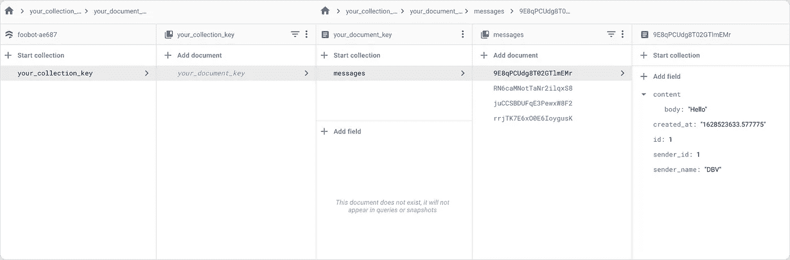

# RxSwift x Firestore

> 原文：<https://itnext.io/rxswift-x-firestore-5beefe97e379?source=collection_archive---------4----------------------->

> Firebase 的产品之一 Cloud Firestore 是一个云托管的 noSQL 数据库，支持移动和网络的实时同步和离线支持，因此您可以构建响应迅速的应用程序，无论网络延迟或互联网连接如何。

我不想过多地谈论 **Firebase** 生态系统，因为这需要一年的时间来解释它有多不可思议。文章的主要目的是向你展示如何专业地使用**云 Firestore** 与 **RxSwift** 。

首先，你得准备一些东西。

*   [**添加 FirebaseFirestore 框架**](https://firebase.google.com/docs/firestore/quickstart#ios)
*   [**添加 RxFirestore 库**](https://github.com/RxSwiftCommunity/RxFirebase#firestore)
*   [**添加 CodableFirebase**](https://github.com/alickbass/CodableFirebase)

其次，我们喝点水，稍微放松一下。

# **编码时间！**

## **1。创建 firestore 客户端管理。**

这里，我们将创建一个 FirestoreClient 类，它应用了**单例模式。**

*   **persistenceEnabled** :默认情况下，离线持久化是启用的，所以如果你不想缓存你的 app 正在使用的云 Firestore 数据的副本，那么就把它设置为`**false.**` 详细概述，参见这个[文档](https://firebase.google.com/docs/firestore/manage-data/enable-offline)。

## **2。将数据写入云 Firestore。**

例如，我们要写一个函数给**发送**一条消息。

*   首先，编写一个您希望从 **Cloud Firestore 发送和接收数据的消息请求和响应模型。**

*   接下来，编写一个发送消息函数**。**

*   让我们看看*第 7 行*， **addDocument** 函数需要一个`NSDictionary`作为它的参数，所以让我们创建一个扩展，将`Encodable`对象转换成一个`NSDictionary.`[***Encodable+extension . swift***](https://gist.github.com/dubydu/1bd785b2b8507192093981f55662aefc#file-encodable-extension-swift)

如果一切顺利，我们将有一个这样的结构化数据:

有关详细概述，请参见本[文件](https://firebase.google.com/docs/firestore/manage-data/add-data)

## 3.从云 Firestore 读取数据。

你已经知道如何发送信息；然而，为了使这个例子更清楚，我们将编写另一个函数来从`messages`集合中检索所有消息。

让我们创建一些**可编码的**包装器，以便在收到来自**云 Firestore** — *line 9* 的快照后解析数据。

*   **解码单个文档**

*   **解码多个文件**

> *These wrappers took inspiration from this article:* [***[Swift]Firestoreのdocument 取得を見やすく書けるようにしてみる***](https://qiita.com/d-nakajima/items/236f711937ea81ebdcfa)

F 最后，`listenChatMessage()`函数将返回一个包含元素值的`Observable`，该元素值是来自 **Cloud Firestore** 的当前数据库。然后，每当数据库由于添加、删除或更新等操作而发生变化时，该函数将立即返回一个`Observable`,其中包含您修改的数据库的一个元素值。