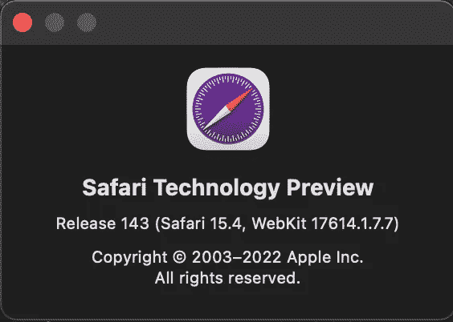
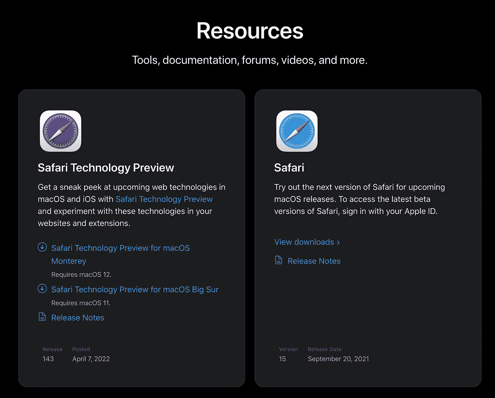
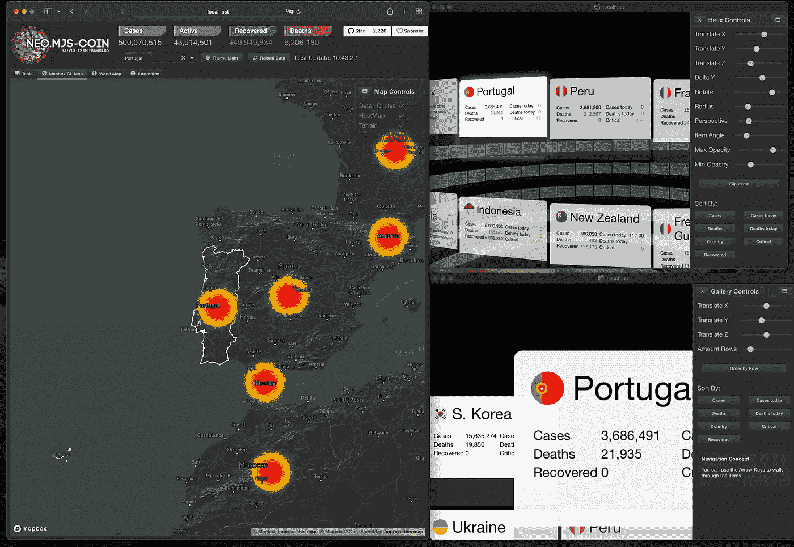
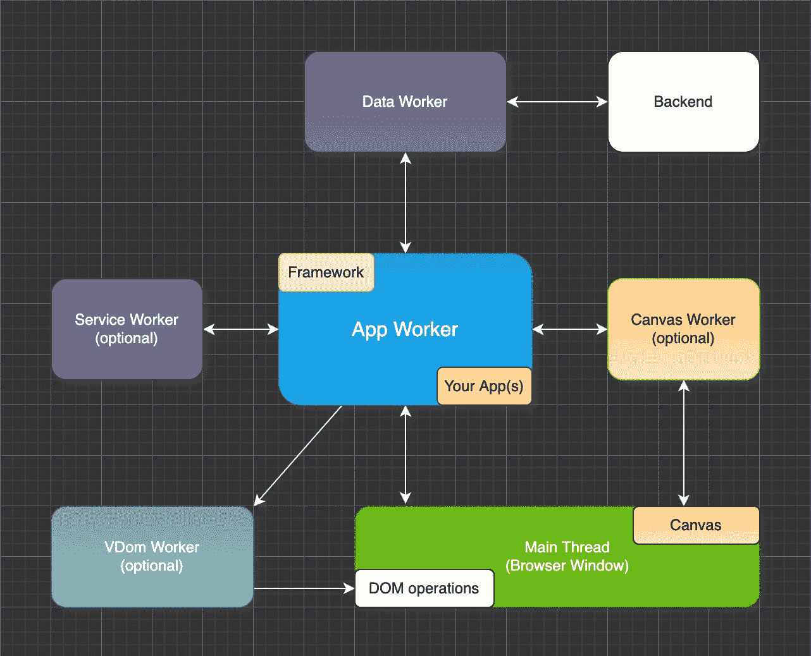

# Safari 现在完全支持共享工作者

> 原文：<https://itnext.io/safari-now-fully-supports-sharedworkers-534733b56b4c?source=collection_archive---------3----------------------->

## 使用 Webkit，多窗口应用已经成为现实

我对这个功能非常兴奋，因为我已经等了两年多了。我们现在可以轻松地创建多屏幕应用程序，并在多个浏览器标签中共享 API 相关数据。

# 内容

1.  介绍
2.  如何安装 Safari Tech 预览版？
3.  如何基于 JS 模块创建 SharedWorker？
4.  neo.mjs 多窗口 Covid 仪表板
5.  浏览器的当前状态
6.  最后的想法

# 1.介绍

对于那些还不熟悉共享工作者的人，请快速浏览一下这个链接:

[](https://developer.mozilla.org/en-US/docs/Web/API/SharedWorker) [## shared worker-Web API | MDN

### SharedWorker 接口表示一种特定的工作器，可以从几个浏览上下文中访问它…

developer.mozilla.org](https://developer.mozilla.org/en-US/docs/Web/API/SharedWorker) 

虽然 Chrome 和 Firefox 在相当长一段时间内确实支持 SharedWorkers，但对于基于 Webkit 的 scope 来说，情况就大不相同了。

该团队实际上在许多年前致力于一个实现，但是如果我没记错的话，由于安全考虑，它在版本 7 中放弃了开发。

我参与了一个相当大的社区努力，将该功能推回到“雷达上”类别:

 [## 149850 -恢复对共享工作者的支持

### 错误 149850:恢复对共享工作人员的支持

bugs.webkit.org](https://bugs.webkit.org/show_bug.cgi?id=149850) 

快进:Webkit 团队创建了一个新标签，并几乎秘密地解决了这个问题:

 [## 230382 -实现共享工作器

### 编辑描述

bugs.webkit.org](https://bugs.webkit.org/show_bug.cgi?id=230382) 

这个问题现在已经解决了，它已经进入了最新版本的 Safari 技术预览版:



# 2.如何安装 Safari Tech 预览版？

安装非常简单:

 [## 资源- Safari -苹果开发者

### 工具、文档、论坛、视频等等。观看视频并向我们的工程师学习，他们展示了如何将…

developer.apple.com](https://developer.apple.com/safari/resources/) 

# 3.如何基于 JS 模块创建 SharedWorker？

您可以像这样创建一个非基于模块的工作线程:

```
const worker = new SharedWorker('worker.js');
```

如果您确实想要一个 JS 模块作为起点，只需使用 type 选项:

```
const worker = new SharedWorker('worker.mjs', {
  type: 'module'
});
```

# 4.neo.mjs 多窗口 Covid 仪表板

这个演示应用程序仍然是最令人惊叹的 neo.mjs 演示之一:

到目前为止，它只能在 Chromium 和 Firefox 浏览器中运行。现在，它也可以在 Safari 技术预览版中运行:)



亲自尝试一下:

**开发模式** (Chromium，Safari):
[neo.mjs/apps/sharedcovid/index.html#mainview=table](https://neomjs.github.io/pages/node_modules/neo.mjs/apps/sharedcovid/index.html#mainview=table)

**dist/production**(Chromium、Firefox、Safari):
[neo . mjs/dist/production/apps/shared covid/index . html # main view = table](https://neomjs.github.io/pages/node_modules/neo.mjs/dist/production/apps/sharedcovid/index.html#mainview=table)

# 5.浏览器的当前状态

我们可以总结如下:


(用[https://imgflip.com/memegenerator/187760713/Three-dragons](https://imgflip.com/memegenerator/187760713/Three-dragons)生成)

在渲染性能方面，Safari 卷土重来。例如，neo.mjs helix 和 gallery 视图与 Chromium 处于同一级别。在这种情况下，Firefox 感觉慢了 10 倍左右，这种情况非常严重。

虽然 Firefox 也支持 SharedWorkers，但是 Mozilla 团队还没有在基于 worker 的范围内完成对 JS 模块的支持。更准确地说:动态导入还没有奏效。

对于 neo.mjs 范围，这意味着:

dev 模式(专用工人):
**Chromium，Safari**

dev 模式(共享工作者):
**Chromium，Safari**

分销/生产(专门的工人):
**Chromium、Firefox、Safari**

分销/生产(共享工人):
**Chromium、Firefox、Safari**

很高兴看到 Mozilla 很快又赶上来了！

# 6.最后的想法

此时，neo.mjs workers 设置会立即在 Safari 中运行:



在我们切换到 SharedWorkers 范围的情况下也是如此。

这使我们能够跨多个浏览器窗口直接通信，并共享相同的后端(API)数据，从而减少对 BE 的调用。

性能提升惊人。

关于 iOS 的思考:苹果仍然限制 iOS 只允许 Webkit 引擎。含义:iOS 上的 Chrome 只是一个被剥皮的 Safari。一旦软件支持也在 iOS 上结束，我们可以创建使用无头浏览器的混合应用程序，在那里，应用程序也可以直接通信。

新的 Safari 版本将 neo.mjs 推向了黄金时段。除非您想成为下一个 jQuery 开发人员，否则我只能强烈建议您深入研究一下:

[](https://github.com/neomjs/neo) [## GitHub - neomjs/neo:应用工人驱动的前端框架

### neo.mjs 使您能够使用一个以上的 CPU 创建可扩展的高性能应用程序。不需要照顾一个…

github.com](https://github.com/neomjs/neo) 

如果您在学习 neo 方面需要帮助，非常欢迎您加入 Slack 频道:

[](https://join.slack.com/t/neomjs/shared_invite/zt-6c50ueeu-3E1~M4T9xkNnb~M_prEEOA) [## 松弛的

### 编辑描述

join.slack.com](https://join.slack.com/t/neomjs/shared_invite/zt-6c50ueeu-3E1~M4T9xkNnb~M_prEEOA) 

问候&快乐编码，
托拜厄斯