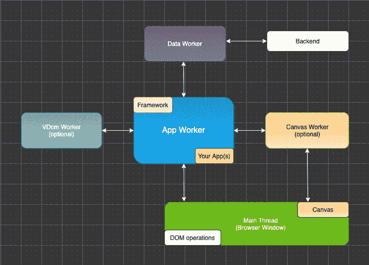
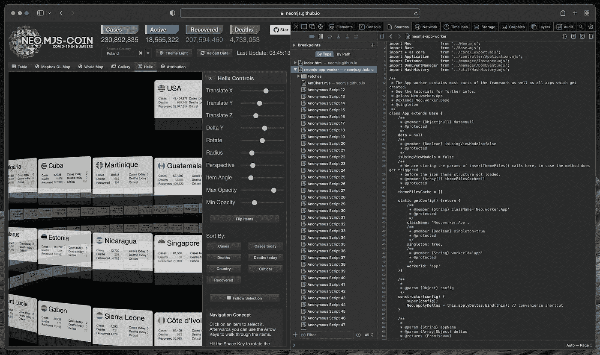

# Safari (Webkit)刚刚发布了对 worker 范围内 JS 模块的支持

> 原文：<https://itnext.io/safari-webkit-just-released-support-for-js-modules-inside-the-worker-scope-b2d29e67178?source=collection_archive---------2----------------------->

这是让 UI 开发回到它所属的地方的巨大一步:
进入浏览器。

# 内容

1.  介绍
2.  如何从 JS 模块创建一个 worker？
3.  在大型用例中验证逻辑
4.  火狐目前是什么状态？
5.  构建工具的未来
6.  Safari (Webkit)缺什么？
7.  最后的想法

# 1.介绍

相关票证:

 [## 164860-Workers 中的 JS 模块

### 编辑描述

bugs.webkit.org](https://bugs.webkit.org/show_bug.cgi?id=164860) 

自 2021 年 4 月以来，这项功能已经在 Safari 技术预览版中运行，因此这是以下内容的后续博文:

[](https://levelup.gitconnected.com/safari-webkit-about-to-release-support-for-js-modules-inside-the-worker-scope-9dd33fc20190) [## Safari (Webkit)即将在 worker 范围内发布对 JS 模块的支持

### 这是让 UI 开发回到它该在的地方的一大步:浏览器。

levelup.gitconnected.com](https://levelup.gitconnected.com/safari-webkit-about-to-release-support-for-js-modules-inside-the-worker-scope-9dd33fc20190) 

它刚刚在“普通”Safari 版本(15.0)中发布。

# 2.如何从 JS 模块创建一个 worker？

您可以像这样创建一个非基于模块的工作线程:

```
const worker = new Worker('worker.js');
```

如果您确实想要一个 JS 模块作为起点，只需使用 type 选项:

```
const worker = new Worker('worker.mjs', {
  type: 'module'
});
```

# 3.在大型用例中验证逻辑

[neo.mjs](https://github.com/neomjs/neo) 很可能是最大的项目，它依赖于在 worker 范围内使用 js 模块。毕竟，它遵循“应用程序工作者是主要参与者”的范式，您的应用程序和组件存在于其中。



到目前为止，在 Chromiun (Chrome & Edge)和 Safari 技术预览版中，只可能使用开发模式→真实代码，而没有任何构建和编译。

当然，我们以前也可以在 Safari 中使用基于 webpack 的`dist/development`和`dist/production`输出，但是如果您想为 Webkit 设计或修复特定的东西，这并不有趣。

我的测试案例是 Covid Dashboard，这是一个相当复杂的应用程序。

你可以在这里找到源代码: [apps/covid](https://github.com/neomjs/neo/tree/dev/apps/covid)



一旦使用了 import 和/或 export 语句，您的文件就可以算作一个 JS 模块。如果您想扩展一个类并导入基类，显然需要这样做。

如果您坚持“一个文件一个类”的设计模式，这是非常有意义的。

正如你在控制台里面看到的，`Neo.worker.App`是住在 app 里面的 web worker。这是真正的代码(没有源代码图)。

# 4.火狐目前是什么状态？

您可以在此处找到相关门票:

 [## 1247687 -实施工人模块

### 核心领域的新(ystartsev):工人。最后更新 2021-09-16。

bugzilla.mozilla.org](https://bugzilla.mozilla.org/show_bug.cgi?id=1247687) 

票证正在开发中，但尚未完成。

# 5.构建工具的未来

一旦 Firefox 赶上来，所有主要的现代浏览器都准备好支持 JS 模块。此时，像 [webpack](https://github.com/webpack/webpack) 这样的构建工具可以得到简化。

Harmony，这个将模块转换成“非模块”的引擎，在这一点上已经过时了。

如果您不想创建包(分割块)，您也可以在此时缩小您的文件。

# 6.Safari (Webkit)缺什么？

我们仍然需要对共享工作者的支持:

 [## 149850 -恢复对共享工作者的支持

### 错误 149850:恢复对共享工作人员的支持

bugs.webkit.org](https://bugs.webkit.org/show_bug.cgi?id=149850) 

Chromium 和 Firefox 都支持它们。

这一点尤其重要，因为 iOS 上的所有浏览器都必须使用它。

我也希望看到多窗口 covid 应用程序在这里运行:

共享工作者对移动设备也很重要，因为许多应用程序使用包含多个 web 视图的本机外壳(无头浏览器)。

我们可以在他们之间直接交流。

# 7.最后的想法

您可以在此处找到近地天体资料库:

[](https://github.com/neomjs/neo) [## GitHub - neomjs/neo:应用工人驱动的前端框架

### neo.mjs 使您能够使用一个以上的 CPU 创建可扩展的高性能应用程序。不需要照顾一个…

github.com](https://github.com/neomjs/neo) 

我将添加一些开发模式示例的链接，您现在可以在 Safari 中直接运行这些示例。

covid Dashboard:
apps/covid/index . html

covid Gallery:
[examples/component/corona Gallery/index . html](https://neomjs.github.io/pages/node_modules/neo.mjs/examples/component/coronaGallery/index.html)

helix:
[examples/component/helix/index . html](https://neomjs.github.io/pages/node_modules/neo.mjs/examples/component/helix/index.html)

最诚挚的问候&快乐编码，
托比亚斯