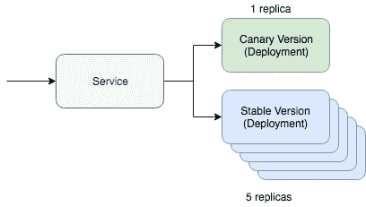

# 带 Helm 的安全且自动化友好的金丝雀部署

> 原文：<https://itnext.io/safe-and-automation-friendly-canary-deployments-with-helm-669394d2c48a?source=collection_archive---------5----------------------->


这是一系列实用、安全和可重复的 Kubernetes 部署方法的一部分。这些帖子是建筑[*delivery bot*](http://deliverybot.github.io)*的一部分，是从 GitHub 部署到 Kubernetes 的缺失环节。*

Canary 部署是在用户群子集上测试新代码的一种非常有效的方式。它们显著降低了部署的爆炸半径，这种部署可能很难通过仅将其暴露给一部分流量来实施。这篇文章将深入探讨如何在 Kubernetes 中实现这一点，而且是以一种部署自动化友好的方式。这篇文章假设你对舵图和 Kubernetes 资源有所了解。



金丝雀部署

Kubernetes 的一个简单的 canary 部署涉及两个关键资源:服务和部署资源。canary 部署的工作方式是让一个服务资源和两个不同的部署资源为该流量服务。其中一个部署资源将是 canary 版本，而另一个将是稳定版本。我们可以将金丝雀版本的副本数量保持得更低，以便只为更小比例的流量提供服务。如果你喜欢用 Yaml 思考，它大致看起来像下面的 Kubernetes 资源:

```
kind: Deployment
metadata:
  name: app-canary
  labels:
    app: app
spec:
  replicas: 1
  ...
    image: myapp:canary
---
kind: Deployment
metadata:
  name: app
  labels:
    app: app
spec:
  replicas: 5
  ...
    image: myapp:stable
---
kind: Service
selector:
  app: app # Selector will route traffic to both deployments.
```

这很容易想象，只要使用 kubectl，甚至在 Kubernetes 文档[中有一个很好的指南。这篇文章的问题是，我们将如何自动化这一点，另外如何用 Helm 做到这一点。](https://kubernetes.io/docs/concepts/cluster-administration/manage-deployment/#canary-deployments)

## **自动化金丝雀**

首先，我们需要一个基本的掌舵图，包含我们上面讨论的资源。舵轮图应该是这样的:

```
~/charts/app
├── Chart.yaml
├── README.md
├── templates
│   ├── NOTES.txt
│   ├── _helpers.tpl
│   ├── deployment.yaml
│   └── service.yaml
└── values.yaml
```

Helm 的核心概念是管理多个版本。稳定版本是我们代码稳定版本的主要发布途径。然后，我们可以用我们的金丝雀代码部署金丝雀头盔释放。连接这些的部分是稳定版本必须将流量路由到金丝雀版本。我们将通过使用服务上的特定选择器来管理这一点:

```
selector:
  app.kubernetes.io/name: myapp
```

我们的部署资源(canary 和 stable)将在 pod 上指定此标签。只要我们在部署掌舵图的金丝雀版本时正确设置了这一点，我们就会看到流量将被路由到已部署的 pod。

让我们发布图表的稳定版本。这将类似于以下命令:

```
helm upgrade
  --install myapp \
  --namespace default \
  --set app.name=myapp \      # Goes into app.kubernetes.io/name
  --set app.version=v1 \      # Goes into app.kubernetes.io/version
  --set image.tag=stable \
  --set replicaCount=5
```

现在让我们测试一下我们的新金丝雀。要推出金丝雀部署，我们只需要区分两件事。版本名称需要不同，这样我们就不会实际上只是升级我们当前的稳定版本。版本和图像标签也需要不同，以便我们部署不同的代码，并且我们可以在部署资源标签中识别这种代码差异。

```
helm upgrade
  --install **myapp-canary** \
  --namespace default \
  --set app.name=myapp \      # Goes into app.kubernetes.io/name
  --set **app.version=v2** \      # Goes into app.kubernetes.io/version
  --set **image.tag=canary** \
  --set replicaCount=1
```

就是这样！如果您 ping 服务，您应该能够看到 canary 应用程序只是在部分时间路由流量。

如果你正在寻找将这种逻辑打包的部署自动化，看看 [Deliverybot](https://deliverybot.github.io) ，特别是 [Helm GitHub automation](https://github.com/deliverybot/helm) 。用于测试和实施这些想法的图表位于 github.com/deliverybot/helm/charts 的[。这是关于如何进行自动化金丝雀部署的理论概述，但这些工具通过示例和具体概念将它付诸实践。](https://github.com/deliverybot/helm/tree/master/charts/app)

其他职位:

*   Kustomize:使用新的 Kubernetes 模板系统部署应用程序。
*   [使用 Helm](https://medium.com/@colinjfw/best-practices-for-deploying-to-kubernetes-using-helm-73be1f3040d2) 部署到 Kubernetes 的最佳实践。