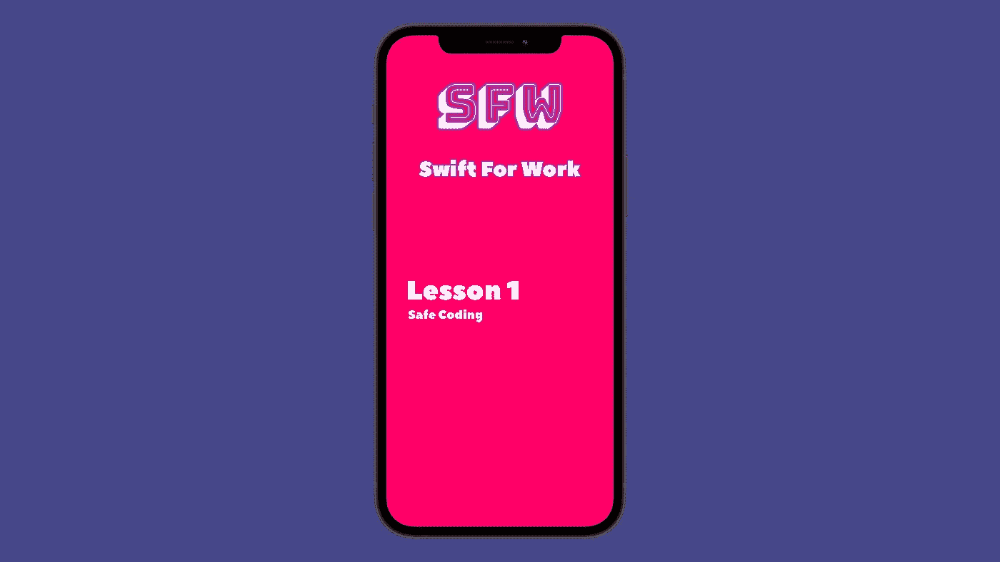

# Swift 中的安全编码

> 原文：<https://itnext.io/safe-coding-in-swift-a66e1f818a93?source=collection_archive---------0----------------------->

## 确保你的应用不再崩溃(或者至少不像以前那样崩溃)



想象一下这个场景；你刚刚更新了你的应用程序，然后出去发泄一下。当你们都很放松的时候，你的电话开始一遍又一遍的响。你上一个版本崩溃的次数比 Windows Vista 还多！😜

我不想成为那样的人，但这可能是你的错，所以你活该😬

根据我的经验，9/10 的情况下会有意外的崩溃，这是因为我太确定一个变量总会有一个值…直到它没有。所以，为了不在每次外出和电话铃响时都得轻微的心脏病，让我们来看看你在编码时可以遵循的一些原则，以尽量减少崩溃。

# 始终提供默认值

Swift 为开发人员提供了一种非常方便的方法，在使用变量时提供一个值，以防它是`nil`。让我们看看下面的例子:

```
**Server**.request("getNumberOfLikes") { (response, error) **in
    self**.numberOfLikes = response **as!** Int
    **self**.updateUI()
}
```

你发现问题了吗？虽然这被认为是一个新手的错误，但它也可能发生在更有经验的开发人员身上。如果你没注意到，它是`forced unwrap`:

```
response **as!** Int
```

不管你有多确定响应会一直存在，总会有**和**出错**和你的应用**崩溃**的时候！**

最有可能的是，这可能是因为你或其他人将来会做出的改变。一个属性或一个响应现在可能是强制性的，但是将来您的业务逻辑可能会改变，使该属性或响应成为可选的。因此，当这种变化生效时，你的应用程序很有可能会大规模崩溃！

以下是避免这种灾难的方法:

```
**Server**.request("getNumberOfLikes") { (response, error) **in
    self**.numberOfLikes = response **as?** Int ?? 0
    **self**.updateUI()
}
```

让我们快速看一下发生了什么变化:

那个`??`被称为**零合并运算符**，它与`optional`值密切相关。nil 合并操作符可以在内联中执行，而不是检查变量是否为 nil，如果是，就给它赋值。它实际上检查左边的表达式是否产生一个零，如果是，它把你在右边提供的值赋给变量。否则，它会安全地解开变量。

# `if-let` & `guard-let`报表

尽管 nil 合并操作符很方便，但有时您需要在代码中添加更多的逻辑。例如，如果您知道某个值有时可以为零，有时不为零，那么您应该使用`if-let`语句。

例如:

```
**Server**.request("getNumberOfLikes") { (response, error) **in
    if** response != nil{ **self**.numberOfLikes = response **as!** Int
    } **self**.updateUI()
}
```

虽然上面的情况看起来比强制解包变量更安全，但它仍然可能导致崩溃。如果响应确实不是`nil`，但出于某种原因它不再是`Int`，会发生什么？

让我们改用`if-let`语句，看看会发生什么:

```
**Server**.request("getNumberOfLikes") { (response, error) **in
    if let** numberOfLikes = response **as?** Int{ **self**.numberOfLikes = numberOfLikes
    } **self**.updateUI()
}
```

现在看起来不是好多了吗？这样你就能以最安全的方式具体检查你想要的东西！当然，您总是可以在同一个`if-let`语句中添加更多的检查，就像这样:

```
**Server**.request("getNumberOfLikes") { (response, error) **in
    if let** numberOfLikes = response **as?** Int,
       **let** variable2 = something **as?** Type,
       **let** variable3 = somethingElse **as?** Type{ ...
    } **self**.updateUI()
}
```

> 只有当所有子语句都不是`nil`时，`if-let`语句才会被认为有效。显然，如果需要，您可以添加`else-if-let`和`else`语句。

在上面的标题中，我提到了另一种类型的语句，即`guard-let`语句。那个，不用声明要用的变量，但是是加分项。您会发现，在您想要完全停止代码块流动的情况下，它会更有用。

```
**Server**.request("getNumberOfLikes") { (response, error) **in
    guard let** numberOfLikes = response **as?** Int **else** { **return** }
    **self**.updateUI()
}
```

在这个例子中，只有当`guard-let`语句不调用`return`时，才会调用`updateUI`函数。如果你只想检查一个变量是否包含一个值，而不是把它存储在某个地方，如果不包含，就返回，那么你可以这样做:

```
**Server**.request("getNumberOfLikes") { (response, error) **in
    guard** response **as?** Int **else** { **return** }
    **self**.updateUI()
}
```

# 这个故事的要点

如果你从今天所读的内容中应该记住一些东西，那就是你永远不应该，让我重复一遍以示强调，**你永远不应该**，不检查任何可选值！

快速总结每个控制语句何时更有用:

*   nil 合并操作符使你能够在变量为零的情况下为变量提供一个默认值。您应该在总是需要一个值的情况下使用它。
*   `if-let`语句帮助您安全地打开可能有值或没有值的选项。
*   `guard-let`语句最适合于当一个变量或一组变量为零，或者与您提供的检查不匹配时，您需要对代码块进行转义的情况。

我希望你看完我的毫无疑问完美的教程后，不是吹牛😜，你将会对如何使你的应用程序不容易崩溃和出错有所了解。

感谢您的阅读！
下一集再见(希望如此😁)