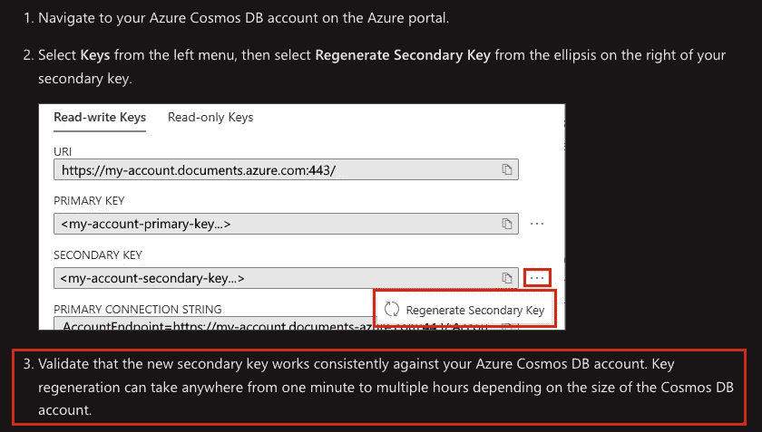

# 安全地轮换 Azure CosmosDB 帐户密钥:一个不应该太难的过程

> 原文：<https://itnext.io/safely-rotating-azure-cosmosdb-account-keys-a-process-that-shouldnt-be-as-hard-as-it-is-50f38f165498?source=collection_archive---------5----------------------->

我，质疑自己的存在。尼克·舒利亚欣在 [Unsplash](https://unsplash.com?utm_source=medium&utm_medium=referral) 上的照片

# 问题是

在我当前的项目中，我们遇到了一个难题:我们需要轮换我们的 CosmosDB 帐户密钥，但是我们不知道新的主键或辅键何时“准备好”使用。”*准备使用？为什么新提供的钥匙没有准备好？*“你可能会问。亲爱的读者，事实证明这就是 CosmosDB 的工作方式。

用红色标出的是我很长时间以来读过的最令人困惑的句子。

原来你可以得到一个新的密钥，**,但它可能无法在你的 CosmosDB 账户**上持续**几个小时。我已经突出显示了这些词，因为你可以获得一个新的密钥，它可能在第一次或第二十次请求时工作，然后在接下来的十几次请求中失败。作为服务的消费者，除了多次尝试并确保其有效之外，您无法看到密钥何时会被一致接受。这意味着自动化是充满危险的。**

# 为什么新钥匙不能立即工作？

这是一个大问题。我认为这有两个潜在的原因，其中任何一个都是 CosmosDB 设计方式的症状。当您请求一个新的访问密钥(主密钥或次密钥)时，CosmosDB 需要 5-10 分钟来生成这个新密钥。生成密钥后，还需要 5-180 分钟才能安全使用密钥。

出现这种情况的一个可能原因是，新密钥需要在存放存储数据的物理分区的所有主机上复制。这个过程可能需要一点时间，每个主机都必须更新自己的密钥库并撤销过时的密钥。第二个可能的原因是 CosmosDB 访问密钥也可能是用于执行静态加密的相同密钥。这意味着所有数据在生成时都必须用新密钥重新加密，如果数据库很大，这可能需要很长时间。

不管什么原因，我都希望一个新的密钥可以立即使用，并且 CosmosDB 不会提供新的密钥，直到它在后端得到完全验证。事实并非如此。CosmosDB 一生成您的密钥，您就可以得到它，而测试它是否工作的责任就落在了您的身上。作为客户和平台架构师，我不同意这种设计，但这不在我的控制范围内。我们所能做的就是围绕这一点实现自动化，并尽可能多地安装护栏！

# 准备 Azure DevOps 代理

我们决定放弃构建 Docker 容器，因为我们只需要一个定制工具来测试与我们基于 Mongo 的 CosmosDB 帐户的连接性:mongosh。

一旦在我们的代理上安装了正确版本的 Mongo Shell，我们就可以继续执行旋转密钥的脚本了。

# 剧本

我将把脚本及其相关函数分成几个独立的部分，然后在最后一起展示，这样更容易理解发生了什么以及为什么。

首先，我们有一个处理 CosmosDB 帐户密钥轮换的函数，并在密钥轮换完成后返回新的连接字符串。这相当简单:

## 旋转按键

这也包含了一点健全检查，以确保我们从 CosmosDB 获得的密钥实际上是一个新密钥；如果没有，在一个循环上查询帐户，直到你得到一个新的密钥。我从未见过这个循环的执行，但是考虑这样的边缘情况也无妨。

## 测试连通性

接下来，我们使用新生成的密钥测试到 CosmosDB 帐户的连接性。这是整个过程的基础，在将新的密钥上传到密钥库之前，我们要确保新生成的密钥对 CosmosDB 始终有效:

测试连通性的逻辑如下:

*   使用新的帐户密钥测试连通性🔑
*   如果连接被标记为成功，将**计数器**增加 1 ➕
*   如果连接被标记为不成功，
    -将**计数器**重置为 0，而不管其当前值❌
    -将两次尝试之间的**等待时间**乘以 2，直到达到 **maxWait 的极限。**这是我们的指数后退。
*   如果我们超过了循环的最大时间(2 小时)，退出❌
*   如果连续五次连接成功，退出✅环路

正如您所看到的，对于我们来说，考虑到使用密钥是“安全的”,我们需要五个连续的连接才能成功。你可能会想知道你多久会有一次成功的五次连接。从我的经验来看，答案是永远不会。即使在一个非常小的 CosmosDB 帐户上，我们也看到连接逻辑至少需要 5 分钟才能成功，最初的几次尝试失败了，然后零星的失败贯穿始终。以下是输出示例:

在第 34 行，你可以看到我已经跳过了显示，即使在四次成功的连接尝试之后(如此接近！)我们失败了，现在必须将我们的计数器重置回 0。

## 将新密钥上传到密钥库

完成后，我们将 CosmosDB 密钥上传到 Key Vault，这是一个简单的函数:

## 把所有的放在一起

总结一下，我们从一个主函数调用所有这些函数:

我们将密钥类型传递给我们的函数——主要的或次要的——以及 CosmosDB 帐户名。需要注意的一点是，我们的 CosmosDB 帐户名与创建它们的资源组名相匹配。如果您有一个与您的资源组名称不同的资源组，您可以调整脚本以接受另一个变量。