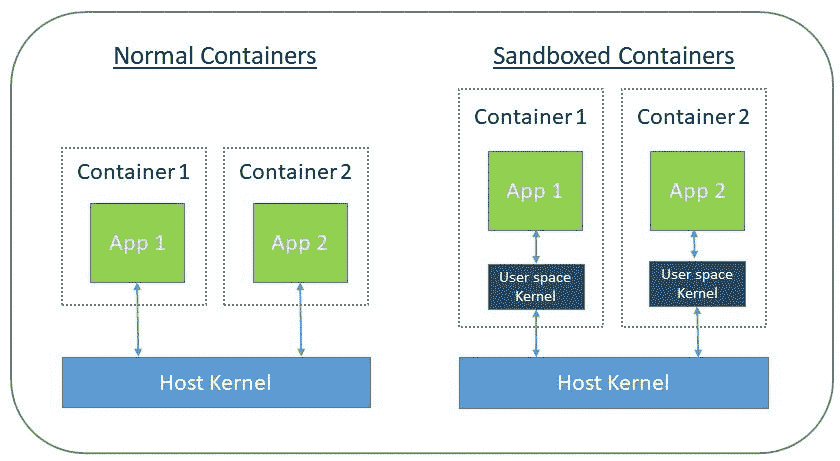
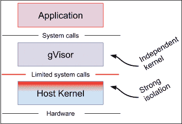
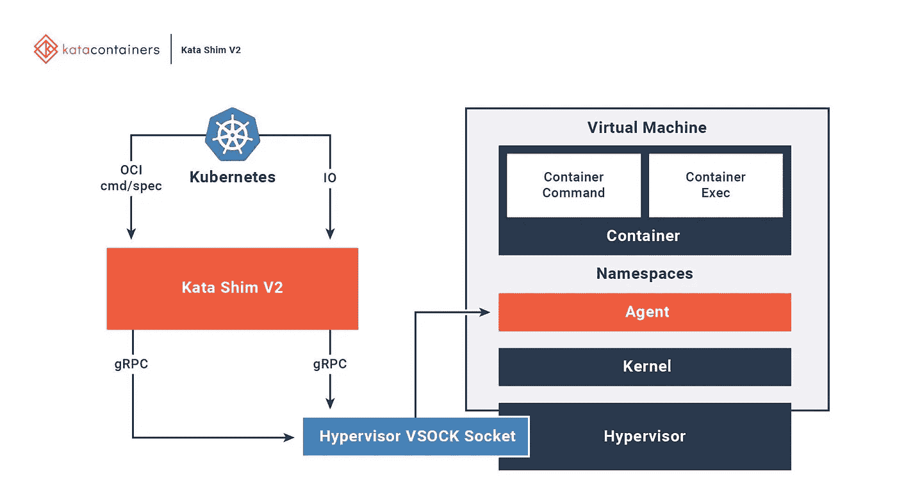

# 沙盒容器:虚拟机在新的虚拟角色中卷土重来了吗？

> 原文：<https://itnext.io/sandboxed-containers-are-virtual-machines-making-a-comeback-in-a-new-avatar-cf83e1c4a5fb?source=collection_archive---------3----------------------->

马加瓦(鸣谢:images.twinkl.co.uk)

一只能够探测未爆炸地雷的冈比亚囊鼠 Magawa 发现了许多地雷和柬埔寨内战遗留的其他军械。2020 年 9 月，这只老鼠被授予 PDSA 金质奖章，这是一项动物勇敢奖，旨在表彰动物的勇敢和对职责的奉献。(来源:维基百科)

# 介绍

人工智能、大数据和区块链等数字技术正在推动对可以在微秒内大规模扩展的应用的需求。企业内部的开发人员面临着在几天内大量生产新功能的压力。混合云是新常态，数字化转型是保持竞争力的必要条件。容器已经成为应对这些挑战的重要技术。容器在开发人员和操作人员中的巨大成功已经见证了这种技术在各种行业中的快速广泛应用。

# 集装箱太棒了

容器技术几乎已经取代虚拟化成为消耗本地和云计算资源的主要手段。虚拟机本质上是一种硬件虚拟化技术，即在裸机主机上运行的一款名为 VMM 的软件控制硬件资源(CPU、内存、硬盘等)。)并将它们呈现为多个离散的虚拟资源。这允许在主机上运行多个离散的虚拟机，每个虚拟机都有自己的操作系统。

另一方面，容器不虚拟化硬件，而是使用主机操作系统内核的高级功能(cgroups 和 namespaces)在主机上创建一个隔离的计算环境。应用程序在这个隔离的计算环境中运行。对于应用程序来说，容器就像一个虚拟机，而对于主机来说，容器只是另一个进程。简而言之，您可以将一个运行操作系统的裸机服务器(或虚拟服务器)变成一个由独立容器组成的盘子。然而，所有这些容器都共享主机的 OS 内核。

# 虚拟机提供了强大的隔离

信用:unit42.paloaltonetworks.com

虽然容器很棒，但是人们应该认识到这样一个事实，在一个服务器上运行的多个容器，**共享同一个操作系统内核**。而且，与任何软件一样，容器化的应用程序也可能存在安全漏洞。这些漏洞的来源可能存在于应用程序源代码或应用程序使用的某个库中。在这种情况下，如果恶意用户利用这些漏洞并能够侵入容器，入侵者很有可能能够推进攻击并渗透到主机内核中。如果发生这种情况，结果可能是灾难性的，因为这也暴露了主机上的其余容器。

如果同一个应用程序在一个虚拟机中运行，那么入侵者最多只能渗透到该虚拟机的客户内核中，而无法访问服务器的内核。这样，安全攻击仅限于受影响的虚拟机，服务器上的其他虚拟机不受影响。简而言之，与容器相比，VM 提供了更高程度的隔离，因为它有自己的内核。

# 沙盒容器:轻量级虚拟机

因为容器共享来自主机的更多资源，所以它们对存储、内存和 CPU 周期的使用比 VM 高效得多。然而，更多共享的缺点是容器和主机之间的信任边界较弱。一般来说，虚拟化硬件隔离比容器中使用的名称空间隔离创建了更强的安全边界。攻击者逃离容器(进程)的风险远远高于逃离虚拟机的机会。一些应用和用例确实需要高度的隔离，同时需要容器的优势，即两全其美。例如，为多个租户提供服务的系统需要很强的隔离，这样应用程序数据就不会泄露。

一个显而易见的问题是:有没有一种方法可以让我运行一个容器化的应用程序，同时从虚拟机提供的高度隔离中获益？答案是响亮的“是”。欢迎来到名为**沙盒容器**的新型容器。

简而言之，这些容器有自己的内核，很像虚拟机。内核的这一层被称为**用户空间内核**。然而，这个内核在本质上是非常轻量级的，使用现代编程技术编写，并且只是为了充当容器和主机之间的一个额外的强隔离层而专门构建的。

因此，它可以动态配置，可以快速创建和销毁。如果符合开放容器倡议(OCI)和容器运行时接口(CRI)规范，这种沙盒容器也可以与 Docker 和 Kubernetes 等容器工具配合使用。

在接下来的章节中，我们将深入研究两种广泛使用的沙盒容器技术:Google gVisor 和 Kata 容器

# 谷歌眼镜

gVisor 是一个用 Go 编写的应用程序内核，它实现了 Linux 系统调用接口的很大一部分。它在运行的应用程序和主机操作系统之间提供了一个额外的隔离层。

信用:gvisor.io

它包括一个名为`runsc`的 OCI 运行时，使得使用现有的容器工具变得容易。`runsc`运行时与 Docker 和 Kubernetes 集成，使得运行沙盒容器变得简单。gVisor 可以配合 Docker、Kubernetes 使用，也可以直接使用`runsc`

当您使用 gVisor 启动一个容器时，runsc 容器运行时会首先启动一个用户空间内核的实例。用户空间内核充当另一层防御，它拦截来自容器的系统调用，或者自己处理这些调用，或者将它们传递给主机。实际的应用程序是在这个用户空间内核之上启动的。为了让事情更有吸引力，gVisor 是一个开源项目，所以当您看到需要时，可以添加新的功能和增强。它也符合 CRI 规范，所以 gVisor 容器可以在 Kubernetes 中运行。

# Kata 容器

Kata 容器与容器一样轻便快捷，并与容器管理层集成，包括 Docker 和 Kubernetes (K8s)等流行的编排工具，同时还提供了虚拟机的安全优势。

Credit: katacontainers.io

Kata 容器与 OCI、容器运行时接口(CRI)和容器网络接口(CNI)完全集成。它支持各种类型的网络模型(例如，直通、MacVTap、桥接、tc 镜像)和可配置的客户内核，因此需要特殊网络模型或内核版本的应用程序都可以在其上运行。上图显示了 Kata 虚拟机中的容器如何与现有的编排平台进行交互。

Kata 在主机上有一个 *kata 运行时*来启动和配置新的容器。对于 Kata VM 中的每个容器，主机上都有一个对应的 Kata Shim。Kata Shim 从客户端(例如 docker 或 kubectl)接收 API 请求，并通过 VSock 将请求转发给 Kata VM 内部的代理。Kata 容器进一步做了一些优化来减少 VM 启动时间。

# 结论

与普通容器相比，沙盒容器提供了更强的隔离。这种高度隔离提供了额外的安全层，在一些使用案例和行业中非常有用。这种容器技术符合 OCI 和 CRI 规范，因此它们可以很好地与现有的容器工具和 Kubernetes 兼容。看到虚拟机如何在新的虚拟角色中卷土重来，真是太神奇了！

感谢阅读。如果你喜欢这篇文章，请在 Twitter( [@senthilch](https://twitter.com/senthilrch) )和 Medium([Senthil Raja Chermapandian](https://medium.com/u/35b3e4a1e602?source=post_page-----cf83e1c4a5fb--------------------------------))上关注我

*查看***，这是一个 Kubernetes 操作器，用于直接在集群工作节点上创建和管理容器图像的缓存，因此应用程序 pods 几乎可以立即启动**