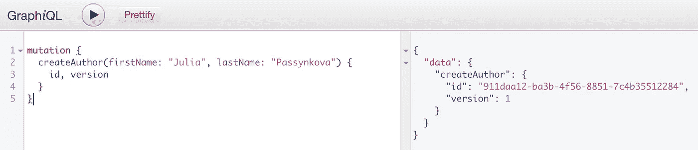
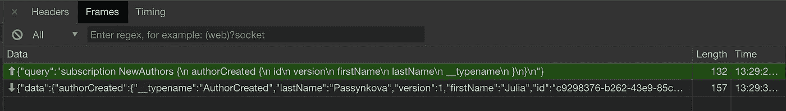
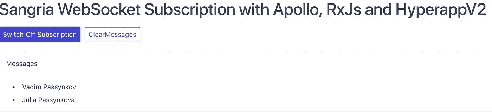

# 向 Apollo、RxJs 和 Hyperapp V2 订购 Sangria WebSocket

> 原文：<https://itnext.io/sangria-websocket-subscription-with-apollo-rxjs-and-hyperapp-v2-40d6dfdb5342?source=collection_archive---------1----------------------->

你知道为了运行 Apollo 订阅，GraphQL 服务器应该通过 [WebSocket 协议](https://github.com/apollographql/subscriptions-transport-ws/blob/master/PROTOCOL.md)实现 GraphQL 吗？

之前，我曾与实现该协议的 GraphQL 服务器合作，例如:节点服务器使用[订阅-传输-ws](https://github.com/apollographql/subscriptions-transport-ws) ，药剂服务器使用[苦艾酒-插座](https://github.com/absinthe-graphql/absinthe-socket)，我将它们与 VanillaJS、React 和 Angular 前端集成在一起。没问题！

最近，我收到了一个从 Scala GraphQL 实现— [sangria](https://github.com/sangria-graphql/sangria) 消费订阅的要求。原来在 sangria 中可以实现 WebSocket 订阅(见[sangria-subscriptions-example](https://github.com/sangria-graphql/sangria-subscriptions-example)分支[https://github . com/sangria-graph QL/sangria-subscriptions-example/tree/TRB ngr-web sockets](https://github.com/sangria-graphql/sangria-subscriptions-example/tree/trbngr-websockets))**但是没有实现 GraphQL WebSocket 协议**Apollo 订阅就不行了。

因为我别无选择，只能集成，所以我必须实现一个简单的 WebSocket Apollo 订阅链接。完整的客户端代码可以在 Github[sangria-Apollo-web socket-example](https://github.com/ipassynk/sangria-apollo-websocket-example)找到，服务器代码可以在[https://Github . com/sangria-graph QL/sangria-subscriptions-example/tree/trbngr-web sockets](https://github.com/sangria-graphql/sangria-subscriptions-example/tree/trbngr-websockets)找到

## 基本 Apollo WebSocket 链接

下面是带有 http 和订阅链接的基本 Apollo 客户机设置。WebSocketBasicLink 函数将创建一个基本的 web 套接字链接。由于这是标准的阿波罗代码，所以我不会详细介绍这个设置。

```
**function** createSangriaLink() {
  **return new** WebSocketBasicLink({ uri: "ws://localhost:8080/graphql" });
}

**const** wsLink = createSangriaLink();
**const** link = split(
  ({ query }) => {
    **const** { kind, operation } = getMainDefinition(query);
    **return** kind === "OperationDefinition" && operation === "subscription";
  },
  wsLink,
  createHttpLink({ uri: "http://localhost:8080/graphql" })
);

**const** client = **new** ApolloClient({
  link: link,
  cache: **new** InMemoryCache()
});
```

让我们实现 WebSocketBasicLink。作为任何 Apollo 链接，它应该扩展 ApolloLink 类。为了使用 WebSocket，我使用了 RxJs webSocket subject。你可以在[用 RxJS 处理 WebSocket 错误](https://medium.com/p/17125c6f2159?source=post_stats_page---------------------------)阅读我关于 RxJS 和 WebSocket 实现的博客

这是:

```
**class** WebSocketBasicLink **extends** ApolloLink {
  constructor({ uri }) {
    **super**();

    **this**.requester = operation => {
      **return new** LinkObservable(observer => {
        **const** query = print(operation.query);
        **const** subject = webSocket(uri);
        subject.next({ query });

        **const** sub = subject.subscribe(
          data => observer.next(data),
          error => observer.error(error),
          () => observer.complete()
        );

        **return** () => {
          **if** (!sub.closed) {
            sub.unsubscribe();
          }
        };
      });
    };
  }

  request(op) {
    **return this**.requester(op);
  }
}
```

## 让我们测试一下

现在我们准备运行解决方案。我们将使用:

1.  GraphiQL 可用于向 Sangria 服务器发送新数据:



2.上面创建的 Apollo 客户端通过 WebSocket 订阅接收事件。

```
**const** query = `
  subscription NewAuthors {
    authorCreated {
      id
      version
      firstName
      lastName
    }
  }
`;client.subscribe({
    query: gql`
      ${query}
    `,
    fetchPolicy: "no-cache"
  })
).subscribe(msg => {
  console.log(msg);
});
```

3.Chrome Inspect -> Network ->WS 监控 webSocket 流量。您可以观察客户端和服务器相互传递的消息。



## 超 app

这个解决方案很有效，作为奖励，我决定添加一个简单的 UI 来显示消息和控制订阅。我每天都用 React 和 Angular，所以我想试试别的。经过快速的研究，我发现了一个有趣的框架来为我的简单 UI 进行实验。目前，他们正在积极开发具有效果、动作和订阅 API 的框架的 V2(【https://github.com/jorgebucaran/hyperapp/pull/726】)。订阅这是我的任务所需要的。另外 [hyperapp](https://github.com/jorgebucaran/hyperapp) 看起来和 Elm 相似，并且允许使用 JSX 进行查看。

15 分钟后，我的用户界面准备就绪。



这是一个 HyperApp 订阅，可以将收到的消息添加到一个集合中进行显示。如果你有使用 NGRX 或 redux-observable 的经验，这些术语对你来说应该很熟悉。

```
**const** effect = **function**(props, dispatch) {
  **const** sub = from(
    client.subscribe({
      query: gql`
        ${query}
      `,
      fetchPolicy: "no-cache"
    })
  ).subscribe(msg => {
    **const** {
      data: {
        authorCreated: { firstName, lastName }
      }
    } = msg;
    dispatch(props.action, { firstName, lastName });
  });

  **return** () => sub.unsubscribe();
};

**const** AddMessage = (state, message) =>
  Object.assign({}, state, { messages: [...state.messages, message] });

**export const** apolloSubscription = props => ({
  effect: effect,
  action: AddMessage
});
```