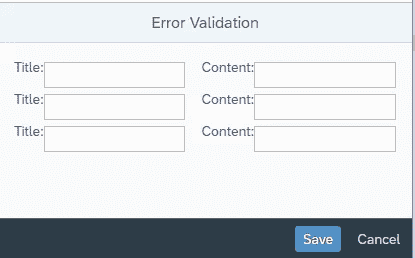
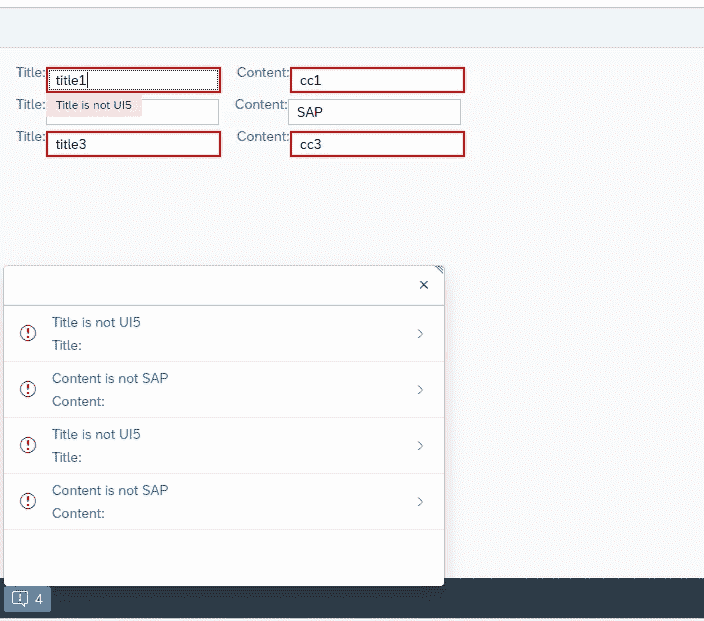
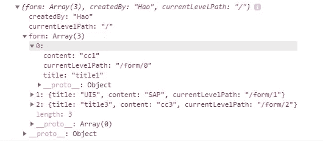
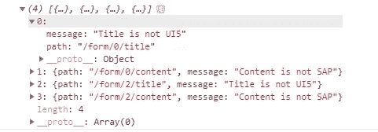

# 在 SAPUI5 中显示来自服务器端验证的内嵌表单验证消息

> 原文：<https://itnext.io/sapui5-display-form-validation-from-server-side-validation-8323ceec9ade?source=collection_archive---------4----------------------->

UI5 有很好的客户端内联验证。但是当涉及到服务器端验证时，尤其是在构建视图代码 xml 文件时，就不那么好了。

我将讨论如何在服务器端进行表单验证，并在表单域中显示验证消息。

假设有一个类似下图的用户界面:



演示用户界面

UI 由输入 的 ***标题和输入*** 的 ***内容组成列表。这个 UI 是由一个模型动态呈现的。ui 是在 XML 视图中定义的，这意味着您不能为每个输入字段定义 ID。当用户点击保存，前端发送数据到后端。后端基于业务逻辑进行某些验证，然后将错误信息发送回前端。前端在相应的输入字段内显示错误。出于演示目的，表单验证的逻辑非常简单，如果 ***标题输入*** 的值不是“UI5”或者 ***内容输入*** 的值不是“SAP”就会显示错误。***



演示 UI 显示错误

问题是前端如何知道哪个错误属于哪个输入字段？一切以模型为基础。因此，每个错误都通过“路径”与输入字段相关联。把路径想象成模型的面包屑。例如，我们有一个如下所示的模型:

```
{
 form: [{
   title: "title1",
   content: "cc1"
 }, {
   title: "UI5",
   content: "SAP"
 }, {
   title: "title3",
   content: "cc3"
 }],
 createdBy: "Hao"
}
```

而你想告诉前端值等于“cc1”的 ***内容属性*** 是错误的。该属性的路径将是**“表单/0/内容”。**如果将此路径作为目标属性传递给 MessageManager，

```
sap.ui.getCore().getMessageManager().addMessages(
 new sap.ui.core.message.Message({
 type: sap.ui.core.MessageType.Error,
 message: **path**,
 processor: this.getView().getModel(‘forms’)
 })
);
```

行内错误将显示在值为“cc1”的输入字段上。

在后端开始验证表单之前，我在模型的每一层添加了“***currentLevelPah***”。这可以由前端或后端来完成。看看"**currentlevelpath**"是什么样子:



在开始验证表单之前，添加了 **currentLevelPath**

后端进行表单验证，并将错误信息发送给前端。看看错误信息是什么样子的:



来自后端的错误信息，请注意“路径”属性

你可以从 https://github.com/haojia321/server-side-validation-in-ui5 找到这个演示的代码

如果您有任何问题或建议，请告诉我。