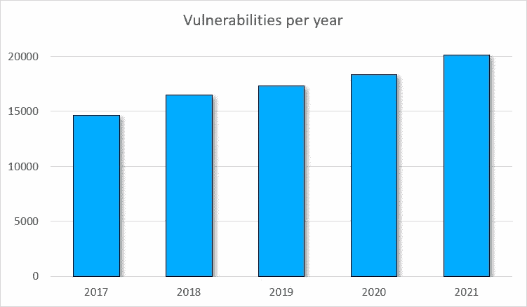
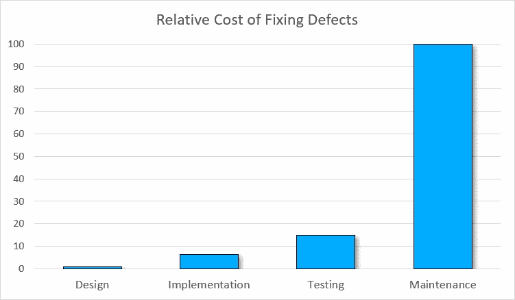
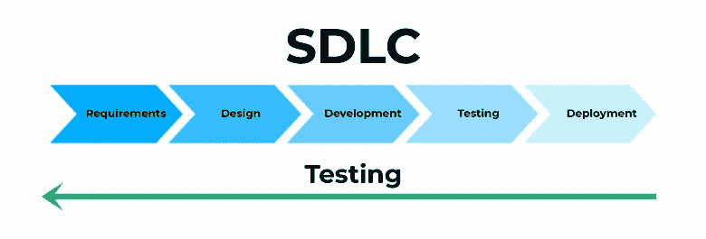
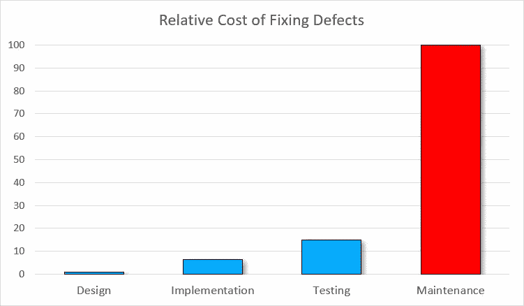
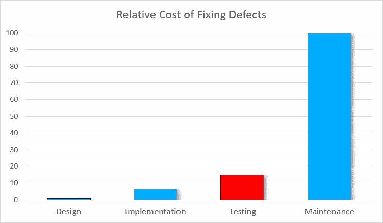
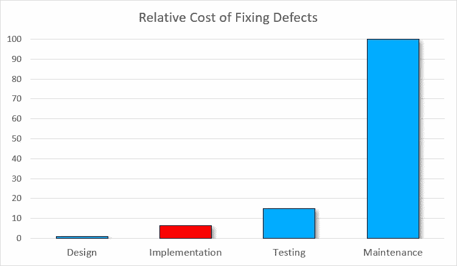
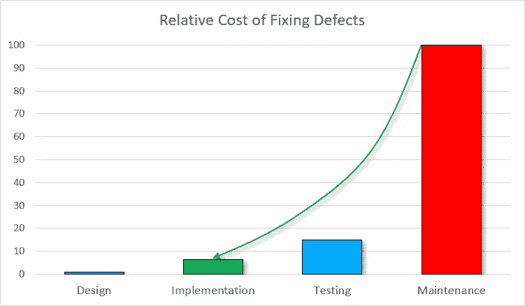
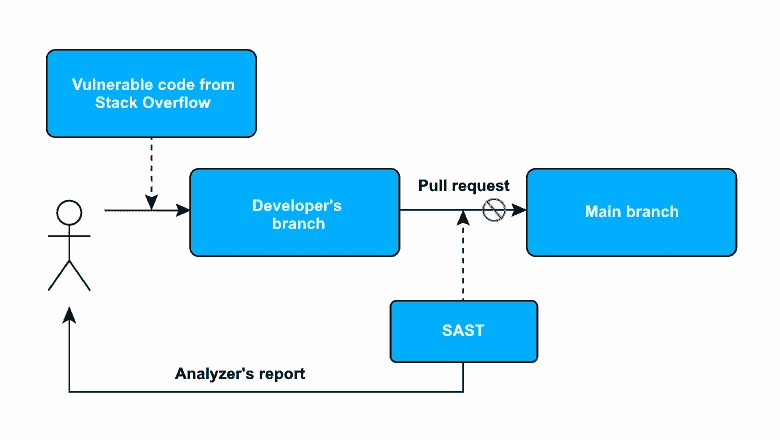
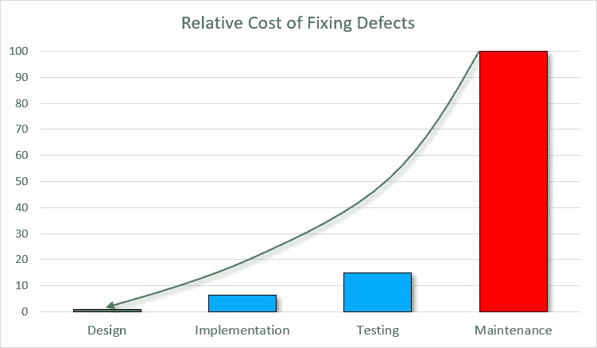

# 安全 SDLC 中的 SAST:将它集成到 DevSecOps 管道中的 3 个理由

> 原文：<https://itnext.io/sast-in-secure-sdlc-3-reasons-to-integrate-it-in-a-devsecops-pipeline-3ee44bfdbe82?source=collection_archive---------2----------------------->

漏洞会产生巨大的声誉和财务风险。这就是为什么很多公司对安全性着迷，渴望建立一个安全的开发生命周期(SSDLC)。因此，今天我们将讨论 SSDLC 固态 DLC 的一个组件。

SAST(静态应用程序安全测试)用于搜索应用程序源代码中的安全缺陷。SAST 检查了代码中的许多潜在漏洞——可能的 SQL 注入、XSS、SSRF、数据加密问题等。这些漏洞包含在 [OWASP Top 10](https://owasp.org/Top10/) 、 [CWE Top 25](https://cwe.mitre.org/top25/archive/2021/2021_cwe_top25.html) 等列表中。

在我们讨论为什么将 SAST 集成到 DevSecOps 管道中之前，让我提醒您注意几个事实。

# 漏洞的数量正在增加。修复它们的成本也在增加

# 事实#1:漏洞的数量每年都在增长

要估计每年发现的漏洞数量，只需查看 CVE(常见漏洞和暴露)统计数据即可。下图是从 2017 年到 2021 年发现的漏洞数量。[数据](https://nvd.nist.gov/vuln/search/statistics?form_type=Basic&results_type=statistics&search_type=all&isCpeNameSearch=false)由国家漏洞数据库(NVD)提供。

这里有两个事实:

*   发现的漏洞数量每年都在增加；
*   2017 年和 2021 年的漏洞数量相差超过 30%。

顺便说一下，在 2022 年写文章的时候，已经发现了五千多个漏洞。

请记住，漏洞在公开之前可能会存在多年。至少拿轰动一时的[log 4 shell(CVE-2021–44228)](https://en.wikipedia.org/wiki/Log4Shell)来说吧，它是在亮相 8 年后才被披露的。攻击者可以利用一个隐藏的漏洞，直到它被发现，结果是，企业正在赔钱。

**必须做什么？使用复杂的方法和工具来检测尽可能多的安全缺陷。**

# 事实#2:以后发现的漏洞修复起来更加昂贵

以下是 IBM 系统科学研究所[关于修复漏洞的相对成本的报告](https://www.researchgate.net/publication/255965523_Integrating_Software_Assurance_into_the_Software_Development_Life_Cycle_SDLC):

发布后发现的漏洞比开发阶段发现的要贵 15 倍。此外，它们比在设计阶段发现的漏洞要贵 100 倍。

不同的来源呈现的图表略有不同。然而，总的统计数据是相同的:后来发现的缺陷修复起来更加昂贵。

绝对值在很大程度上取决于许多因素:漏洞的严重程度、修补易受攻击组件的复杂程度等。漏洞作为错误，可能会造成数千、数十万甚至数百万美元的损失。还记得阿丽亚娜 5 号的发射吗？故障损失从 360，000，000 美元到 500，000，000 美元不等。或者是多边形等离子桥漏洞的[故事](https://medium.com/immunefi/polygon-double-spend-bug-fix-postmortem-2m-bounty-5a1db09db7f1)，有近 8.5 亿美元的风险。

**必须做什么？**使用有助于尽早发现安全缺陷的工具和方法。让你的团队提高技能。

# 将 SAST 集成到 SSDLC 中的 3 个理由

# 1.左移测试

Shift-left 是一种旨在软件开发生命周期早期执行测试的实践。也就是说，项目时间线上的测试应该转移到左边——更接近开始。

静态分析的优势之一是早期缺陷检测。这也和 SAST 有关。这意味着 DevSecOps 管道中的 SAST 允许您遵循左移测试并更早地检测安全缺陷，从而更便宜、更容易地修复它们。

让我们考虑一个例子。为了估计损失，我们使用前面显示修复缺陷的相对成本的图表。对于标准单位，我们取 100 美元。

因此，您的团队正在开发一个处理 XML 文件的应用程序。XML 处理程序的设计如下:

*   使用的 XML 解析器处理外部实体没有限制；
*   解析器接收输入的用户数据(污点数据)。

以这种方式设计的系统可能会受到 XXE 攻击。假设开发人员发现了问题，并在同一阶段修复了它。然而，损失已经达到至少 100 美元。

想象一下，一个安全缺陷没有被检测出来，并进入了发布。

在最坏的情况下，黑客会找到漏洞并加以利用。剥削带来损失。然而，你和你的客户都没有意识到这一点。

你迟早会发现这个漏洞的。问题是——你和你的客户已经遭受了什么样的声誉损害和经济损失。而且，你需要关闭漏洞，更新客户端软件。图表显示损失达 10，000 美元。实际上，这听起来很乐观。

假设一家公司使用 SAST 解决方案，可以检测这种 XXE。如果在 CI/CD 中经常使用 SAST，开发人员可以更早地发现安全缺陷。在这种情况下，顾客不会得到有缺陷的产品。黑客也不会利用这个安全缺陷。因此，可能的损失*显著*减少。该安全缺陷的成本约为 1600 美元。

然而，您可以更好地管理这个过程——不仅在 CI/CD 中使用 SAST 解决方案，而且在本地——在开发人员的机器上使用。这使得在 IDE 开发期间找到 XXE 成为可能。由于开发人员在任务的上下文中，解决问题会更容易，因此也更便宜。《安全漏洞》花费 650 美元。

事实证明，DevSecOps 管道中的 SAST 帮助削减了大约 15 倍的成本:从 10，000 美元到 650 美元。左移测试正在进行。

# 2.外部代码中的安全缺陷

有时开发人员使用现成的解决方案——不仅是库，还有代码片段。比如从 Stack Overflow 或者从 GitHub 库复制的代码片段。问题是——这样的代码有多安全？唉，没有安全保障。

[安全实现的众包知识有多可靠？](https://arxiv.org/pdf/1901.01327.pdf)“研究证实了这一点。作者分析了堆栈溢出的一些问题，并检查了提出的安全解决方案。以下是他们的发现:

*   1429 个被检查的回答帖子中有 644 个(45%)包含不安全的解决方案；
*   平均而言，包含不安全解决方案的回答帖子更受欢迎，获得更多评论和观点；
*   被接受的答案不一定包含安全代码。

另一项研究——“如果你愿意，我可以存储加密密码”——讨论自由开发者。该论文指出，如果没有明确询问自由职业者，他们不太可能提供安全的解决方案。就像其他人一样，他们不介意复制现成的代码，包括堆栈溢出的代码片段。

顺便说一句，有一个关于从堆栈溢出复制代码的有趣故事和后果。我们说的是 Razer Synapse 和 Docker for Windows。

这些应用程序是由不同的公司开发的，看起来毫无关联。然而，如果我们运行这些应用程序中的一个，我们就不能运行另一个。为什么？

两个应用程序的开发人员都使用了堆栈溢出的错误代码。

获取全局互斥体时出现问题。由于错误代码，结果是两个*独立的*应用程序使用了一个*公共的*互斥体。你可以在 Twitter 的[主题中了解更多信息。](https://twitter.com/Foone/status/1229641258370355200)

好吧，开发人员可以将不安全的代码从堆栈溢出复制粘贴到应用程序中。在这种情况下，SAST 如何保护应用程序免受漏洞攻击？通过分析复制的代码。SAST 解决方案可以单独分析它，也可以在它集成到应用程序的代码库之后进行分析。

请注意，有时在将外部代码集成到应用程序中之后，漏洞才会出现*。这就是为什么你*需要*来分析整个应用程序的代码，而不仅仅是复制的代码。*

# 3.提高开发人员的安全技能

事实上，如果您将 SAST 集成到您的开发过程中，您会更加精确地遵循左移测试。这是通过提高开发人员在安全领域的技能来实现的。

前面我们讨论过，SAST 将应用程序安全的责任转移到了开发上。这是因为开发人员处理了 SAST 解决方案的警告。

要修复安全缺陷，开发人员需要调查问题。如果你不明白 SSRF 是什么，有可能修复它吗？一个路径遍历？XEE？

开发人员分析来自 SAST 解决方案的警告，并调查安全缺陷的本质以修复它。工具文档对此有所帮助。因此，开发人员在信息安全方面变得更有经验。

但是还有一件更重要的事情。开发者现在知道了弱点的本质。这意味着在这种情况下他们会更加注意。因此，降低了将来出现类似安全缺陷的可能性。

因此，随着专业知识的增加，团队将努力防止安全缺陷，甚至在编写代码之前*。这降低了软件开发的成本。*

值得注意的是，SAST 的解决方案开发人员经常有[博客](https://pvs-studio.com/en/blog/posts/cpp/0900/)，在那里他们描述使用他们的工具、编写安全代码等等的最佳实践。这样的博客可以成为团队发展新技能的额外机会。

# 结论

我们总结一下。SAST 允许降低财务和声誉风险。这是通过以下方式实现的:

*   左移测试。安全缺陷在早期阶段被检测到，此时它们的成本是最小的；
*   第三方代码分析。从堆栈溢出复制的代码可能不安全。自定义代码也是如此。因此，检查外部代码的潜在漏洞是有用的；
*   团队训练。要修复 SAST 工具发现的问题，开发人员需要对其进行调查。因此，团队提高了安全技能。它有助于在编写代码之前防止安全缺陷。

尽管有这些优势，你需要记住一个事实。SAST 不是万能的。它不会保护您免受 100%的漏洞，也不会修复所有问题。你不能只在 SAST 的帮助下创造固态硬盘。

然而，SAST 是另一个有助于降低声誉和财务风险的重要步骤。如果您正在构建 SSDLC， [SAST 工具](https://pvs-studio.com/en/pvs-studio/)应该是 DevSecOps 管道中必不可少的一部分。

和往常一样，如果你不想错过新的出版物，我邀请你订阅[我的推特](https://twitter.com/_SergVasiliev_)。