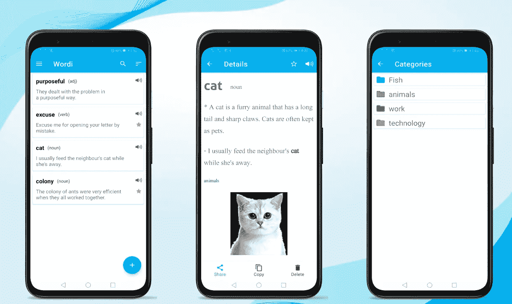

# 在 Wordi 应用程序上保存和构建词汇

> 原文：<https://itnext.io/save-and-build-vocabulary-on-wordi-app-e98053bb8673?source=collection_archive---------3----------------------->

学习短语，而不是单个单词

为了提高你的学习记忆，使用组块技术是非常重要的。组块学习是一种以组块为特征的主动学习策略，组块被定义为认知加工，将信息重新编码为有意义的组，称为组块，以提高学习效率或能力。

学习者利用他们的语块知识来帮助他们预测意义和实时处理语言。语块包括有意义的短语，如习语、搭配和句子结构。

整理床铺，在一天结束时，上课，鼓励我学习，依靠我都是语块的例子。

这种技巧可以帮助你创造一个新的短语。例如，如果你学习“在一天结束时”，你可以说“在一月底”。这意味着你可以用同样的模式来构建新的短语。

**Wordi app** 进场应对这种手法。使用的主要目的是通过组块来学习，这意味着学习短语，而不是单个单词。这是一个有效的节省单词的应用程序，可以用一种新的技术(组块)学习单词，并在你需要的时候毫不犹豫地使用它们。

这个应用程序对想要学习和建立与特定学习领域相关的新词汇、语言或术语的个人很有帮助。

使用 Wordi，将新单词添加到词汇表中，包括意思、句子、修辞和照片。照片帮助你把文字和视觉事物联系起来。当你点击一个单词项时，你可以显示它的细节。那将有助于复习你以前学过的东西。您也可以搜索您忘记或想要再次回忆的单词。

为你的单词列表创建多种颜色的类别，有助于根据类别对你的单词列表进行分类，如工作、友谊、爱情、科学、空间、医学等。

在 Wordi App 中，你可以通过听它的声音来改善你的发音。此外，你可以按字母顺序或根据时间或类别对单词列表进行排序。

你可以把你的单词添加到你最喜欢的列表中。它会帮助你把注意力集中在你喜欢用的词上。除此之外，你可以认出句子中的主要单词，因为你会看到它有不同的颜色。

当你阅读和查看其他应用程序中的单词时，你可以通过按下**单词 i** 将它们添加到你的单词列表中。

如果你想在晚上使用，Wordi 应用程序支持一个黑暗的主题来减少眼睛疲劳。

Wordi App 最重要的功能是，你可以将你的词汇列表以 JSON 文件的形式备份到你的手机上，如果你误卸载了该应用或重置了你的手机，还可以恢复它们。

您可以直接从应用程序中与您的朋友分享您的单词详细信息，并一起学习。

医学/工程专业的学生可以使用这个应用程序来保存与以后的学习和实践相关的不同术语。新的语言学习者也可以每天复习单词。

通过 [**获取 *Wordi App* 通过**](https://play.google.com/store/apps/details?id=com.marwaeltayeb.wordi)**[**三星**](https://galaxy.store/vtqczpxze)[**亚马逊**](https://www.amazon.com/gp/product/B09R4319TB)和 [**华为**](https://appgallery.huawei.com/#/app/C105424127) 店铺。**

**更多文章:点击 [**此处**](https://marwa-eltayeb.medium.com/)**

****在**[GitHub](https://github.com/Marwa-Eltayeb)|[LinkedIn](https://www.linkedin.com/in/marwa-eltayeb/)|[Twitter](https://twitter.com/Marwa_Eltayeb1)上找我**