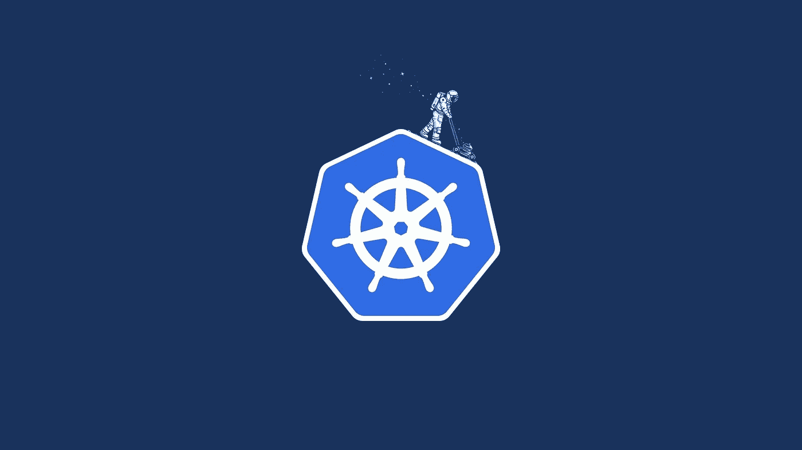
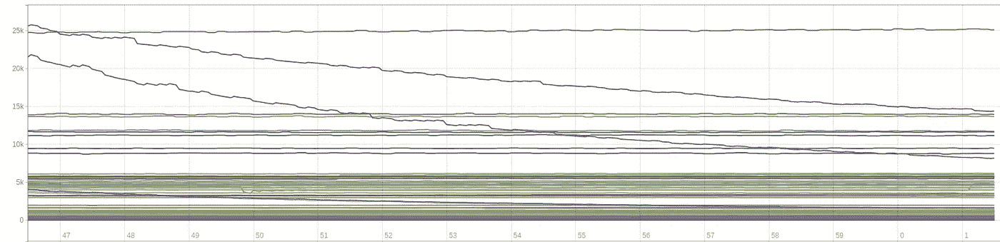

# 使用 5 个开源工具节省 Kubernetes 集群的成本

> 原文：<https://itnext.io/save-costs-in-your-kubernetes-cluster-with-5-open-source-projects-7f53899a1429?source=collection_archive---------4----------------------->

1.  使用 Prometheus 监控过多的资源请求
2.  工作时间自动缩放
3.  节点自动缩放
4.  水平 pod 自动缩放
5.  垂直 pod 自动缩放

额外:降低云成本的更多技巧



[图片来自丹·加菲尔德](https://twitter.com/todaywasawesome/status/915374176063463424)

嗨！今天，我想分享我是如何通过使用上述工具，在我的集群中大幅降低成本的。

本文描述了许多开源项目，但这并不是详细的指南。重点是快速建立他们来*品尝*每个项目。

我知道开源可能很难接近，所以我将包括部署这些项目所需的所有代码，以及一个最小的描述和进一步文档的链接。如果您决定继续使用任何软件，请阅读完整的文档。

最后一点，我将只讨论 CPU 指标，但是同样的代码对于内存指标总是有效的。

# 使用 Prometheus 监控过多的资源请求

首先，我将展示如何测量在您的 Kubernetes 集群中浪费了多少资源。

普罗米修斯是 Kubernetes admin 最好的朋友。部署它最简单的方法是通过[这个舵图](https://hub.kubeapps.com/charts/stable/prometheus):

```
helm install stable/prometheus
```

如果您的集群中已经有一个 Prometheus 实例，请确保您已经部署并监控了 [kube-state-metrics](https://github.com/kubernetes/kube-state-metrics) ，并且您已经配置了一个作业来[监控节点的 cAdvisor](https://github.com/prometheus/prometheus/blob/master/documentation/examples/prometheus-kubernetes.yml#L102) 。如果你正在使用上面链接的舵图，你已经准备好继续。

我将通过容器请求的内核和实际使用的内核之间的关系来衡量资源效率。这个数字越大，不必要保留的资源就越多。

不要害怕下面的查询，它实际上很简单，你会学到一些普罗米修斯的技巧😉

```
label_replace(
  label_replace(
    kube_pod_container_resource_requests_cpu_cores{},
    "pod_name", 
    "$1", 
    "pod", 
    "(.+)"
  ),
  "container_name", 
  "$1", 
  "container", 
  "(.+)"
) 
/
on(pod_name,namespace,container_name) 
sum(
  rate(
    container_cpu_usage_seconds_total{pod_name=~".+"}[60m]
  )
) 
by (pod_name,namespace,container_name)
```

分子是容器的 CPU 请求。指标*kube _ pod _ container _ resource _ requests _ CPU _ cores*由 kube-state-metrics 提供。我使用了两次`label_replace` 函数来转换 *pod* 和 *container* 标签，以匹配分母中的 *pod_name* 和 *container_name* 标签(标签匹配是划分不同度量所必需的)。

分母是 CPU 使用率，以 60 分钟的时间间隔计算，以避免出现峰值。`on` 关键字用于限制两部分匹配的标签。

这是我在测试集群中得到的输出:



每个容器的 CPU 请求/使用情况图表

是的，一个容器占用的资源是它实际使用的 25000 倍😒。

使用这个指标，您可以配置一个警报，以便在每次请求超过使用量时通知您。

但是我不喜欢收到大量关于员工的邮件或松散的信息，这些都是可以自动处理的。我们将在“垂直 Pod 自动缩放”部分了解如何自动改进这一指标。

# 工作时间自动缩放

对于我来说，最大的节省实际上来自于避免不必要的工作负载。部署只在工作时间使用的工具或环境是正常的。

值得庆幸的是，有一个有用的工具可以安排何时将部署扩展到 0(感谢[雅各布斯](https://github.com/hjacobs)):

[](https://github.com/hjacobs/kube-downscaler) [## hjacobs/kube-降频器

### kube-缩减规模—在下班后缩减 Kubernetes 部署

github.com](https://github.com/hjacobs/kube-downscaler) 

该存储库包含在集群中部署该控制器的 YAMLs:

```
git clone [https://github.com/hjacobs/kube-downscaler.git](https://github.com/hjacobs/kube-downscaler.git)
cd kube-downscaler
kubectl apply -f deploy/
```

接下来，您只需要注释您想要缩减的部署:

```
kubectl annotate deploy <MY DEPLOY> "downscaler/uptime=Mon-Fri 07:30–20:00 Europe/Madrid"
```

此数量将在 20:00 缩减为零，并在 7:30(周一至周五)恢复到之前的副本数量。

与下一个工具一起使用，它将帮助你在睡觉时节省很多钱。

# 节点自动缩放

集群自动缩放器是任何 Kubernetes 集群的必备插件。它负责管理集群中可用的资源总量，并与您的云提供商进行沟通以扩大或缩小资源规模。毕竟不少用节点就不是真正的节约。

[](https://github.com/kubernetes/autoscaler/tree/master/cluster-autoscaler) [## kubernetes/自动缩放器

### 自动缩放 Kubernetes 的自动缩放组件

github.com](https://github.com/kubernetes/autoscaler/tree/master/cluster-autoscaler) 

它可以与 kubeapps 中的这个[头盔图](https://github.com/kubernetes/autoscaler/tree/master/cluster-autoscaler)一起部署。请参阅文档，根据您的云提供商进行配置。阅读[常见问题](https://github.com/kubernetes/autoscaler/blob/master/cluster-autoscaler/FAQ.md)也是一种建议。

集群自动缩放刚刚工作。通过一些配置，它可以自动发现节点的自动扩展组，您将不再有处于挂起状态的 pod。每当可用的 CPU 或内存不足以部署新的 pod 时，它都会启动一个新的节点。此外，它还会在必要时缩小规模。

额外的节省:你可以通过添加一个标签到你的自动缩放组来缩放一个节点组到 0，在这里了解如何。

# 水平 Pod 自动缩放

如果您有多个服务副本，这种方法非常有用，可以避免流量高峰时的中断。使用此功能根据实际流量调整副本的数量。

 [## 水平 Pod 自动秤— Kubernetes

### 编辑此页面水平窗格自动缩放器自动缩放复制控制器中的窗格数量…

kubernetes.io](https://kubernetes.io/docs/tasks/run-application/horizontal-pod-autoscale/) 

Kubernetes 已经改进了它的水平扩展能力。在任何部署中，只需一个命令就可以配置自动扩展，并且可以使用 CPU 和内存边界以及任何其他自定义指标来完成。

如果您的集群不符合先决条件，我会帮助您满足这些条件。惟一的先决条件是 metrics-server，但是要部署它，您需要启用聚合层。

[聚合层](https://kubernetes.io/docs/tasks/access-kubernetes-api/configure-aggregation-layer/)是 Kubernetes 的一部分，它允许用额外的 API(作为我们需要的度量 API)来扩展默认的 apiserver。可以通过向 apiserver 添加以下参数来启用它:

```
--requestheader-client-ca-file=/etc/kubernetes/certificates/ca.crt
--requestheader-allowed-names=
--requestheader-extra-headers-prefix=X-Remote-Extra-
--requestheader-group-headers=X-Remote-Group
--requestheader-username-headers=X-Remote-User
--proxy-client-cert-file=/etc/kubernetes/certificates/apiserver.crt
--proxy-client-key-file=/etc/kubernetes/certificates/apiserver.key
```

是的，在这个例子中，我使用了我已经为 apiserver 拥有的相同证书，并在 requestheader-allowed-names 中设置了通配符。我在我的生产集群中不这样做，这只是为了更快地进行。在 [apiserver 参考](https://kubernetes.io/docs/reference/command-line-tools-reference/kube-apiserver/)中找到所有这些参数的解释。

我们准备部署[度量服务器](https://github.com/kubernetes-incubator/metrics-server)。首先克隆 repo，它提供 YAMLs 来部署一切。

```
git clone [https://github.com/kubernetes-incubator/metrics-server.git](https://github.com/kubernetes-incubator/metrics-server.git)
cd metrics-server
```

我们只需要在文件 deploy/1.8+/metrics-server-deployment . YAML 中添加一个参数，结果文件如下:

```
# File: deploy/1.8+/metrics-server-deployment.yaml
........
........
........
command:        
  - /metrics-server        
  - --source=kubernetes.summary_api:''
  - --requestheader-allowed-names=
```

保存、退出并运行:

```
kubectl create -f deploy/1.8+/
```

检查 pod 日志以验证它是否正常工作。

好吧！我将创建一个使用 0.9 内核的测试部署:

```
kubectl create -f - <<EOF
apiVersion: extensions/v1beta1
kind: Deployment
metadata:
  name: scaling-test
  namespace: default
spec:
  replicas: 1
  template:
    metadata:
      labels:
        app: scaling-test
    spec:            
      containers:
      - name: hamster
        image: k8s.gcr.io/ubuntu-slim:0.1
        command: ["/bin/sh"]
        args: ["-c", "while true; do timeout 0.9s yes >/dev/null; sleep 0.1s; done"]
EOF
```

现在，让我们为超过 80%的 CPU 使用率配置一个水平 pod 自动扩展(HPA)规则:

```
kubectl autoscale deploy scaling-test -min=1 -max=5 -cpu-percent=80
```

检查新创建的 HPA 资源并等待事件:

```
k describe hpa scaling-test
```

一分钟后，部署应该扩展到最大值(5)。在最初的几秒钟内，您可能会看到一些错误。

现在编辑部署，并将参数更改为:

```
- args:
  - -c
  - while true; do timeout 0.5s yes >/dev/null; sleep 0.5s; done
```

此命令将仅使用 50%的核心，因此部署应该自动缩减到 1 个副本。

# 垂直 Pod 自动缩放

这个[项目](https://github.com/kubernetes/autoscaler/tree/master/vertical-pod-autoscaler)处于 alpha 状态，但它对我来说是最有用的。正确配置后，它会自动为您的 pod 设置资源请求！

[](https://github.com/kubernetes/autoscaler/tree/master/vertical-pod-autoscaler) [## kubernetes/自动缩放器

### 自动缩放 Kubernetes 的自动缩放组件

github.com](https://github.com/kubernetes/autoscaler/tree/master/vertical-pod-autoscaler) 

您在第一部分已经看到，我的 pod 请求的 CPU 内核比它们实际使用的多得多。一旦设置了垂直 pod autoscaler，这个指标就会大幅下降，并根据需要调整我的集群大小，而不需要更多的工作。

**建议**:暂时不兼容水平吊舱自动缩放器。不要在同一个部署中同时使用两者！

Vertical Pod Autoscaler 也依赖于 metrics-server，我们在上一节中学习了如何部署它。另一个先决条件是在 apiserver 中启用[准入 webhooks](https://kubernetes.io/docs/reference/access-authn-authz/extensible-admission-controllers/#admission-webhooks) 。只需在 apiserver 参数中添加这些准入控制器:

```
--admission-control=ValidatingAdmissionWebhook,MutatingAdmissionWebhook
```

现在克隆存储库，并使用安装脚本设置自动缩放器:

```
git clone [https://github.com/kubernetes/autoscaler.git](https://github.com/kubernetes/autoscaler.git)
cd autoscaler/vertical-pod-autoscaler
./hack/vpa-up.sh
```

这将为其三个组件创建自定义资源定义、部署和 RBAC 配置:

1.  推荐器:它监控 pod 指标并估计使用情况。
2.  Updater:它接受建议，更新 verticalPodAutoscaler 对象，并在需要时驱逐 pod。
3.  准入控制器:它在创建时用推荐的请求更新 pod。

查看名称空间 kube-system 中三个组件的日志，检查部署是否成功。

现在，创建一个使用 0.5 个内核但仅请求 0.1 个内核的部署，同时创建一个 VPA(verticalPodAutoscaling)，看看会发生什么:

```
kubectl create -f - <<EOF
apiVersion: extensions/v1beta1
kind: Deployment
metadata:
  name: vertical-scaling-test
spec:
  replicas: 1
  template:
    metadata:
      labels:
        app: vertical-scaling-test
    spec:            
      containers:
      - name: ubuntu
        image: k8s.gcr.io/ubuntu-slim:0.1
        resources:
          requests:
            cpu: 0.1
            memory: 50Mi
        command: ["/bin/sh"]
        args: ["-c", "while true; do timeout 0.5s yes >/dev/null; sleep 0.5s; done"]
EOFkubectl create -f - <<EOF
apiVersion: "poc.autoscaling.k8s.io/v1alpha1"
kind: VerticalPodAutoscaler
metadata:  
  name: vertical-scaling-test
spec:  
  selector:
    matchLabels:
      app: vertical-scaling-test
EOF
```

几分钟后，您应该会看到 pod 被新的请求重新创建。如果您编辑窗格以使用较少的资源，它将再次缩小。

这个项目对于开发环境非常有用，但是不要忘记这是一个 alpha 版本。您还可以自定义每个组件，以设置最小值、限制值等。点击查看每个文件夹[中的自述文件。](https://github.com/kubernetes/autoscaler/tree/master/vertical-pod-autoscaler/pkg)

# 在 Kubernetes 省钱的额外技巧

*   避免负载平衡器服务类型。使用入口对象和入口控制器更好也更便宜。
*   如果您在云中，请使用小型持久卷。使用此[新功能](https://kubernetes.io/blog/2018/07/12/resizing-persistent-volumes-using-kubernetes/)在需要时扩展它们。
*   根据您对 CPU 和内存的要求，为集群使用正确的实例类型。选择正确的实例类型以优化使用。

我希望你可以在你的集群中使用这些项目来节省一些信贷，让我知道你取得了什么成就！

[ignaciomillan.com](https://ignaciomillan.com)