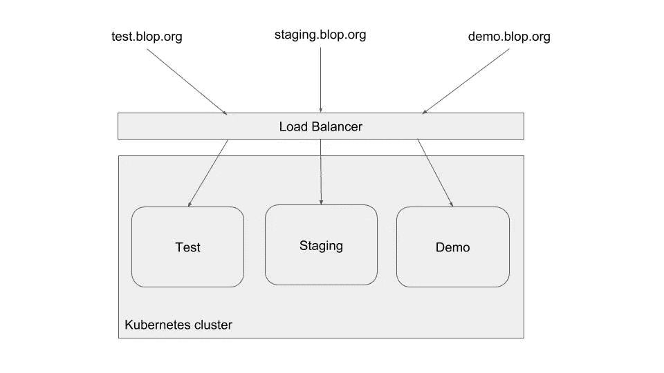
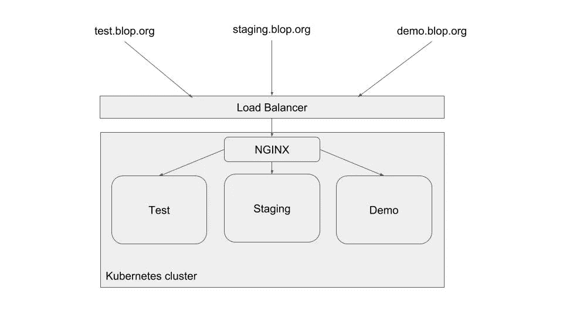
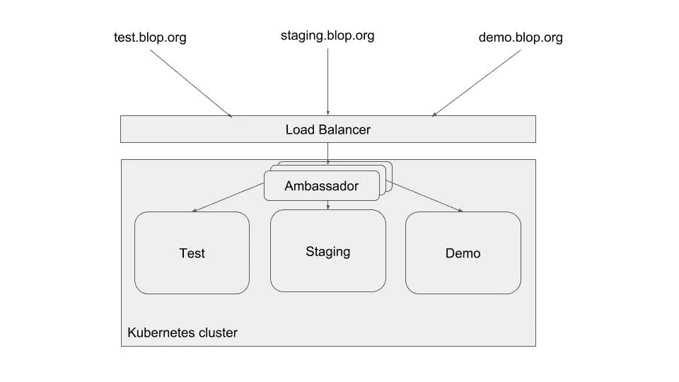

# 通过 Kubernetes Ingress 节省您的 AWS 账单

> 原文：<https://itnext.io/save-on-your-aws-bill-with-kubernetes-ingress-148214a79dcb?source=collection_archive---------1----------------------->

# 库伯内特斯的奇迹

当你开始使用 Kubernetes 时，你学到的第一个概念是[服务](https://kubernetes.io/docs/concepts/services-networking/service/)。

内部服务允许 pod 发现和负载平衡。如果你需要让你的 pod 在互联网上可用，**我认为**，你应该使用类型为`LoadBalancer`的服务。根据云提供商的不同，这将产生不同的影响；例如，在 AWS 上，它将为每个对外公开的**服务创建一个 ELB。**

> ELBs 很棒，但也不便宜。每月大约 20 美元(外加每 GB 数据处理的额外费用)。

如果你有几项服务，这将导致一笔**巨额** **账单**。

# 入口来了

我花了一些时间来熟悉 Kubernetes [入口](https://kubernetes.io/docs/concepts/services-networking/ingress/)。

> Kubernetes 擅长抽象常见的问题，并为您提供不同的具体实现。

这正是 Ingresses 在使端点成为外部端点的上下文中所做的事情。您以一种通用格式指定某些服务应该如何被路由，并且您将实现这种路由的工作留给一个**入口控制器**。

例如:

```
apiVersion: extensions/v1beta1
kind: Ingress
metadata:
  name: test
  annotations:
    nginx.ingress.kubernetes.io/rewrite-target: /
spec:
  rules:
  - host: foo.bar.com
    http:
      paths:
      - path: /foo
        backend:
          serviceName: s1
          servicePort: 80
      - path: /bar
        backend:
          serviceName: s2
          servicePort: 80
```

该入口资源将期望接收对主机`foo.bar.com`的请求，并根据请求路径将流量路由到服务`s1`或`s2`。您还可以基于主机进行路由(如下例所示)

需要明确的是，入口不能取代内部服务。你仍然希望你的每个应用/微服务都有一个内部服务——这意味着你的 pod 总是可以在同一个地址访问，不管它们是如何死亡或被创建的。然后入口会将外部流量路由到内部服务

```
Request => Ingress => (Internal) Service => Pod
```

默认情况下，Kubernetes 没有安装入口控制器。这是你的工作，选择一个(或者更多，如果你有更复杂的需求)。

# 我的要求

我们使用 Kubernetes 名称空间来分隔不同的环境。例如，在一个 Kubernetes 集群中，我们可能有一个`test`、`demo`和`staging`名称空间。我不想每个人都有一个单独的 ELB。这个太贵了。

我想将`test`、`demo`和`staging`的 DNS 指向一个端点:



# ALB 入口控制器

我第一次遇到 [ALB 入口控制器](https://github.com/kubernetes-sigs/alb-ingress-controller)，它听起来很有前途。它可以创建新的[应用负载平衡器](https://docs.aws.amazon.com/elasticloadbalancing/latest/application/introduction.html)，而不是创建弹性负载平衡器。

因此，该入口控制器可以转换入口资源，例如:

```
apiVersion: extensions/v1beta1
kind: Ingress
metadata:
  name: test
  annotations:
    nginx.ingress.kubernetes.io/rewrite-target: /
spec:
  rules:
  - host: foo.com
    http:
      paths:
      - path: /
        backend:
          serviceName: foo
          servicePort: 80
  - host: bar.com
    http:
      paths:
      - path: /
        backend:
          serviceName: bar
          servicePort: 80
```

一个 ALB，有两个目标组:一个用于主机为`foo.com`时的`foo`服务，另一个用于主机为`bar.com`时的`bar`服务

然而对我来说有一个主要的问题，因为在我写作的时候:

> ALB 入口控制器不支持跨多个名称空间的路由

如果您在`test`创建一个入口资源，在`staging`创建一个入口资源，ALB 入口控制器将创建两个 ALB，这违背了整个要点。我已经在 Github 上提出了这个[问题，但是它似乎还没有进展。](https://github.com/kubernetes-sigs/alb-ingress-controller/issues/329)

# 解决方案 1: NGINX 入口控制器

不久前，我遇到了这个关于跨名称空间进入的 Github 问题，但不幸的是，我没有仔细阅读。读了第二遍后，我意识到这个解决方案非常简单，有了 [NGINX 入口控制器](https://github.com/kubernetes/ingress-nginx)。

架构非常简单。您有一个指向 NGINX 的 ELB，它在内部分发流量:



NGINX 入口控制器

好消息是这也很容易设置！

1.  按照此处的[说明安装 NGINX 入口控制器。](https://kubernetes.github.io/ingress-nginx/deploy/)
2.  在每个名称空间中定义一个入口资源

对于测试:

```
apiVersion: extensions/v1beta1
kind: Ingress
metadata:
  name: api-ingresse-test
  namespace: **test**
  annotations:
    kubernetes.io/ingress.class: "nginx"
spec:
  rules:
  - host: test.blop.org
    http:
      paths:
      - backend:
          serviceName: myApp
          servicePort: 80
        path: /
```

对于暂存:

```
apiVersion: extensions/v1beta1
kind: Ingress
metadata:
  name: api-ingresse-staging
  namespace: **staging**
  annotations:
    kubernetes.io/ingress.class: "nginx"
spec:
  rules:
  - host: staging.blop.org
    http:
      paths:
      - backend:
          serviceName: myApp
          servicePort: 80
        path: /
```

对于演示:

```
apiVersion: extensions/v1beta1
kind: Ingress
metadata:
  name: api-ingresse-demo
  namespace: **demo**
  annotations:
    kubernetes.io/ingress.class: "nginx"
spec:
  rules:
  - host: demo.blop.org
    http:
      paths:
      - backend:
          serviceName: myApp
          servicePort: 80
        path: /
```

瞧啊。没什么可做的了。NGINX 入口控制器将处理这些资源，并自动创建单个 ELB。然后，您只需将您的`test`、`demo`和`staging` DNS 指向 ELB，工作就完成了！

如果你想的话，你可以通过写配置映射来调优 NGINX，但这不是必须的。它开箱即用。

为了获得更好的可用性，您可以增加`nginx-ingress-controller`的副本数量:

```
kubectl -n ingress-nginx scale deploy nginx-ingress-controller --replicas=3
```

# SSL 终端

您也可以轻松终止 SSL 流量。您可以选择在 [ELB 级别](https://kubernetes.github.io/ingress-nginx/deploy/#aws)或者用 [NGINX](https://github.com/kubernetes/ingress-nginx/blob/master/docs/user-guide/tls.md) 终止 SSL。

就个人而言，我更喜欢在 ELB 终止 SSL，因为它非常容易设置(安装 NGINX 入口控制器时只需一个注释)。但是其他人可能喜欢 NGINX 提供的额外控制。

# 解决方案 2:大使

我遇到的第二个解决方案实际上并没有使用 Ingress。

> [Ambassador](https://www.getambassador.io/) 是一个构建在[特使代理](https://www.envoyproxy.io/)之上的 Kubernetes-native 微服务 API 网关。

它提供了与 NGINX 入口控制器相似的架构:



大使舱在你的集群中路由流量

首先你需要安装大使，这很容易做到。

```
kubectl apply -f [https://getambassador.io/yaml/ambassador/ambassador-rbac.yaml](https://getambassador.io/yaml/ambassador/ambassador-rbac.yaml)
```

这将安装 3 个`Ambassador`pod，它们将根据您的 pod 路由流量。这种冗余提供了高可用性，并有助于扩展负载。

然后您需要创建一个`LoadBalancer`类型的服务来指向这些 pod。对于 AWS，您可以像[那样做](https://www.getambassador.io/reference/ambassador-with-aws):

```
apiVersion: v1
kind: Service
metadata:
  name: ambassador-main
  namespace: ambassador
  annotations:
    service.beta.kubernetes.io/aws-load-balancer-ssl-cert: "your_aws_cert_for_https"
    service.beta.kubernetes.io/aws-load-balancer-ssl-ports: "*"
    service.beta.kubernetes.io/aws-load-balancer-backend-protocol: "tcp"
    service.beta.kubernetes.io/aws-load-balancer-cross-zone-load-balancing-enabled: "true"
    service.beta.kubernetes.io/aws-load-balancer-proxy-protocol: "*"
    getambassador.io/config: |
      ---
      apiVersion: ambassador/v0
      kind:  Module
      name:  ambassador
      config:
        use_proxy_proto: lower
        use_remote_address: true
spec:
  type: LoadBalancer
  ports:
  - name: ambassador
    port: 443
    targetPort: 80
  selector:
    service: ambassador
```

这将创建一个单一的`ELB`。如上所述，您可以将所有 DNS 名称指向该端点，并让 Ambassador 进行路由。

有了大使你**不需要入口资源**。您只需向服务添加注释。在我们的例子中，这个看起来像这样:

如果我们在`test`、`staging`和`demo`中为我们的`bar`应用程序提供了一个服务，我们将简单地添加`getambassador.io/config`注释

对于测试:

```
kind: Service
apiVersion: v1
metadata:
  name: test-bar
  namespace: test
  annotations:
    getambassador.io/config: |
      ---
      apiVersion: ambassador/v0
      kind:  Mapping
      name:  test-bar
      prefix: /
      service: test-bar:8080
      host: test.blop.org
spec:
  type: NodePort
  selector:
    app: bar
  ports:
    - protocol: TCP
      port: 8080
      targetPort: 8080
```

对于暂存:

```
kind: Service
apiVersion: v1
metadata:
  name: staging-bar
  namespace: test
  annotations:
    getambassador.io/config: |
      ---
      apiVersion: ambassador/v0
      kind:  Mapping
      name:  staging-bar
      prefix: /
      service: staging-bar:8080
      host: staging.blop.org
spec:
  type: NodePort
  selector:
    app: bar
  ports:
    - protocol: TCP
      port: 8080
      targetPort: 8080
```

对于演示:

```
kind: Service
apiVersion: v1
metadata:
  name: demo-bar
  namespace: demo
  annotations:
    getambassador.io/config: |
      ---
      apiVersion: ambassador/v0
      kind:  Mapping
      name:  demo-bar
      prefix: /
      service: demo-bar:8080
      host: test.blop.org
spec:
  type: NodePort
  selector:
    app: bar
  ports:
    - protocol: TCP
      port: 8080
      targetPort: 8080
```

Ambassador 还提供了其他功能，如:

*   gRPC 支持
*   证明
*   限速
*   Istio (服务网格)集成

如果你想了解更多关于大使的信息，请点击这里查看。

如果你和我一样，已经使用多个 ELB 很长时间了，我希望这个简单的解决方案可以让你的 AWS 账单变得更轻一点！

不言而喻，这种架构也适用于 GCE 和 Azure。

PS:其他值得一提的入口控制器: