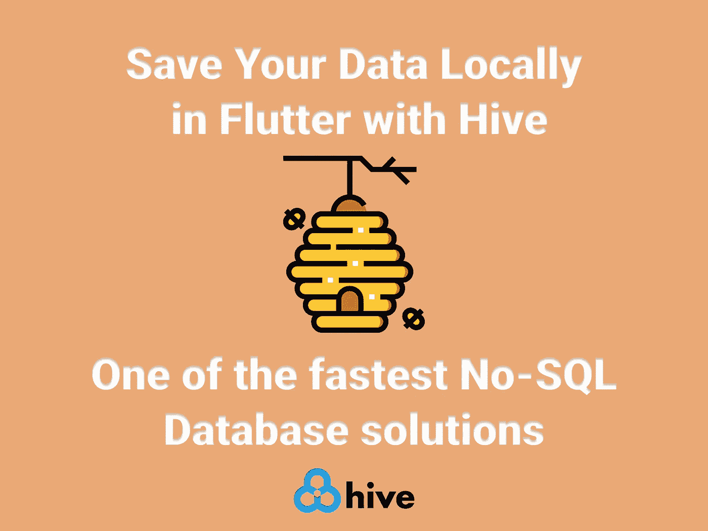

# 用 Hive 在 Flutter 中本地保存您的数据

> 原文：<https://itnext.io/save-your-data-locally-in-flutter-with-hive-11ec5d30fb55?source=collection_archive---------2----------------------->

## Flutter 中最快的非 SQL 数据库解决方案之一



在本地存储数据并在应用启动之间保持数据是任何移动应用开发过程的基本概念之一。几乎每个应用程序都要求您处理数据，从存储送餐应用程序的客户信息到一个简单的值，以了解用户在上次访问时是否打开了黑暗模式。

Flutter 提供了很多本地数据持久化选项供开发者选择。 [shared_preferences](https://pub.dev/packages/shared_preferences) 是一个很好的包，用于在本地存储小的键值对，而 [sqflite](https://pub.dev/packages/sqflite) ，Flutter 的 SQLite 包，当您处理需要您处理数据库中复杂关系的强关系数据时，是一个很好的选择。

但是如果你想要一个快速安全的本地数据库，没有本地依赖，也可以在 Flutter web 上运行😏，那么[蜂巢](https://pub.dev/packages/hive)是一个相当不错的选择。

> Hive 是一个用纯 Dart 编写的轻量级、速度极快的键值数据库。灵感来自[比特木桶](https://en.wikipedia.org/wiki/Bitcask)。


# 特征

*   🚀跨平台:移动、桌面、浏览器
*   ⚡出色的性能(参见[基准](https://pub.dev/packages/hive#benchmark))
*   ❤️简单、强大、直观的 API
*   🔒内置强加密
*   🎈没有本机依赖项
*   🔋含电池

## 入门指南

[](https://pub.dev/packages/hive) [## 蜂巢|飞镖包

### Hive 是一个用纯 Dart 编写的轻量级、速度极快的键值数据库。灵感来自比特酒桶。如果你需要…

公共开发](https://pub.dev/packages/hive) 

*   让我们将 Hive 包添加到我们的`pubspec.yaml`

```
dependencies:
  ...
  hive: ^2.0.5
  hive_flutter: ^1.1.0
  ...
dev_dependencies:
  ...
  hive_generator: ^1.1.1
  ...
```

*   然后我们需要在`main.dart`中初始化我们项目的 Hive

*   初始化 Hive 后，我们需要打开我们的盒子。

```
await Hive.openBox('boxName');
```

*   您可以像这样使用键值对来保存数据👇👇

*   这样你就可以读取你保存的数据👇👇

*   要更新之前的键值对，只需再次覆盖它。
*   如果你想删除你保存的键值对，你需要这样做👇👇

*   这里有一些你可能需要的有用的方法👇👇

*   你也可以很容易地在 Hive 中存储你的对象，还有很多我在这篇文章中没有提到的特性，如果你感兴趣，你可以在这里查看这篇文章👇👇

[](/flutter-save-data-to-local-storage-with-hive-nosql-database-package-8a0de834f313) [## 颤振保存数据到本地存储与蜂房 NoSQL 数据库包

### Hive 是一个用纯 Dart 编写的轻量级、速度极快的键值数据库。

itnext.io](/flutter-save-data-to-local-storage-with-hive-nosql-database-package-8a0de834f313) 

*   你也可以在这里查看文档👇👇

 [## Hive 文档

### 描述

docs.hivedb.dev](https://docs.hivedb.dev/#/) 

**感谢您的阅读！**👏👏

如果你喜欢这篇文章，请点击👏按钮(你知道你可以升到 50 吗？)

另外，别忘了关注我，在你的社交网站上分享这篇文章！也让你的朋友知道吧！！