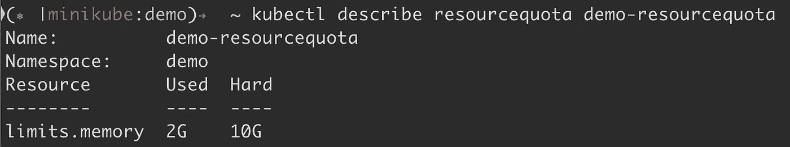
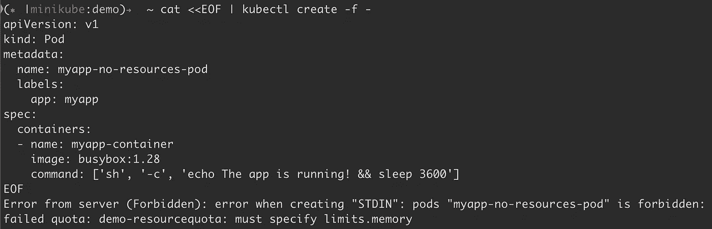
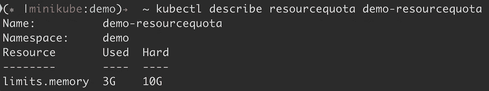

# 从 DoS 保存您的 Kubernetes 集群

> 原文：<https://itnext.io/save-your-kubernetes-cluster-from-dos-4b8855126ca1?source=collection_archive---------3----------------------->

Kubernetes 已经成为容器编排工具的市场领导者。根据 [2019 年 CNCF 调查](https://www.cncf.io/wp-content/uploads/2020/03/CNCF_Survey_Report.pdf)， **78%的受访者在生产中使用 Kubernetes，比去年的 58%大幅上升**

虽然容器已经成为部署应用程序的标准，但是 kubernetes 已经成为容器管理的标准。

# Kubernetes 集群中的 DoS

考虑一个 Kubernetes 集群，它有 3 个工作节点，每个节点有 10GB 的内存。假设开发人员最终错误地部署了一些 pods，这几乎消耗了节点中所有可用的 cpu 和内存。因此在服务于来自消费者的流量的其他应用荚中引起资源争用。这也可能是由于黑客故意将高资源消耗的容器注入系统造成的。

为了更好地理解这种情况，假设一个节点有 10GB 的容器可分配内存，并且有 5 个应用程序单元共享可用内存。每个应用程序单元平均消耗 1GB 内存，这使得节点以 50%到 60%的内存利用率运行。现在，在同一个节点中部署一个消耗 10GB 内存的 pod 将导致噪音邻居问题。这会导致其他应用程序单元中的资源争用，进而增加这些服务的延迟，或者在更糟糕的情况下使服务变得不可用。

当开发人员在代码中犯了一个错误，导致内存泄漏并不断增加内存使用量时，也可能会发生这种情况。


# Kubernetes 的有效资源管理

这就是为什么开发人员应该更加关注他们开发的服务所需的资源，并在 Kubernetes 集群中部署服务时配置所需的最低内存和 cpu。可以相应地配置资源请求，以在保证最小资源的节点中调度 pod。

例如，如果服务至少需要 2 个 cpu 和 3GB 内存，则在 pod 规范中，按如下方式配置资源请求:

```
apiVersion: v1kind: Podmetadata: name: demo-service namespace: demospec: containers: - name: demo-container image: demo-service-image resources: requests: cpu: "2" memory: "3G"
```

同样重要的是，开发人员还应该配置他们的服务可以消耗的最大资源。这有助于避免其他服务单元中的噪音邻居问题。

比方说同样的`demo-service`应该不会消耗超过 4 个 cpu 和 5 GB 内存。在这种情况下，将资源限制添加到上述 pod 规格中。

```
apiVersion: v1kind: Podmetadata: name: demo-service namespace: demospec: containers: - name: demo-container image: demo-service-image resources: requests: cpu: "2" memory: "3G" limits: cpu: "4" memory: "5G"
```

强烈建议根据服务需求在 Kubernetes 集群中部署的 pod 中配置资源请求和限制。

话虽如此，只是为了安全起见，我们需要在 Kubernetes 集群中添加一些策略，以确保 pods 不会过度利用资源，从而导致嘈杂的邻居问题，从而避免部署在集群中的应用程序被拒绝服务。

# 从 DoS 保存您的 Kubernetes 集群

上述问题的一个解决方案是在资源上设置某种配额，这些资源将被配置为 pods 中的请求和限制。这是为了确保没有人过度配置资源请求和限制，从而避免节点中资源的过度利用(超过某个阈值)。

Kubernetes 提供了 ResourceQuota 来实现这一点，因为它在验证阶段注入了一个准入控制器。默认情况下，大多数 kubernetes 发行版都支持 ResourceQuota。即使在其他情况下，也可以通过在 kube-apiserver 的`--enable-admission-plugins`标志中添加`ResourceQuota`来启用它。

启用 ResourceQuota 准入插件后，根据需要为每个命名空间添加配额。例如，要仅分配 10GB 的内存用于在名称空间中部署服务，请创建一个资源配额，如下所示:

```
apiVersion: v1kind: ResourceQuotametadata: name: demo-resourcequotaspec: hard: limits.memory: 10G
```

该资源配额确保所有 pod 的资源限制中的内存总和不超过 10GB 内存。任何创建或修改请求都将由 ResourceQuota 准入控制器在验证阶段进行验证。如果不符合现有的资源配额，该请求将被拒绝。

现在部署内存限制为 2GB 的 pod，如下所示:

```
apiVersion: v1kind: Podmetadata: name: myapp-pod labels: app: myappspec: containers: - name: myapp-container image: busybox:1.28 command: ['sh', '-c', 'echo The app is running! && sleep 3600'] resources: limits: memory: 2G
```

通过运行`kubectl describe resourcequota demo-resourcequota`，可以看到 2GB 的内存限制已经用完了配置的配额。



当部署另一个内存限制为 9GB 的 pod 时，它将失败，因为它将超过 10GB 的配额。


群集管理员应该配置 ResourceQuota 中的值，以便不会过度利用节点。

在 kubernetes 集群中，在 pod 规范中提及资源请求和限制并不是强制性的，如果没有提及，就意味着 pod 对资源的消耗没有限制。它可以消耗节点中所有可用的资源。因此，不建议跳过 pod 规范中的资源请求和限制。

有了 ResourceQuota，如果缺少资源配额所需的请求或资源限制，任何 pod 创建或更新都将被拒绝。例如，上述资源配额不允许创建或更新没有配置内存资源限制的 pod。



为了确保所有的 pod 都有一些默认的资源请求或限制，我们可以在名称空间中创建 LimitRanger。

LimitRanger 也是一个准入控制器，它将参与变异阶段。如果任何 pod 规范没有资源请求或限制，它将添加相同名称空间的 LimitRanger 中提到的资源请求和限制。

在命名空间中创建 LimitRanger，如下所示:

```
apiVersion: v1kind: LimitRangemetadata: name: default-requests-limits namespace: demospec: limits: - default: memory: 1Gi defaultRequest: memory: 500Mi type: Container
```

然后在相同的名称空间中应用没有资源请求和限制的 pod，如下所示:

```
apiVersion: v1kind: Podmetadata:name: myapp-no-resources-podlabels:app: myappspec:containers:- name: myapp-containerimage: busybox:1.28command: ['sh', '-c', 'echo The app is running! && sleep 3600']
```

现在，获取运行在 K8s 集群中的上述 pod 的 yaml。LimitRanger `default-requests-limits`中提到的资源请求和限制被添加到`.spec.resources`中。

```
...spec: containers: - command: - sh - -c - echo The app is running! && sleep 3600 image: busybox:1.28 imagePullPolicy: IfNotPresent name: myapp-container resources: limits: memory: 1G requests: memory: 500Mi...
```

再次运行`kubectl describe resourcequota demo-resourcequota`并查看 3GB 内存限制已超出配置的配额。



# 结论

因此，根据需求配置 ResourceQuota 和 LimitRanger，Kubernetes 集群中的所有应用程序都可以避免嘈杂的邻居问题和拒绝服务

*原发布于*[*https://www . prabhujayakumar . dev*](https://www.prabhujayakumar.dev/blog/save-your-k8s-cluster-from-dos/)*。*