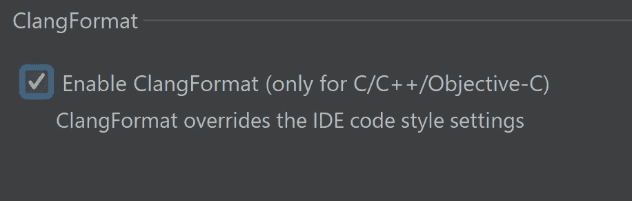
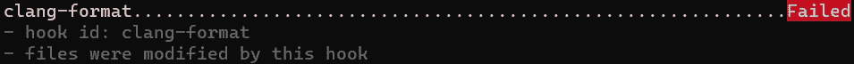
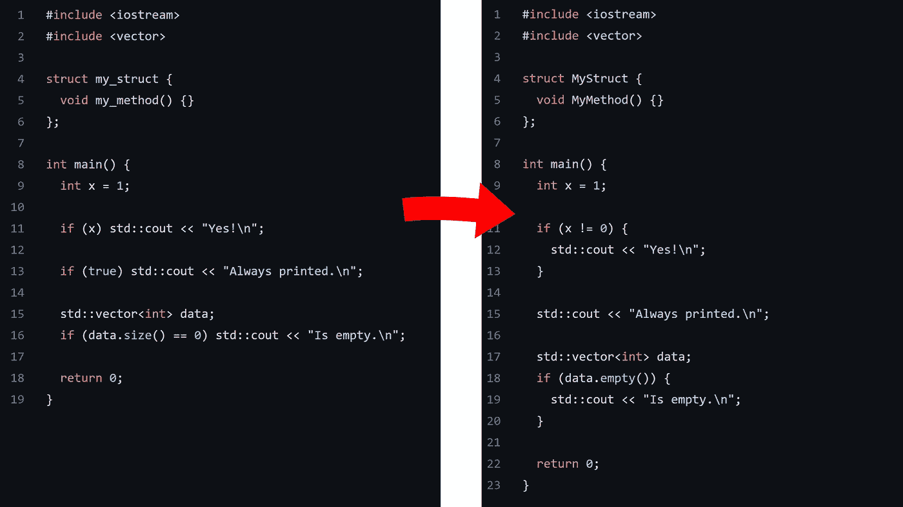
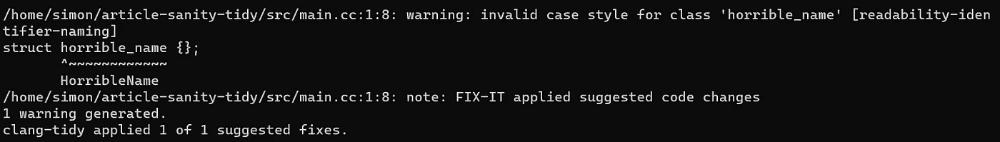

# 节省你的理智和时间——不要拘泥于形式。

> 原文：<https://itnext.io/save-your-sanity-and-time-beyond-clang-format-2b929b9120b8?source=collection_archive---------1----------------------->

作为一名软件工程师，你能做的最有影响力的事情之一就是自动化重复的活动。尤其是一个经常需要更多自动化的领域是代码审查。

今天，我们将看看如何将 C、C++、C#、Java、JavaScript、Objective-C 和 Objective-C++语言的样式检查和执行卸载到 clang-format。我们将进一步讨论使用 clang-tidy 的更高级的 C++选项，以及如何将这两个工具与 git pull 请求工作流集成。

# 叮当声格式

您可能听说过 clang-format，因为许多 ide(通过 libformat)将它作为标准的代码格式化解决方案。出于同样的原因，我们对 clang-format 感兴趣，以便统一地格式化代码。

虽然这并没有消除建立代码风格时最初的自行车脱落，但它消除了在代码评审期间任何进一步分心的可能性。

## 选择你的风格

使用 clang-format 的缺点是，您需要选择或定义一种严格的代码格式，而 clang-format 提供的过多选项可能会让人不知所措。

所以，首先，考虑一下你属于这两类中的哪一类:

*   您没有预先存在的代码，或者不关心重新格式化代码库所产生的差异。
*   您希望匹配接近当前代码库的代码样式，最小化重新格式化的差异。

如果你不关心或者还没有需要关心的代码，我强烈建议选择一种预定义的代码风格:LLVM、Google、Chromium、Mozilla、WebKit、Microsoft 或 GNU。

您也可以使用一个预定义的样式作为基线，并将您的更改放在上面。例如，这是我常用的 C++风格:

如果您关心的话，有几个工具可以从代码示例中自动检测格式配置:

*   [clang Visual Studio 的电动工具扩展](https://clangpowertools.com/)
*   [unformat(基于 python)](https://github.com/johnmcfarlane/unformat)
*   [无格式(基于 C++的)](https://github.com/alandefreitas/clang-unformat)

我强烈建议挑选一些中小型的样本文件，并只在这些文件上运行该工具，而不管您使用哪种工具。这种方法将大大减少运行时间和成功的机会。

最重要的是，最终结果不太可能完全不同。如果您当前没有使用格式强制工具，您将会遇到一些样式不一致的情况。准备好深入配置以微调风格。

一旦有了基于预定义样式或检测到的样式的配置，就将其存储在项目根目录下的一个`.clang-format`文件中。

# 预提交

虽然我们现在有了代码风格，但是我们还需要一个关键的步骤来减少代码审查期间的手工劳动。我们需要在每段代码进入我们的 git 存储库之前，自动强制执行代码样式(注意，其他版本管理系统也提供非常相似的功能)。

这种强制有两个部分:首先，在开发人员机器上，作为他们典型工作流的一部分，其次，在拉请求期间。

大多数 ide 会自动选择一个`.clang-format`文件，有些会要求你启用一个设置:

Clion:启用 clang 格式配置

IDE 解决方案对大多数开发者来说应该足够了。但是，如果您像我一样，有时使用基本编辑器编辑文件，那么使用预提交钩子可以从多一层强制中获益。

你可以使用一个[预提交钩子](https://github.com/andrewseidl/githook-clang-format)，但是我们会用 clang-tidy 做更多的执行工作，所以我们将使用[预提交框架](https://pre-commit.com/)。

该框架提供了一种方便的方法来提取您可能需要的各种预提交挂钩，只需引用包含这些挂钩的存储库:

这个文件在我们的存储库根目录下，我们需要做的就是在每个存储库运行一次`pre-commit install`来配置钩子。之后，如果我们尝试提交一个格式不正确的文件，它将被自动重新格式化，预提交框架会通知我们，以便我们可以检查差异:

你可以在这里查看最终结果:[github.com/HappyCerberus/article-sanity-format](https://github.com/HappyCerberus/article-sanity-format)。

## 拉请求流

这给我们多了一道防线。虽然在开发人员的机器上设置本地强制非常容易(运行一次`pre-commit install`，但是我们仍然希望确保当有人忘记时，未格式化的代码不会进入存储库。

由于这完全是为了限制代码审查的手工工作，我们将借用 pull request 工作流，并且由于我们已经使用了 pre-commit，我们将使用它的 git 动作。不需要额外的配置，只需点击“使用 Github 登录”按钮即可对[预提交 CI](https://pre-commit.ci/) 进行授权。

一旦启用，[拉取请求将自动格式化](https://github.com/HappyCerberus/article-sanity-format/pull/1)以符合配置的代码格式:

# 铿锵整齐

clang-format 和预提交都是多语言工具。在这一节中，我们将讨论 clang-tidy，它是一个特定于 C++的静态分析器。

你可能对铿锵整齐很熟悉。然而，你可能不知道 clang-tidy 提供了一套高度可配置的代码风格检查和修复。这些修复涵盖了超出格式的代码更改，如命名风格(如 CamelCase vs snake_case)。

有太多的检查要详尽地涵盖。幸运的是，可读性类别下的大多数检查都是显而易见的，应该在任何存储库中启用(在它们的默认配置中)。

与代码风格相关的主要检查是[可读性-标识符-命名](https://releases.llvm.org/13.0.0/tools/clang/tools/extra/docs/clang-tidy/checks/readability-identifier-naming.html)。该检查强制执行特定类别的所有标识符的大小写样式(例如 CamelCase、snake_case)以及前缀和后缀(支持匈牙利符号[即将推出](https://clang.llvm.org/extra/clang-tidy/checks/readability-identifier-naming.html))。要获得灵感，你可以搜索现成的样式，比如[谷歌代码样式](https://gist.github.com/airglow923/1fa3bda42f2b193920d7f46ee8345e04)。

最后，以下是可配置的或值得考虑但不普遍适用的检查:

*   警告可以是常量但不是常量的成员函数
    [可读性-make-member-function-const](https://releases.llvm.org/13.0.0/tools/clang/tools/extra/docs/clang-tidy/checks/readability-make-member-function-const.html)
*   警告成员函数可以是静态的而不是
    [可读性-将成员函数转换为静态的](https://releases.llvm.org/13.0.0/tools/clang/tools/extra/docs/clang-tidy/checks/readability-convert-member-functions-to-static.html)
*   为 if，for，while…
    [可读性-大括号语句](https://releases.llvm.org/13.0.0/tools/clang/tools/extra/docs/clang-tidy/checks/readability-braces-around-statements.html)
*   强制使用大写文字后缀，例如用`0U`代替`0u`
    [可读性-大写文字后缀](https://releases.llvm.org/13.0.0/tools/clang/tools/extra/docs/clang-tidy/checks/readability-uppercase-literal-suffix.html)
*   启发式地检测交换的函数调用参数
    [可读性-可疑-调用-参数](https://releases.llvm.org/13.0.0/tools/clang/tools/extra/docs/clang-tidy/checks/readability-suspicious-call-argument.html)
*   功能大小和复杂性(需要对您的代码库进行微调)
    [可读性-功能-认知-复杂性](https://releases.llvm.org/13.0.0/tools/clang/tools/extra/docs/clang-tidy/checks/readability-function-cognitive-complexity.html)，[可读性-功能大小](https://releases.llvm.org/13.0.0/tools/clang/tools/extra/docs/clang-tidy/checks/readability-function-size.html)
*   幻数检测(可能需要对您的代码库进行微调)
    [可读性——幻数](https://releases.llvm.org/13.0.0/tools/clang/tools/extra/docs/clang-tidy/checks/readability-magic-numbers.html)

## 挂钩到预提交

clang-tidy 的一个问题是，它需要编译数据库才能正常工作。CMake 和 Bazel 可以自动发出这些信息；对于其他构建系统，您可以使用像 [Bear](https://github.com/rizsotto/Bear) 这样的构建拦截器工具。为简单起见，我将使用 CMake 演示集成:

本地工作流非常类似于只使用 clang-format，注意 clang-tidy 通常更冗长:

需要运行 CMake 的缺点是我们不能再使用预提交 CI。相反，我们需要编写自己的 Github 动作。你有几个选择来实现这个目标。我选择了一个尝试修复格式和样式的操作，如果失败，它将关闭 pull 请求。

*   [自动修复成功的拉取请求](https://github.com/HappyCerberus/article-sanity-tidy/pull/14)
*   [拉式请求自动关闭，需要手动干预](https://github.com/HappyCerberus/article-sanity-tidy/pull/15)

如果您计划在您的团队中部署相同的操作，请添加关于如何在本地设置预提交的附加上下文。通常，开发人员应该在本地遇到样式冲突，并在将代码推送到存储库之前修复它。

# 最后的备注和链接

这篇文章的一个目的是鼓舞人心。许多检查可以添加到预提交框架或直接通过 git 挂钩。但是，请注意维护 CI 和本地环境之间的对等性。

本地运行的检查(尤其是自动修复)有效地实现了零停机时间，并且完全本地化给有问题的开发人员。这种隔离将允许您在构建一套样式检查工具时提高生产率。

## 仅 clang 格式自动化的链接

*   [演示库](https://github.com/HappyCerberus/article-sanity-format)
*   [自动格式化的拉式请求](https://github.com/HappyCerberus/article-sanity-format/pull/1)
*   [铿锵格式风格选项](https://clang.llvm.org/docs/ClangFormatStyleOptions.html)
*   [预提交挂钩(并非全部与预提交配置项兼容)](https://pre-commit.com/hooks.html)

## clang-tidy & CMake 自动化的链接

*   [演示存储库](https://github.com/HappyCerberus/article-sanity-tidy)
*   [GitHub 动作运行在拉请求上](https://github.com/HappyCerberus/article-sanity-tidy/blob/main/.github/workflows/pre-commit.yml)
*   拉取请求示例:[自动修复](https://github.com/HappyCerberus/article-sanity-tidy/pull/14)，[失败并关闭](https://github.com/HappyCerberus/article-sanity-tidy/pull/15)
*   [铿锵整齐的检查](https://clang.llvm.org/extra/clang-tidy/checks/list.html)

# 感谢您的阅读

感谢您的阅读。我写软件工程主题和后端编程语言。

我也在 YouTube 上发布视频。你有问题吗？在推特或 LinkedIn 上联系我。