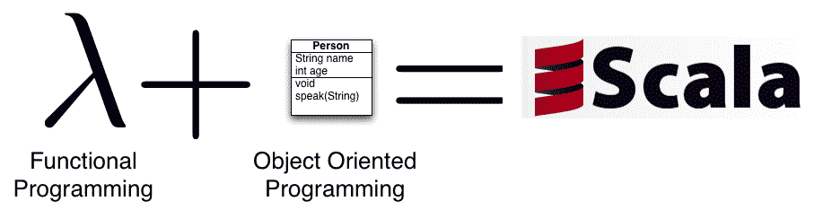

# Scala vs. GO

> 原文：<https://itnext.io/scala-vs-go-3e2e52f19de?source=collection_archive---------0----------------------->

亨德里·萨布里在 [Unsplash](https://unsplash.com?utm_source=medium&utm_medium=referral) 上的照片

# 介绍

自从我涉足 [**DevOps**](https://en.wikipedia.org/wiki/DevOps) 和**大数据之后，**我一直在使用两种优秀但截然不同的编程语言: [**GO**](https://golang.org/) 和 [**Scala**](https://scala-lang.org/) 。

Scala 是一种更古老、更成熟的编程语言，在并发编程和大数据处理等领域找到了自己的位置。另一方面，Go 是谷歌创造的一种更新、更简单的语言，用来克服对 C++的批评；设计一种考虑到多核处理器的语言。

这两种语言都是优秀的语言，都可以为并发应用程序和流处理实现很高的性能，但是它们的设计非常不同。在这篇文章中，我将试着给你一个两种语言的快速概述，它们的优点和缺点，并回顾一些真实的单词用例，我们将推荐一种语言而不是另一种。

# 简单来说 Scala

Scala 是一种由学者创造的编程语言，它是第一个运行在**[**JVM**](https://en.wikipedia.org/wiki/Java_virtual_machine)上的 **Java** 的替代品。它将自己定义为:**

> **Scala 是一种现代多范式编程语言，旨在以简洁、优雅和类型安全的方式表达常见的编程模式。[1]**

**Scala 兼具功能性和面向对象性，提供了两者的优势。它有一种灵活的方式来定义你的程序，由你来决定如何描述它们:从纯粹的函数式编程到纯粹的面向对象编程。**

**像 Java 一样，Scala 是面向对象的:**

> **Scala 是一种纯面向对象的语言，因为[每个值都是一个对象](https://docs.scala-lang.org/tour/unified-types.html)。对象的类型和行为由[类](https://docs.scala-lang.org/tour/classes.html)和[特征](https://docs.scala-lang.org/tour/traits.html)描述。[1]**

**它还提供了对[功能编程](https://en.wikipedia.org/wiki/Functional_programming)和一个强大的[静态](https://en.wikipedia.org/wiki/Static_typing) [类型系统](https://en.wikipedia.org/wiki/Type_system)的支持。与 Java 不同，Scala 拥有 [Scheme](https://en.wikipedia.org/wiki/Scheme_(programming_language)) 、 [Standard ML](https://en.wikipedia.org/wiki/Standard_ML) 、 [Haskell](https://en.wikipedia.org/wiki/Haskell_(programming_language)) 等[函数式编程](https://en.wikipedia.org/wiki/Functional_programming)语言的诸多特性，包括[curry](https://en.wikipedia.org/wiki/Currying)、[类型推理](https://en.wikipedia.org/wiki/Type_inference)、[不变性](https://en.wikipedia.org/wiki/Immutability)、[懒求值](https://en.wikipedia.org/wiki/Lazy_evaluation)、[模式匹配](https://en.wikipedia.org/wiki/Pattern_matching)。它还有一个高级类型系统，支持[代数数据类型](https://en.wikipedia.org/wiki/Algebraic_data_type)、[协方差和逆变](https://en.wikipedia.org/wiki/Covariance_and_contravariance_(computer_science))、[高阶类型](https://en.wikipedia.org/wiki/Higher-order_type_operator)(但不支持[高阶类型](https://en.wikipedia.org/wiki/Parametric_polymorphism))和[匿名类型](https://en.wikipedia.org/wiki/Anonymous_type)。**

> **Scala 也是一种函数式语言，因为每个函数都是一个值。Scala 提供了定义匿名函数的[轻量级语法](https://docs.scala-lang.org/tour/basics.html#functions)，支持[高阶函数](https://docs.scala-lang.org/tour/higher-order-functions.html)，允许函数[嵌套](https://docs.scala-lang.org/tour/nested-functions.html)，支持[curry](https://docs.scala-lang.org/tour/multiple-parameter-lists.html)。[1]**

****

**Java 中没有的 Scala 的其他特性包括[操作符重载](https://en.wikipedia.org/wiki/Operator_overloading)、可选参数、[命名参数](https://en.wikipedia.org/wiki/Named_parameter)和[原始字符串](https://en.wikipedia.org/wiki/Raw_string)。相反，Scala 中没有的 Java 特性是[检查异常](https://en.wikipedia.org/wiki/Checked_exception)，这被证明是有争议的。**

****Scala 在大数据**和其他用例中被大量使用。Twitter 等公司转向 Scala，特别是因为更好的并发支持。Scala 很强大，但是很难学，并且仍然存在一些与 Java 的兼容性问题。**

**Scala 使用的两个关键驱动因素是基于 actor 系统的用于并发编程的 [**Akka**](https://akka.io/) 框架和用于大数据的 [**Spark**](https://spark.apache.org/) 处理引擎。由于其学术性质，除了 Akka 或 Spark 之外，Scala 在现实世界中没有找到太多的用法。虽然在金融机构大量使用。**

## **Scala Pros**

*   **运行在 [**JVM**](https://en.wikipedia.org/wiki/Java_virtual_machine) 上。它附带了多年来构建的所有 JVM 优化，并且与 Java 兼容。**
*   **非常简洁，与 Java 或 GO 相比，它需要更少的样板代码。**
*   ****功能性和面向对象**。**
*   **[**型系统**](https://dzone.com/articles/scala-type-system-in-depth) 非常强大。您可以为您的库构建自定义 DSL，在编译时执行检查等等。**
*   **函数式编程的所有 [**优点**](https://medium.com/@devisha.singh/7-unbeatable-advantages-of-functional-programming-b5d1af1edbe1) 。**
*   **[**Akka**](https://akka.io/) 基于 actor 模型的生态系统使其成为并发系统的绝佳选择。**
*   **强大的 [**构建**](https://www.scala-sbt.org/) 工具。**
*   ****多才多艺**。Scala 可以用来表达任何类型的问题。**

## **Scala Cons**

*   ****复杂。**难学难精通。通常由高级程序员使用。**
*   ****太宽泛**，同样的事情有一百种表达方式，每个 Scala 开发者都有自己的风格，在大型项目中很难保持代码的一致性。**
*   **一些**与 Java** 的兼容性问题；同样，如果你需要使用 Java 库，它会剥夺 Scala 的优势。**
*   ****慢编译器。虽然有像 Bloop 这样的工具可以缓解这些问题。****
*   ****它继承了云原生应用程序的 JVM 问题**,如大型容器、缓慢的启动时间、难以调优、部署缓慢等。**
*   **尽管 Scala 非常通用，但它只是找到了某些利基市场，并没有被广泛采用。**

## **用例**

*   ****大数据和分析**。由于其强大的类型系统和可扩展性，大数据世界中很多工具如 [**Spark**](https://spark.apache.org/) 都使用 Scala。它是数据工程师和大规模流和批处理引擎的首选语言。**
*   ****并发系统和实时应用**。 [**Akka**](https://akka.io/) 框架因其对并发系统的可伸缩性而闻名，并广泛应用于交易服务和其他使用 JVM 的高并发系统。**
*   ****高并发 API**。[**Play Framework**](https://www.playframework.com/)提供了一个高度并发的 web 框架来构建由 **Akka** 支持的应用和 API。**
*   ****巨石**。Scala 是大型整体应用的绝佳选择，甚至是分布式应用。使用 [Akka 集群](https://doc.akka.io/docs/akka/current/index-cluster.html)你可以在一个应用中创建高度分布式的应用。**
*   **一般来说，Scala 是用来为特定领域构建框架和库的，就像 Akka 或 Spark 一样。**

# **简单地说**

**[**走**](https://golang.org/) 是异兽。与 Scala 相比，它没有那么优雅、强大或简洁，但它是为特定目的而构建的，而且做得非常好。**

**Go 是由 Google 创建的，它的语法[类似于](https://en.wikipedia.org/wiki/Syntax_(programming_languages)) [**C**](https://en.wikipedia.org/wiki/C_(programming_language)) **。**它的目标是通过添加[内存安全](https://en.wikipedia.org/wiki/Memory_safety)、[垃圾收集](https://en.wikipedia.org/wiki/Garbage_collection_(computer_science))、[结构类型](https://en.wikipedia.org/wiki/Structural_type_system)来克服 C *++* 中存在的不安全操作。这是非常容易学习和简单使用。它专为多核机器设计，以最大限度地提高并发程序的并行性。它使用非常轻量级的绿色线程 [**Go 例程**](https://golangbot.com/goroutines/) 进行并发编程。**

> **Go 可以快速编译成机器码，同时具有垃圾收集的便利和运行时反射的能力。它是一种快速的静态类型的编译语言，感觉像是一种动态类型的解释语言。[2]**

**go**小**，但是它涵盖了很多用例，比如微服务、流处理、CLIs 等等。Golang 为在不同平台上生成二进制文件提供了出色的支持，而无需在目标上安装 Go。由于其小而有效的二进制大小，它非常适合打包在容器中的云本机应用程序。您的应用程序容器可以打包到一个[微型容器](https://github.com/GoogleContainerTools/distroless/blob/master/examples/go/Dockerfile)(大约 5-10MB)中，只需几秒钟就可以部署，这使得它成为比 JVM 语言更好的微服务选择。欲了解更多信息，请查看我关于在 Kubernetes 中部署 [**Go 微服务的文章。**](/grpc-go-microservices-on-kubernetes-bcb6267e9f53)**

****

## **去职业**

*   ****超快的编译器**，感觉像是解释语言。出色的开发人员体验。**快速的开发过程和提高的生产率**。**
*   ****简单安全**，我喜欢 GO 的一点是，它通常只有一种表达问题的方式，这加快了开发、代码审查以及整个开发过程。**
*   **对初级和高级开发人员来说都很棒。学习和采用非常容易，因为它不需要虚拟环境。**
*   ****云原生应用和 Kubernetes** 的完美选择。由于体积小，没有预热次数和速度。**
*   ****并发**立易拜 [**走套路**](https://golangbot.com/goroutines/) 。**
*   **伟大的标准库，其中包括一个网络服务器。**
*   **GO 可以用在**广泛的** [**用例**](http://go-lang.cat-v.org/go-code) **:** CLIs、web 应用、流处理等。**
*   ****资源使用率非常低**。你可以在一台服务器上运行数百万个围棋程序。与 JVM 相比，它使用很少的 RAM 和 CPU，这使得运行要便宜得多。**

## **去监狱**

*   **是**不简洁**而且很难保持代码干爽。**
*   ****太简单**，像泛型这种基本的东西在 Go 里是没有的，虽然很快会有[加入](https://blog.tempus-ex.com/generics-in-go-how-they-work-and-how-to-play-with-them/)。**
*   **这是一种相对**的新语言**，没有太多的库或教程。**
*   **[**依赖管理**](https://medium.com/@khorlee/dependency-management-in-go-lang-using-go-commands-7900a7b2f760) **有点违背直觉**并且难以管理，但是自从添加了`go mod`之后已经有所改善。好消息是，`go mod`是语言的一部分，而不是像`sbt`那样的独立项目，尽管`sbt`更强大。**
*   **[**错误处理**](https://blog.golang.org/error-handling-and-go) **繁琐**。**
*   **与 Scala 相比，它不够优雅、强大和灵活。**
*   ****有点不成熟**，GO 比 Scala 更新。**

## **用例**

*   ****CLI 和脚本**:像 *kubectl* 这样的 CLI 大多使用 Go。**
*   ****网络应用**。因为它是高度并发的，并且不需要太多资源，所以非常适合处理 HTTP 请求。**
*   ****流应用**。使用 Go 例程，Go 可以极快地处理数百万个事件。它是 Scala 中 Akka 流的竞争对手。**
*   ****微服务**。由于体积小、速度快、监控能力强，Go 是云原生微服务的绝佳选择。**
*   ****无服务器和云应用**。Go 是[无服务器功能](https://cloud.google.com/functions/)的完美选择，特别是在 Google Cloud 中。**

# **Scala vs GO**

**Bot 编程语言是强类型的，有垃圾收集器，它们是安全的，高度并发的，每秒可以处理数百万条记录。**

****对于流处理，使用**GO 更容易、更简单，但依赖于发布/订阅系统，如 [**卡夫卡**](https://kafka.apache.org/) 和 **NoSQL** 数据库，如 [**卡珊德拉**](https://en.wikipedia.org/wiki/Apache_Cassandra) 。Akka 本身就是一个怪兽，可以独立管理大量的请求，没有任何依赖性，它也提供了更多的 fores，比如**背压。****

****对于 web 应用**,[**Play 框架**](https://www.playframework.com/) 更适合于有状态的 web 应用或长期存在的应用，在这些应用中，JVM 有足够的时间来优化应用。Scala 非常适合小型服务或大型平台。如果需要和 Akka 集成也是不错的选择。另一方面， **GO 更适合微服务、云原生应用和** [**无服务器功能**](https://cloud.google.com/functions/) 。对于云中的无状态 API，我会使用 GO，因为它更便宜也更容易。**

**GO 拥有强大的支持[**gRPC**](https://grpc.io/)**这是内部微服务的绝佳选择，这些微服务可以以极快的速度以流的方式使用。****

******对于大数据，Scala 或 Python 是最佳选择**。在大数据领域，围棋仍处于起步阶段。****

****总的来说，GO 的运营和雇佣成本更低。因此，如果成本是一个问题，请考虑 GO。另一方面，Scala 开发人员往往是真正优秀的工程师，这也为组织带来了价值。****

****随着应用程序的增长，GO 源代码往往会变得更难维护，所以我不建议将其作为一个整体，**对于更稳定和更大的项目，Scala 是一个更好的选择，**特别是对于更传统的企业**。******

## ****表演****

****这是一个棘手的问题，如果你用谷歌搜索 vs GO performance，你会找到几篇文章，根据不同的测试，结果会有所不同。起初，GO 似乎在简单的用例中表现得更好，但对于真实世界的场景，Scala，特别是 Play 框架，由于在运行时调整字节码添加优化的 [**JIT JVM 优化**](https://docs.oracle.com/cd/E13150_01/jrockit_jvm/jrockit/geninfo/diagnos/underst_jit.html) ，确实赶上了。****

****对于微服务、无状态应用和容器化应用，GO 会更快更便宜，这是一个巨大的优势。一般来说，如果成本对你来说很重要，围棋会占上风。对于复杂的应用程序，monolith，stateful 处理，Scala 是一个更好的选择。要详细比较 Go 和 Play 框架，请查看这篇[精彩文章](https://medium.com/ymedialabs-innovation/rest-api-performance-comparison-between-golang-and-play-991a8f4040de)。****

********

****GO vs Play REST 获取性能，来源:[https://medium . com/ymedialabs-innovation/REST-API-Performance-comparison-between-golang-and-Play-991 A8 f 4040 de](https://medium.com/ymedialabs-innovation/rest-api-performance-comparison-between-golang-and-play-991a8f4040de)****

****对于流处理，情况也是如此。Akka 更加强大和优雅，它有一个巨大的生态系统和更多的功能，但它的使用，开发和优化是复杂的。如果你有一个好的 Akka 开发团队，他们可以写一个比 GO 更快的处理事件的单块。然而，GO 的扩展非常简单。****

# ****推荐****

## ****如果你是开发人员…****

*   ****如果你是初级开发人员和/或你没有 Java 经验，但有 Python 或 C++经验，学习 GO。****
*   ****如果你想在云计算、初创企业和很酷的项目中工作，那就学习 GO 吧。****
*   ****如果你花不起时间去掌握一门新语言，那就去学吧。****
*   ****如果你是开发流应用和 API 的后端工程师，那就学习 GO 吧。****
*   ****如果你信奉 DevOps 文化，就去学围棋吧。****
*   ****如果你正在使用谷歌云学习围棋。****
*   ****用 GO 写脚本和命令行工具，POC 或者超快的 API。****
*   ****如果你是高级开发人员和/或 Java 开发人员，学习 Scala。****
*   ****如果您已经使用了 JVM 和/或在本地运行，请学习 Scala。****
*   ****如果你正在使用 Akka 和 Spark 寻找高薪工作，学习 Scala。****
*   ****如果你在大数据方面投入很大，学习 Scala。****
*   ****如果你想在金融机构等更传统的行业工作，学习 Scala。****

****简而言之，围棋好玩又爽，易学又简单。在 3 个月内，您就可以为现实世界的使用编写生产就绪的应用程序。Scala 有趣、复杂、具有挑战性，但也很有价值，报酬很高，也更有声望，尤其是在大数据领域。****

## ****如果你是技术主管…****

*   ****当你没有 JVM 依赖并且可以在容器中运行二进制应用程序时，使用 GO。****
*   ****对无服务器函数使用 GO，而不是 JVM。****
*   ****对于在云中或 Kubernetes 中管理的短期分布式 web 应用程序或 API，使用 GO。****
*   ****将 GO 用于自定义脚本、小型作业和 CLI。****
*   ****使用 GO 使用很少的资源以低成本消费和处理大量的事件。****
*   ****如果你在云中运行，特别是谷歌云，使用 GO。****
*   ****如果你依赖 JVM 或者你的开发团队已经熟悉 Java，那么使用 Scala。****
*   ****对于利用 JVM 优化的高并发分布式系统，使用 Scala。****
*   ****大数据用 Scala，特别是 Spark。****
*   ****如果您的 Java 应用程序有伸缩问题，请使用 Scala。****

****总之，GO 是一种二进制语言，消耗很少，很容易采用，对于你的工具箱来说是一个很好的工具，但我不会把它作为大型组织的唯一编程语言，因为它不像其他语言那样通用。Scala 更难，但是如果你已经在使用 Java，它是一个很好的下一步。****

## ****如果你是经理…****

*   ****使用 GO 作为节省成本的机制。Go 比 Scala 便宜，不仅使用更少的资源，而且开发人员的工资也更低。****
*   ****使用 GO 进行**无服务器或 Kubernetes** 。****
*   ****利用 GO 吸引年轻人才，将公司呈现为初创企业。****
*   ****如果你在 Google Cloud 上运行，使用 GO，因为大多数 GCP 服务都是基于 GO APIs 的。****
*   ****将 Scala 用于关键的并发应用、单片或实时系统。****
*   ****使用 Scala 吸引高技能的高级开发人员。****
*   ****用 **Scala 做大数据**。****
*   ****如果您已经在使用 Java，并且您的组织中的改变很困难且需要时间，请使用 Scala。****
*   ****如果你想增加一门新的语言，又不能花太多时间，那么 GO 比 Scala 更容易采用，特别是如果你已经使用 C++而不是 Java。****

****总的来说，围棋的运营成本更低，雇佣人才的成本更低；它易于使用，可以在广泛的用例中采用。它也可以作为一种补充语言，而你仍然是你的核心应用程序的另一种语言。Scala 非常适合大型项目和大数据。如果你在 JVM 上投入了大量资金，Scala 是一个常见的下一步。****

# ****结论****

****在过去的几年里，我一直都在使用 Go 和 Scala，它们各有优缺点。作为一名开发人员，**我喜欢用 Scala 解决问题**，**它相当优雅、简洁、强大；和一乐使用**；然而在现实世界的问题中，我更倾向于依赖围棋，因为我做事更快更便宜；当你在一家需要赚钱的公司工作时，这就是礼貌。得益于快速的编译时间和部署时间以及非常低的资源使用， **GO 是用于云原生应用的最具成本效益的语言**。尽管如此，对于大数据和高度并发的关键系统来说，Scala 是最好的选择，而且它比 GO 更成熟。对于更大、更传统的企业，Scala 更适合。****

# ****参考****

*****【1】*[*https://docs.scala-lang.org/tour/tour-of-scala.html*](https://docs.scala-lang.org/tour/tour-of-scala.html)****

*****【2】*[*https://golang.org/doc/*](https://golang.org/doc/)****

*****记得来* ***拍拍*** *如果你喜欢这篇文章还有* [***关注*** ***我***](https://javier-ramos.medium.com/subscribe) *或* [***订阅***](https://javier-ramos.medium.com/membership) *获取更多更新！*****

****[**订阅**](https://javier-ramos.medium.com/subscribe) 获得**通知**当我发表一篇文章和 [**加入 Medium.com**](https://javier-ramos.medium.com/membership)访问百万或文章！****