# 可扩展微服务演示 K8s Istio Kafka

> 原文：<https://itnext.io/scalable-microservice-demo-k8s-istio-kafka-344a2610eba3?source=collection_archive---------1----------------------->

## 使用 Kafka 进行异步通信的高可伸缩微服务应用程序演示


[https://unsplash.com/photos/-rckGTtnN7w](https://unsplash.com/photos/-rckGTtnN7w)

## 系列内容

该系列使用不同的技术创建相同的可扩展微服务应用程序:

1.  (本文)
2.  [使用 AWS Lambda Kinesis 的可扩展无服务器微服务演示](https://medium.com/@wuestkamp/scalable-serverless-microservice-demo-aws-lambda-kinesis-terraform-cbe6036bf5ac?source=friends_link&sk=074614683a6641cab9b6067929bdc660)
3.  使用 Knative 和 Kafka 的可扩展无服务器微服务演示(计划中)

## 这是怎么回事？

这描述了一个使用 Kubernetes，Istio 和 Kafka 的高度可扩展的微服务演示应用程序。通过同步 REST API 调用，可以创建用户。在里面，所有的交流都是通过卡夫卡异步完成的。

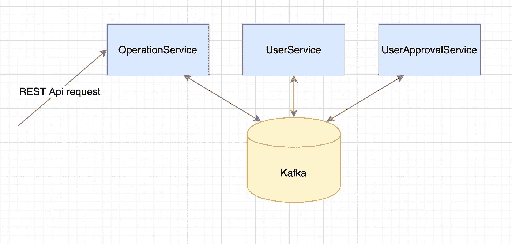

图 1:架构概述

Kafka 消费者/生产者 UserApprovalService 根据 Kafka 主题中有多少未处理的消息被自动缩放(HPA)。还有一个节点/集群缩放器。

**我们将扩展到每秒 23000 个 Kafka 事件，11 个 Kubernetes 节点和 280 个 pod。**

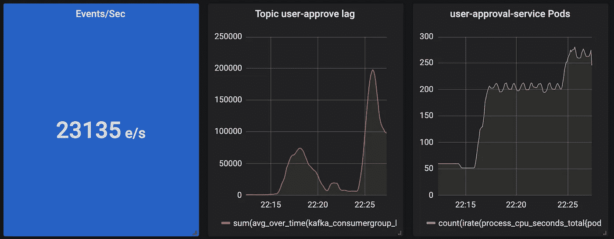

图 2:结果概述

该应用程序完全是在 Terraform 的帮助下编写的，可以使用一个命令运行。

## 技术堆栈:

*   将（行星）地球化（以适合人类居住）
*   (Azure) K8s，MongoDB，容器注册表
*   卡夫卡
*   伊斯迪奥
*   格拉法纳，普罗米修斯，卡夫卡出口商，基亚利
*   蟒蛇，走

## 贮藏室ˌ仓库

[https://github.com/wuestkamp/scalable-microservice-demo](https://github.com/wuestkamp/scalable-microservice-demo)

查看自述文件，了解如何自己运行它。

# 体系结构

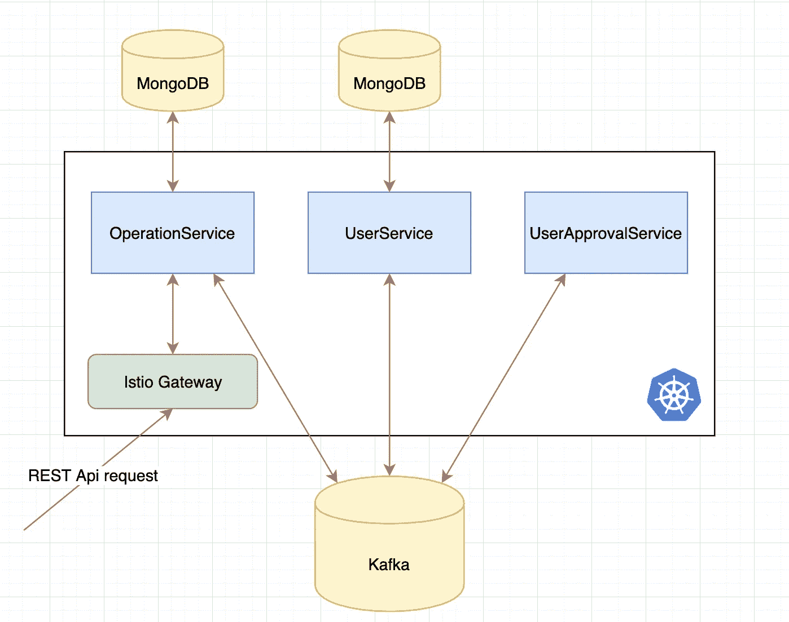

图 3:建筑

我们有三种微服务:

*   **OperationService** (Python):接收同步 REST 请求，并将这些请求转换成异步事件。将请求作为“操作”进行跟踪，并将它们存储在自己的数据库中。
*   **UserService** (Python):处理用户创建并将它们存储在自己的数据库中。
*   **useapprovalserver**(Go):可以批准/拒绝一个用户，无状态。

Kafka 集群由 ConfluentCloud 管理，Mongo 数据库和 K8s 集群由 Azure 管理。

## 每个服务模式的数据库

我们不使用多个服务共享的大型数据库，如果是有状态的，每个服务都有自己的数据库。我们仍然只有一个 MongoDB 数据库服务器，但是在这个服务器上可以存在多个数据库。如果微服务使用相同的类型/版本，它们可以共享同一个数据库服务器。点击阅读更多[。](https://microservices.io/patterns/data/database-per-service.html)

## 异步通信

这三个微服务彼此异步通信，没有直接的同步连接。异步的一个优点是松耦合。如果 UserApprovalService 关闭了一段时间，请求不会失败，只是需要更长的时间，直到用户获得批准。因此，当使用异步通信时，不需要实施重试或断路器。

## 消息工作流

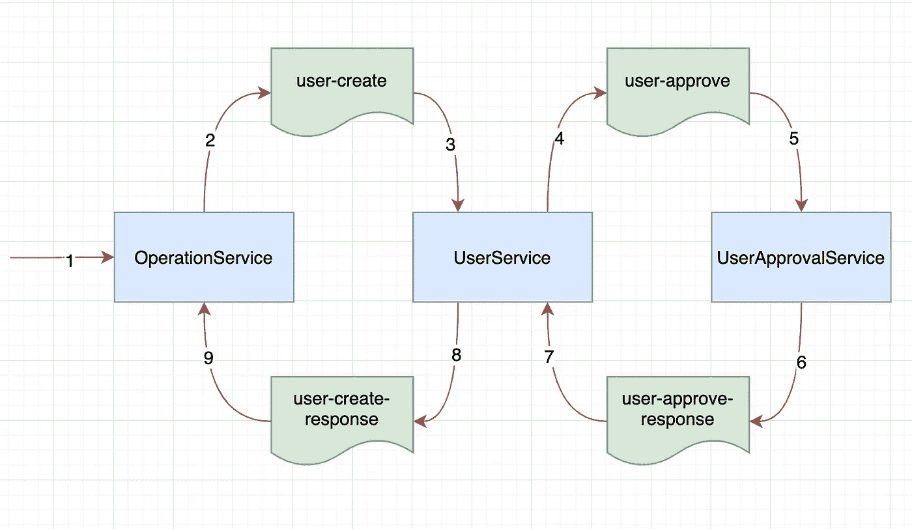

图 4:消息工作流

图 4 显示了生成和消费的消息。**用户服务**使用`user-create`消息，创建存储在 MongoDB 中的“待批准”用户，并生成消息`user-approve`。

一旦它接收到来自**userprovalservice**的`user-approve-response`消息，它就将用户更新为“已批准”或“未批准”并产生`user-create-response`消息，该消息将被 **OperationService** 接收，后者将操作状态更新为“已完成”。

## 传奇模式

当您使用一个大型(MySQL)关系数据库时，您可以简单地将您的操作包装在数据库事务中。SAGA 模式可用于跨多个微服务为操作实现类似 ACID 的事务。

在图 4 中，用户服务可以被认为是 SAGA 用户创建的编排者。因为它通过生成和消费各种消息来协调用户创建。在本例中，只涉及到一个服务(UserApprovalService)，但是如果有更多的服务，情况会变得更加复杂。

一个传奇可以被比作一个状态机来实现。点击这里阅读更多关于传奇模式和编排与编排的区别:[https://microservices.io/patterns/data/saga.html](https://microservices.io/patterns/data/saga.html)

## 同步异步转换

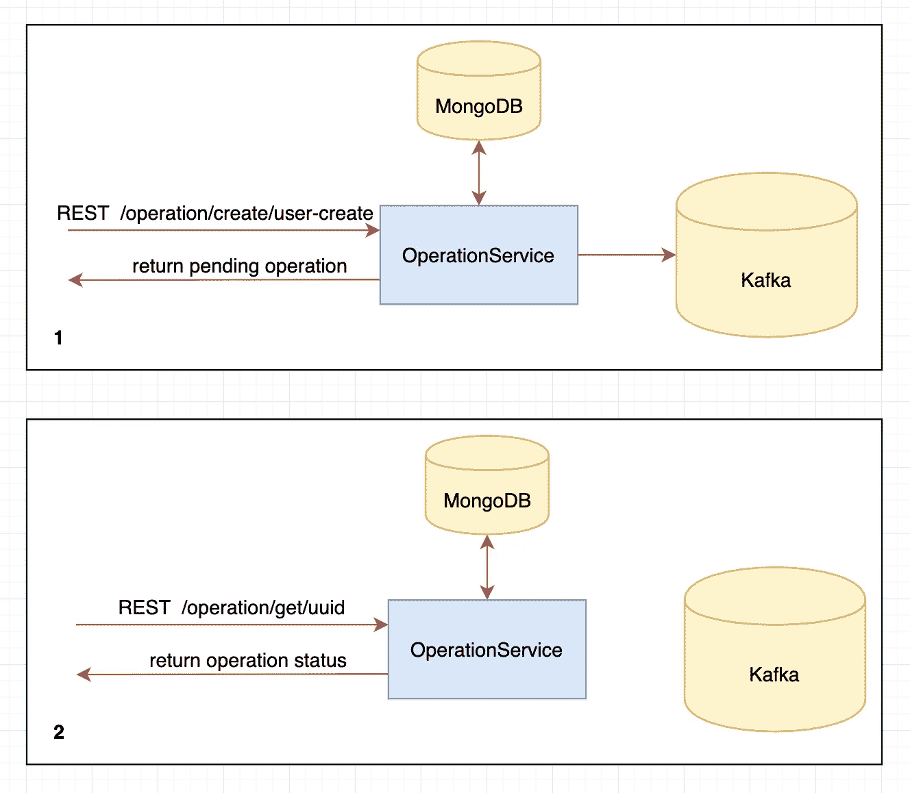

图 5:同步到异步转换

( **1** )图 5 显示，首先对 OperationService 进行同步 REST 调用，以创建一个新操作，在本例中为“user-create”。OperationService 发出异步消息，然后立即返回处于挂起状态的新操作。

( **2** )返回的操作包含一个 UUID，它可以用来定期获取该操作的当前状态。该操作将根据其他服务发出的进一步异步请求进行更新。

# 基于 Kafka 消息计数的缩放

Kubernetes 集群扩展是用 Azure 上的 Terraform 配置的。我们在 UserApprovalService 部署上也有一个 HPA(水平 Pod 自动缩放器)。

HPA 监听自定义指标，该指标提供了关于 Kafka 主题用户批准中有多少消息尚未处理的信息。如果有消息在排队，我们会旋转更多的 pod。

UserApprovalService 在处理完一条消息后会休眠 200 毫秒。这意味着如果它是唯一的实例并且新消息不断出现，它将会落后。

# 监控和指标

我们用普罗米修斯和格拉夫纳来想象正在发生的事情。

## 卡夫卡度量

为了从 Kafka 获得度量，我们使用了 [kafka_exporter](https://github.com/danielqsj/kafka_exporter) ，这使得这些在 Prometheus 和 Grafana 中可用。我们在 UserApprovalService 的每个 Pod 中将 kafka_exporter 实现为 sidecar，这样每个 Pod 都可以使用这些指标。

为了将这些 Kafka Prometheus 指标用作 K8s 自定义指标(HPA 需要)，我们使用了 [k8s-prometheus-adapter](https://github.com/DirectXMan12/k8s-prometheus-adapter) 。

```
# confirm install
kubectl api-versions | grep "custom.metrics"# list Kafka topic metrics
kubectl get --raw /apis/custom.metrics.k8s.io/v1beta1  | jq# list Kafka topic metrics for every pod
kubectl get --raw "/apis/custom.metrics.k8s.io/v1beta1/namespaces/default/pod/*/kafka_consumergroup_lag" | jq
```

项目的`[prometheus-adapter.yaml](https://github.com/wuestkamp/scalable-microservice-demo/blob/master/infrastructure/helm/config/prometheus-adapter.yaml)`中有更多细节。现在，我们能够将这些 Kafka 指标用于 K8s HPA。

## Istio metrics / Kiali

Kiali 与 Istio 配合得非常好，可以立即向我们概述正在发生的事情:

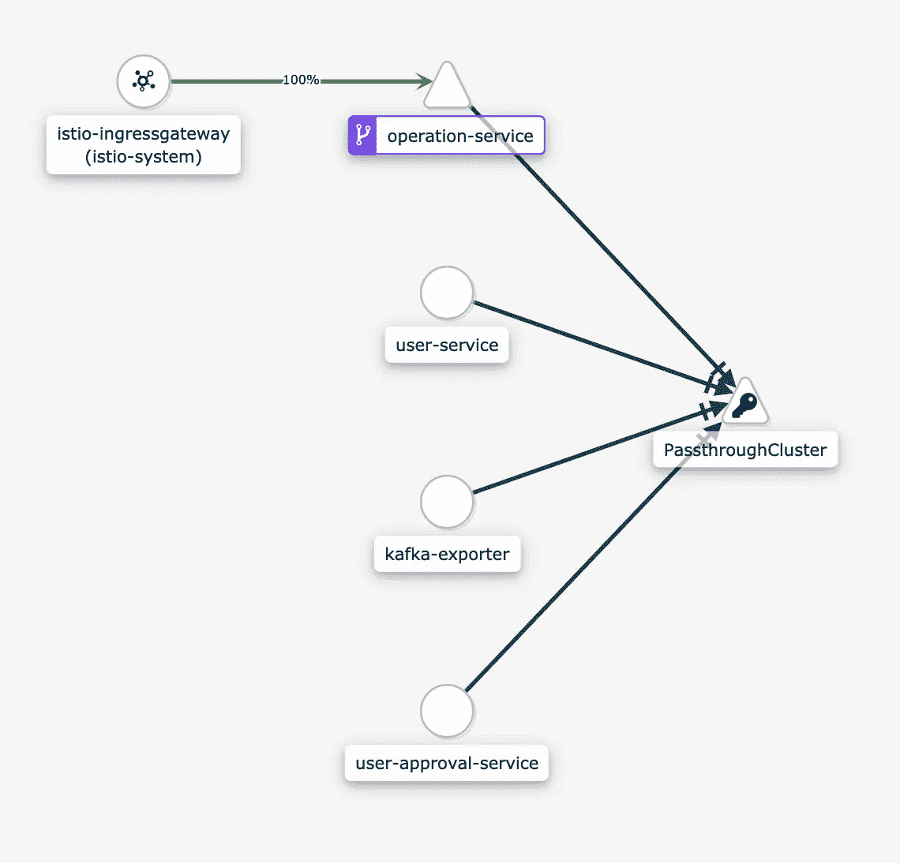

图 6: Kiali 网络

在图 6 中，我们看到 REST 请求到达 Istio Gateway，然后到达 OperationService。所有其他通信都通过“PassthroughCluster”进行，这是外部管理的 Kafka。我们还可以看到 kafka-exporter 正在与 kafka 通信以收集指标。

到今天为止，Istio 还不能更详细地管理 Kafka 流量，它把它作为 TCP 来处理。特使似乎已经能够做到这一点，这意味着 Istio 将跟进。我们可能还会看到 Kiali 的进步，比如在边缘上显示每秒的消息数量。

在 Joel Takvorian 的 Twitter 帖子中可以看到更多，他成功地将 Kafka 节点包含到了 Kiali 服务图中。

# 在活动

现在好戏开始了。

## UserApprovalService 滞后

如果不启用 HPA，我们每秒会创建大约 60 个新事件。


图 7:主题用户批准延迟增加

**从左到右我们看到:**

*   卡夫卡事件/秒
*   尚未处理(滞后)的用户批准事件
*   用户批准服务窗格数量
*   节点数量

UserApprovalService 在处理完一条消息后会休眠 200 毫秒。这意味着如果它只有一个实例，并且新事件不断出现，它将会落后，正如我们在图 7 中看到的。

## 启用缩放

现在，随着 HPA 的启用和不断增加的输入 REST 请求来创建新用户。

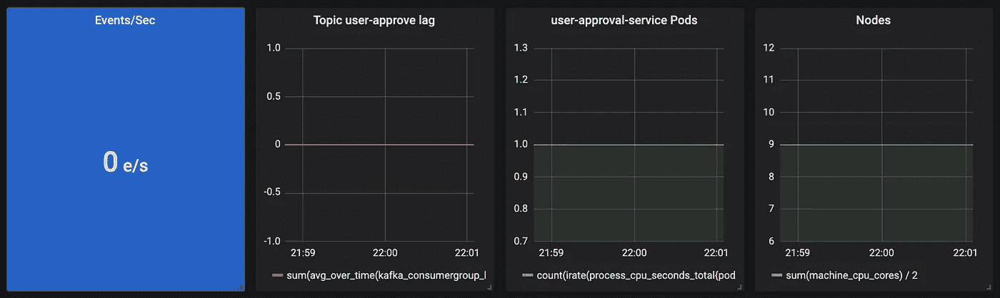

图 8:无负载，但我们从 9 个节点开始，以实现更快的扩展

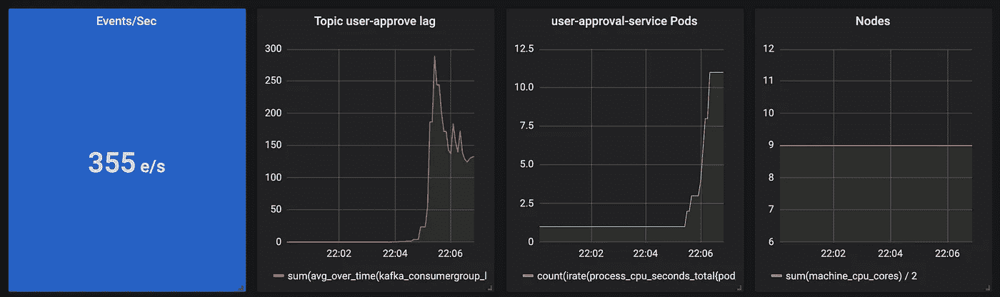

图 9:请求命中，我们看到 HPA 扩展了 Kafka 消费者 UserApprovalService


图 10:每秒 2045 个事件

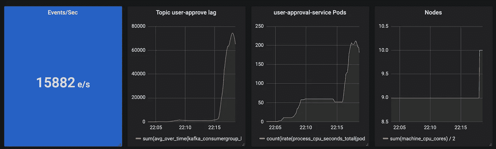

图 11:第一个节点缩放

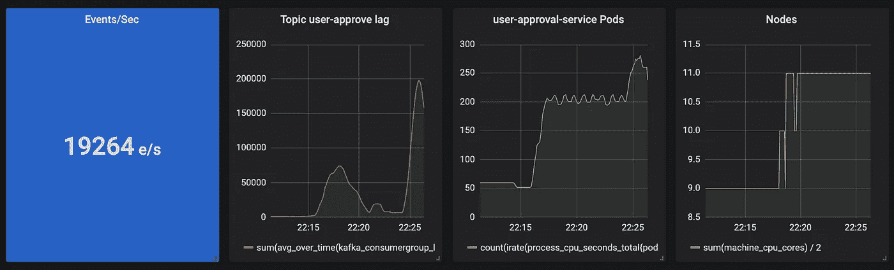

图 12:每秒接近 20000 个事件

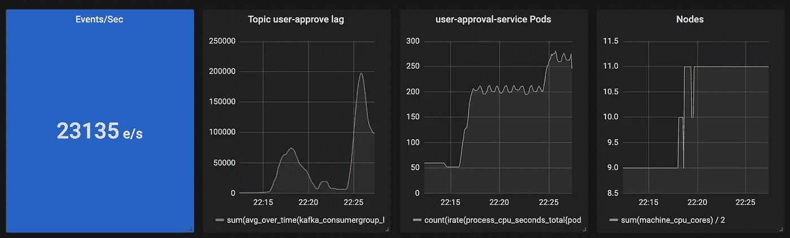

图 13: 23000！

# 概述

该应用程序自动扩展到约 280 个 UserApprovalService pods、11 个节点，每秒处理约 23000 个事件！这是一个很好的开始:)

这只是由于 Azure 帐户的计算限制而停止，无法创建更多节点。

# 来源

*   我非常喜欢的一本书:Chris Richardson 的微服务模式。这本书的很多信息也可以在 [https://microservices.io](https://microservices.io) 上找到
*   [一篇关于如何在 Kafka 上使用 HPA 的好文章](https://medium.com/@ranrubin/horizontal-pod-autoscaling-hpa-triggered-by-kafka-event-f30fe99f3948)

# 成为 Kubernetes 认证

[](https://killer.sh)

[https://killer.sh](https://killer.sh)