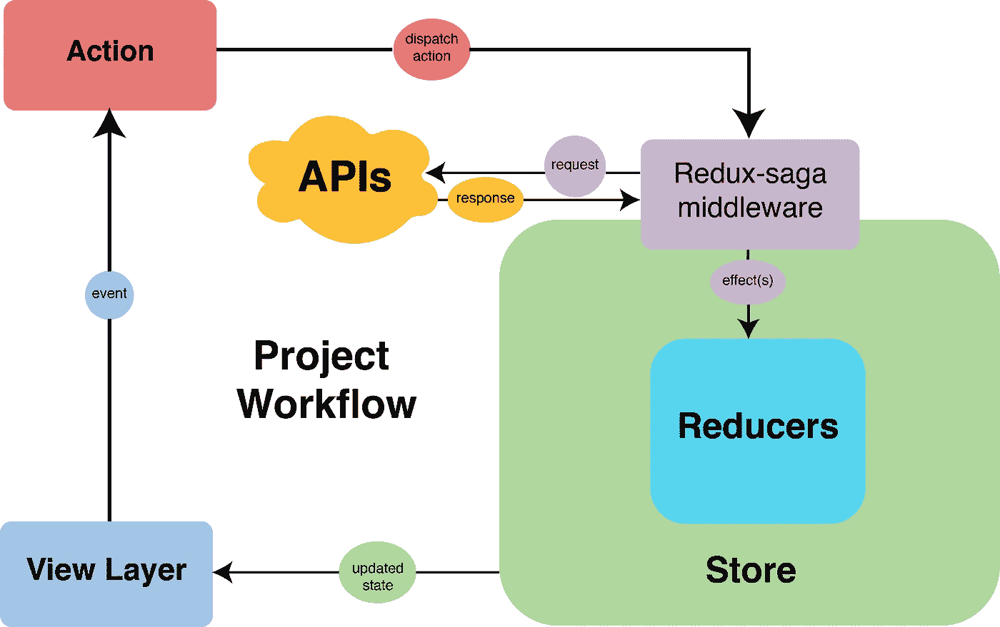
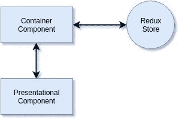

# 使用 Redux-Saga 和 Typescript 的 React 项目的可扩展 Redux 架构

> 原文：<https://itnext.io/scalable-redux-architecture-for-react-projects-with-redux-saga-and-typescript-f6afe1dece9b?source=collection_archive---------1----------------------->

Redux 是一个在 Javascript 应用程序中管理数据状态和 UI 状态的工具。在本教程中，我们将看到如何组织由 Redux 组成的项目的结构。


*Redux 是 JavaScript 应用程序的可预测状态容器。它帮助您编写行为一致、在不同环境(客户机、服务器和本机)中运行、易于测试的应用程序。——*[*https://redux.js.org/*](https://redux.js.org/)

虽然 Redux 在很大程度上与 React 相关联，但它也可以与其他库一起使用，如 Vue、Meteor、Angular 等。它也是轻量级的，大约 2KB(包括依赖项)，所以您不必担心应用程序变得太大。

既然我们已经解决了 Redux 定义的问题，那么让我们开始开发一个经过测试的、严格类型化的、可伸缩的架构吧！

如果您想直接跳到架构规范，请转到“Redux 项目的架构设计”一节。你也可以从[这里](https://github.com/ersah123/scalable-react-redux-saga)看一看我为本教程创建的回购。

## 内容

*   [项目设置](#a23d)
*   [将 Redux 整合到项目中](#310f)
*   [构建 Redux](#787c)

## 先决条件

*   `Node v10.x.x`

# 项目设置

我们将使用带有 typescript 的`create-react-app`开始，但是这个架构也可以应用于任何现有的项目:

```
$ yarn create react-app my-app --typescript
```

然后，我们可以转到项目目录并启动应用程序:

```
$ yarn start
```

## 安装依赖项

显然，我们需要将 redux 相关的依赖项安装在项目根目录中另一个命令行的代码库中:

```
$ yarn add redux@4.0.4 react-redux@7.1.0 redux-saga@1.0.5 redux-saga-test-plan@4.0.0-beta.4 typesafe-actions@4.4.2 enzyme@3.10.0 redux-mock-store@1.5.3 enzyme-adapter-react-16@1.14.0
```

让我们也添加开发依赖项:

```
$ yarn add --dev @types/react-redux@7.1.1 @types/enzyme@3.10.3 @types/redux-mock-store@1.0.1 @types/enzyme-adapter-react-16@1.0.5
```

# 将 Redux 集成到项目中

安装后，我们需要对现有代码进行一些更改，为 Redux 架构准备代码基础。首先，请清除`return`中的所有标记。然后用 redux 存储和容器为 redux 提供程序添加标记。最终的 App.tsx 将如下所示:

接下来，我们将在`src`目录下创建`state`文件夹来保存我们的商店配置文件和 Redux 商店的初始化。

```
$ mkdir src/state && touch src/state/index.ts
```

为了能够基于环境配置中间件，让我们创建一个索引文件来导入存储配置。在本教程中，我们将停留在开发环境中:

接下来，我们需要在同一个目录中创建商店初始化器的开发配置:

出于状态模块化的目的，我们将遵循基于特征的文件夹结构方法。叫做鸭子。你可以在这里了解更多这种模式:[freeCodeCamp](https://medium.com/u/8b318225c16a?source=post_page-----f6afe1dece9b--------------------------------):[https://www . freeCodeCamp . org/news/scaling-your-redux-app-with-ducks-6115955638 be/](https://www.freecodecamp.org/news/scaling-your-redux-app-with-ducks-6115955638be/)

因此，让我们创建我们的第一个鸭子文件夹，它将包含其他鸭子(功能文件夹):

```
$ mkdir src/state/ducks && touch src/state/ducks/index.ts
```

然后我们需要创建定义应用程序状态的根 reducer:

# 构建 Redux 项目

*Redux 架构围绕着严格的单向数据流。*

*这意味着应用程序中的所有数据都遵循相同的生命周期模式，使应用程序的逻辑更可预测、更易于理解。它还鼓励数据标准化，这样您就不会有多个彼此不知道的相同数据的独立副本。——*[https://redux.js.org/basics/data-flow](https://redux.js.org/basics/data-flow)



具有 Redux-Saga 的通用 Redux 架构

在该架构中，数据流如下:

*   组件处理一个事件并调度一个操作
*   Redux 调用缩减器函数
*   相关的减速器功能更新状态
*   监听该状态片变化的容器得到通知
*   容器用新的状态和属性更新组件
*   如果改变了属性，组件将被重新渲染

与此同时，传奇人物正在倾听某些行动并处理副作用。按产品，它会调度新的动作。

让我们继续实现数据流。首先，我们需要一个公共 API 来消费。为此，我们将使用 [JSONPlaceholder](https://jsonplaceholder.typicode.com/) 。

为了保存 api URL，我们需要创建。环境文件。添加以下行后，不要忘记重新启动 npm 服务器:

```
// .envREACT_APP_JSON_PLACEHOLDER=[https://jsonplaceholder.typicode.com](https://jsonplaceholder.typicode.com)
```

为了简单起见，我们将在本教程中只实现 GET 请求。但是您可以通过创建携带有效负载的新动作来发送到 API 端点，从而轻松地进行 POST。为了使其类型安全，您还应该在此基础上更改操作类型。基于此，我们的可扩展架构和文件夹结构如下所示:

```
src
├── App.css
├── App.test.tsx
├── App.tsx
├── components
│   ├── post.tsx
│   └── postList.tsx
├── containers
│   ├── __tests__
│   │   └── postList.container.spec.tsx
│   └── postList.tsx
├── index.css
├── index.tsx
├── logo.svg
├── react-app-env.d.ts
├── serviceWorker.ts
└── state
    ├── configureStore.dev.ts
    ├── ducks
    │   ├── index.ts
    │   └── post
    │       ├── __tests__
    │       │   ├── __mockData__
    |       |   |  └── postsData.json    
    |       │   ├── actions.spec.ts
    │       │   ├── reducers.spec.ts
    │       │   └── sagas.spec.ts
    │       ├── actions.ts
    │       ├── reducers.ts
    │       ├── sagas.ts
    │       └── types.ts
    ├── index.ts
    ├── middlewares
    │   └── saga.ts
    └── utils
        └── apiCaller.ts
```

因为我们将在 API 中对`posts`进行操作，所以文件夹名将被称为‘post’。还将在其中创建测试和模拟数据文件夹，如下所示:

```
$ mkdir src/state/ducks/post src/state/ducks/post/__tests__ src/state/ducks/post/__tests__/__mockData__
```

此外，我们需要在这个文件夹中存储该特性的相关类型。将相关类型添加到类型文件中:类型

我们将需要一些模拟数据用于我们的`post`特性，看起来像这样:

## 行动

我们将从编写我们的`post`特性的动作开始。为了简单起见，我们不会在本教程中讨论错误处理。我们将首先开始编写测试:

然后，写出实际行动:

## 还原剂

我们需要减速器来塑造我们的国家。让我们从测试开始实现:

实际的减速器将如下所示:

通过这样做，redux 已经设置好并可以使用了。下一步是如何处理副作用。

## 中间件

因为我们希望我们的行为和减少者是纯净的，我们需要在别的地方处理它。最佳实践是使用某种能够监听动作并将其他动作分派给 Redux 的中间件。有一些选项，但对于本教程，我们将使用 Redux-Saga。这也是我们执行 Ajax 调用的地方。

为了保存我们的中间件，我们将在`state`目录下创建一个名为`middlewares`的新文件夹:

```
$ mkdir src/state/middlewares && touch src/state/middlewares/sagas.ts
```

让我们创建一个 saga 中间件，用于商店初始化:

要使用 Redux-saga，我们需要添加新的中间件来存储配置，如下所示:

和往常一样，我们将从编写测试开始。使用`redux-saga-test-plan`包为传奇编写测试非常简单明了:

接下来，我们将写我们的第一个传奇故事来听某些动作:

我们还需要创建一个根传奇来派生我们代码库中的所有特性传奇:

## Ajax 调用

我们将首先创建一个新文件夹来保存我们的状态实用程序:

```
$ mkdir src/state/utils && touch src/state/utils/apiCaller.ts
```

为了调用 API，我们将使用内置方法`fetch`。我们将通过创建一个名为`apiCaller`的实用函数来实现这一点。

## 容器

作为最佳实践，我们应该区分容器组件和表示组件。容器组件是 Redux 存储和表示组件之间的桥梁。容器组件从 redux store 获取数据，并将数据和动作提供给表示组件。他们倾向于有状态。



因为容器可以监听多个状态片，所以它们应该进入自己的目录。

```
$ mkdir src/containers src/containers/__test__
```

让我们首先开始为容器编写测试:

接下来是实际的集装箱编码:

最后，我们来创建演示组件:

```
$ mkdir src/components
```

这样，我们完成了 Redux 数据流和架构。无论您向这个代码库添加多少功能，复杂性几乎都是一样的。

## 下一步是什么？

您可以安装一些工具和依赖项，并将其作为中间件来使用，以简化您的开发并帮助新手更快地上手。

*   冗余记录器
*   redux-devtools-扩展

## 结论

随着我们的前进，我们会根据我们的需求努力设计项目。这使得我们的项目更具可持续性。在这样做的同时，我们学习和总结我们所学到的东西，以便我们可以在未来的项目中重复使用和改进。

Redux 已经走过了漫长的道路，并且仍然保持强劲。Redux 至今仍很流行，并广泛应用于生产中的许多项目。我们使用的这种架构仍然是最新的，并且工作正常。希望这篇教程能对你的下一个项目有所帮助。

干杯！