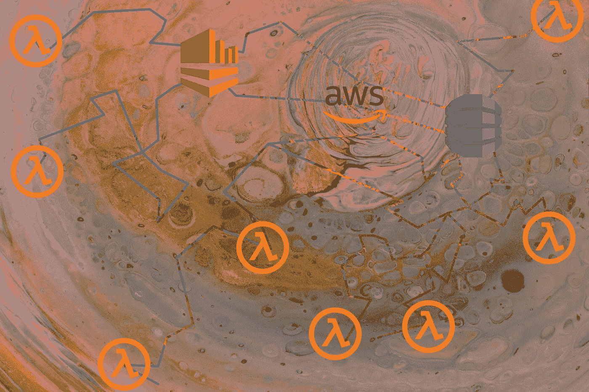
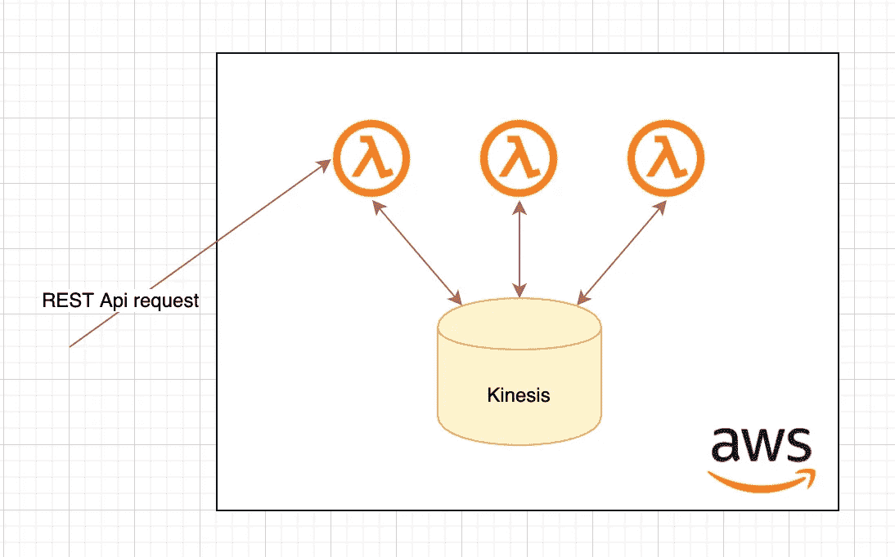
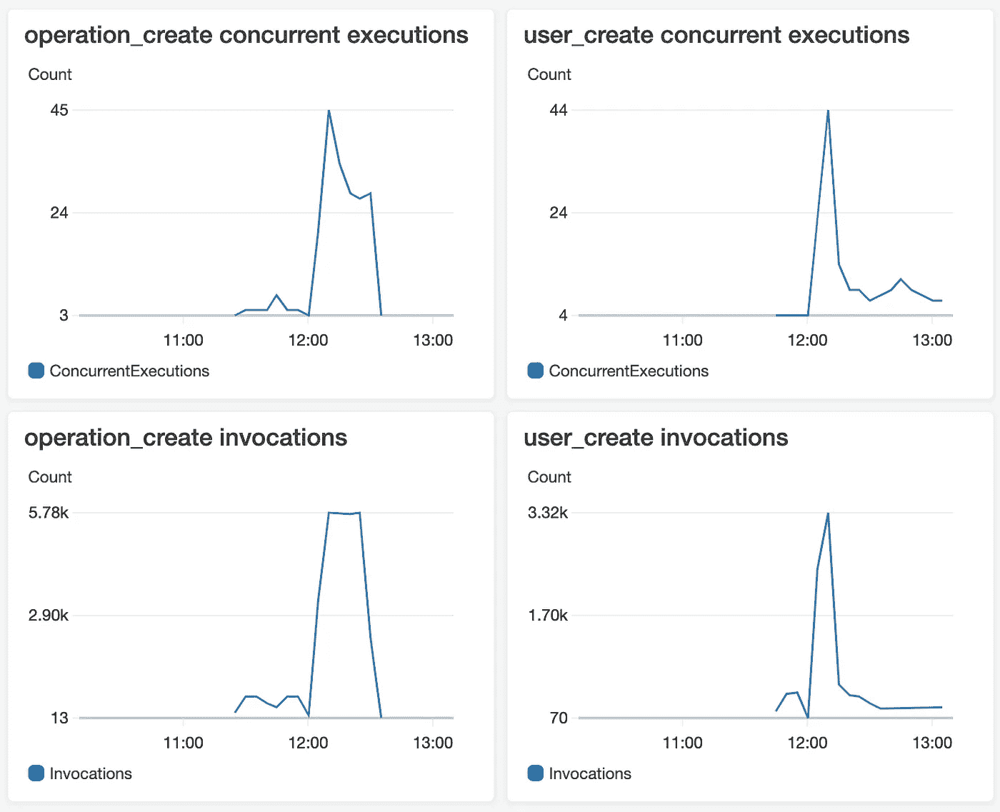
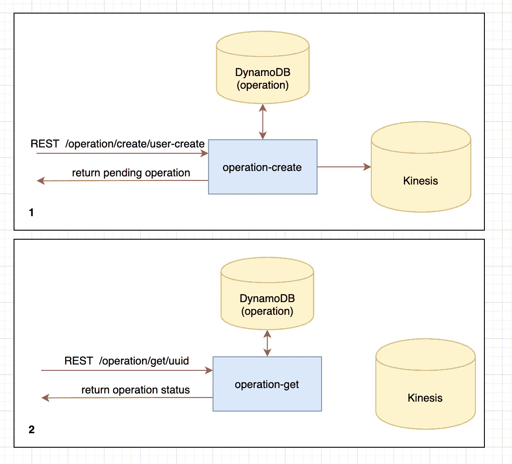
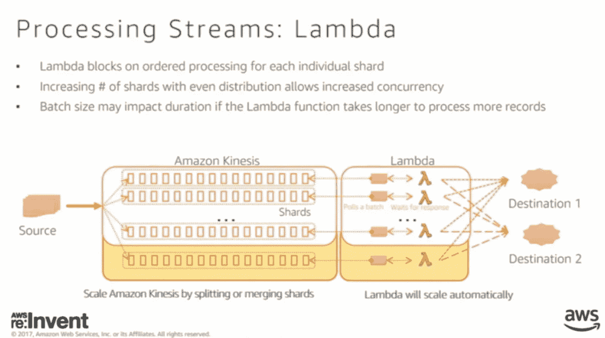
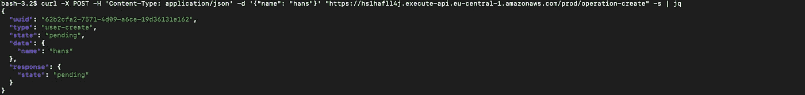
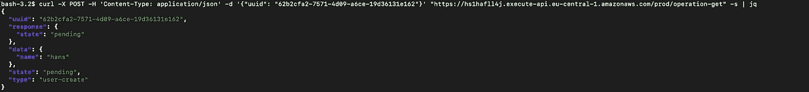
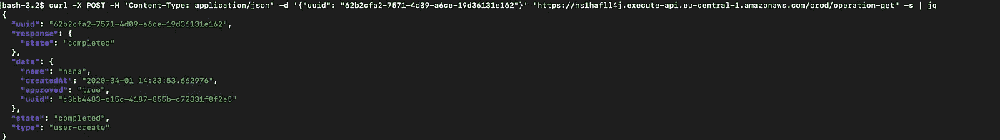
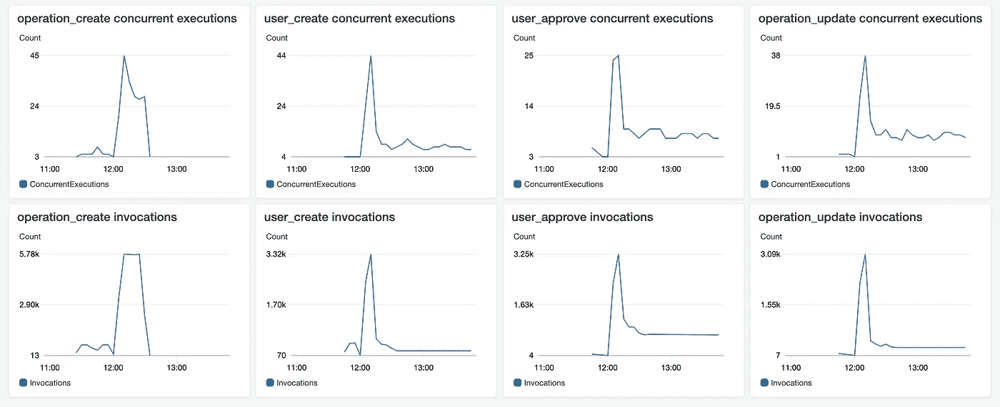

# 可扩展的无服务器微服务演示 AWS Lambda motis terra form

> 原文：<https://itnext.io/scalable-serverless-microservice-demo-aws-lambda-kinesis-terraform-cbe6036bf5ac?source=collection_archive---------3----------------------->

## 使用驱动程序演示具有异步通信的高度可扩展的无服务器微服务应用程序



## 系列内容

本系列使用不同的技术创建相同的可扩展微服务应用程序:

1.  [使用 Kubernetes、Istio 和 Kafka 的可扩展微服务演示](/scalable-microservice-demo-k8s-istio-kafka-344a2610eba3?source=friends_link&sk=7404e77f2a42d21261707794afaed58d)
2.  (本文)
3.  使用 Knative 和 Kafka 的可扩展无服务器微服务演示(已计划)

## 这是怎么回事？

在这里，我们构建了与[第 1 部分](/scalable-microservice-demo-k8s-istio-kafka-344a2610eba3?source=friends_link&sk=7404e77f2a42d21261707794afaed58d)中相同的微服务应用程序。虽然这一次我们使用了无服务器技术及其周围的 AWS 生态系统。通过同步的 REST API 调用，可以创建用户。所有进一步的交流都是通过驱动程序异步完成的。



图 1:体系结构概述

## TL；速度三角形定位法(dead reckoning)

我们在一个时间点跨所有函数扩展到大约 180 个并发 Lambda 执行和大约 18000 个 Lambda 调用。这主要受到驱动碎片数量的限制。



图 2:显示两个λ函数的度量的结果预览

## 存储库/技术

[https://github . com/wuestkamp/scalable-无服务器-microservice-demo](https://github.com/wuestkamp/scalable-serverless-microservice-demo)

Terraform，AWS: Lambda (Python)，运动学，DynamoDB，S3，API-Gateway

一切都是用 Terraform 编写的，可以通过运行一个命令来设置，更多信息见[项目的自述文件](https://github.com/wuestkamp/scalable-serverless-microservice-demo)。

# 体系结构


图像 3:建筑

图 3 显示了架构。我们有 5 个主要的 Lambda 函数，都是用 Python 编写的:

*   **操作-创建**:将同步 REST API 请求转换为异步事件，创建一个“操作”来跟踪用户创建
*   **用户-创建**:在“需要审批”状态下创建新用户
*   **用户批准**:批准用户
*   **用户-创建-响应**:检查用户创建是否完成。现在，只有用户批准的响应是必要的，但是更多与其他服务的交互是可能的
*   **操作-更新**:用新的状态更新操作，如完成或错误

## 同步异步转换

还有另一个 Lambda 函数**操作-get** 允许用户检索操作的状态，但是我没有把它包括在图像 3 中。



图 4:同步到异步转换

( **1** )图 4 显示，首先对 operation-create Lambda 进行了一个同步 REST 调用，以创建一个新的操作。Lambda 函数向 Kinesis 发出一条消息，然后立即返回处于挂起状态的新操作。

( **2** )返回的操作包含一个 UUID，它可以用来定期获取该操作的当前状态。该操作将根据其他服务异步发出的进一步异步请求进行更新。

## 与第 1 部分相比

与[第 1 部分](/scalable-microservice-demo-k8s-istio-kafka-344a2610eba3?source=friends_link&sk=7404e77f2a42d21261707794afaed58d)相比，该架构现在有 6 个服务(或者说是 Lambda 函数)，而在第 1 部分中我们只有 3 个服务。但是我们仍然可以将这 6 项功能分成 3 个不同的组，如下所示:

*   **操作服务**:操作-创建，操作-获取，操作-更新
*   **用户服务**:用户创建，用户创建响应
*   **用户批准服务**:用户批准

我决定将第 1 部分的服务分成更小的功能，因为用 Lambda 很容易做到。通过这种方式，每个函数只监听一个很棒很干净的特定事件。

## 无服务器

这看起来像是梦，对吗？编写应用程序，然后它就可以运行了。它可以自动扩展/缩小，高度可用，响应速度快。这个演示项目的目的也是为了找出我们是否已经在这一点上。

## 每个服务模式的数据库

我们不使用多个服务共享的大型数据库，如果是有状态的，每个服务都有自己的数据库。如果微服务使用相同的类型/版本，它们可以共享同一个数据库服务器。点击阅读更多[。使用 AWS DynamoDB，您甚至不需要管理服务器实例，只需创建表。](https://microservices.io/patterns/data/database-per-service.html)

## 异步通信

所有 Lambda 函数彼此异步通信，没有直接的同步连接。异步的一个优点是松耦合。如果用户批准功能关闭了一段时间，请求不会失败，只是需要更长时间直到用户获得批准。因此，当使用异步通信时，不需要实施重试或断路器。

# AWS API 网关

允许您创建(REST)API 并管理端点、伸缩、节流、TLS 终止、认证等等。它连接现有的 AWS 服务或外部服务。

# AWS 室壁运动

> Amazon Kinesis 可以轻松收集、处理和分析实时流数据，因此您可以获得及时的见解，并对新信息做出快速反应。Amazon Kinesis 提供了经济高效地处理任何规模的流数据的关键功能，以及选择最适合您应用要求的工具的灵活性。(【https://aws.amazon.com/kinesis】T2

# AWS 无服务器λ函数

它们根据来自不同来源的输入事件，在需要时运行您的代码。例如，这些可以是 API 调用、数据库更改或来自其他功能的调用。

## 缩放比例

通常，对于每个事件，都会启动一个新的函数实例。尽管如果在短时间内有更多的事件跟随，实例可以被重用。但是一个实例永远不会被用来同时处理两个或更多的事件。在这些情况下，将创建同时运行的新实例。

## 层

层允许你保持实际的 Lambda 函数很小。如果你的函数太大，你将不能在网络编辑器中编辑它们。这个演示创建了一个包含`aws-xray-sdk` python 依赖项的层。这一层然后被所有函数使用。

## 用 X 射线追踪

只需一次点击，即可启用 X 射线追踪。这样就有可能看到一个函数何时被执行以及运行了多长时间。使用`aws-xray-sdk`还可以跟踪从函数内部对其他 AWS 服务甚至外部(HTTP)API 的调用。下面是在 python 中如何做到这一点:

```
import json
import boto3
**from aws_xray_sdk.core import patch_all
patch_all()**

def lambda_handler(event, context):
  ...
```

更多关于 SDK 和补丁[在这里](https://docs.aws.amazon.com/xray/latest/devguide/xray-sdk-python-patching.html)。

## Kinesis 并发事件处理

为了让多个 Lambda 函数同时处理来自同一个 Kinesis 流的事件，有必要拥有多个 Kinesis 流碎片。一个 shard =一个并发 Lambda 函数。



图 5: Kinesis 并发 Lambda 处理

# 实际演示

## 创建一个用户



图 6:创建一个新用户，带有挂起状态的即时响应



图 7:用户创建仍未完成



图 8:用户创建完成

## 创造大量用户

现在我们用大量的请求来攻击我们的 API。事件流将是:

**操作 _ 创建** - > **用户 _ 创建** - > **用户 _ 批准** - > **操作 _ 更新**

(为了保持简洁，图中没有用户创建响应的指标)



图 6:运行中的 Lambda 指标

*   我们从 12:00 到 12:20 使用 API ( **operation_create** )处理新的用户创建请求
*   Kinesis 碎片的大小为 50，所以每个碎片最多只能同时消耗 50 个功能
*   我们可以看到，即使当新请求( **operation_create** )在 12:30 左右停止时，其他函数仍然在现有的 Kinesis 事件上工作了一段时间，并且从未完成

# 结果

我们能够在一个时间点跨所有函数扩展到大约 180 个并发 Lambda 执行和大约 18000 个 Lambda 调用。这受到了动力流碎片数量的限制。及时处理大量的请求是不够的。这应该可以通过提高碎片量来解决。

这让我怀疑这种方法是否是一个好的技术选择。要有更多的并发消费者，肯定需要改进。**如果您有任何意见，请告诉我！**

## AWS API 网关

API-Gateway(默认情况下)的响应时间很慢，大约为 1 秒，这使得很难将请求扩展到很高的数量。为了解决这个问题，我在 while 循环中运行`curl`,不等待响应，这样我就可以创建负载。

响应延迟可能是由 API 网关同步调用 Lambda 函数并将其响应返回给用户引起的。Lambda 函数需要一些时间来加载和准备。这可以通过设置一个[保留并发](https://docs.aws.amazon.com/lambda/latest/dg/configuration-concurrency.html#configuration-concurrency-reserved)来处理。

## AWS Kinesis 和并发消费者

需要考虑的一点是，在一个 Kinesis 流分片上只能有一个 Lambda 函数并发运行。所以为了扩大规模，你需要创造更多的碎片。我用 50 个碎片创建了四个动力流，这是由于我的地域限制。

## 与第一部分的比较:Kubernetes Istio Kafka

这两种解决方案的扩展幅度几乎相同，并且通过简单地增加资源就显示出了增长潜力。

与第 1 部分相比，使用 AWS 生态系统比更手动的方法要快得多。我猜我花了三分之一的时间。

这是因为所有托管服务已经很好地协同工作，通常只需勾选一个框就可以实现跟踪等功能。还有监控，如果 CloudWatch 的默认提供足够了，那么它可以直接与几乎所有的服务一起开箱即用。

## AWS 阶跃函数

还有 [AWS 步骤函数](https://aws.amazon.com/step-functions/)，通过将各种 Lambda 函数连接在一起，允许创建状态机作为可视化工作流。然后，它们可以通过直接调用同步通信，或者通过队列异步通信。

虽然 Kinesis 作为函数间的事件代理不被支持，甚至当使用 SQS 时，仍然需要更复杂的其他函数调用。这就是为什么我选择不使用它，但它看起来很有前途。

# 概述

无服务器和周围基于事件的生态系统(比如 AWS)看起来真的是软件架构的未来。在我看来，这就是我们要去的地方。只要有可能，我们不想担心底层虚拟机、服务器甚至容器。

尽管我认为“云原生”也意味着使用开源软件，而不是局限于一家公司云提供商。这就是为什么我将在 Kubernetes 之上研究 Knative 及其无服务器功能和事件处理。如果有时间的话，我也可以用 Knative 创建这个微服务示例演示。

让我知道你在这个演示中看到的改进。