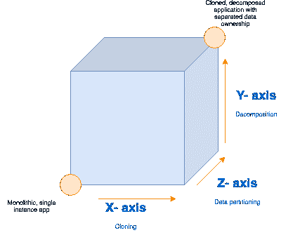

# 使用缩放立方体更好地缩放您的应用

> 原文：<https://itnext.io/scale-your-app-better-with-scaling-cube-1860930c4d57?source=collection_archive---------5----------------------->

一个高质量软件的标志之一是它的伸缩性。在我们的云计算时代，可伸缩性尤其重要。多亏了现代云提供商，有无数种方法可以扩展您的应用程序。

在《 [**可伸缩性的艺术**](https://www.amazon.com/Art-Scalability-Architecture-Organizations-Enterprise/dp/0134032802) 》一书中，作者提出了一个巧妙的模型来表示不同类别的软件伸缩，称为“伸缩立方体”。在本帖中，我们将回顾该模型背后的基本原则，以及为什么在扩展项目时应该考虑它。

# 缩放立方体的 3 个轴

请看这张图表:

上图显示了缩放立方体。左下角表示一个应用程序还没有进行任何可伸缩性改进。另一方面，右上角表示应用程序已经通过了所有三个类别的可伸缩性改进。通常你想瞄准右上角，但是这也取决于你的应用程序的业务需求。

这是三个轴表示的内容:

*   x 轴:创建克隆的应用程序实例
*   y 轴:按功能分解成微服务
*   z 轴:使用数据所有权拆分

现在让我们更详细地分解轴。

# x 轴:克隆

这个轴或多或少是不言自明的。当考虑改进应用程序的负载处理时，首先应该考虑的是生成应用程序的多个实例，并在它们之间平均分配负载。

与其他两种类型相比，使用 X 轴扩展应用程序要快得多，而且需要的精力也更少。如今，生成应用程序的附加实例通常是扩展项目的一种廉价而快速的方式。

用 X 轴缩放有两种方法。

*   **垂直平衡** —为单台机器增加更多资源。
*   **水平平衡** —向基础设施添加更多机器。

## 垂直平衡

在这种情况下，您可以利用运行应用程序的单台机器上未使用的计算资源。您可以通过实例化多个工作进程来实现这一点，这些工作进程都运行应用程序的一个单独实例。但是，请记住，为了有效地处理这些工作进程，您需要使用某种负载平衡机制。

你可以使用像`[cluster](https://www.npmjs.com/package/cluster)`这样的 NPM 包在 Node.js 中很容易地设置垂直平衡。

## 水平平衡

第二种平衡是水平平衡。这仅仅意味着将更多运行您的应用程序的机器添加到您的基础设施中。这很容易实现，大多数较小的步骤将由您的云提供商为您处理。AWS 和其他云提供商还允许您根据流量动态调整机器数量。

大多数时候，云提供商为一个反向代理设置一个单独的服务器，比如`[Nginx](https://docs.nginx.com/nginx/admin-guide/web-server/reverse-proxy/)`，它也充当您的实例的负载平衡器。

## 多个实例的其他优势

添加多个实例无疑可以提高应用程序的响应速度，但是它还有其他好处:

*   它使您的应用程序更加防失败:即使您的一个实例意外崩溃，其他实例仍然会处理负载。
*   如果实现零停机策略对您来说至关重要，那么添加多个实例是必须的。例如，在进行更新时，您可以通过将更改逐个应用到实例来避免任何停机时间。

如果您希望充分利用您的资源来提高应用程序的负载处理能力，您应该考虑同时利用垂直和水平平衡。

# y 轴:分解

简而言之，Y 轴指的是根据功能将单个整体应用拆分为多个独立的微服务。随着无服务器技术的兴起，这种做法正被广泛采用。还有一个很好的理由，采用无服务器架构有很多好处。

微服务架构提高了您的负载处理能力，因为多个独立服务比单个整体应用程序提供了更强的计算能力。您可以根据需要通过对服务应用 X 轴改进来进一步改进。

当您将应用程序分成更小的独立部分时，它的架构也会得到改进。因为这样做，你几乎是被迫在它们之间创建了一个松散的耦合。

拥有多个服务还会使您的应用程序更加健壮和防故障，因为一个服务的故障不一定会危及另一个服务的性能。相比之下，在整体架构中，如果应用程序的一部分崩溃而没有得到正确处理，整个实例都会崩溃。

今天，由于微服务架构的兴起，几乎任何云提供商都提供了对无服务器计算的支持，包括 AWS 的 Lambdas，谷歌的云功能和 Azure 的功能。

# z 轴:数据分区

对于大多数商业应用来说，应用 X 轴和 Y 轴应该足够了。但是，如果您有一个大型企业应用程序，并且它的健壮性是非常重要的，那么您可以通过数据分区来进一步改进您的基础设施的设置。请注意，只有在充分应用了 X 和 Y 轴的改进后，才应该考虑数据分区。

数据分区是第三个也是最后一个可伸缩性类别，主要适用于数据库。在考虑负载处理时，您还需要考虑数据库的能力。

大多数情况下，您可以基于某种属性将应用程序的数据分离到多个较小的数据库中。确切的属性将取决于您的业务需求，但通常其他属性会根据记录的字母顺序、数据的地理区域等进行划分。

## 数据谱系关系

这个概念伴随着微服务。这个想法是让你的服务独立于彼此的数据。这可以通过让每个服务专门负责自己的数据来实现。一种方法是为每个服务提供一个单独的数据库，并使其只能由该服务访问。如果您的应用程序的其他部分需要检索相同的数据，它们必须与您的微服务进行通信。这样做，您将减少基于数据相关性的错误数量。

这个帖子到此为止！

不管你以前是否知道缩放立方体，你都很可能遇到过本文中讨论的可伸缩性技术。尽管如此，了解这个概念并在尝试扩展应用程序时考虑它还是很有帮助的。

感谢您的阅读！

*原载于 2019 年 7 月 7 日*[*【https://isamatov.com】*](https://isamatov.com/scale-your-app-better-with-scaling-cube/)*。*