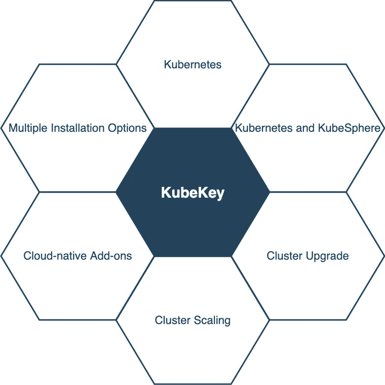
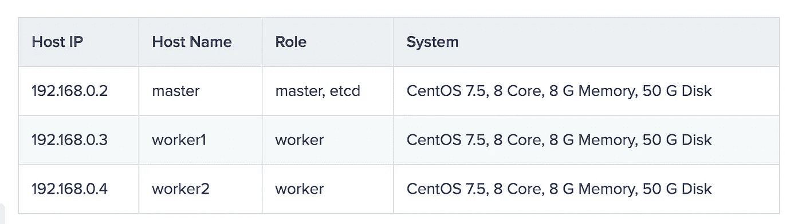
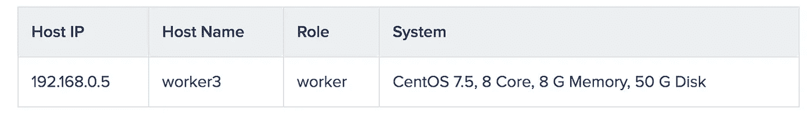

# 扩展 Kubernetes 集群:使用 KubeKey 的最佳实践之一

> 原文：<https://itnext.io/scaling-a-kubernetes-cluster-one-of-the-best-practices-for-using-kubekey-960fea2a7b24?source=collection_archive---------3----------------------->

在我的[上一篇文章](https://kubesphere.io/blogs/install-kubernetes-using-kubekey/)中，我展示了如何使用 [KubeKey](https://github.com/kubesphere/kubekey) 建立一个三节点 Kubernetes 集群。正如我在文章中提到的，KubeKey 是一个轻量级的、功能强大的安装程序，它能够以一种快捷方便的方式安装 Kubernetes 及其相关的附加组件。事实上，KubeKey 能做的远不止这些，因为它也是扩展 Kubernetes 集群的有效工具。



在一些云平台上，您可以通过增加或减少节点数量来直接扩展集群。通常，这不需要复杂的操作，因为这些平台会为你做几乎所有的事情，你只需要点击几个按钮。但是，在某些本地环境中，您可能需要手动更改节点数量。在本文中，我将演示如何使用 KubeKey 在您的集群中进行横向扩展和纵向扩展。这些步骤如下所示:

1.  下载 KubeKey。
2.  使用 KubeKey 通过自动创建的配置文件来检索集群信息。
3.  验证群集信息，并应用配置来扩展群集。
4.  在集群中扩展。

# 准备主机

这是我的现有 Kubernetes 集群的节点信息。



```
$ kubectl get nodes
NAME      STATUS   ROLES    AGE     VERSION
master    Ready    master   9m50s   v1.17.9
worker1   Ready    worker   9m19s   v1.17.9
worker2   Ready    worker   9m20s   v1.17.9
```

这是将首先添加到群集，然后从群集中删除的节点。



关于节点、网络和依赖关系需求的更多信息，请参见我的上一篇文章。

# 下载 KubeKey

1.  从其 [GitHub 发布页面](https://github.com/kubesphere/kubekey/releases)下载 KubeKey，或者使用以下命令下载 KubeKey 版本 1.0.1。你只需要将 KubeKey 下载到你的一台机器上，作为**任务盒**进行伸缩，比如主节点。

`curl -sfL https://get-kk.kubesphere.io | VERSION=v1.0.1 sh -`

*注*

*您可以在命令中更改版本号，以下载特定版本。*

2.上面的命令下载 KubeKey 并解压文件。您的文件夹现在包含一个名为`kk`的文件。使其可执行:

`chmod +x kk`

# 横向扩展集群

1.  现在我已经准备好了 KubeKey，我需要创建一个包含所有节点信息的配置文件，这与通过 KubeKey 设置 Kubernetes 集群是一样的。如果您的集群是通过 KubeKey 安装的，那么您的机器上可能仍然有那个配置文件。这种情况下可以直接编辑。否则，执行以下命令来检索集群信息。

`./kk create config --from-cluster`

标志`--from-cluster`用于获取退出集群的信息。

2.上面的命令创建了一个配置文件，默认情况下是`sample.yaml`。打开文件，您可以看到一些字段已经预先填充了值。添加新节点的信息，并验证其他字段是否设置正确。

`vi sample.yaml`

```
apiVersion: kubekey.kubesphere.io/v1alpha1
kind: Cluster
metadata:
  name: sample
spec:
  hosts:
  # You should complete the ssh information of the hosts
  - {name: master, address: 192.168.0.2, internalAddress: 192.168.0.2, user: root, password: Testing123}
  - {name: worker1, address: 192.168.0.3, internalAddress: 192.168.0.3, user: root, password: Testing123}
  - {name: worker2, address: 192.168.0.4, internalAddress: 192.168.0.4, user: root, password: Testing123}
  - {name: worker3, address: 192.168.0.5, internalAddress: 192.168.0.5, user: root, password: Testing123}
  roleGroups:
    etcd:
    - master
    master:
    - master
    worker:
    - worker1
    - worker2
    - worker3
  controlPlaneEndpoint:
    # If loadbalancer was used, 'address' should be set to loadbalancer's ip.
    domain: lb.kubesphere.local
    address: ""
    port: 6443
  kubernetes:
    version: v1.17.9
    imageRepo: kubesphere
    clusterName: cluster.local
    proxyMode: ipvs
    masqueradeAll: false
    maxPods: 110
    nodeCidrMaskSize: 24
  network:
    plugin: calico
    kubePodsCIDR: 10.233.64.0/18
    kubeServiceCIDR: 10.233.0.0/18
  registry:
    privateRegistry: ""
```

*注*

*添加新节点时，不允许修改现有节点(如 master)的主机名。*

关于配置文件中不同参数的更多信息，请参阅我的上一篇文章。

3.保存文件并执行以下命令来应用配置:

`./kk add nodes -f sample.yaml`

4.缩放完成后，您可以看到如下输出。

`Congratulations! Scaling cluster is successful.`

5.执行以下命令来检查名称空间的状态。

`kubectl get pod --all-namespaces`

```
NAMESPACE     NAME               READY   STATUS    RESTARTS   AGE
kube-system   calico-kube
             -controllers
             -59d85c5c84-48dbg   1/1     Running   0          50m
kube-system   calico
             -node-8f9tr         1/1     Running   0          50m
kube-system   calico
             -node-ttl4c         1/1     Running   0          3m56s
kube-system   calico
             -node-wkfld         1/1     Running   0          50m
kube-system   calico
             -node-x9ks2         1/1     Running   0          50m
kube-system   coredns
             -74d59cc5c6
             -6jszk              1/1     Running   0          50m
kube-system   coredns
              -74d59cc5c6
              -mzcxp             1/1     Running   0          50m
kube-system   kube-apiserver
              -master            1/1     Running   0          50m
kube-system   kube-controller
              -manager-master    1/1     Running   0          50m
kube-system   kube-proxy
              -fw5cf             1/1     Running   0          50m
kube-system   kube-proxy
              -qrv5p             1/1     Running   0          50m
kube-system   kube-proxy
              -r82sh             1/1     Running   0          3m56s
kube-system   kube-proxy
              -v4rnf             1/1     Running   0          50m
kube-system   kube-scheduler
              -master            1/1     Running   0          50m
kube-system   nodelocaldns
              -4wfsv             1/1     Running   0          3m56s
kube-system   nodelocaldns
              -fbsbl             1/1     Running   0          50m
kube-system   nodelocaldns
              -mzpvt             1/1     Running   0          50m
kube-system   nodelocaldns
              -zj5jz             1/1     Running   0          50m
```

6.执行以下命令检查您的节点。

`kubectl get nodes`

```
NAME      STATUS   ROLES    AGE     VERSION
master    Ready    master   52m     v1.17.9
worker1   Ready    worker   51m     v1.17.9
worker2   Ready    worker   51m     v1.17.9
worker3   Ready    worker   5m12s   v1.17.9
```

正如您在上面看到的，所有节点都已启动并运行。

# 在集群中扩展

1.  要删除一个节点，还需要提前准备一个配置文件。如果你直接跳到这一步，或者你还没有下载 KubeKey，参考上面的内容下载 KubeKey，检索你的集群信息。之后，编辑配置文件。

`vi sample.yaml`

2.仔细检查是否所有字段都设置正确，如有必要进行更改，然后保存文件。

```
apiVersion: kubekey.kubesphere.io/v1alpha1
kind: Cluster
metadata:
  name: sample
spec:
  hosts:
  # You should complete the ssh information of the hosts
  - {name: master, address: 192.168.0.2, internalAddress: 192.168.0.2, user: root, password: Testing123}
  - {name: worker1, address: 192.168.0.3, internalAddress: 192.168.0.3, user: root, password: Testing123}
  - {name: worker2, address: 192.168.0.4, internalAddress: 192.168.0.4, user: root, password: Testing123}
  - {name: worker3, address: 192.168.0.5, internalAddress: 192.168.0.5, user: root, password: Testing123}
  roleGroups:
    etcd:
    - master
    master:
    - master
    worker:
    - worker1
    - worker2
    - worker3
  controlPlaneEndpoint:
    # If loadbalancer was used, 'address' should be set to loadbalancer's ip.
    domain: lb.kubesphere.local
    address: ""
    port: 6443
  kubernetes:
    version: v1.17.9
    imageRepo: kubesphere
    clusterName: cluster.local
    proxyMode: ipvs
    masqueradeAll: false
    maxPods: 110
    nodeCidrMaskSize: 24
  network:
    plugin: calico
    kubePodsCIDR: 10.233.64.0/18
    kubeServiceCIDR: 10.233.0.0/18
  registry:
    privateRegistry: ""
```

3.执行以下命令在集群中进行扩展(在本例中删除了`worker3`)。

`./kk delete node <nodeName> -f sample.yaml`

*注*

*用自己的节点名替换* `*<nodeName>*` *。*

4.执行以下命令来验证结果。

`kubectl get nodes`

```
NAME      STATUS   ROLES    AGE    VERSION
master    Ready    master   3h7m   v1.17.9
worker1   Ready    worker   3h6m   v1.17.9
worker2   Ready    worker   3h7m   v1.17.9
```

5.您可以看到节点(`worker3`)已被成功移除。

# 摘要

添加和删除节点仍然是集群维护的重要部分。实际上，您需要根据集群上运行的实际工作负载来调整节点数量，以获得最佳的资源利用率。幸运的是，KubeKey 是这方面最有效的工具之一。

# 参考

库伯基

[多节点安装](https://kubesphere.io/docs/installing-on-linux/introduction/multioverview/)

[kube key:Kubernetes 和云原生插件的轻量级安装程序](https://kubesphere.io/blogs/install-kubernetes-using-kubekey/)