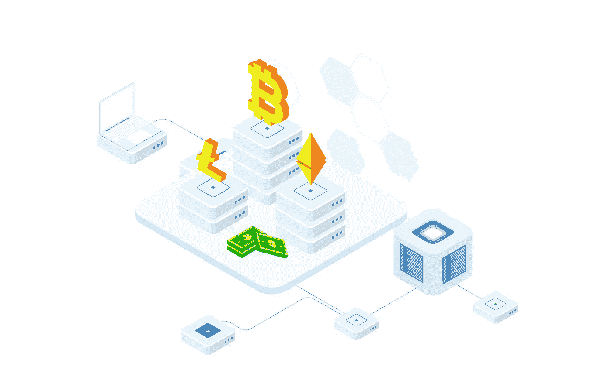

# 使用 Kubernetes 扩展比特币节点

> 原文：<https://itnext.io/scaling-bitcoin-node-with-kubernetes-64d6017a047d?source=collection_archive---------7----------------------->



基于区块链的解决方案在过去几年变得非常流行，为了获得区块链的数据，你必须通过私人托管的区块链节点进行某种数据访问，或者从 https://blockpulsar.com 的[获取数据](https://blockpulsar.com/)

私人托管是相当昂贵的，但这是一种权衡，你自己管理一切，并控制你想要的区域发行版或 API，而不是通过简单的订阅获得它，让其他专业人士管理技术资料。

如果你有某种项目需要一个私人托管的比特币节点，那么很可能直接在虚拟服务器上进行原始配置是一个非常糟糕的想法，特别是如果有太多可扩展的解决方案可以配置你的云环境。

# 将比特币节点放入 Docker 容器

本质上，比特币节点是某种基本的 C++服务器应用程序，如果你想努力推动它并从中获得最大收益，它是相当存储密集型和 CPU 密集型的。最难解决的部分是为了能够运行节点而必须装载的大量 Docker 卷。

在撰写本文时，BTC 节点需要大约 450GB 的存储容量来获取完整的区块链，并作为一个容器正常运行。这已经非常昂贵，而且几乎不可能在标准的 Macbook Pro 上运行来进行开发测试。这就是为什么确保您的 Kubernetes 环境能够访问至少 500GB 以使部署正常进行非常重要。

首先，让我们使用`debian:buster`作为基础映像，在那里建立 BTC 节点是很容易的，并且作为 Docker 基础映像发行版它是很受欢迎的，所以我们在研究一些潜在问题时不会有任何问题

```
FROM debian:buster
WORKDIR /root
```

保留`/root`作为我们的入口点，因为我们在容器内作为根用户工作，BTC 节点将从`/root/.bitcoin`基础卷工作。

因为我们想看起来有点花哨，并确保我们已经正确编译了 BTC 节点，所以我们将下载源代码，并在构建过程中直接在容器内编译它们

```
RUN apt update && apt install --yes wget && \ 
   wget https://bitcoin.org/bin/bitcoin-core-0.21.1/bitcoin-0.21.1.tar.gz && \ 
   tar xzf bitcoin-0.21.1.tar.gz && mv bitcoin-0.21.1 bitcoin && \   
   rm -rf bitcoin-0.21.1.tar.gz
```

当然，您可以为 BTC 节点版本创建一个环境变量，就像从环境变量中替换`0.21.1`版本一样，以使版本升级更加容易。

老实说，BTC 节点有大量的库依赖项，之所以会这样，是因为在 C++服务器开发过程中，你有相当多的外部库可以使用，而不是自己构建所有的东西，所以我们必须安装依赖项并最终编译节点

```
RUN apt install --yes build-essential autoconf libtool pkg-config \
    bsdmainutils libboost-all-dev libevent-dev

RUN cd bitcoin && ./autogen.sh && ./configure --disable-wallet && \
    make -j4 && make install && cd /root && rm -rf bitcoin && apt clean
```

请注意，我们将每一步作为单独的`RUN`命令来执行，以修复图像层，并确保如果没有更改，我们会缓存内容。例如，如果您只构建了一次，那么只有在您更改 BTC 节点版本或从系统中删除基础映像时，才会构建第二次。

为 BTC 节点构建这种半可扩展的 Kubernetes 系统的主要部分可能是将存储作为单独的卷挂载到 Docker 容器的目录中，但问题是比特币节点也将其配置保存在同一个文件夹中，因此如果我们挂载该卷，我们将会丢失 BTC 节点配置。所以，我们必须将配置从本地磁盘复制到`/root/bitcoin.conf`中，稍后将它指定为一个单独的配置文件。

```
COPY ./bitcoin.conf /root/bitcoin.conf

EXPOSE 8332 8333

CMD /bin/bash -c "bitcoind --conf=/root/bitcoin.conf"
```

Rest 非常简单，只需运行一个 docker 容器，该容器已经预先定义了公开的端口和启动命令。

# 多个副本的简单 Kubernetes 配置

当然，作为基础，我们必须定义 Kubernetes 服务本身，以确保它在 Kubernetes 集群内部是可达的，但它在这里完全是常规的服务配置，还不是特定于 BTC 节点的！

```
# btc.service.yml
apiVersion: v1
kind: Service
metadata:
  name: bitcoin
spec:
  selector:
    app: bitcoin
  ports:
    - protocol: TCP
      name: http
      port: 8332
      targetPort: 8332
```

唯一的事情是，我们的目标是从 BTC 节点获取通用 RPC API 的端口 8332。

配置的第二部分是定义`StorageClass`，根据云提供商或专用服务器配置，这将有所不同，但我们必须有一个存储类，我们可以在多个副本之间重复使用，以便为每个 BTC 节点副本创建一个新卷。这个例子是在谷歌云中制作东西。

```
# btc.storage.class.yml
kind: StorageClass
apiVersion: storage.k8s.io/v1
metadata:
  name: bitcoin-disk
provisioner: kubernetes.io/gce-pd
parameters:
  type: pd-ssd
  zone: us-central1-a
allowVolumeExpansion: true
```

定义并应用存储类后，我们可以继续定义实际的 pods 配置，这不是常规部署，但正是`StatefulSet`确保我们为每个副本复制分配的资源。它主要用于数据库或缓存实例，但不要忘记 BTC 节点包含区块链，这也是一种数据库，它当然是一种有状态的应用程序。

```
# btc.stateful.set.yml
apiVersion: apps/v1
kind: StatefulSet
metadata:
  name: bitcoin
spec:
  serviceName: bitcoin
  replicas: 1 # Scale as match as you want
  revisionHistoryLimit: 1
  selector:
    matchLabels:
      app: bitcoin
  template:
    metadata:
      labels:
        app: bitcoin
    spec:
      restartPolicy: Always
      containers:
        - name: bitcoin
          image: <your BTC Node Image>
          volumeMounts:
            - name: bitcoin
              mountPath: /root/.bitcoin
  volumeClaimTemplates:
    - metadata:
        name: bitcoin
      spec:
        accessModes: [ "ReadWriteOnce" ]
        storageClassName: bitcoin-disk
        resources:
          requests:
            storage: 500Gi
```

就是这样！在此之后，您可以通过更改`replicas`数字，根据所需的计数来扩展 BTC 节点，但请记住，每个副本将需要额外的 500GB 存储和更多资源来处理 BTC 节点事务。

要考虑的一个极端情况是，无论何时尝试扩展 BTC 节点，都要确保在它前面有某种负载平衡。我知道 Kubernetes 从服务到 Pod 级别都内置了它，但根据来自[https://blockpulsar.com](https://blockpulsar.com/)的经验，有时 BTC 节点看起来很健康，但它无法获取某些部分的数据。因此，维护生产状态 BTC 节点比管理标准服务要痛苦得多。

# 结论

大多数基于区块链的应用程序需要使用直接 RPC API 从区块链节点获取数据，这增加了将这些数据放在云基础架构中的需求，并且维护和设置成本很高。

如果您在 BTC 节点的基础上构建了资源和自动化来保持其最新并正确处理负载平衡，那么扩展它并不困难。一些云基础设施提供商甚至限制如何匹配每个帐户可以使用的存储，这是本地托管 BTC 节点的另一个限制，因为与它们相关的大部分成本归结为扩展每个节点的存储空间。这就是为什么有像 https://blockpulsar.com T2 T3 这样的服务，通过提供使用比特币区块链 API 的干净 API 来做所有复杂的基础设施工作。