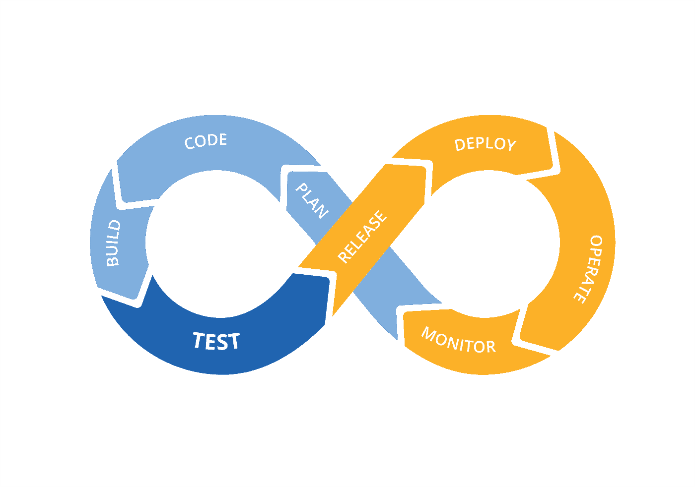
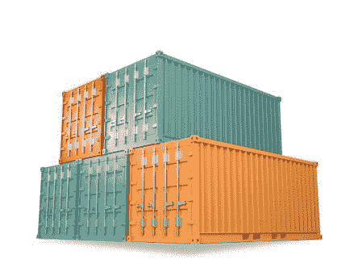
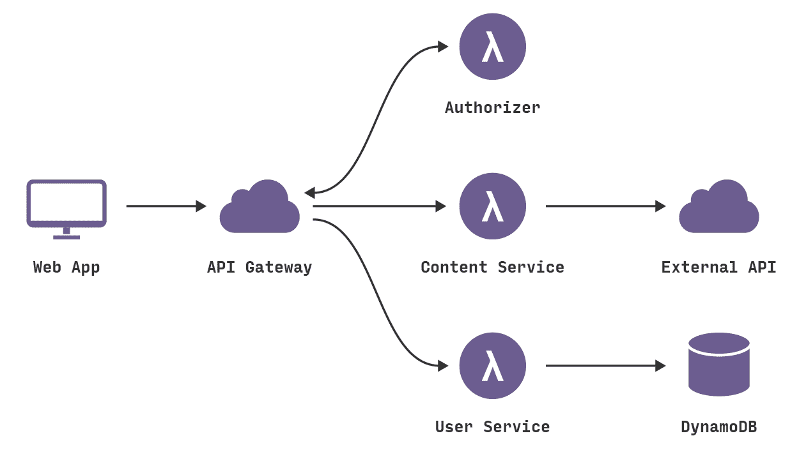
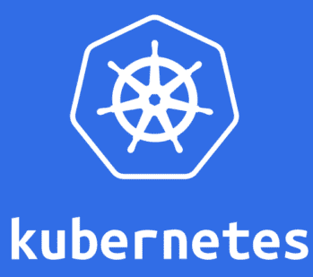

# 扩展我的应用:无服务器与 Kubernetes

> 原文：<https://itnext.io/scaling-my-app-serverless-vs-kubernetes-cdb8adf446e1?source=collection_archive---------1----------------------->

# 介绍

在我之前的 [**帖子**](https://medium.com/@javier.ramos1/my-first-app-time-to-market-90a443ec03fc) 中，我谈到了你在开始一个项目或公司时可以使用的不同平台、工具和编程语言；解释权衡和利弊。当你开始一个项目时，你的目标是**上市时间**，在别人之前推出你的产品，同时保持低成本。在这篇文章中，我们将进入一个新的领域，企业世界。如果你已经在一家中型公司工作，或者你的创业公司正在快速成长，那么这篇文章适合你。

Kubernetes 与无服务器

随着你的团队和你的产品的成长，新的过程和特性将是必需的；这需要更好的团队同步、改进的测试、敏捷的过程、计划和严格的质量控制。后端即服务( **BaaS** )或者简单的 *node.js* app **都是不够的**；您将需要对基础设施、构建过程、更好的性能等有更多的控制。能够在全球范围内扩展。你需要管理你的系统并保持它运行。您已经到了停机时间不可接受的地步，您需要 [**SREs**](https://en.wikipedia.org/wiki/Site_reliability_engineering) 来确保您的系统全天候运行。**欢迎来到** [**的世界！**](https://medium.com/@javier.ramos1/introduction-to-devops-ee81fd1578be)

DevOps 生命周期

# 库伯内特斯

传统上，开发团队负责添加功能，运营团队负责运行你的应用；**被**分开了，这就造成了很多 [**的问题**](https://dzone.com/articles/top-5-reasons-why-devops-is-important) 。渐渐地，公司开始采用 [**DevOps**](https://www.devopsagileskills.org/dasa-devops-principles/) 文化。

**DevOps** 文化包含了与本文相关且彼此非常接近的两项重要技术:

*   [**微服务**](https://medium.com/@javier.ramos1/devops-microservices-part-2-microservices-1692476a1a17?source=your_stories_page---------------------------) : [微服务](https://martinfowler.com/microservice)是一种全新的革命性方式，可以用最少的努力开发复杂的 IT 系统。简而言之，[微服务](https://smartbear.com/learn/api-design/what-are-microservices/)架构风格是一种将单个应用程序开发为一套小型服务的方法，每个服务运行在自己的进程中，并与轻量级机制(通常是 HTTP 资源 API)进行通信。这些服务是围绕业务功能构建的，可由全自动部署机器独立部署。一套[模式](http://microservices.io/patterns/microservices.html)、[最佳实践](https://github.com/katopz/best-practices/blob/master/best-practices-for-building-a-microservice-architecture.md)和[技术](http://cloud.spring.io/)支持微服务的开发。
*   [**容器**](https://medium.com/@javier.ramos1/devops-microservices-part-3-containers-e0cc44930e86) :容器只是一个应用程序可以运行的隔离的执行环境，它拥有运行所需的所有组件，但它遵循一个标准，并清楚地定义了它的需求和依赖关系。容器允许 DevOps 团队独立于他们使用的语言或平台以及环境来管理应用程序的生命周期。 [**Docker**](https://www.docker.com/) 是集装箱背后的主要技术。

码头工人和集装箱。

你可以把**微服务**想象成***Dev*****容器**想象成 ***Ops*** 统一在 **DevOps** ！

随着企业开始迁移到微服务，其复杂性也在增加。[容器编排](https://www.infoworld.com/article/3268073/containers/what-is-kubernetes-container-orchestration-explained.html)被引入以应对操作的复杂性，2014 年 [**Kubernetes**](https://kubernetes.io/) 诞生。Kubernetes 是一个可移植的、可扩展的开源平台，用于管理容器化的工作负载和服务，促进了声明式配置和自动化。关键思想是服务的**声明性**本质。部署将描述它在 CPU、内存、速度、依赖性等方面需要什么资源，Kubernetes 将确保它满足要求，并相应地自动扩展和复制。所以，你告诉 Kubernetes 你想要什么，而不是怎么做。如果可能的话，Kubernetes 会确保集群状态与您的请求相匹配。

在这一点上，我们了解了监控、记录、测试、自动化和维护我们的应用程序以保持其运行的需求。我们已经看到开发人员如何转向更小的服务(*微服务*)，并且由于敏捷方法和自动化，他们承担了部署它们并通过更好的通信来维护它们的责任。Kubernetes 允许将遗留应用程序带入云中，在容器中运行，并以可预测和自动化的方式管理它们。

大约在同一时间，**云提供商正在快速发展**，并提供越来越多的**服务**。除此之外，还发生了两件大事:

*   一些开发者和公司意识到，他们正在做的操作类型与其他公司完全一样，并且大部分努力都与确保他们的**应用**能够在他们请求**峰值**时**扩展**有关。他们也意识到，在许多情况下，他们是在为未使用的资源买单。
*   大多数应用程序逻辑是基于**事件****的，当事件被触发时，服务被调用，比如 HTTP 请求或文件上传，它们会采取行动，或者回复或者生成新事件。这就是 [**无功编程、**](https://en.wikipedia.org/wiki/Reactive_programming) 和 [**事件源**](https://martinfowler.com/eaaDev/EventSourcing.html) 和[**【CQRS】**](https://www.martinfowler.com/bliki/CQRS.html)等新范式。**

****基于事件的微服务和开发团队编写反应式应用的组合，以及向云的大规模迁移，催生了无服务器模式。****

# **无服务器**

**简而言之， [**无服务器**](https://martinfowler.com/articles/serverless.html) **就是执行不需要任何服务器**的业务逻辑的任何东西。这个**去掉了 DevOp** s 的操作方面，可以想象， **Serverless 与云**紧密耦合。随着越来越多的服务被添加到云中，开发人员意识到可以将简单的功能作为微服务与其他云服务一起使用，并根据事件编排它们。尽管有人试图在本地提供类似无服务器的行为，但**无服务器是为云**准备的。**

**最流行的范例是功能即服务([**【FaaS】**](https://en.wikipedia.org/wiki/Function_as_a_service))，它是由 **AWS** 用 [**Lambda**](https://aws.amazon.com/lambda/) 服务推广的。给你一些背景，AWS 有越来越多的计算、处理和存储互联服务，如 EC2、S3、SNS、SQS 等。开发人员将编写与这些服务交互并对事件做出反应的应用程序。AWS 慢慢地将事件添加到一些服务中，开发人员使用他们的消息服务作为粘合剂来编排微服务。由于这些云服务，开发人员可以编写简单的小服务，AWS 将负责所有的交叉方面，如监控、日志、缩放等。但开发人员仍在关注虚拟机的操作方面，如更新、补丁和重启。 **Lambda** 的推出是为了提供**运行在云上的简单功能，并且可以与云提供商服务**进行交互。开发人员的目标是**只**关注**代码**而不是操作。这种方法适合于 **web 应用**的一个常见用例，在这种情况下，请求的数量有短有长，很难管理。FaaS 通过提供**超快速自动缩放和简单配置**解决了这个问题。**

****

**典型的无服务器 Web 应用**

**总而言之 **FaaS** 的关键积木是:**

*   ****无服务器**:无需管理虚拟机、操作系统等。你只需要打包你的应用程序并上传到云端。不需要像在 Kubernetes 中那样管理图像。**
*   ****按需付费**:这是一个核心功能，**你只需按请求付费**，如果你的应用程序是空闲的，你就不用付费。这可以大幅削减成本，特别是对于没有稳定负载的应用程序。这是 Web 应用程序中常见的情况，负载会发生变化，很难预测。**
*   ****事件驱动**:函数对事件做出反应并执行特定的动作，它们使用消息队列如 SNS 或 Kinesis 来编排事件。**

**注意**无服务器与 FaaS** 不同，其他不需要服务器的服务也是服务，范围从流处理或物联网到大数据管道，一些例子是 AWS Glue、AWS Athena、AWS DynamoDB 或 GCP 发布/订阅。**

**然而，无服务器非常依赖于云提供商。所有的云提供商，如 Azure、T2、AWS、T4 和 GCP，都提供无服务器服务，但它们根据其他服务的不同进行不同的整合。 [**无服务器框架**](https://serverless.com/) 在从云提供商那里分离 **FaaS** 方面做得很好，但是在你能做什么方面它是有限的；例如，它只能提供某些东西，如 API 网关或桶，但不支持其他类型的基础设施。最后，当使用无服务器时，仍然很难从云提供商迁移。**

****由于现收现付模式和简化模式**，无服务器越来越受欢迎。它比 Kubernetes 简单得多，适合许多用例。随着公司的成长， **Serverless 提供了一个比 Kubernetes 更容易管理的 NoOps 替代品，并且可以以最小的努力更快地扩展。然而，无服务器的灵活性较差，可能不适用于某些用例；在某些情况下，它可能比 Kubernetes 更贵，现在让我们讨论一下利弊。****

# **无服务器 vs Kubernetes**

**毫无疑问，**无服务器功能**是实现您的服务的一个**成本有效且简单的**解决方案，这是毫无疑问的。这是你应该考虑的第一个选择；但是有一个问题:它们往往依赖于云提供商，您无法控制资源，并且从长远来看，它们可能会因为集成而变得昂贵。另一方面，在容器中运行工作负载可能更具成本效益，但也更复杂。**

**与 Kubernetes 相比，无服务器有三个主要缺点:**

*   **不适用于某些用例，如实时分布式系统、有状态处理、长时间运行的作业等。函数必须由事件触发，并且必须快速响应。您无法对基础设施进行精细控制，因此无法使用低级 API 来最大限度地提高性能和减少延迟。**
*   ****云提供商依赖性**:云提供商之间的迁移很困难，**内部部署更加困难**。由于有关数据保护和数据可闻性的法律越来越多，一些公司开始迁移回本地，Kubernetes 使他们能够解决以前的本地运营问题，同时保持对数据的严格控制。如果您决定使用无服务器，那么迁移回本地是非常困难的。**
*   ****无服务器可能变得昂贵**。由于事件驱动的现收现付性质，很难预测和控制成本。我担心的是，由于 FaaS 的事件驱动性质，我们被吸引去整合可能不太划算的云服务。例如，AWS API Gateway 是一项很好的服务，但随着时间的推移，成本会越来越高。所有这些与更昂贵服务的集成会大幅增加成本。如果你有一个或多或少的稳定负载，Kubernetes 会更便宜。**

**请注意，Kubernetes 允许类似 FaaS 的行为，这要感谢像 [**Knative**](https://knative.dev/) 这样的项目，它们允许在微型容器中运行的函数响应事件而运行，然后缩小到零。Knative 是 [**GCP 云跑**](https://cloud.google.com/run/) 背后的技术。**

**在过去的几个月里，我一直在研究并致力于优化运行在云上的**微服务**的成本和性能。**

**根据我的经验，如果一家公司计划扩大规模并保持竞争力，他们应该考虑将其基础架构迁移到 Kubernetes。**无服务器非常适合快速上市**。你可以很快从想法到产品，它可以在负载方面很好地扩展。许多创业公司以这种方式开始，但随着时间的推移，一些公司可能会在基础设施成本上挣扎。这完全取决于您的用例。如果你不整合昂贵的服务，你有不可预测的负载，应用程序有时是空闲的，无服务器会更便宜，可以处理数百万的请求。如果你有一个稳定的或预测的负载(季节性)，Kubernetes 可能会更便宜。**

**我们在 Kubernetes 中看到两种常见的模式，最常见的是**移动传统本地应用**；迁移到无服务器太耗时，Kubernetes 是一个更好的选择。另一个用例是我们刚刚谈到的**成本控制**，我们可以通过在适当管理的集群上运行 Kubernetes 免费开源替代方案来降低成本。举个例子，如果你在 AWS，你用 Lambda，SNS，Kineses，DynamoDB 等等。你可以搬到 Kubernetes，管理你自己的开源项目，比如 MongoDB、Kafka 和你的微服务。这是从 **NoOps** 到 **DevOps** 的转变，它需要一个更大的团队来管理，但它可以大幅削减成本。**

****

**让我们回顾一下利弊，看看什么时候考虑这个或那个。**

## ****无服务器优势****

*   ****好用易学**，你只要写小函数就行了！**
*   ****现收现付**。对于不可预测的负载(如 web 应用程序),可能会便宜很多。功能不运行时没有成本！**
*   ****事件驱动**，可以集成很多服务。**
*   ****无操作**。无需维护基础设施或操作系统！**
*   ****易于管理**只需设置 RAM、集成 IAM 并设置触发器。**
*   ****无限扩展**，无需设置集群。非常快。**
*   **不需要专门的运营团队。监控是内置的。这样可以降低成本。**
*   ****开发者生产力**。**

## ****无服务器缺点****

*   ****不适合某些用例**，如实时系统或长期任务。**
*   ****供应商锁定。**难以迁移。**
*   **事件驱动的范例可能很难学习。**
*   **调试可能会很困难。**
*   ****安全** **问题**。更难配置具体的规则或政策，您完全依赖于云提供商，这对于银行和保险公司来说可能是不可行的。**
*   **在某些情况下，它会变得昂贵，不是因为 FaaS，而是因为整合。**
*   ****不灵活**，不能使用任何编程语言或运行时。**

## ****Kubernetes Pros****

*   ****不可变的基础设施**。不再有“它在我的笔记本电脑上工作”，开发和生产中相同的代码和依赖关系。**
*   ****非常高效**管理资源，很快。低延迟。**
*   ****说明性**。只需确定您需要什么，Kubernetes 会处理其余的事情。**
*   ****性价比**。几个容器可以在一个虚拟机上运行。**
*   ****支持工具和框架的大生态系统**。在我看来，太宽泛了。**
*   **多种工作负载和部署选项。**你可以跑任何东西。****
*   **它支持 **Cron 作业和有状态应用**，包括大数据处理或 Actor 系统。**
*   ****便携式**。可以在内部或跨多个云提供商运行。**
*   ****开放标准**，极大的社区支持和广泛采用。**

## ****Kubernetes Cons****

*   ****难**学。它需要网络和存储方面的知识。**
*   ****开箱即用难以部署**，您依赖云提供商。一些公司提供比其他公司更好的工具、监控和安全性。**谷歌云**是目前**最便宜的**和功能最好的最新提供商。**
*   ****需要更多专业知识**与无服务器相比，雇佣人才可能会很昂贵**
*   ****监控、安全、开发工具等选项太多**。很难跟上时代。**

## ****什么时候应该考虑无服务器****

*   ****您的团队主要是没有运营经验(网络、存储、监控……)的开发人员****
*   **您正在构建一个有许多峰值和不可预测负载的网站，需要快速扩展。**
*   **在某些时候，您很少或根本不使用资源，并且您更喜欢“随用随付”模式。**
*   **你使用一种主要支持的语言，比如 Python，JavaScript，Go，Java…**
*   ****你不用 Java 或者 JVM** 。无服务器它不是 JVM 的最佳选择，因为它需要更长的时间来扩展，而且 JVM 没有时间来优化代码执行。**
*   ****上市时间**很重要，但资源有限。**
*   **您的用例可以使用 FaaS 来实现。**
*   ****您致力于单一的云提供商。****
*   ****你可以应对每月账单的突然激增**。对于初创公司来说，这可能是一个问题，高额的云账单可能会让他们陷入困境。**
*   **你构建事件驱动的应用程序。**

## ****什么时候应该考虑 Kubernetes****

*   ****您正在将现有的服务迁移到云中。****
*   **你的服务已经在容器上运行了。**
*   **您可以在本地或混合云中运行。**
*   **您使用了云 FaaS 提供商不支持的编程语言。**
*   ****您的应用程序需要低级 API，如线程控制。****
*   **你有**有状态**组件**或者**长时间运行的任务。**
*   **您正在构建实时分布式系统。**
*   **你大量使用了 JVM，特别是并发性。**
*   **您希望**控制**部署、CI/CD 渠道以及应用程序如何打包和推出。**
*   ****团队中有运营专家**，他们非常熟悉 Kubernetes，知道如何监控、保护它并保持它的运行。**
*   **你的公司信奉 **DevOps** **原则**。**
*   **你想要避免供应商锁定。**
*   **你有一个可预测的或稳定的负荷。**
*   **您希望严格控制您的资源，以最大限度地提高性能和降低成本**
*   **您有无服务器无法满足的安全或策略要求。**

# **结论**

****无服务器和 Kubernetes 不是竞争技术**，如你所见，**它们解决不同的用例，它们可以共存**。例如，让您的 Kubernetes 集群与云提供的无服务器数据库和消息服务进行交互是非常常见的，反之亦然，lambda 函数调用 VPC 内部的托管实例。**

**在我看来，**与常规虚拟机**相比，这两种方法在可维护性、性能和成本节约方面都向前迈进了一大步。如果无服务器符合您的使用情况，并且您不担心供应商锁定，那么就选择它；这是一个简单的可扩展解决方案。以后可以随时去 Kubernetes。对于更复杂的场景，如大数据管道或 ML，Kubernetes 是更好的选择。虽然一些云提供商有大数据无服务器分析，但服务过于昂贵或不成熟。**

**考虑你的业务，如何发展，你的文化和你的目标。然后定义你的核心价值观，指导方针，okr 和流程。使用 [**领域驱动设计**](https://en.wikipedia.org/wiki/Domain-driven_design) 拿出最好的解决方案和团队架构，然后，思考框架和平台。**不要先选择一个平台，然后再尝试在这个平台上解决业务问题，让它发挥作用。****

**我希望你喜欢这篇文章。欢迎发表评论或分享这篇文章。跟随[***me***](https://twitter.com/JavierRamosRod7)*进行未来的帖子。***