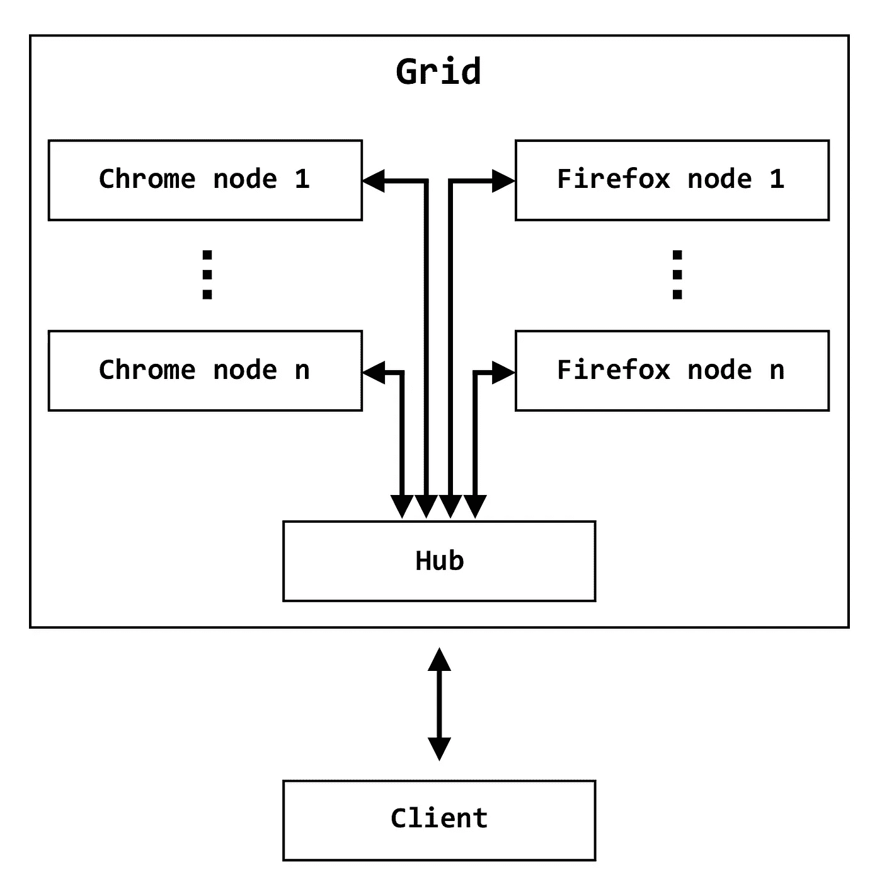

# 使用 Kubernetes 扩展 Selenium 测试执行

> 原文：<https://itnext.io/scaling-selenium-test-execution-with-kubernetes-c79bc53979f5?source=collection_archive---------1----------------------->


在这个系列中，我们将探索使用 Docker 容器和 Kubernetes 为 Selenium 构建一个可伸缩的执行框架。

## 超大规模测试执行

Docker 和 Kubernetes 编排平台的容器化已经席卷了计算基础设施世界，并对我们今天设计和构建软件的方式产生了深远的影响。Selenium 测试是一种候选工作负载，可以受益于现代超大规模基础架构提供的大规模并行性。

在本文中，我们将使用我们在用 MSTest V2 系列的 [Selenium UI 测试中构建的框架，在 Docker 容器中执行 Selenium 测试。而用于测试的示例代码是基于 C#构建的。NET Core，这种方法可以用于任何可以利用 RemoteWebDriver 的 Selenium 测试套件。](https://medium.com/@joegroner/selenium-ui-testing-with-mstest-v2-1db414bbba28)

## 在 Linux 中用。网络核心

首先，让我们从 Github 上的 [jg-testframework repo](https://github.com/joegroner/jg-testframework) 中克隆框架和样本。在 Linux 环境中，确保您可以在本地构建和运行测试，并获得通过的结果。你要确保你有[。NET Core 2.1 SDK](https://www.microsoft.com/net/download/dotnet-core/) 安装运行(我的测试一直针对 2.1.301)。

在测试中/JG。Demo.CoreTests 子文件夹，打开 default.runsettings 文件，确保 WebDriver 参数设置为“chrome”:

`<Parameter name=”WebDriver” value=”chrome” />`

现在您可以运行测试，看看您是否获得了通过测试的结果:

```
cd test/JG.Demo.CoreTests
dotnet build
dotnet test --no-build --settings default.runsettings
```

让我们也使用 RemoteWebDriver 和手动启动的 chromedriver 进行一次健全性检查。确保在 default.runsettings 中设置了以下值:

```
<Parameter name=”WebDriver” value=”remotechrome” />
<Parameter name="SeleniumHost" value="[http://localhost:4444/](http://localhost:4444/)" />
```

然后在后台启动 chromedriver 的一个实例，并重复测试执行:

```
./bin/Debug/netcoreapp2.1/chromedriver --port=4444 >/dev/null 2>&1 &
dotnet test --no-build --settings default.runsettings
```

*旁白:如果你打算继续下去，如果你想重用端口 4444，你可能想终止后台进程。*

## Docker 入门

Selenium 项目维护[一组 Docker 图像](https://hub.docker.com/r/selenium/)，我们将使用它们在 Docker 中执行测试。

首先，让我们使用独立的 Chrome 镜像进行一个简单的测试。首先，我们需要修改 SeleniumHost 参数以包含一个路径(我们稍后将讨论原因):

```
<Parameter name="SeleniumHost" value="[http://localhost:4444/wd/hub](http://localhost:4444/wd/hub)" />
```

然后，我们将旋转绑定到端口 4444 的容器，并再次运行我们的测试:

```
docker run -d -p 4444:4444 -v /dev/shm:/dev/shm selenium/standalone-chrome
dotnet test --no-build --settings default.runsettings
```

您可以在 [docker-selenium repo](https://github.com/SeleniumHQ/docker-selenium) 上找到关于 Selenium 映像的其他信息，包括对/dev/shm 和内存的简要讨论。

*旁白:如果您打算继续，如果您想重用端口 4444，您可能需要停止容器。*

## 使用 Selenium 网格进行缩放

Selenium 项目创建了网格来帮助解决可伸缩性问题。网格抽象了对(潜在的)异构驱动程序/浏览器组合的访问，集中了基础设施，并为消费者提供了测试云。

一个网格由[集线器和节点元素](https://www.seleniumhq.org/docs/07_selenium_grid.jsp#how-selenium-grid-works-with-a-hub-and-nodes)组成。节点是驱动程序/浏览器对的抽象，例如 Chrome 节点或 Firefox 节点，集线器充当集中器。节点在启动时向集线器注册。然后，客户端提交启动会话的请求，并将所需的能力传递给集线器，集线器检查该请求，并将测试会话路由到适当的节点以供执行。随后的通信都继续流经集线器，从而简化了客户端配置。

为了通过网格执行测试，我们将/wd/hub 路径添加到 Selenium 主机 URL 中。因此，我们可以推断，我们在前面的例子中使用的 Docker 映像既充当了 hub 又充当了 node，实际上它是一个独立的单节点网格。

*先不说:为什么要多走一条路？hub 还提供了其他端点，包括一个位于/grid/console 的控制台，它对于管理网格非常有用。*



## 在 Docker 中建立 Selenium 网格

让我们看看 Docker Hub 上提供的其他一些图片，这些图片展示了 Selenium 网格 Hub 和 node 角色，特别是 selenium/hub 和 selenium/node-chrome。我们将借用 docker-selenium 文档来使用 Docker Compose 来简化网格:

现在，通过简单地从创建 docker-compose.yaml 的目录执行`docker-compose up -d`,我们已经启动了两个容器:一个 hub 和一个带有 Chrome 的节点。我们可以重复我们的测试，它们应该会再次成功运行。

## 水平缩放 Selenium 网格节点

Docker 使扩展变得微不足道(假设您有足够的计算资源)，所以让我们看看如果我们用第二个 Chrome 节点扩展并再次运行测试会发生什么。

```
docker-compose up -d --scale chrome=2
```

我加了一些线。Sleep()调用我们的演示测试方法来使扩展的效果更加明显，但是当我们添加额外的测试并继续向外扩展时，回报自然会变得更加明显。

## 下一个

在我们的下一期文章中，我们将与 VSTS 一起处理构建和发布，以展示我们如何将 Docker 中的 Selenium Grid 集成到典型的 CI/CD 流程中，然后我们将把执行推送到云中的 Kubernetes。

从 [Github repo](https://github.com/joegroner/jg-testframework/tree/docker-part1) 下载代码。