# 将您的微前端从主线程上剥离

> 原文：<https://itnext.io/scaling-your-micro-frontends-off-the-main-thread-36dedf54c5bf?source=collection_archive---------1----------------------->

虽然我已经看到和读到了相当多的方法来创建微前端，并通过延迟加载策略来增强应用程序，以便在您需要时获取新视图，但大多数方法都觉得难以实现，并且直到最后才真正考虑清楚。本文将向您展示一种实际上很容易实现并且非常强大的方法。

关于微前端决策框架，我们将使用:

*   水平分裂
*   客户端合成
*   客户端路由

为了使这种方法与众不同，我们将在顶部添加以下设计目标:

1.  我们的 mfe 和应用程序将存在于一个 web worker 中，这将带来极快的渲染性能
2.  我们代码的开发模式版本必须在浏览器中运行(零构建或转换)
3.  我们希望在应用程序的不同部分使用不同版本的 mfe
4.  我们希望在需要时延迟加载我们的 mfe

# 内容

1.  建立一个类似单回购的结构
2.  创建我们的主应用
3.  创建我们的第一个微前端
4.  将 MFE_1 包含到我们的主应用程序中
5.  创建我们的第二个微前端
6.  将 MFE_2 包含到我们的主应用中
7.  客户端路由
8.  我们 MFE 组合的生产构建
9.  我们的代码真的存在于 app worker 中吗？
10.  增强创意
11.  最后的想法

# 1.建立一个类似单回购的结构

我为本文创建了一个新的存储库:

 [## GitHub-neom js/micro-frontends-demo:从主线程中扩展您的微前端

### 此时您不能执行该操作。您已使用另一个标签页或窗口登录。您已在另一个选项卡中注销，或者…

github.com](https://github.com/neomjs/micro-frontends-demo) 

我使用“monorepo-like”这个词，因为对于一个真正的 monorepo，您可能会使用一个构建工具(例如 Bazel、Lerna、yarn workspaces)。

您还可以设置多个分支，至少是“main”和“dev”，并根据需要添加特性分支。

为了使这个演示尽可能简单，我们只使用主分支。

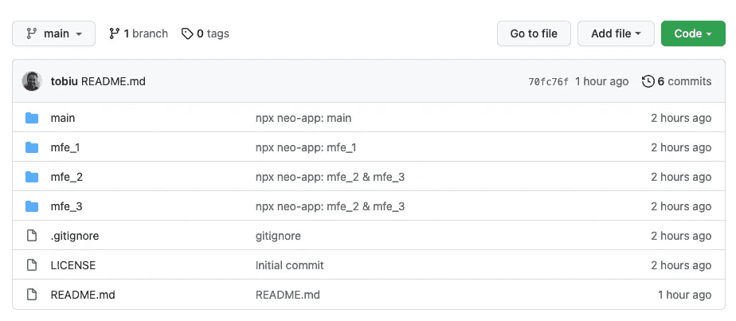

根文件夹不包含 package.json 文件，因此每个顶级文件夹将包含一个独立的 npm 包。

如果你的公司有多个开发团队，他们在一个复杂应用的不同领域工作，或者如果你要迁移到 monorepo，这种策略是有意义的。

当然，如果每个团队(包)从长远来看使用相同的依赖项，这是很好的，但是这会使迁移变慢，甚至对于相同依赖项的不同版本，也可能有合理的理由。

为了创建这个基本设置，我在 repo 的根文件夹中使用了 4 次`npx neo-app`。

此时，所有 4 个顶级文件夹都包含相同的虚拟应用程序，并且可以自行构建和部署。让我们快速看一下其中的一个:

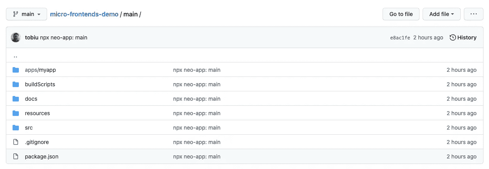

对于我们来说，`.gitignore`已经排除了`dist`和`node_modules`文件夹。

# 2.创建我们的主应用

由于我们已经有了一个虚拟应用程序，让我们快速了解一下:

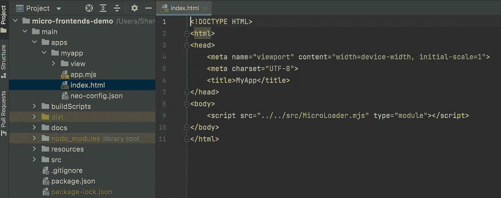

`index.html`将只包括`MicroLoader`。这将为我们创建工人设置:

应用程序工作人员是我们的主要参与者、指挥者和与应用程序相关的构建入口点，他将为我们获取应用程序外壳:

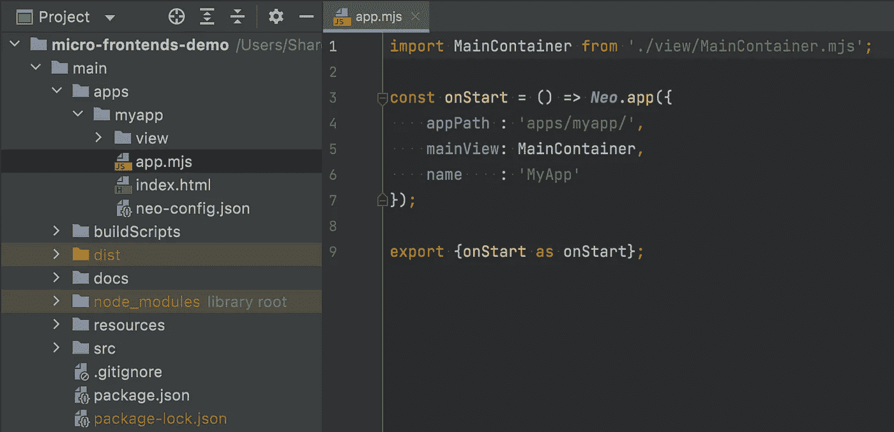

我们的应用程序外壳是尽可能轻量级的，并且与组件无关。然而，我们可以在这里定义一个`mainView`和一个`parentId`，以防我们想要将这个应用程序呈现到一个特定的 DOM 节点中。

您可以将`app.mjs`文件想象成应用程序工作人员的索引文件(起点)。

所以，我们可以马上开始调整我们的主应用程序的内容。

我们将从一个非常简单的结构开始:

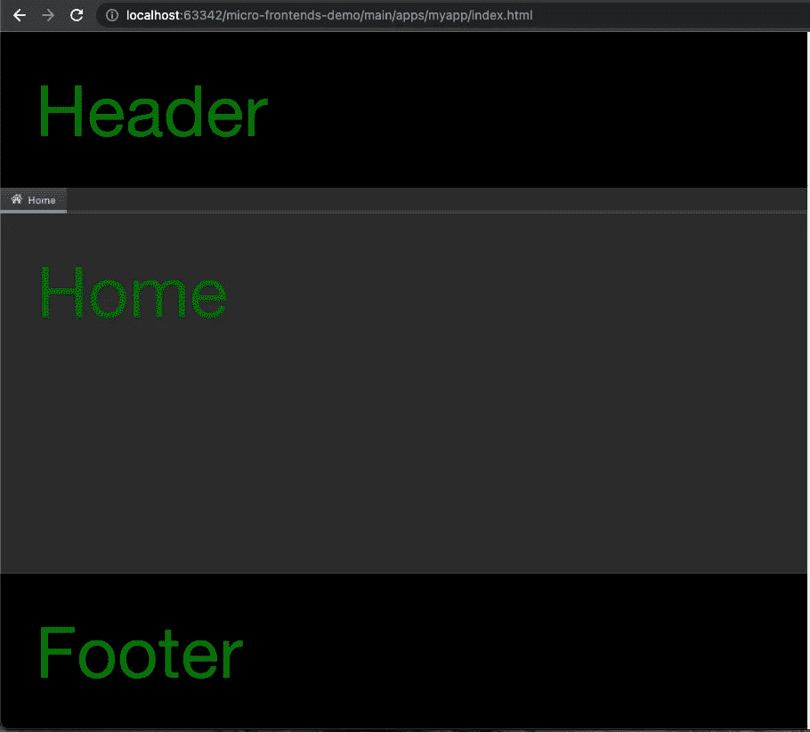

假设“Home”将包含一个复杂的视图，我们将为它创建一个自己的类:

接下来让我们看看我们的视窗(主视图):

这里的特殊之处在于，一旦第一个选项卡被激活，我们就动态导入我们的`HomeComponent`。这还不重要，但是一旦我们设置了客户端路由，它就会变得重要。

在一个真正的应用程序中，我们会使用主题引擎来设计我们的内容，但是我们的目标是保持它的简单，并专注于核心主题:微前端。

# 3.创建我们的第一个微前端

虽然我们可以直接在顶层 repo 文件夹中的 apps 文件夹内创建这个组件，但是让我们使用那里的`src`文件夹来保持它的整洁:

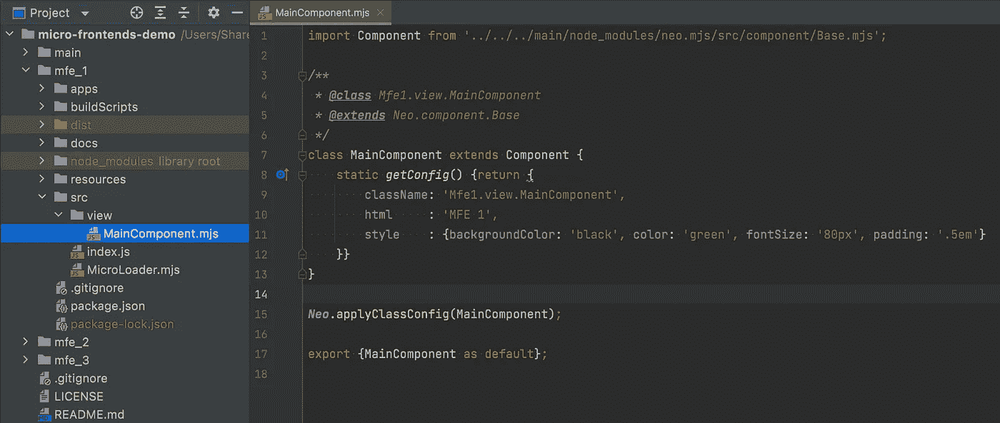

由于我们在此范围内工作的团队希望独立于我们的主应用程序来查看和测试它，所以让我们先将它包含到此范围的应用程序文件夹中(这不会影响我们的主应用程序或它的构建)。

如果你仔细观察:我们使用 neo.mjs 从我们的主目录相关的导入，以避免多次获取框架相关的文件。

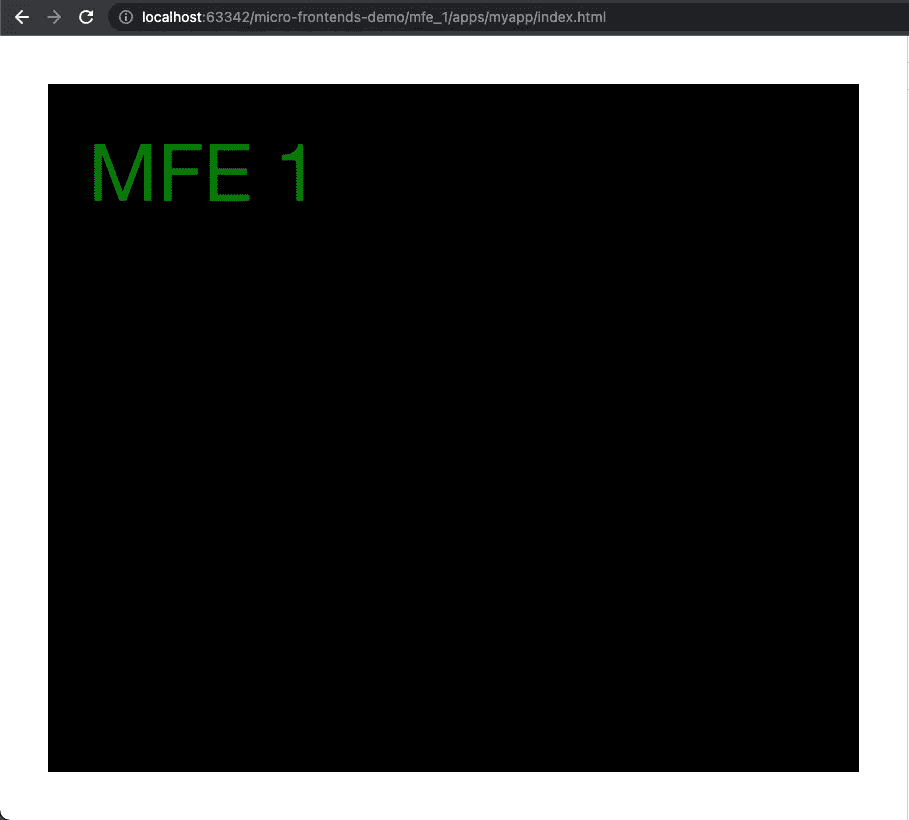

我们可以立即在浏览器中打开它，无需任何构建或转换，相关团队可以从这里开始工作并测试微前端。

# 4.将 MFE_1 包含到我们的主应用程序中

我有点害怕向您展示这种方法，但是如果您愿意，您可以非常容易地直接包含总是最新的版本:

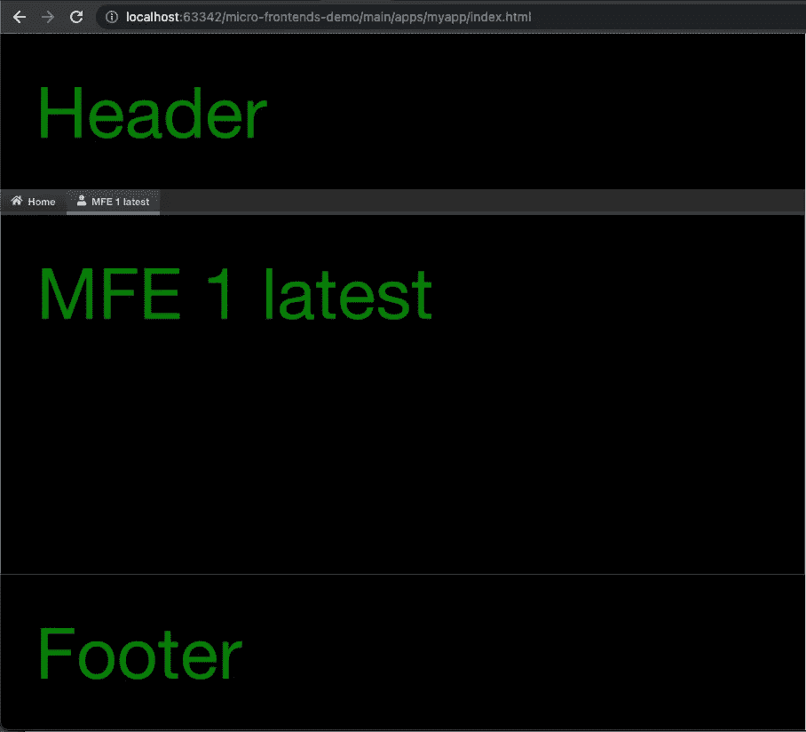

我们还将 MFE_1 添加为动态导入。如果你打开开发者工具中的网络标签，并切换到我们的主应用程序中的新标签，你会注意到我们的新组件将在这一点上得到懒惰加载。

您还会注意到，我们正在显示一个不同的文本。遵循**单向数据流**范例，父组件可以直接改变类配置(类似于 React 中的 props)。

**警告**:除非你的团队在使用不同的功能分支时非常小心，并且只有在发布新的包版本时才会将代码推送到主分支，否则你就冒着微前端代码库内的代码变化破坏主应用程序的风险。甚至“仅仅”打破开发分支会显著地减慢其他团队的速度。

干净的方法是调整我们的`package.json`文件，并在此时将 MFE_1 发布到 npm:

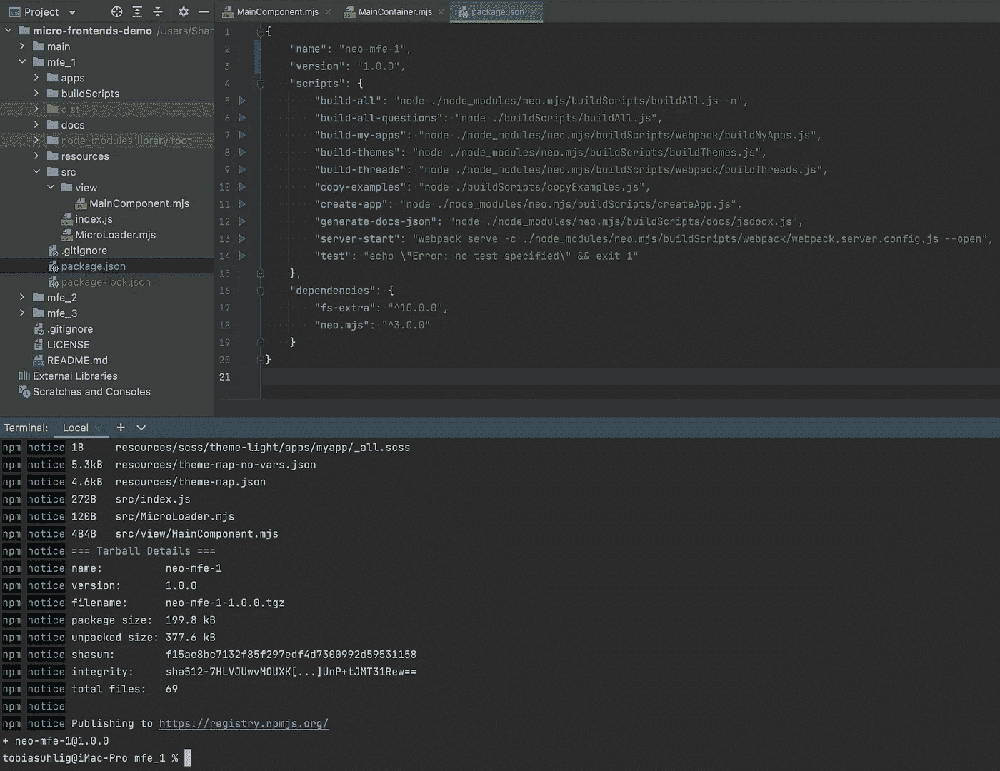

现在我们的顶层回购文件夹可以根据需要将这个包添加到它们的`package.json`文件中，并安装依赖项。这样你也可以控制使用不同的版本。

# 5.创建我们的第二个微前端

这一次，我们将创建一个小组件树，并触发一个事件。

我们还将调整我们的独立测试应用程序:

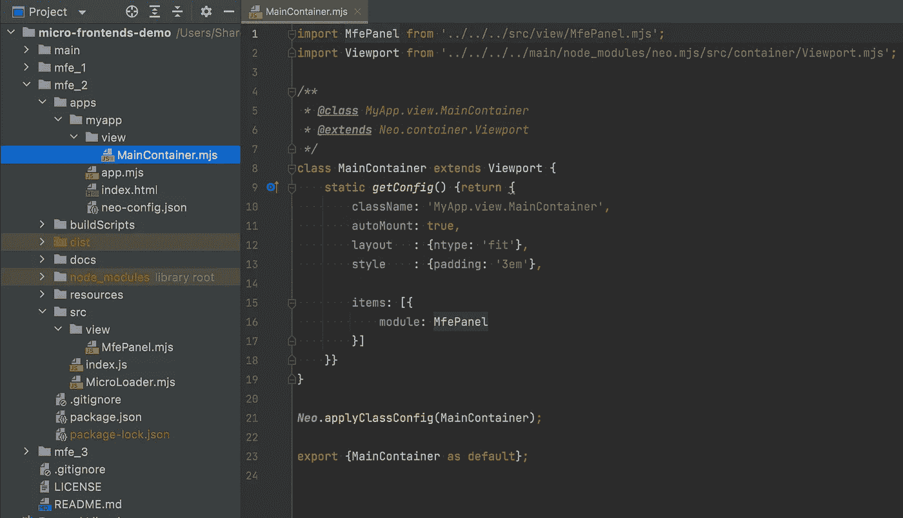

我们得到以下结果:

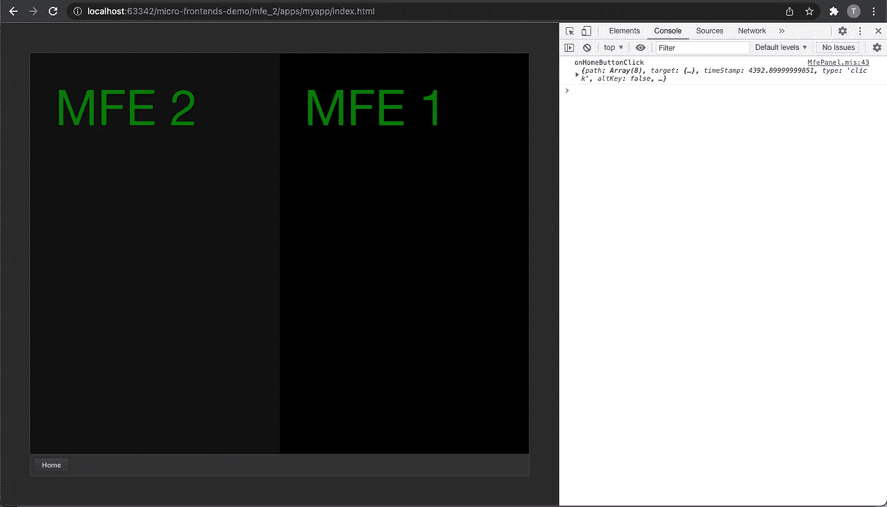

# 6.将 MFE_2 包含到我们的主应用中

与 MFE_1 一样，我们将在需要时延迟加载新面板。我们还将为自定义事件添加一个侦听器，我们将把它映射到新的视图控制器中。

下面是新视图控制器的代码:

结果:

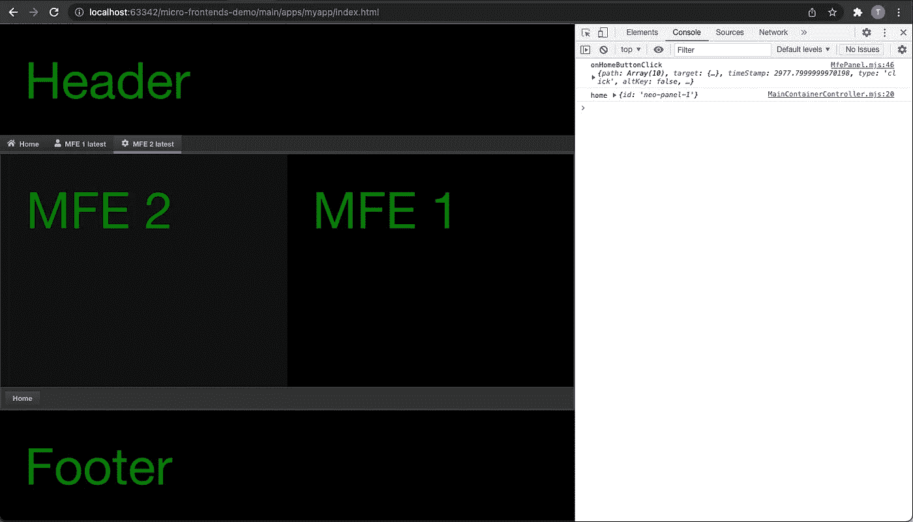

再次遵循单向数据流范例:修改父组件的状态或配置不是一个好主意。相反，我们将触发父组件可以订阅的事件。

**提示**:使用 PubSub 实现不是一个好主意，因为消息总线不可伸缩。他们很容易被大量的输入淹没。这里的可观察驱动实现感觉更优雅。

# 7.客户端路由

这一部分相当容易。我们需要给我们的`tabButtonConfig`对象添加路线:

下一步是将`onHashChange()`逻辑添加到我们的视图控制器中:

我们不仅在切换主选项卡时生成路线，而且我们现在还可以使用路线加载我们的应用程序，这将只加载我们需要的视图。

如果您仔细观察，您会注意到，如果我们从加载 MFE_2 路由开始，然后切换到 MFE_1 选项卡，将不会有任何延迟加载。发生这种情况，是因为 MFE_2 已经包含了 MFE_1。

在检查 DOM 时，您会注意到只安装了活动的选项卡。除此之外，我们还可以选择将选项卡的 JS 实例保存在内存中(这是默认行为)，并且只在需要时添加和删除现有的虚拟 dom。

含义:每个选项卡的`constructor()`只会触发一次，每个选项卡的`render()`方法也只会触发一次。

客户端路由不仅限于选项卡。我们可以使用卡片布局或其他结构来处理视图控制器内部的逻辑。

# 8.我们 MFE 组合的生产构建

到目前为止，整个代码都在浏览器中运行，没有任何直接的构建或编译。这大大加快了开发速度。

然而，我们确实想把每个州需要的文件打包。Webpack 是一个很棒的工具，可以在 app worker 范围内为我们的动态导入创建分割块。

我们需要做的就是在我们的`main`顶层文件夹的`package.json`中运行`build-all`脚本。

**提示**:如果我们只改变与应用相关的代码，我们可以使用`build-my-apps`脚本，这样会更快。

我们也可以在我们的`main/apps`文件夹中生成多个应用程序，我们将获得开箱即用的跨应用程序分割块。意思是:将多个应用放入同一个页面将会有接近零的开销。

现在让我们来看看`dist/production`版本:

你会看到我们将加载更少的文件。对于基于 Webpack 的版本，我们需要切换到 dev tools network 选项卡中的`Other`选项卡。这与 Harmony 有关，一旦 Mozilla (Firefox)支持 worker 范围内的 JS 模块，Harmony 就会被删除。

目前，dev 模式运行在 Chromium 和 Safari 中，而 dist/production 版本运行在所有主流浏览器中。不用担心，也有一个 dist/development 版本(支持所有浏览器)。

# 9.我们的代码真的存在于 app worker 中吗？

在创建应用程序时，除了`window`和`window.document`未定义之外，你几乎不会注意到它们的区别。

不作弊:)

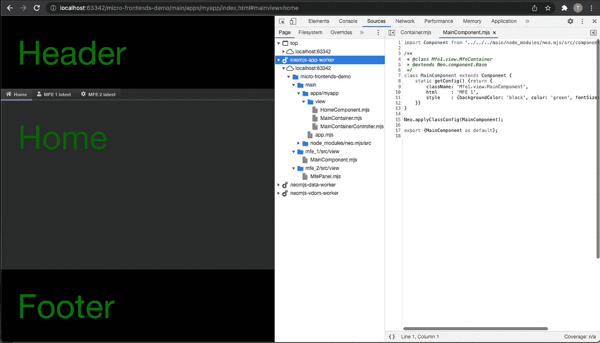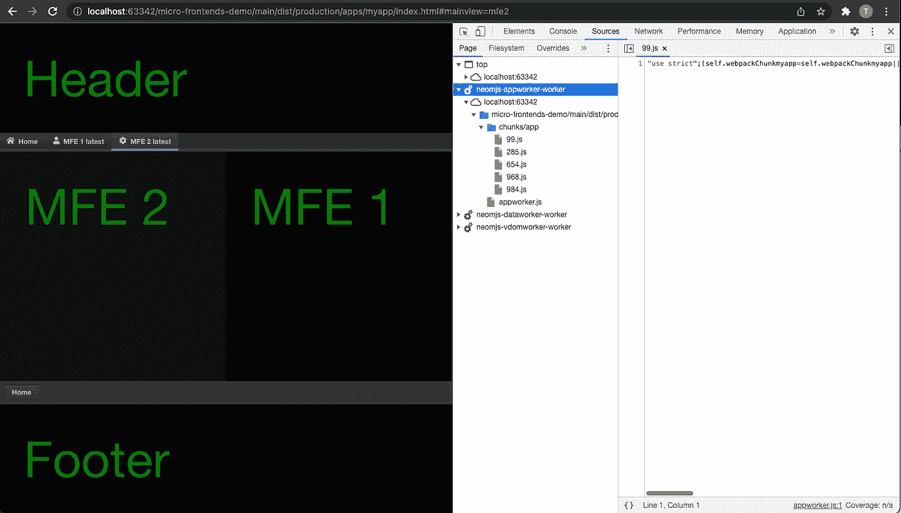

你的应用、组件和微前端真正地存在于应用工作者的范围内。

# 10.增强创意

还有一个难题需要解决。浏览器不支持裸模块说明符，我们不能在导入语句或动态导入中使用变量。

变量会给我们很大的帮助，例如为我们的 URL 指定一个基本路径。

解决这个问题的一个方法是将 neo 放入 CDN，并从那里获取所有与框架相关的文件。

我想做的是让我们能够将框架放入 monorepo 结构的顶级文件夹中。这使我们能够从那里获取所有文件，并以一种方便的方式为特性请求或 bug 创建 PRs。

我很可能需要调整构建脚本来处理这个问题。

为了支持在不同版本中导入 mfe(作为顶层文件夹中的依赖项添加)，我们还需要一个新的构建脚本来根据需要调整与框架相关的导入路径(除非我们使用 CDN)。

请给我提个醒，如果你想看到这种情况发生的话！

我可以创建这篇文章的第二部分，如果你有什么想法，你想看到 MFE_3 实现内部。我在考虑一个更复杂的视图，显示更多的事件，并在运行时调整另外两个 mfe。MFE_3 应该包含一个视图模型(类似于存储/状态提供者，比如 MobX)和如何使用它的逻辑。为了保持这篇文章的篇幅合理，我暂时跳过了这一部分。

# 11.最后的想法

虽然我强烈建议如果可能的话坚持使用单一工作空间(npx neo-app ),但是 monorepo 方法可能会很好，特别是在多个团队想要在不同的范围上工作并且需要不同的依赖项(或者相同依赖项的不同版本)的情况下。

创建这个 PoC 演示和撰写这篇文章只花了一天时间。相信我，写这篇文章花了大部分时间。

您可能已经注意到，我们根本没有使用模块联合。我们不需要指定任何遥控器，可以自由使用和惰性加载微前端。

而我们不能(也不想！)为我们使用的每个 MFE 单独创建一个 dist/prod 版本，我们可以根据需要创建与我们的应用程序相关的构建版本。

构建时间会稍微慢一点，但是请记住，我们只在需要部署到 dist/prod 时才需要构建。对于开发，我们根本不需要任何构建或移植。

不过，我还没有找到时间来全面研究模块联合。如果有适用于 neo 范围的用例，请→功能请求或 PRs。

欢迎您直接在 neo repo 中创建新功能请求:

 [## GitHub - neomjs/neo:应用工人驱动的前端框架

### neo.mjs 使您能够使用一个以上的 CPU 创建可扩展的高性能应用程序。不需要照顾一个…

github.com](https://github.com/neomjs/neo) 

目前的计划是接下来重点关注新的学习部分(大规模 epic):

 [## 学习部分/ Wiki neomjs/neo

### 此时您不能执行该操作。您已使用另一个标签页或窗口登录。您已在另一个选项卡中注销，或者…

github.com](https://github.com/neomjs/neo/projects/29) 

您可以在这里找到本文中提到的所有文件:

 [## GitHub-neom js/micro-frontends-demo:从主线程中扩展您的微前端

### 此时您不能执行该操作。您已使用另一个标签页或窗口登录。您已在另一个选项卡中注销，或者…

github.com](https://github.com/neomjs/micro-frontends-demo) 

请随意进入 slack 频道，获取想法、反馈和问题:

 [## 松弛的

### 编辑描述

join.slack.com](https://join.slack.com/t/neomjs/shared_invite/zt-6c50ueeu-3E1~M4T9xkNnb~M_prEEOA) 

问候&快乐编码，
托拜厄斯

附:我将很快创建一个在线演示！

预览图像:

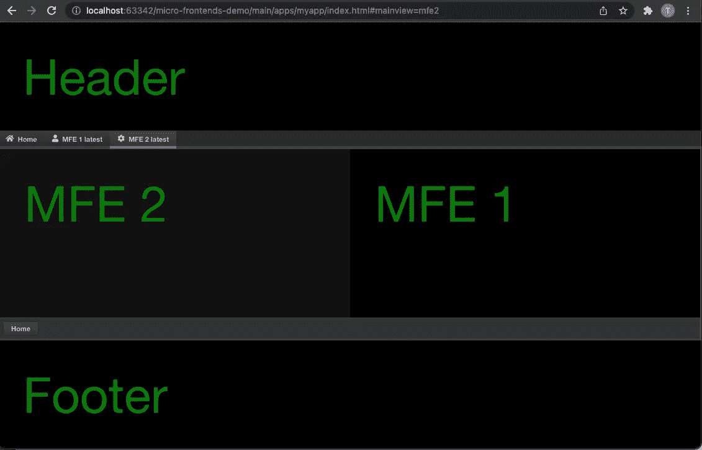