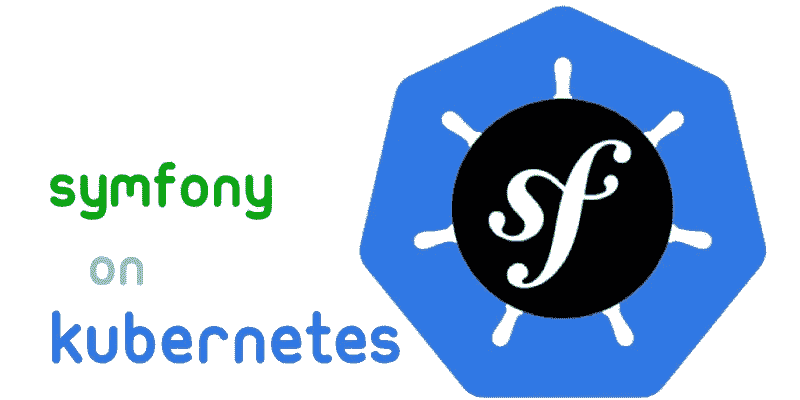

# 如何在 Kubernetes 上部署和扩展 Symfony web 应用程序

> 原文：<https://itnext.io/scaling-your-symfony-application-and-preparing-it-for-deployment-on-kubernetes-c102bf246a93?source=collection_archive---------1----------------------->



我已经和一个同事合作一个项目有一段时间了。该项目基本上是一个网站，正在使用 Symfony 3.4 建立，它仍然处于开发阶段。

我决定分享我将我们的基础设施从 Amzon AWS 迁移到 Digital Ocean 上的 Kubernetes 的经验，以及我必须对我们的 symfony 代码进行的更改。

# 缩放一个网站/应用意味着什么？

这意味着，通过简单地添加更多资源(服务器、存储等)，以一种使应用程序能够服务更多客户(更多请求)的方式来设计应用程序。

对于一个网站来说，这基本上意味着以一种可以在任意数量的可用服务器之间分配负载的方式来设计和构建您的网站。

# **迁移前我们的基础设施如何？**

由于我们的网站仍处于开发阶段，我们真的没有考虑太多的规模，因为我们总是推迟。

*   我们使用一个单独的开发服务器，在那里我们托管我们单独的 web 服务器。
*   我们的 mySql 数据库使用 Amazon RDS(关系数据库服务)托管。它包括一个网站的数据库，和吉拉和类似的东西的几个其他数据库。
*   对于文件存储，我们将文件本地存储在 web 服务器上，会话信息也存储在磁盘上，这可能是我们正确扩展 web 服务器的第一个挑战，因为存储应该在不同的服务器之间共享并保持一致，无论您的请求来自哪里。
*   代码过去(现在仍然)托管在 github 上。然而，我们有一个非常幼稚的 cron 脚本运行在开发服务器上，监视新的提交。每当一个新的提交被推送时，它就在拉取它，做一些构建操作，并更新网站的开发版本。实际上，它为我们做了一件伟大的工作。

当我们开始接近完成我们的开发和启动我们的项目时，我们开始考虑一个永久的基础设施来托管我们的网站，并允许我们轻松扩展。

除此之外，我只有一个 AWS 服务器和一个 RDS，这已经花费了很多钱，使得它不具备真正的可伸缩性(成本方面也是如此)。因此，我们决定转向更灵活的基础架构，我们可以根据需要轻松地对其进行扩展和缩减，并且更加经济高效。

在那一刻，我觉得这是一个了解 containers、docker 和 Kubernetes 的好机会，因为它们正是我一直在寻找的！

# 我们是如何在 Kubernetes 上部署我们的 Symfony 应用程序的？

在这里，我会试着记起最显著的挑战，以及我们是如何摆脱它们的。如果你需要任何特定主题的进一步细节，请让我知道。

**首先，摆脱本地文件存储！**

事实上，这是对我最大的挑战。如果这部分让你感到困惑也没关系。当你进入实现阶段时，这可能真的很有帮助，你可以从这里得到一些想法。

首先让我对这篇伟大的文章表示赞赏，因为它给了我很好的提示，告诉我可以从哪里开始

[](https://medium.com/@galopintitouan/how-to-build-a-scalable-symfony-application-on-kubernetes-30f23bf304e) [## 如何在 Kubernetes 上构建可伸缩的 Symfony 应用程序

### 现代 web 应用程序很复杂。您的用户对您的应用程序的期望是不断的…

medium.com](https://medium.com/@galopintitouan/how-to-build-a-scalable-symfony-application-on-kubernetes-30f23bf304e) 

正如上面的文章所建议的，我开始使用文件系统抽象层来访问文件(本质上是用户上传的图像和其他附件/文件)。

但是等等，我该怎么做？我会有太多需要重构的地方？！

嗯，这倒是真的。我将尝试非常简要地解释我做了什么，但是如果有人感兴趣，我可以写另一篇关于我如何尽快实现文件系统抽象的详细文章。

我使用了一个名为“ **League Flysystem** 的 Symfony 包来抽象文件系统访问

[](https://github.com/thephpleague/flysystem) [## 超级联赛/飞行系统

### 本地和远程文件系统的抽象。通过创建一个帐户来为超级联赛/飞行系统的发展做贡献…

github.com](https://github.com/thephpleague/flysystem) 

然而，由于数字海洋不支持 kubernetes 上的 NFS 存储(至少目前如此)，我发现这是我使用数字海洋空间的另一个好机会(因为它提供了一个额外的优势，一个免费的 CDN 来在全球分发我的资产！)

因此，我使用 Leage Flysystem 和 DigitalOcean spaces 存储来存储用户上传的图片、我的网站资产等。

当然，这不是现成的，你仍然需要找到你访问文件系统的每个地方，并用一个 Leage 文件系统调用来替换它。然而，做到这一点并不难。

在我的例子中，我用自己的 MountManager 覆盖了 Leage Flysystem 中的默认 mount manager，这样我就可以控制何时访问远程文件系统(数字海洋空间，以及使用哪个 bucket)以及何时访问本地文件系统，这取决于我们试图访问的路径。

例如，由于这个自定义挂载管理器，我能够在我的数据库中只存储一个相对文件路径(例如，image _ path:images/2019/03/16/123 . jpg ),而不用关心/存储它的存储位置，因为我的自定义挂载管理器知道“images”文件夹存储在数字海洋空间中，并且它应该使用这个特定的文件系统和那个特定的适配器来获取它。

为了使事情变得更简单，我还为 Symfony Liip Imaging bundle 编写了自定义解析器，允许它从抽象文件系统(连接到数字海洋空间)中获取原始图像，并在那里写入缓存的图像。

不仅如此，我使用 Redis 集群来存储我们是否已经有了图像的缓存版本，以便所有 web 服务器都可以共享 thins 信息，而不是让每个 web 服务器都生成自己的缓存版本。

我可以在这里讲得太深，但这将超出本文的范围(我猜它已经够混乱了)。如果你需要关于这个话题的详细信息，请告诉我。

**2-会话管理:在您的网络服务器之间共享用户会话**

在典型的可伸缩 web 应用程序中，如果用户请求由不同的 web 服务器提供服务，我们应该不会有任何问题。

然而，如果我们在本地存储用户会话，就会有问题。

幸运是，symfony 为会话存储提供了方便的抽象。在我的例子中，我在 kubernetes 集群上安装了一个 redis 集群，并使用它来存储会话信息。

[](https://github.com/snc/SncRedisBundle) [## snc/SncRedisBundle

### Symfony 支持 Predis 和 PhpRedis - snc/SncRedisBundle 的 Redis 包

github.com](https://github.com/snc/SncRedisBundle) 

现在，您并不真正关心用户的请求在哪里得到服务，因为用户会话将在您所有的 web 服务器之间共享！

**3-数据库！**

当我迁移到 Digital Ocean 时，他们还没有现成的关系数据库服务(现在，他们有了，但是有限，还不支持 mysql。预计将很快推出)

我创建了自己的 mysql 集群，采用一主多从架构。我使用了 kubernetes 网站上提供的例子，但是必须处理安全性和其他问题。我花了两天时间才让它运行起来，所以我打算写一篇关于如何在 kubernetes 上设置 mysql cluster 的文章。

[https://kubernetes . io/docs/tasks/run-application/run-replication-stateful-application/](https://kubernetes.io/docs/tasks/run-application/run-replicated-stateful-application/)

在您的情况下，您可能会决定使用现成的数据库服务，而不是自己维护一个 DB 集群。

# 4- Kubernetes！

这里我不打算详细讨论 kubernetes 的实现细节。我将简单介绍一下您的集群可能是什么样子

在接下来的部分中，我假设您已经对 kubernetes 有了一些了解。这不是一个完整的实现细节，只是一个简单的概述。

不过，如果需要的话，我很乐意分享另一篇包含所有细节的文章。

## 网络豆荚

我为我的 web 服务器角色创建了一个 pod 定义，它包含 nginx 容器和 php-fpm 容器，一起运行并共享代码量。

实际上，我不需要 Nginx 容器，因为我在默认映像中唯一改变的是为我的网站添加一个配置文件和密码保护(出于开发目的)。但是使用 Kubernetes configMap 可以很容易地做到这一点，只需在容器中挂载配置文件。

我使用 StatefulSet，它允许我为我的 web 服务器设置任意数量的副本。我将解释为什么我使用 StatefulSet 而不是 Deployment。

我将 symfony 代码文件夹附加到 php 容器中，我只是用 initContainer 将它复制到 Nginx 容器中。

我的 php Dockerfile 定义如下

```
*# PHP Dockerfile* **FROM** composer:1.5.1 **AS *composer* FROM** php:7.1.24**-**fpm

**RUN** apt-get update **&&** apt-get install **-**y \
      acl \
      libfreetype6-dev \
      libjpeg62-turbo-dev \
      libpng-dev \
      libbz2-dev \
      libicu-dev \
      libzip-dev \
      zip \
    **&&** docker-php-ext-install **-**j$(nproc) iconv \
    **&&** docker-php-ext-install bz2 \
    **&&** docker-php-ext-configure gd **--**with-freetype-dir=**/**usr**/**include**/ --**with-jpeg-dir=**/**usr**/**include**/** \
    **&&** docker-php-ext-install **-**j$(nproc) gd \
    **&&** apt-get install jpegoptim \
    **&&** docker-php-ext-install intl \
    **&&** docker-php-ext-install mysqli \
    **&&** docker-php-ext-install pdo_mysql \
    **&&** docker-php-ext-install opcache \
    **&&** docker-php-ext-configure zip **--**with-libzip \
    **&&** docker-php-ext-install zip \
    **&&** docker-php-ext-install exif \
    **&&** pecl install xdebug-2.5.0 \
    **&&** docker-php-ext-enable xdebug \
    **&&** apt-get install **-**y vim;

*# copy the Composer PHAR from the Composer image into the PHP image* **COPY --**from=***composer* /**usr**/**bin**/**composer **/**usr**/**bin**/**composer

**RUN** echo **'memory_limit = 2048M' >> /**usr**/**local**/**etc**/**php**/**conf.d**/**docker-php-memlimit.ini

*# Create user codekeeper, and use it as owner of the code* **RUN** useradd **-**ms **/**bin**/**bash codekeeper

**RUN** mkdir **-**p **/**code
**WORKDIR /**code
**RUN** chown codekeeper:codekeeper .

**USER** codekeeper

*# Install composer packages (by starting with coping only composer file, to make use of docker layering feature)* **COPY** symfony**/**composer.json symfony**/**composer.lock .**/
RUN** composer install **--**prefer-dist **--**no-scripts **--**no-dev **--**no-autoloader

*# Now, copy the code* **COPY --**chown=codekeeper:codekeeper symfony **/**code
**WORKDIR /**code

*# Remove execute permissions from all files in (/code), but add it only for directories (to allow traversal)* **USER** root
*#RUN chmod -R -x+X .* 

*# Give permissions to write to var* **RUN** setfacl **-**dR **-**m u:www-data:rwX **-**m u:codekeeper:rwX var
**RUN** setfacl **-**R **-**m u:www-data:rwX **-**m u:codekeeper:rwX var

**CMD** [**"sh"**, **"-c"**, **"(setfacl -R -m u:www-data:rwX -m u:codekeeper:rwX var) && (setfacl -dR -m u:www-data:rwX -m u:codekeeper:rwX var) && php-fpm"**]
```

注意，我首先复制 composer.lock 内容，安装 composer，最后一步复制代码。这样，当重新构建 docker 映像时，代码更改将只触发构建步骤(最后一层)

不用分享我的**。dockerignore** ，但是值得一提的是我忽略了 node_modules。它们是通过 initContainer 构建的，但是它们被缓存在 PV(持久卷)中，所以它们不会在每次 pod 重新启动时被下载。当然，你也要忽略。来自 docker 映像的 git 存储库。

现在，最重要的部分是 web pod 的定义。这可能感觉有点复杂！我决定分享它，以防有人需要它。

我用 StatefulSet 实现了它，所以我可以为每个 pod 请求一个 PVC，而不需要手动创建它们。

```
**apiVersion**: apps/v1
**kind**: StatefulSet
**metadata**:
  **name**: webserver
  **labels**:
    **app**: webserver
**spec**:
  **selector**:
    **matchLabels**:
      **app**: webserver
  **serviceName**: webserver
  **replicas**: 4
  **template**:
    **metadata**:
      **name**: webserver
      **labels**:
        **app**: webserver
    **spec**: **initContainers**:
        - **name**: init-php
          **image**: your-php-image (PLEASE REPLACE THIS)
          **env**:
          - **name**: DATABASE_HOST_RW
            **valueFrom**:
              **configMapKeyRef**:
                **name**: website-config
                **key**: DATABASE_HOST_RW

          - **name**: DATABASE_HOST_RO
            **valueFrom**:
              **configMapKeyRef**:
                **name**: website-config
                **key**: DATABASE_HOST_RO

          - **name**: DATABASE_NAME
            **valueFrom**:
              **configMapKeyRef**:
                **name**: website-config
                **key**: DATABASE_NAME

          - **name**: DATABASE_USER
            **valueFrom**:
              **configMapKeyRef**:
                **name**: website-config
                **key**: DATABASE_USER

          - **name**: DATABASE_PASSWORD
            **valueFrom**:
              **secretKeyRef**:
                **name**: some-secret-name-you-added
                **key**: password

          - **name**: REDIS_HOST
            **valueFrom**:
              **configMapKeyRef**:
                **name**: website-config
                **key**: REDIS_HOST

          - **name**: REDIS_PORT
            **valueFrom**:
              **configMapKeyRef**:
                **name**: website-config
                **key**: REDIS_PORT

          **volumeMounts**:
          - **name**: code
            **mountPath**: /code

          **command**:
          - bash
          - **"-c"** - |
            # Copy the code to the shared volume, this will be mounted later into both of nginx and php
            cp -r /var/www/html/you_web_site/* /code/
            cd /code
            composer install
            php bin/console assets:install
            php bin/console cache:clear --env=dev
            php bin/console cache:clear --env=prod# I use this image to build my npm packages and webpack assets
        - **name**: node
          **image**: node:11
          **volumeMounts**:
          - **name**: code
            **mountPath**: /var/www/html/you_web_site/ **command**:
          - bash
          - **"-c"** - |
            set -ex
            cd /var/www/html/you_web_site/
            npm install || echo "npm install did not work"
            ./node_modules/.bin/webpack --mode=production

      **containers**:
      - **name**: nginx
        **image**: you-nginx-image or offecial image (PLEASE REPLACE THIS)
        **imagePullPolicy**: Always # you might want to change this
        **volumeMounts**:
        - **name**: code
          **mountPath**: /var/www/html/you_web_site/

      - **name**: php
        **image**: your-php-image
        **imagePullPolicy**: Always # again
        **volumeMounts**:
        - **name**: code
          **mountPath**: /var/www/html/you_web_site/

        **env**:
            # I'm not gonna reput them.. please copy them from
            # initContainer -> first Container
            # Here, I do pass two extra env vars to store auth to digital ocean spaces- **name**: FS_KEY
          **valueFrom**:
            **secretKeyRef**:
              **name**: your-secret-name
              **key**: key

        - **name**: FS_SECRET
          **valueFrom**:
            **secretKeyRef**:
              **name**:  your-secret-name
              **key**: secret
         # That's another var I use to force my app to use local file system when it's set to false.
        - **name**: FS_USE_REMOTE
          **value**: **"true"

      # if your images are stored in private repo
      imagePullSecrets**:
      - **name**: your-image-pull-secret

      **volumes**:
      - **name**: webserver-config-map
        **configMap**:
          **name**: webserver# I use a persistent volume to store code, so I don't rebuild everything on every pod restart (like, node_modules). However, it's perfectly fine to use temp volume, it will just take a bit longer to start the container **volumeClaimTemplates**:
  - **metadata**:
      **name**: code
    **spec**:
      **accessModes**: [**"ReadWriteOnce"**]
      **resources**:
        **requests**:
          **storage**: 4Gi
      **storageClassName**: do-block-storage
```

将 configMap 中的所有键作为 ENV 变量导入可能是一个更好的主意，但是我觉得太懒了，不想改变它。

如您所见，有两个 initContainers，第一个将代码从我的 php 容器复制到一个卷中，该卷也安装在 nginx 容器中。它还做一些其他的操作

第二个 initContainer 只是一个临时节点映像，我用它将 node_modules 安装到挂载的卷上，并构建 webpack 资产。

当然，这里有太多的配置图和秘密..我不打算告诉你如何生成它们(我假设你知道)。

我认为分享的最后一件事可能是有用的，那就是 symfony patameters.yml

我想向您展示这如何映射到上面的 kubernetes 配置(特别是 env 变量)

```
*# This file is auto-generated during the composer install* **parameters**:
    **database_host_rw**: **'%env(DATABASE_HOST_RW)%'
    database_host_ro**: **'%env(DATABASE_HOST_RO)%'
    database_port**: **'%env(DATABASE_PORT)%'
    database_name**: **'%env(DATABASE_NAME)%'
    database_user**: **'%env(DATABASE_USER)%'
    database_password**: **'%env(DATABASE_PASSWORD)%'
    redis.host**: **'%env(REDIS_HOST)%'
    redis.port**: **'%env(REDIS_PORT)%'
    filesystem.use_remote**: **'%env(FS_USE_REMOTE)%'
    filesystem.endpoint**: **'your spaces or amazon s3 endpoint'
    filesystem.buckets.uploads.cdn**: **'your cdn prefix' # i use this to translate filepaths to web urls
    filesystem.credentials.key**: **'%env(FS_KEY)%'
    filesystem.credentials.secret**: **'%env(FS_SECRET)%'****# Now, we are defining defaults
    env(DATABASE_HOST_RW)**: localhost
    **env(DATABASE_HOST_RO)**: localhost
    **env(DATABASE_PORT)**: 3306
    **env(DATABASE_NAME)**: your local db name
    **env(DATABASE_USER)**: db_user
    **env(DATABASE_PASSWORD)**: db_password_local
    **env(REDIS_HOST)**: localhost
    **env(REDIS_PORT)**: 6379
    **env(FS_USE_REMOTE)**: false **assets_base**: http://localhost:8080
    **default_timezone**: Asia/Damascus
```

## 服务

我有三项主要服务:

*   web 服务从客户端([通过入口控制器](https://www.digitalocean.com/community/tutorials/how-to-set-up-an-nginx-ingress-with-cert-manager-on-digitalocean-kubernetes))接收 web 请求，并将它们转发给任何 web pods(如上所述)
*   Mysql 服务:实际上有两个，一个将请求转发给主 pod(用于读写请求)，另一个将请求转发给任何从 pod(只读)
*   Redis 服务:它只是将请求转发给 Redis 集群中的任何 pod。

当然，我还有其他服务于吉拉、kubernetes 仪表板、自动部署等的对象..都在同一个集群上运行..但是我不打算在这里详细讨论。

## 我们如何在笔记本电脑上开发？自动化部署呢？

实际上，所有开发都在我们的机器上本地进行，这些机器运行的代码版本与集群上运行的代码版本相同，但是使用单独的 Apache 服务器来提供 web 内容，从本地独立的 php-fpm 安装，使用单独的本地 mysql 安装和单独的 redis 集群。所以基本上，当地没有库伯内特。

通过将参数 **FS_USE_REMOTE** 设置为 false，我们的本地机器告诉我们的定制挂载管理器总是使用本地文件系统进行存储，而不是使用数字海洋空间存储。

让您的部署自动发生在开发集群上，并使用在线数据查看它们，这非常方便。至少，对我们来说，我们曾经是这样做的！

您可以通过在每次推送新的提交时重新部署 web pods 来实现这一点，但是对于我们来说，正如我提到的，我们过去只是推送，并看到我们的更改自动反映出来(这要感谢在旧设置中已经提到的幼稚的 cron 脚本)。

我想在 kubernetes 集群上有一个类似的设置，为此我使用了这个包

https://github.com/keel-hq/keel

这很简单，很容易设置，我只需要按照链接，找到如何做到这一点。

## 从 kubernetes 豆荚伐木怎么样？

我们还没有做那部分的工作。那绝对是我需要马上做的事情。

# 我们对这个基础设施满意吗？

绝对的！虽然我们还没有在生产环境中测试它，但是现在我真的可以称我们的网站，一个比以前更具可扩展性的网站。

考虑一下我的网站上线后，流量显著增加的情况。我该怎么办？

嗯，非常简单！向集群添加更多节点(对于数字海洋，这意味着单击几个按钮)，然后调整我的 web 服务器 pod 的副本数量，以启动更多服务器。别担心，我的应用程序现在可以很好地分配负载！

MySql 的读操作过载了？好了，让我们通过修改一行代码来增加奴隶的数量吧！

我不能否认集群有时会有一些问题，特别是对 kubernetes 的数字海洋支持仍然有限，但绝对值得努力。

# 最后

我真的希望这篇文章对你或你们中的一些人有所帮助。

这是我的第一篇关于媒体的文章，我知道它可能太长，太无聊，尤其是没有图片..因此，请随时向我发送您可能有的任何反馈。

此外，请随时询问任何问题，并告诉我您是否希望我更详细地写这篇文章中提到的任何特定主题。

谢谢！